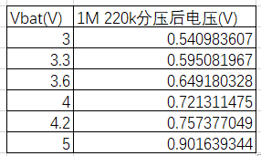
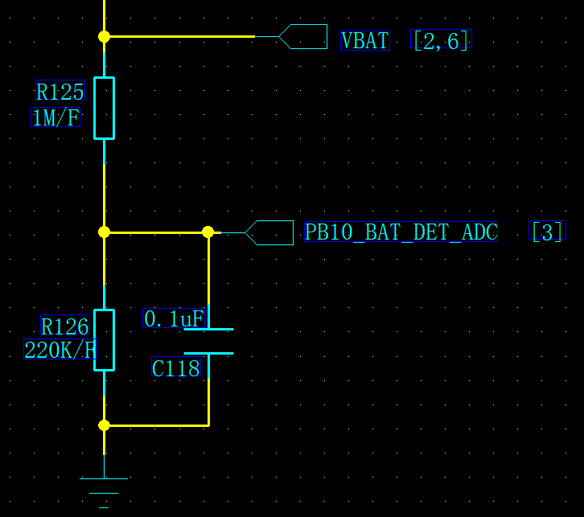
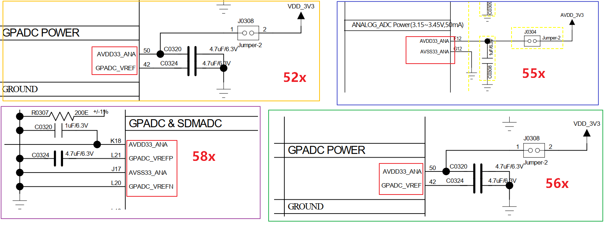
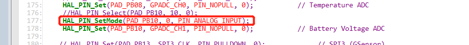
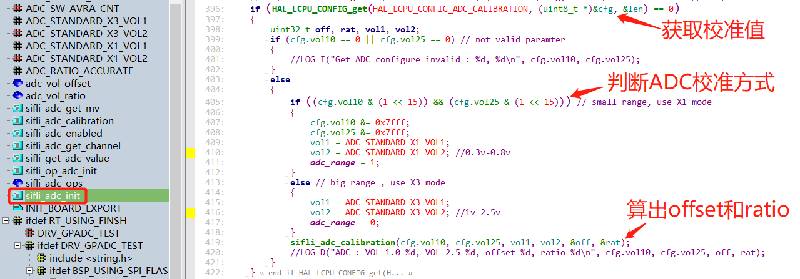
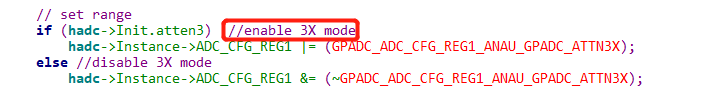
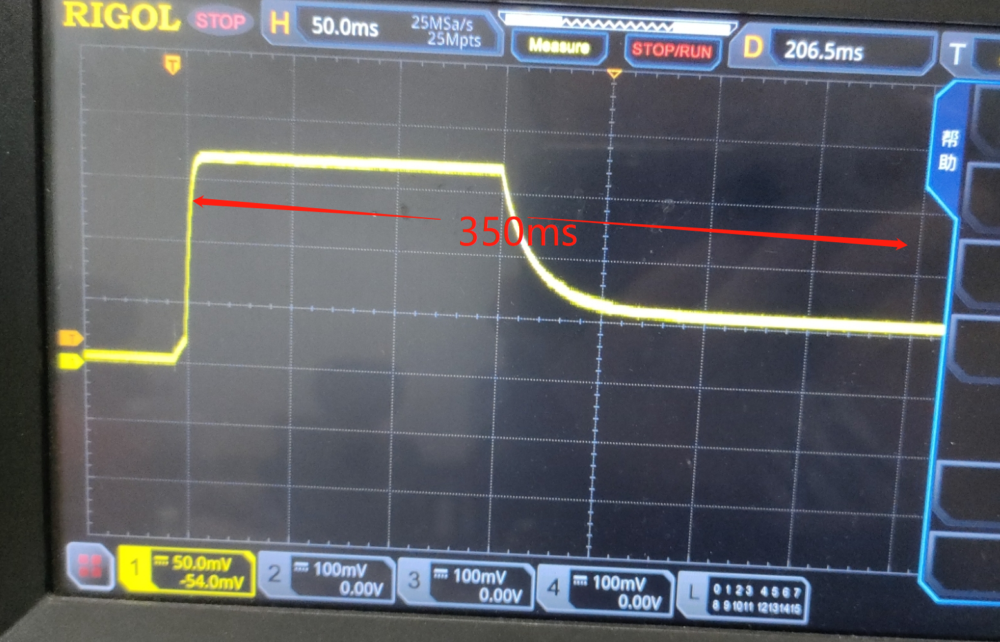

# Sample with GPADC

This note consolidates the ADC guides for SF32LB52x, SF32LB55x, SF32LB56x, SF32LB57x, and SF32LB58x. The software workflow is shared, but the input limits, pad assignments, and calibration points are family-specific. Select the target family in the tables before configuring hardware or firmware.

GPADC is SiFli's general-purpose ADC for measurements such as sensors and battery voltage. It is separate from the audio ADC available on SF32LB52x, SF32LB56x, SF32LB57x, and SF32LB58x, and from the sigma-delta ADC available on SF32LB55x and SF32LB58x. This note covers GPADC only; use the target family's audio or sigma-delta documentation for those converters.

## ADC Scope and Channel Model

The SF32LB52x, SF32LB55x, SF32LB56x, and SF32LB58x SDK app-note model uses eight ADC channels, `GPADC_CH0` through `GPADC_CH7`, for analog sources such as sensor outputs and battery-voltage measurements. The SF32LB57x hardware design guide defines twelve GPADC channels: `PA28`–`PA38` as `GPADC_CH0`–`GPADC_CH10`, plus `VBAT` / `VBATS` as `GPADC_CH11`. A usable voltage result depends on both the external divider network and the software calibration values.

The guide separately notes that `GPADC_CH7` is the fixed battery-voltage input on SF32LB52x. On SF32LB56x, channel 7 is mapped to `PB32`; use the SF32LB56x mapping below rather than the SF32LB52x battery-input convention. The SF32LB57x 12-channel map and `VBAT`/`VBATS` input must also be checked separately; do not apply the eight-channel map to it.

## ADC Characteristics and Input Network

<div align="center"><em>Table: ADC characteristics by SF32 family</em></div>

<div align="center" markdown>

| Characteristic | SF32LB55x | SF32LB52x / 56x / 58x | SF32LB57x |
|:---------------|:----------|:----------------------|:----------|
| ADC channels | 8 | 8 | 12 |
| Battery-voltage sampling | **External:**<br>route a divider into a selected GPADC input | **On-chip:**<br>SF32LB52x: `GPADC_CH7` / `BAT`;<br>SF32LB56x: `GPADC_CH7` / `PB32`;<br>SF32LB58x: `GPADC_CH7` / `PB39` | **On-chip:**<br>`GPADC_CH11` / `VBAT` or `VBATS` |
| Sampling width | 10 bit | 12 bit | 12 bit |
| Sampling accuracy | 3–4 mV | 1–2 mV | 1–2 mV |
| Maximum sampled voltage | 1.1 V | 3.3 V | 3.3 V |
| Recommended external-divider resistors | 1000 kΩ / 220 kΩ | 470 kΩ / 1000 kΩ | 470 kΩ / 1000 kΩ |
| RC settling time | 157 ms | 200 ms | 200 ms |

</div>

Choose the divider and its RC behavior so the ADC input never exceeds the target family's documented limit. Divider tolerance affects the final measurement accuracy. The guides recommend separately calibrating the divider network on the production line to remove that error from the final result. This page treats SF32LB57x electrical characteristics as the same as SF32LB52x, SF32LB56x, and SF32LB58x, pending family-specific confirmation.

For the SF32LB55x external battery path, the upstream FAQ shows a 1 MΩ / 220 kΩ divider using 1% resistors. The high resistance reduces the divider's continuous leakage current; the 1% tolerance limits divider-ratio error and supports measurement accuracy. The divider output is the ADC test point; it is not the battery voltage itself. Use the target schematic and electrical limits when adapting this reference.

{ loading="lazy" }
<div align="center"><em>Figure: VBAT resistor-divider and ADC test-point reference from the SF32LB56x SDK guide.</em></div>

{ loading="lazy" }
<div align="center"><em>Figure: SF32LB55x divider-output reference values from the upstream ADC FAQ.</em></div>

{ loading="lazy" }
<div align="center"><em>Figure: SF32LB55x external battery-voltage sampling path.</em></div>

## Analog Supply and Reference

The ADC uses one analog supply domain:

- `AVDD33_ANA` is the required, stable 3.3 V analog supply.
- `GPADC_VREF` is an internal-reference pin, not an independent supply input.

Depending on the platform, `GPADC_VREF` is either decoupled to ground with an external capacitor or is not brought out and uses the internal reference. Never apply a supply directly to `GPADC_VREF`; power the ADC through `AVDD33_ANA`.

{ loading="lazy" }
<div align="center"><em>Figure: GPADC analog-supply and reference wiring across the 52x, 55x, 56x, and 58x examples in the SF32LB56x SDK guide.</em></div>

## Configure the ADC Pad

Set the selected input pad to its analog function before sampling. The guide's generic API examples are:

```c
HAL_PIN_Set_Analog(PAD_PB08, 0);
HAL_PIN_Set_Analog(PAD_PB13, 0);
```

Those calls illustrate the analog-pin API, not a target-family pad selection. Select the physical input from this channel map:

<div align="center"><em>Table: GPADC pad-to-channel mapping by SF32 family</em></div>

<div align="center" markdown>

| Family | `GPADC_CH0` | `GPADC_CH1` | `GPADC_CH2` | `GPADC_CH3` | `GPADC_CH4` | `GPADC_CH5` | `GPADC_CH6` | `GPADC_CH7` |
|:-------|:------------|:------------|:------------|:------------|:------------|:------------|:------------|:------------|
| SF32LB55x | `PB08` | `PB10` | `PB12` | `PB13` | `PB16` | `PB17` | `PB18` | `PB19` |
| SF32LB52x | `PA28` | `PA29` | `PA30` | `PA31` | `PA32` | `PA33` | `PA34` | `BAT` |
| SF32LB56x | `PB22` | `PB23` | `PB24` | `PB25` | `PB26` | `PB27` | `PB28` | `PB32` |
| SF32LB58x | `PB32` | `PB33` | `PB34` | `PB35` | `PB36` | `PB37` | `PB38` | `PB39` |
| SF32LB57x | `PA28` | `PA29` | `PA30` | `PA31` | `PA32` | `PA33` | `PA34` | `PA35` |

</div>

SF32LB57x has four additional ADC channels: `PA36` is `GPADC_CH8`, `PA37` is `GPADC_CH9`, `PA38` is `GPADC_CH10`, and `VBAT` / `VBATS` is `GPADC_CH11`. The `VBAT` / `VBATS` input belongs to the battery-voltage domain and has a different measurement range from normal GPADC pins. Its 12-channel map is therefore not interchangeable with the eight-channel maps above.

The SF32LB55x-only route can also assign the PIN directly to a GPADC channel, for example `HAL_PIN_Set(PAD_PB08, GPADC_CH0, PIN_NOPULL, 0)`. Do not copy that specific assignment into a different family.

{ loading="lazy" }
<div align="center"><em>Figure: SF32LB55x pin configuration showing analog input mode for the battery ADC path.</em></div>

## Read an ADC Channel

SiFli-SDK registers the ADC as a battery-voltage device; the guide uses `bat1` as its default device name. With the RT-Thread device interface, find the device, open it read-only, enable the intended channel, and read its raw value:

```c
uint32_t channel = 1;
uint32_t value;
rt_device_t dev = rt_device_find("bat1");

if (dev) {
    rt_device_open(dev, RT_DEVICE_FLAG_RDONLY);
    rt_device_control(dev, RT_ADC_CMD_ENABLE, (void *)channel);
    rt_device_read(dev, channel, &value, 1);
}
```

For HAL-level code, the guide identifies `HAL_ADC_GetValue(channel)` as the raw-value interface. The configured pad, selected channel, and software read must refer to the same channel.

## ADC Calibration and Voltage Conversion

The guide models conversion as a linear relationship:

<div align="center"><em>V<sub>real</sub> = (Value<sub>adc</sub> − Offset) × Ratio</em></div>

`Offset` is the raw value at 0 V; `Ratio` is the voltage increment per raw count. Factory calibration compensates for manufacturing variation, but the guide also describes a two-point calibration method for the assembled input path:

1. Apply two accurate, stable voltages and read the corresponding ADC values.
2. Use the target family's two calibration voltages rather than 0 V or the maximum input voltage.
3. Use `sifli_adc_calibration` to calculate and retain the ratio and offset.
4. Convert later raw values with the retained calibration values, and include the divider ratio when reporting source-side voltage.

The source implementation sets `ADC_RATIO_ACCURATE` to 1000, with initial `adc_vol_offset` and `adc_vol_ratio` values of 200 and 3930 respectively.

### SF32LB55x Calibration Ranges

The upstream OpenSiFli FAQ documents the SF32LB55x calibration flow in more detail. During `sifli_adc_init`, the factory-area Flash configuration identified by `FACTORY_CFG_ID_ADC` supplies the stored calibration readings. `sifli_adc_calibration` derives the linear `offset` and `ratio` from those readings; subsequent samples use the selected range's `sifli_adc_get_mv` calculation.

Two calibration ranges are documented:

{ loading="lazy" }
<div align="center"><em>Figure: SF32LB55x calibration initialization, range selection, and offset/ratio calculation.</em></div>

- **X1 range:** 0.3 V and 0.8 V. The stored calibration values have bit 15 set, so the implementation selects the small-range path. Accuracy is reduced near 0 V and above 1 V. This path disables `GPADC_ADC_CFG_REG1_ANAU_GPADC_ATTN3X`, so the internal divider is off and the ADC test point must not exceed 1.1 V.
- **X3 range:** 1.0 V and 2.5 V. This is the earlier calibration method. It enables `GPADC_ADC_CFG_REG1_ANAU_GPADC_ATTN3X`, which enables the internal divider with 3× attenuation; the input must not exceed 3.3 V.

{ loading="lazy" }
<div align="center"><em>Figure: SF32LB55x internal-divider enable/disable control for the selected calibration range.</em></div>

Never choose a calibration range from the table alone: use the factory configuration and target SDK implementation. The X1 and X3 behaviors are specific to the SF32LB55x material cited here, not a rule to apply to another family.

<div align="center"><em>Table: Recommended two-point calibration inputs by SF32 family</em></div>

<div align="center" markdown>

| Family | Calibration inputs |
|:-------|:-------------------|
| SF32LB55x | 0.3 V and 0.8 V |
| SF32LB52x / 56x / 58x | 1.0 V and 2.5 V |
| SF32LB57x | 1.0 V and 2.5 V |

</div>

```c
static uint32_t adc_vol_offset = 200;
static uint32_t adc_vol_ratio = 3930;
#define ADC_RATIO_ACCURATE 1000

int sifli_adc_get_mv(uint32_t value)
{
    return (value - adc_vol_offset) * adc_vol_ratio / ADC_RATIO_ACCURATE;
}

int sifli_adc_calibration(uint32_t value1, uint32_t value2,
                          uint32_t vol1, uint32_t vol2,
                          uint32_t *offset, uint32_t *ratio)
{
    uint32_t gap1, gap2;

    if (offset == NULL || ratio == NULL) return 0;

    gap1 = (value1 > value2) ? (value1 - value2) : (value2 - value1);
    gap2 = (vol1 > vol2) ? (vol1 - vol2) : (vol2 - vol1);

    if (gap1 == 0) return 0;

    *ratio = gap2 * ADC_RATIO_ACCURATE / gap1;
    adc_vol_ratio = *ratio;
    *offset = value1 - (vol1 * ADC_RATIO_ACCURATE / adc_vol_ratio);
    adc_vol_offset = *offset;

    return adc_vol_offset;
}
```

### Validate Calibration After Startup and Wake

For SF32LB55x battery-voltage debugging, the upstream FAQ warns that readings in the first approximately 300 ms after startup or wake can be inaccurate because of RC charging and discharging; the observed waveform settles after about 350 ms. Add an appropriate sampling delay or discard the initial unstable samples. When measuring the divider node with a multimeter or oscilloscope, account for the measurement instrument's input impedance; the FAQ reports it can introduce an approximately 30 mV drop.

{ loading="lazy" }
<div align="center"><em>Figure: SF32LB55x startup waveform showing the approximately 350 ms settling behavior.</em></div>

## Bring-Up Check

Before adding multi-channel or cyclic acquisition, verify one channel with a stable, independently measured input:

1. Confirm its target-family pad mapping and analog configuration.
2. Confirm that the divider output stays within the target-family ADC limit.
3. Compare the raw and calibrated results with the applied voltage.
4. Retain the divider and calibration conditions with the board test record.

## Official Source

- [SF32LB52x ADC Usage and Configuration Guide](https://docs.sifli.com/projects/sdk/latest/sf32lb52x/app_note/adc.html)
- [SF32LB55x ADC Usage and Configuration Guide](https://docs.sifli.com/projects/sdk/latest/sf32lb55x/app_note/adc.html)
- [SF32LB56x ADC Usage and Configuration Guide](https://docs.sifli.com/projects/sdk/latest/sf32lb56x/app_note/adc.html)
- [SF32LB57x ADC Usage and Configuration Guide](https://docs.sifli.com/projects/sdk/latest/sf32lb57x/app_note/adc.html)
- [SF32LB58x ADC Usage and Configuration Guide](https://docs.sifli.com/projects/sdk/latest/sf32lb58x/app_note/adc.html)
- SF32LB57x Hardware Design Guide — Storage & Manufacturing — GPADC pin assignment.
- [OpenSiFli ADC FAQ](https://github.com/OpenSiFli/SiFli-Wiki/blob/main/source/en/faq/mcu/adc.md) — SF32LB55x factory calibration ranges and startup/wake validation.
