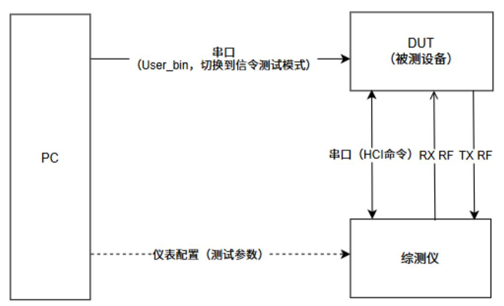
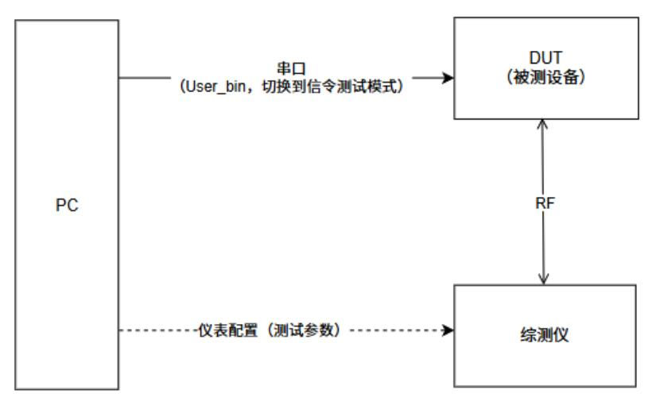
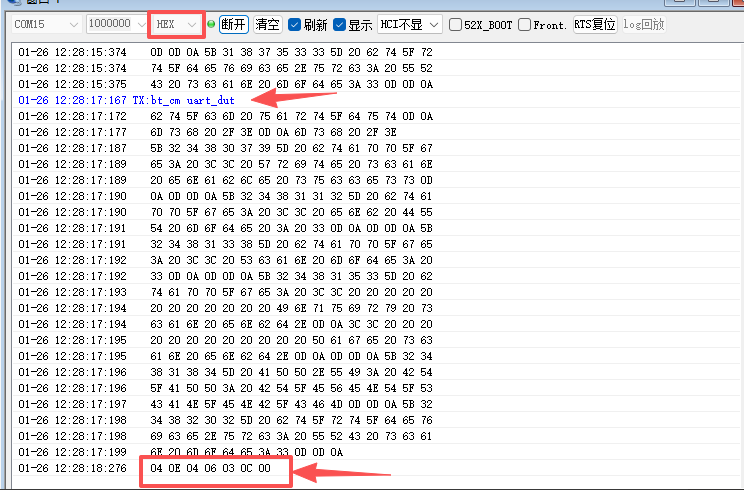
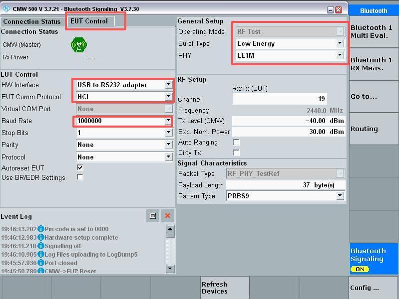
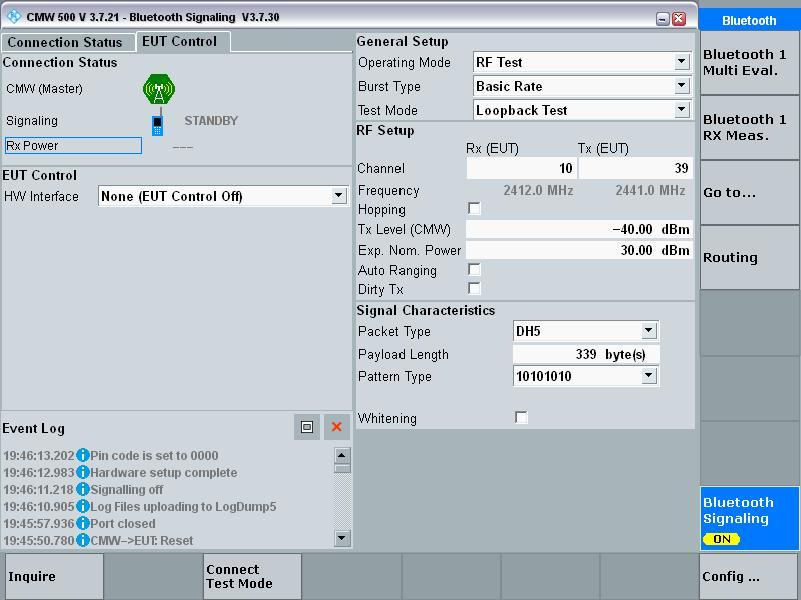

# Run Bluetooth Signaling Tests

Signaling mode creates a real Bluetooth link between the DUT and a communications tester. It is the SDK route for protocol-conformant TX/RX validation and BQB/QDID work; it is different from vendor non-signaling or single-item RF tests.

## Test setup

Prepare the DUT, a Bluetooth communications tester (the source guide uses CMW500), a Windows PC, USB-to-UART cable, and an RF coax cable. Expose `VBAT`, `GND`, and UART1 TX/RX on the DUT. Default UART1 pins vary by package:

<em>Table: Default UART1 pins by device/package</em>

| Device/package | UART1 TX | UART1 RX |
|---|---|---|
| SF32LB551 | PA17 | PA18 |
| SF32LB555/557 | PA34 | PA30 |
| SF32LB56xU (QFN) | PA17 | PA18 |
| SF32LB56xV (BGA) | PA34 | PA30 |
| SF32LB58x | PA32 | PA31 |
| SF32LB52x | PA19 | PA18 |

Use the project's actual pin configuration when it differs from this default map. BLE signaling needs a serial EUT-control connection to the tester; Classic BT signaling can control the DUT over the air after it enters test mode.

The key distinction is the control topology: BLE connects the UART/HCI control path to the tester, while Classic BT lets the tester discover and connect to the DUT over the air. The source guide's SF32LB52x diagrams are shown below; use the target project's pin table for other families.

!!! note "Family scope"
    The UART pin table is the consolidated family/package comparison. The topology and tester screenshots that follow are SF32LB52x source examples; use them to understand the signal path, not as a package-independent pin or menu reference.

{ loading="lazy" }

<em>Figure: SF32LB52x source example — BLE signaling: the PC enters DUT test mode, then the UART/HCI control path moves to the tester.</em>

{ loading="lazy" }

<em>Figure: SF32LB52x source example — Classic BT signaling: the tester discovers and connects to the DUT over RF.</em>

## Put the DUT into test mode

### BLE

1. Boot the DUT and keep DFU/application firmware awake.
2. Connect UART1 to the PC and send the FinSH command `bt_cm uart_dut` with SiFli_Trace or another serial tool.
3. Switch the terminal to hexadecimal display and verify `04 0E 04 XX 03 0C 00`.
4. Disconnect the PC and connect the same UART1 to the tester's USB-to-RS232 EUT-control port.

{ loading="lazy" }

<em>Figure: SF32LB52x source example — confirm `04 0E 04 XX 03 0C 00` before moving the UART connection.</em>

### Classic Bluetooth

1. Boot the DUT and keep the screen/CPU awake.
2. Connect UART1 to the PC and send `bt_cm dut`.
3. Verify the `Write scan enable success` response, then connect the RF coax to the tester. Reboot before entering a different test mode.

## Establish the signaling connection

In the tester's Bluetooth Signaling application, turn signaling on. For BLE, select USB-to-RS232 adapter, 1,000,000 baud, and Low Energy burst type under EUT Control. Connect UART1 to the tester, run Connection Check, and wait for `LE comm test passed`. For Classic BT, set HW Interface to `None (EUT Control off)`, search for the DUT address with Inquire, and select Connect Test Mode.

{ loading="lazy" }

<em>Figure: SF32LB52x source example — BLE EUT Control, baud-rate, and Low Energy settings.</em>

{ loading="lazy" }

<em>Figure: SF32LB52x source example — Classic BT signaling with EUT Control set to `None (EUT Control off)`.</em>

## Run TX measurements

Open `Bluetooth 1 Multi Eval.` and enable the measurement. Select the required BLE 1M/2M or Classic BT BR/EDR burst type, channel, packet type, and payload length. The same tester TX screen is used after either BLE or BT signaling connection.

## Run RX sensitivity measurements

Disable TX before returning to the signaling screen, then open `Bluetooth 1 RX Meas.`. Select BER for Classic BT or PER for BLE, configure the channel and packet type, and enable Rx Quality. Reduce the tester's `Tx Level (CMW)` in small steps; the last value before the BER/PER indicator becomes invalid is the measured sensitivity. Record whether the result is conducted or radiated and include cable loss.

## Record and reproduce

Keep the chip/package, UART pin map, SDK revision, firmware identity, tester model and configuration, RF connection, channel, PHY, packet settings, TX level, BER/PER, and board revision with the result. The official family pages are [SF32LB52x](https://docs.sifli.com/projects/sdk/latest/sf32lb52x/app_note/%E6%80%9D%E6%BE%88SF32LB5xx%E8%8A%AF%E7%89%87%E8%93%9D%E7%89%99%E4%BF%A1%E4%BB%A4%E6%B5%8B%E8%AF%95%E6%8C%87%E5%8D%97.html), [SF32LB55x](https://docs.sifli.com/projects/sdk/latest/sf32lb55x/app_note/%E6%80%9D%E6%BE%88SF32LB5xx%E8%8A%AF%E7%89%87%E8%93%9D%E4%BF%A1%E4%BB%A4%E6%B5%8B%E8%AF%95%E6%8C%87%E5%8D%97.html), [SF32LB56x](https://docs.sifli.com/projects/sdk/latest/sf32lb56x/app_note/%E6%80%9D%E6%BE%88SF32LB5xx%E8%8A%AF%E7%89%87%E8%93%9D%E4%BF%A1%E4%BB%A4%E6%B5%8B%E8%AF%95%E6%8C%87%E5%8D%97.html), and [SF32LB58x](https://docs.sifli.com/projects/sdk/latest/sf32lb58x/app_note/%E6%80%9D%E6%BE%88SF32LB5xx%E8%8A%AF%E7%89%87%E8%93%9D%E7%89%99%E4%BF%A1%E4%BB%A4%E6%B5%8B%E8%AF%95%E6%8C%87%E5%8D%97.html).
