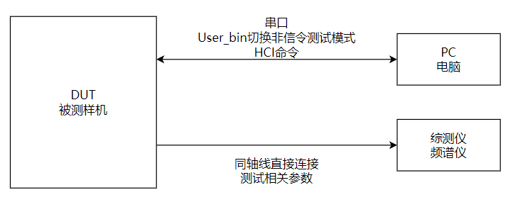
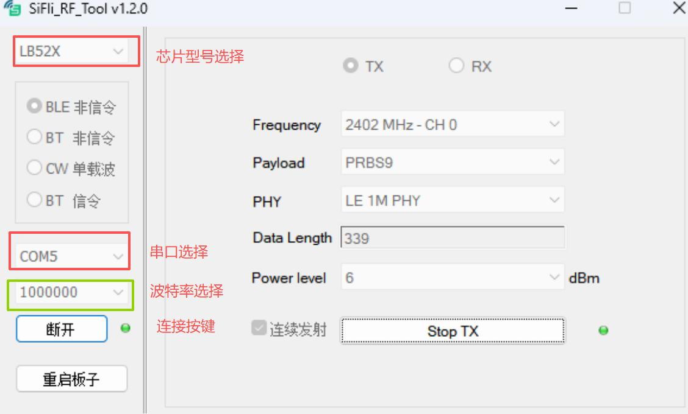
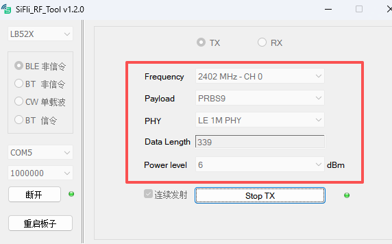
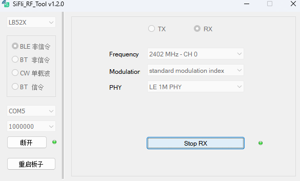
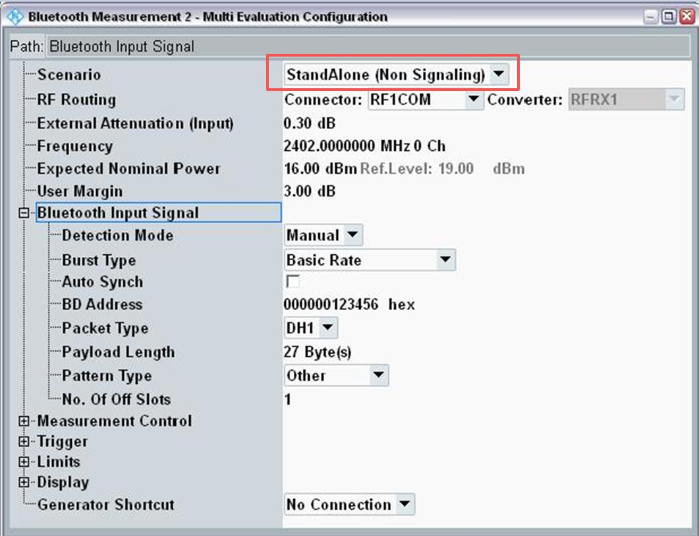

# Run Bluetooth Single-Item RF Tests

Single-item testing is the SDK's low-level RF path for board tuning, FCC/CE pre-compliance, and investigating one carrier or modulation setting at a time. It is not a product feature and does not replace BQB signaling tests.

## Prepare the DUT and tool

Prepare a DUT, PC, USB data cable (not charge-only), RF coax, and a communications tester or spectrum analyzer. Expose `VBAT`, `GND`, and UART1 TX/RX. The source's default UART1 map is:

<div align="center"><em>Table: Default UART1 pins by device/package</em></div>

| Device/package | UART1 TX | UART1 RX |
|---|---|---|
| SF32LB56xU (QFN) | PA17 | PA18 |
| SF32LB56xV (BGA) | PA34 | PA30 |
| SF32LB58x | PA32 | PA31 |
| SF32LB52x | PA19 | PA18 |
| SF32LB55x | Board-specific | Board-specific |

SF32LB55x projects may use a different UART1 mapping; use the board's pin configuration. Connect UART1 to the PC at 1,000,000 baud and the RF port to the instrument through coax. Account for cable loss and distinguish conducted from radiated measurements.

!!! note "Family scope"
    The UART table is the consolidated family/package comparison. The topology and `SiFli_RfTool` screenshots that follow are SF32LB52x source examples; select the actual chip family in the tool and verify the target project's UART mapping.

{ loading="lazy" }
<div align="center"><em>Figure: SF32LB52x source example — the PC controls the DUT through UART/HCI while the RF port connects to a tester or spectrum analyzer through coax.</em></div>

## Enter RF test mode

1. Boot the DUT and keep it awake.
2. Send the FinSH command `bt_cm uart_dut` through SiFli_Trace.
3. Verify the hexadecimal response `04 0E 04 XX 03 0C 00`.
4. Disconnect the terminal; SiFli_RfTool will use the same UART for HCI control.

## Transmit a BLE or Classic BT signal

1. Open `SiFli_RfTool.exe`, select the chip family, choose BLE non-signaling or BT non-signaling, select the UART1 COM port, and connect at 1,000,000 baud.
2. For BLE, set Frequency, Data Length, payload, and PHY, then select Start TX. Stop TX before changing a channel or PHY.
3. For Classic BT, set Frequency, Data Length, and Packet Type, then select Start TX. Stop TX before changing packet parameters.
4. On the tester, match the channel, packet type, payload, and PHY. A spectrum analyzer can show the waveform when no communications tester is available.

The SDK source includes LB52x HDK reference TX levels, but those values are board-specific. Use them only as a debugging reference and measure the actual product board.

{ loading="lazy" }
<div align="center"><em>Figure: SF32LB52x source example — the tool's chip-family, mode, UART, baud-rate, and TX/RX controls; verify these selections before applying a test vector.</em></div>

{ loading="lazy" }
<div align="center"><em>Figure: SF32LB52x source example — select the chip, mode, channel, payload, PHY, data length, and power before starting TX.</em></div>

## Receive and calculate sensitivity

Stop TX before entering RX. Set the channel and press Start RX; stop RX before changing it. For BLE RX, configure the tester for Direct Test Mode, select the PHY/channel, send 1,500 packets, and calculate:

```text
PER = (1500 - received_packets) / 1500 × 100%
```

Record RSSI as well. For Classic BT RX, use a CMW500 GPRF Generator waveform such as DH1/2-DH1/3-DH1 and record received packets, error packets, bit counts, BER, and RSSI. The BLE and Classic BT RF paths share hardware; do not run them in parallel.

{ loading="lazy" }
<div align="center"><em>Figure: SF32LB52x source example — stop TX before RX and record the channel, modulation, PHY, and receive result.</em></div>

## Single-carrier and instrument setup

Stop the current operation before switching to a single-carrier item. Set frequency and power, start TX, and inspect the output on a spectrum analyzer or power meter. For a tester, configure non-signaling reception with the same channel, packet type, and payload as SiFli_RfTool. For RX, configure the tester as the transmitter; BLE uses DTM parameters, while Classic BT uses a GPRF waveform.

If the tool or serial connection becomes unresponsive, close SiFli_RfTool, power-cycle the DUT, wait for boot, and reconnect. Keep the tool version, firmware identity, chip/package, UART pins, board revision, channel, PHY/packet type, power, cable loss, instrument configuration, and raw results with the test record.

{ loading="lazy" }
<div align="center"><em>Figure: SF32LB52x source example — select StandAlone (Non Signaling) and match the DUT channel and packet parameters.</em></div>

Official family sources: [SF32LB52x](https://docs.sifli.com/projects/sdk/latest/sf32lb52x/app_note/%E6%80%9D%E6%BE%88SF32LB5xx%E8%8A%AF%E7%89%87%E8%93%9D%E7%89%99%E5%8D%95%E9%A1%B9%E6%B5%8B%E8%AF%95%E6%8C%87%E5%8D%97.html), [SF32LB55x](https://docs.sifli.com/projects/sdk/latest/sf32lb55x/app_note/%E6%80%9D%E6%BE%88SF32LB5xx%E8%8A%AF%E7%89%87%E8%93%9D%E7%89%99%E5%8D%95%E9%A1%B9%E6%B5%8B%E8%AF%95%E6%8C%87%E5%8D%97.html), [SF32LB56x](https://docs.sifli.com/projects/sdk/latest/sf32lb56x/app_note/%E6%80%9D%E6%BE%88SF32LB5xx%E8%8A%AF%E7%89%87%E8%93%9D%E5%8D%95%E9%A1%B9%E6%B5%8B%E8%AF%95%E6%8C%87%E5%8D%97.html), and [SF32LB58x](https://docs.sifli.com/projects/sdk/latest/sf32lb58x/app_note/%E6%80%9D%E6%BE%88SF32LB5xx%E8%8A%AF%E7%89%87%E8%93%9D%E5%8D%95%E9%A1%B9%E6%B5%8B%E8%AF%95%E6%8C%87%E5%8D%97.html).
