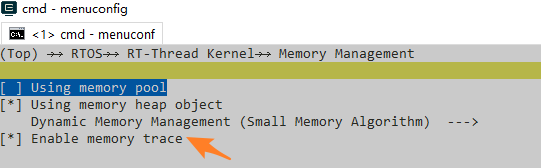
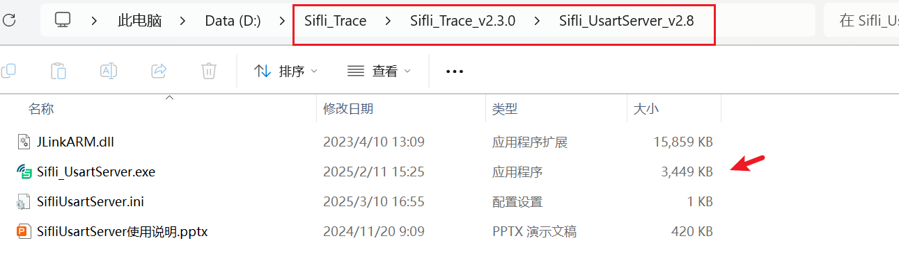
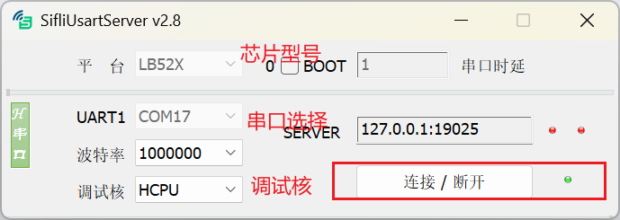
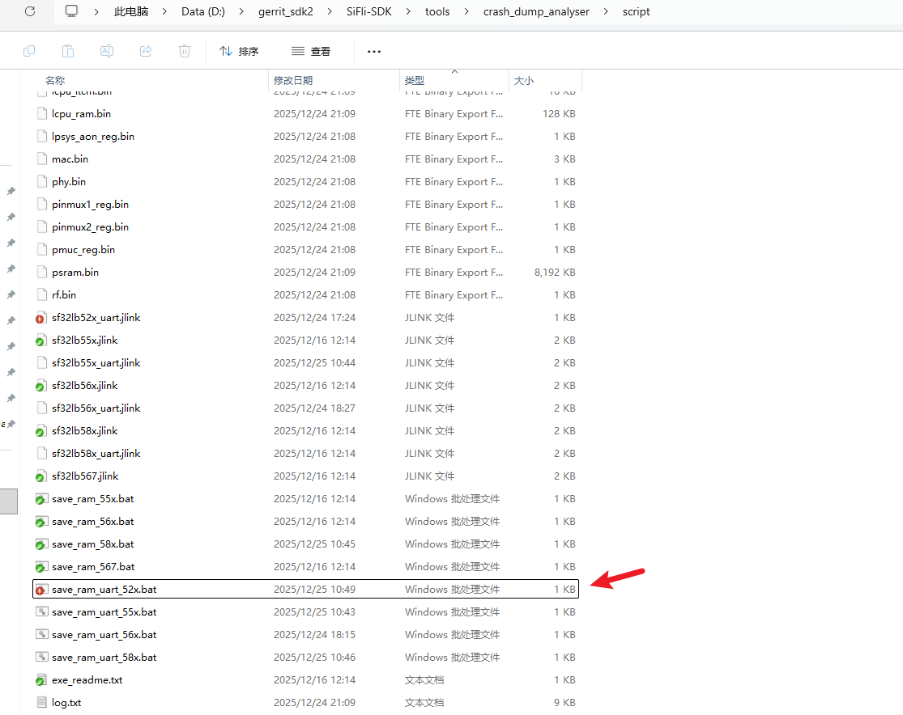
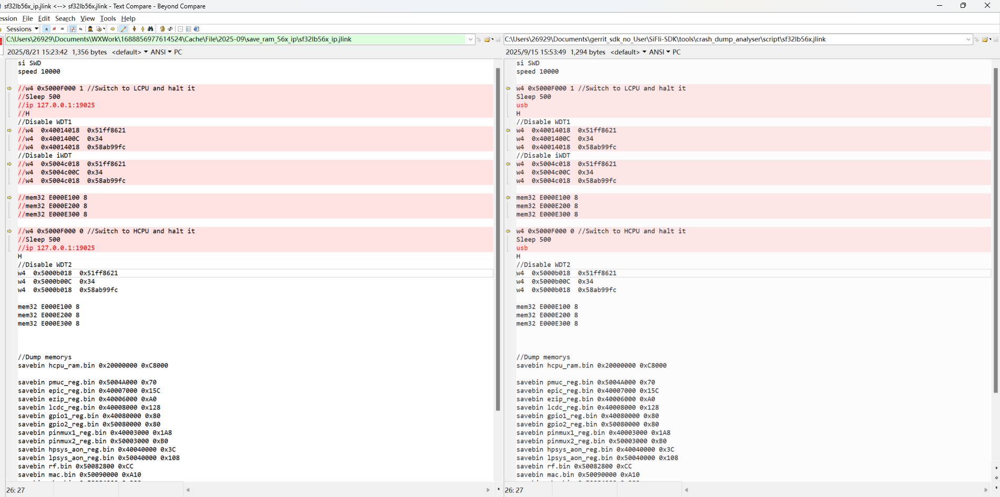

# Capture Logs and Analyze Crashes

The SDK's `debug_logging` and `crash_analysis` guides are complementary: logs explain what the two cores were doing, while a captured memory image lets a debugger recover the failing context. Keep the exact ELF, map/symbol files, SDK revision, chip model, configuration, and board revision with every capture.

## Choose a debug connection

<div align="center"><em>Table: Debug and log connections by SF32 family</em></div>

| Family/source path | Debug and log behavior |
|---|---|
| SF32LB52x, SF32LB56x, SF32LB58x | The source guide documents UART capture, `SifliUsartServer`/`AssertDumpUart`, and J-Link/Trace32 recovery. Use the transport that remains available in the selected sleep state. |
| SF32LB55x | SWD can be switched between HCPU and LCPU with `$SDK_ROOT/tools/segger/jlink_hcpu_a0.bat` and `jlink_lcpu_a0.bat`. LCPU's ROM console is UART3 at 1,000,000 baud; HCPU can use UART1/2 or SWD. Because SWD uses PB IO, keep LPSYS active or in light sleep while connected. |

When LPSYS wakes from standby, SWD returns to HCPU. A J-Link reset does not itself switch the selected core. If asynchronous logging is enabled, an assert dump can be truncated; use a synchronous or retained capture for the failure path.

## Capture a live or post-mortem package

For current SDK releases, capture over UART or J-Link with `sdk.py`:

!!! note "Example scope"
    The command below is an SF32LB52/LB525 example. Keep the command structure, but replace the chip/model, core, transport, and ELF with values supported by the target family and SDK release.

```text
sdk.py crash-dump capture-live --transport uart --probe /dev/ttyUSB0 \
  --chip SF32LB52 --chip-model LB525 \
  --output /tmp/live-crash --elf build_hcpu/main.elf
```

Add `--include-psram --psram-size 8MB` when the target uses PSRAM. A J-Link probe can use `--transport jlink --jlink-ip 127.0.0.1:19025`; select the affected core with `--core hcpu` or `--core lcpu`. The output directory should contain the captured binary, core ELF/AXF, `log.txt`, `manifest.json`, and `sdk_manifest.json`.

For older SDKs, use the family-specific method in the source guide:

- UART: `SifliUsartServer` or `AssertDumpUart` can export an assertion package while the console is available.
- J-Link/SWD: on 55x, run `$SDK_ROOT/tools/crash_dump_analyser/script/save_ram_a0.bat` after putting J-Link on `PATH`; this saves RAM, EPIC registers, and PSRAM.
- Ensure `RTOS → RT-Thread Kernel → Memory Management → Enable memory trace` is enabled when heap-leak evidence is needed.

{ loading="lazy" }
<div align="center"><em>Figure: SF32LB52x source example — enable memory trace before reproducing a failure when heap evidence is required.</em></div>

UART capture normally requires matching the serial utility, server address, and target core. The two source screenshots below are useful connection checks:

{ loading="lazy" }
<div align="center"><em>Figure: SF32LB52x source example — tool directory from the source guide.</em></div>

{ loading="lazy" }
<div align="center"><em>Figure: SF32LB52x source example — the serial port, baud rate, server address, and debug core must match the captured target.</em></div>

{ loading="lazy" }
<div align="center"><em>Figure: SF32LB52x source example — UART RAM-save script listing; use the script that matches the target family and capture path.</em></div>

## Restore and analyze the context

Convert a captured package to a debugger-readable core and analyze it with the matching ELF:

```text
sdk.py crash-dump readcore --package /tmp/live-crash \
  --elf build_hcpu/main.elf --output /tmp/live-crash/coredump.elf
sdk.py crash-dump analyze --core /tmp/live-crash/coredump.elf \
  --elf build_hcpu/main.elf
```

The older Trace32 workflow loads an HCPU assertion package with the HCPU assertion (HA) button and `run_next_step`; use the LCPU recovery configuration for an LCPU dump. If no exception stack is displayed, verify the core selection, ELF, and memory ranges before interpreting registers.

{ loading="lazy" }
<div align="center"><em>Figure: SF32LB52x source example — J-Link/Trace32 capture-script selection.</em></div>

{ loading="lazy" }
<div align="center"><em>Figure: SF32LB52x source example — inspect the call stack, thread list, heap, and error reason together after recovery.</em></div>

## Stop early during boot or a suspected race

To debug initialization, uncomment the first instruction in the matching `Reset_Handler` so it becomes `B .`:

The startup-file paths below are SF32LB55x source paths; use the corresponding startup files for another family.

- HCPU: `$SDK_ROOT/drivers/cmsis/sf32lb55x/Templates/arm/startup_bf0_hcpu.S`
- LCPU: `$SDK_ROOT/drivers/cmsis/sf32lb55x/Templates/arm/startup_bf0_lcpu.S`

Connect J-Link and advance the PC by two bytes to continue. In C, `_asm("B .");` creates the same intentional stop. Do not replace it with `while (1);`; the compiler may optimize away code after the loop.

## Read the evidence

An assertion dump normally includes the assertion function and line, thread table, mailbox and message-queue state, mutexes, semaphores, heap usage, and CPU registers. Correlate the failing PC with the exact ELF, then check stack headroom, blocked owners, queue entries, and the last log before the failure. Preserve the raw dump before symbolizing it.

For interactive inspection, Ozone can load the HCPU/LCPU ELF and the matching Cortex-M33-with-FPU SVD from `$SDK_ROOT/tools/svd_external`. Use UART or `SifliUsartServer` when the core is in a state where SWD cannot attach. ULOG can use UART, and Segger RTT can be selected as the RT-Thread log device after enabling RTT support.

## Instrument bus and memory failures

The SDK bus monitor can capture accesses that lead to a bus fault. Register a callback with `dbg_busmon_reg_callback`, then use `dbg_busmon_read` and `dbg_busmon_write` from the source example to inspect the relevant address range. Pair this with heap tracing and the crash package; a register dump without symbols or memory context is rarely sufficient.

{ loading="lazy" }
<div align="center"><em>Figure: SF32LB52x source example — heap call stack and memory windows.</em></div>

Official family sources: [SF32LB52x crash analysis](https://docs.sifli.com/projects/sdk/latest/sf32lb52x/app_note/crash_analysis.html), [SF32LB55x](https://docs.sifli.com/projects/sdk/latest/sf32lb55x/app_note/crash_analysis.html), [SF32LB56x](https://docs.sifli.com/projects/sdk/latest/sf32lb56x/app_note/crash_analysis.html), [SF32LB58x](https://docs.sifli.com/projects/sdk/latest/sf32lb58x/app_note/crash_analysis.html), and the matching [debugging and logging guide](https://docs.sifli.com/projects/sdk/latest/sf32lb52x/app_note/debug_logging.html).
