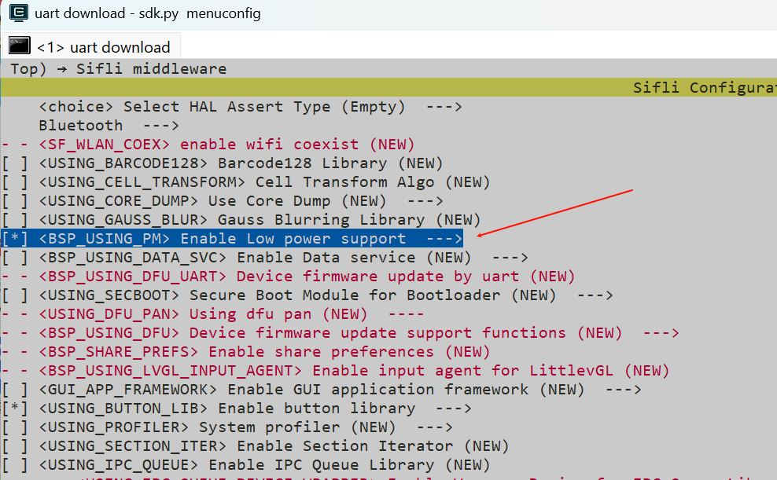
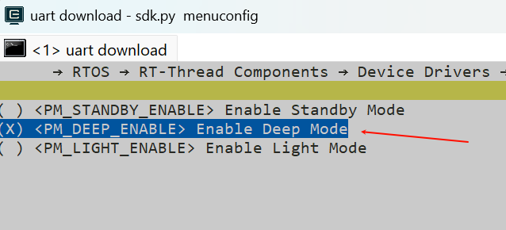
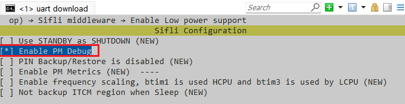
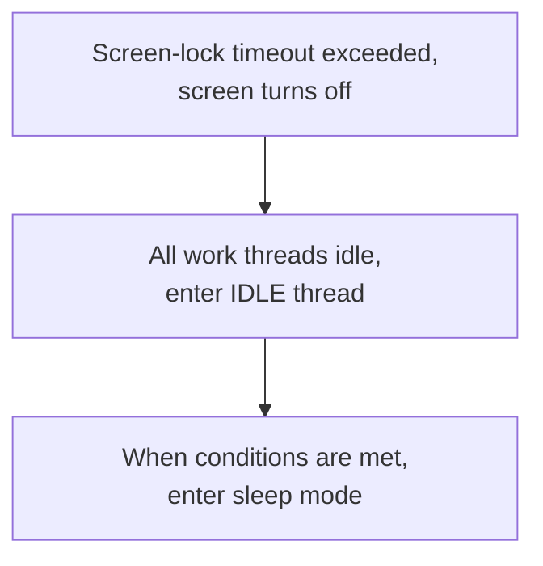
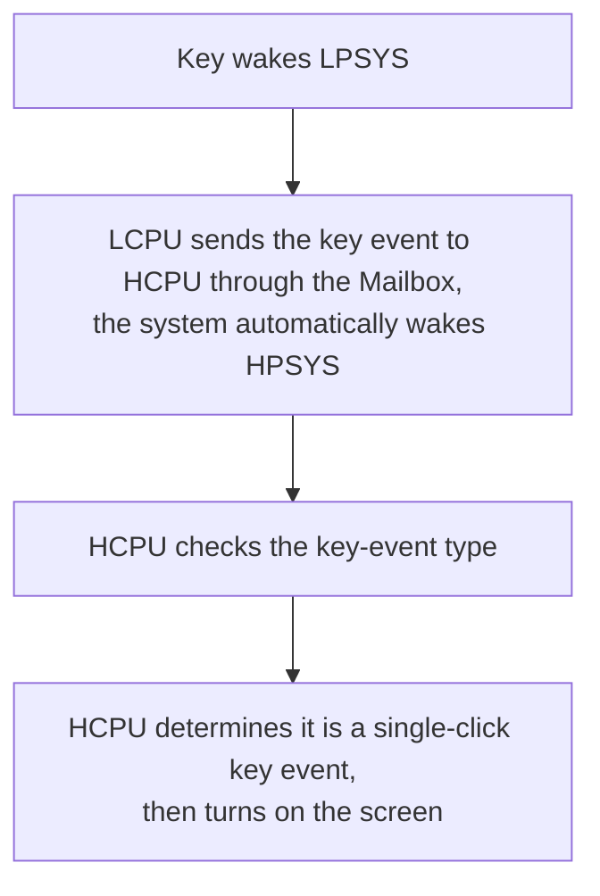

# Configure and Measure Low Power

The SiFli SDK power-management guide covers the dual-core SF32 architecture: HCPU in HPSYS provides up to 240 MHz for graphics, audio, and neural-network work, while LCPU in LPSYS provides up to 48 MHz for Bluetooth and sensor tasks. This page consolidates the SDK guidance for SF32LB52x, SF32LB55x, SF32LB56x, and SF32LB58x.

## Configure the power-management framework

From the project directory, run:

```bash
sdk.py menuconfig
```

Enable these options:

<div align="center"><em>Table: Low-power menuconfig options</em></div>

| Menuconfig path | Symbol | Purpose |
|---|---|---|
| `Sifli middleware → Enable Low power support` | `BSP_USING_PM` | Enables the SiFli power-management module. |
| `RTOS → RT-Thread Components → Device Drivers → Using Power Management device drivers → Select PM Mode → Enable Deep Mode` | `PM_DEEP_ENABLE` | Selects deep-sleep support. |
| `Sifli middleware → Enable Low power support → Enable PM Debug` | `BSP_PM_DEBUG` | Prints power-management transitions; disable it for final current measurements. |

The generated `rtconfig.h` normally contains `RT_USING_PM`, `BSP_USING_PM`, and the selected mode symbol. Start from `example/pm/classical` for a working reference. To disable the feature, reverse the same menuconfig selections.

The figures below are from the SF32LB52x source guide and confirm the two key menu locations. Use the target family's SDK menu as the authority for the actual project.

{ loading="lazy" }
<div align="center"><em>Figure: SF32LB52x source example — enable `BSP_USING_PM` under Sifli middleware → Enable Low power support.</em></div>

{ loading="lazy" }
<div align="center"><em>Figure: SF32LB52x source example — enable `PM_DEEP_ENABLE` under RTOS → RT-Thread Components → Device Drivers.</em></div>

## Select a wake source

Use the board's `pinmux.c`/`drv_io.c` and the APIs in the matching SDK example.

<div align="center"><em>Table: Deep/standby and Hibernate wake behavior by family</em></div>

| Family | Deep/standby wake behavior | Hibernate wake behavior |
|---|---|---|
| SF32LB52x | In deep sleep, all pins can wake through `WSR_GPIO1`; no additional wake-pin selection is required. HCPU and LCPU may sleep independently. | Configure the PMU wake pin and level before calling `HAL_PMU_EnterHibernate()`. |
| SF32LB55x, SF32LB56x, SF32LB58x | Use the family-specific AON wake-pin map. 55x and later provide two system wake sources, `PIN0` and `PIN1`, each assignable to an HCPU/LCPU wake pin. | Select and enable the PMU wake source, for example: |

```c
HAL_PMU_SelectWakeupPin(0,
    HAL_HPAON_QueryWakeupPin(hwp_gpio1, BSP_KEY1_PIN));
HAL_PMU_EnablePinWakeup(0, AON_PIN_MODE_HIGH);
rt_kprintf("CR:0x%x, WER:0x%x\n", hwp_pmuc->CR, hwp_pmuc->WER);
```

A Hibernate wake is a cold boot with `PM_HIBERNATE_BOOT` set; it does not resume the interrupted instruction stream like standby. If one IO must wake both standby and Hibernate, configure both paths. On 55x Hibernate wake pins are floating inputs, so provide an external pull resistor where the board requires one.

## Understand the sleep states

<div align="center"><em>Table: Sleep modes and typical wake times</em></div>

| SDK mode | CPU/peripheral state | SRAM and wake sources | Typical wake time |
|---|---|---|---|
| `PM_SLEEP_MODE_IDLE` | CPU waits in WFI/WFE; clocks and peripherals continue. | SRAM remains accessible; any interrupt can wake it. | <1 µs |
| `PM_SLEEP_MODE_LIGHT` | High-speed clocks stop; the subsystem switches to 32 kHz. | LPTIM, RTC, LCPU BLE MAC, mailbox, or a wake pin. | 30–100 µs |
| `PM_SLEEP_MODE_DEEP` | Like light sleep, but supply switches to `RET_LDO`. | Retained subsystem RAM; same wake sources as light sleep. | 100 µs–1 ms |
| `PM_SLEEP_MODE_STANDBY` | CPU and its peripherals reset/off; configured retention RAM and pin state remain. | RTC, LPTIM, BLE MAC, mailbox, or wake pin. Software distinguishes standby boot through AON state. | 1–2 ms |
| Hibernate | All subsystems power off; 32 kHz crystal remains. | RTC or PMU wake pin; RAM is not retained. `HAL_PMU_EnterHibernate()`. | >2 ms |
| Shutdown | All subsystems power off; RC10K remains. | RTC or PMU wake pin; RAM is not retained and IO is high impedance. `HAL_PMU_EnterShutdown()`. | >2 ms |

When PSRAM is present, HCPU backs up power-down RAM to PSRAM and restores it after wake; otherwise the SDK uses 64 KB of retention RAM. The actual current depends on enabled peripherals, IO levels, external memory, and the board.

## Control clocks while awake

If the idle thread cannot enter a sleep state, WFI auto-frequency reduction can lower current. It is safe only when EPIC, EZIP, LCDC, USB, and SD are idle. If an application does not use the SDK's LVGL/device bookkeeping, bracket peripheral activity with `rt_pm_hw_device_start()` and `rt_pm_hw_device_stop()`. Configure the divider with `HAL_RCC_HCPU_SetDeepWFIDiv()`; audio workloads normally limit the reduced clock to 48 MHz, while other workloads can use 4 MHz. Set `HPSYS_RCC_DBGR_FORCE_HP` as required by the SDK guide.

For active work, use `rt_pm_run_enter()`:

<div align="center"><em>Table: Run-mode HCPU clock selections</em></div>

| Mode | HCPU clock |
|---|---:|
| `PM_RUN_MODE_HIGH_SPEED` | 240 MHz |
| `PM_RUN_MODE_NORMAL_SPEED` | 144 MHz |
| `PM_RUN_MODE_MEDIUM_SPEED` | 48 MHz |
| `PM_RUN_MODE_LOW_SPEED` | 24 MHz |

`pm_scenario_start()`/`pm_scenario_stop()` provide the SDK's UI and Audio policy: either scenario active selects high speed; neither active selects medium speed. Measure energy, not only instantaneous current, because a lower clock can lengthen execution.

## Follow the dual-core sleep flow

After the screen turns off, HPSYS can enter sleep. On 55x/56x/58x, LPSYS normally follows after HPSYS; the 52x family is the exception and permits independent HCPU/LCPU sleep. After wake, `gui_resume` starts a new screen-off decision cycle. Keep LCPU awake when a shared peripheral or IPC transaction still needs it.

Enable `BSP_PM_DEBUG` temporarily and search logs for:

<div align="center"><em>Table: Low-power transition log markers</em></div>

| Log | Meaning |
|---|---|
| `gui_suspend` / `gui_resume` | Screen-off/on transition. |
| `[pm]S: mode,gtime` | Entered sleep; `gtime` is in 32,768-Hz ticks. |
| `[pm]W: gtime` | Woke from sleep. |
| `[pm]WSR:0x...` | Wake reason; decode bits using the family user manual. |

If an expected sleep does not occur, check `list_thread`, `pm_dump`, and `list_timer`. The idle thread must run, no code may hold `rt_pm_request(PM_SLEEP_MODE_IDLE)`, the nearest OS timer must be beyond the policy threshold (typically 100 ms for HCPU and 10 ms for LCPU), wake conditions must be inactive, and IPC queues must be drained. A periodic delay shorter than the threshold can prevent sleep indefinitely.

The source guide also diagrams the “screen off → IDLE → sleep when conditions are met” path and the “key wakes LPSYS, then LCPU sends the event to HCPU through the Mailbox and the system automatically wakes HPSYS” path. These are useful for checking log order; the wording and flow are SF32LB52x examples and should not be used to infer WSR bit assignments for another family.

{ loading="lazy" }
<div align="center"><em>Figure: SF32LB52x low-power debug switch (`BSP_PM_DEBUG`).</em></div>

<div align="center"><em>Figure: SF32LB52x source flow — screen-off to sleep.</em></div>



<div align="center"><em>Figure: SF32LB52x source flow — LPSYS-to-HPSYS wake.</em></div>



## Reduce board-level leakage

Measure the minimum system first: disconnect the display, sensor, charger, and other removable loads, then add them back one at a time. Common leakage sources are:

- an external device that remains powered;
- an output driven high into a powered-down device;
- a floating input or mismatched pull-up/pull-down;
- PSRAM, NOR/NAND flash, eMMC, or SDIO that was not put into its low-power state;
- a 55x USB `PA01` configuration that conflicts with its internal pull-down.

Implement board-specific transitions in `BSP_IO_Power_Down()` and `BSP_Power_Up()`, and use `BSP_TP_PowerDown/Up` and `BSP_LCD_PowerDown/Up` when display or touch power should change immediately at screen-off/on. If XIP executes from NOR flash, place the flash sleep/wake routine in retained RAM (`HAL_RAM_RET_CODE_SECT`).

## Measure and record a reproducible result

For every measurement, record the family and SDK revision, board revision, supply voltage, meter location and bandwidth, firmware configuration, memory population, active peripherals, wake source, sleep mode, and the transition log. Report the state and test conditions with the current; never compare a bare number from a different board or mode.

Official family sources: [SF32LB52x](https://docs.sifli.com/projects/sdk/latest/sf32lb52x/app_note/low_power.html), [SF32LB55x](https://docs.sifli.com/projects/sdk/latest/sf32lb55x/app_note/low_power.html), [SF32LB56x](https://docs.sifli.com/projects/sdk/latest/sf32lb56x/app_note/low_power.html), and [SF32LB58x](https://docs.sifli.com/projects/sdk/latest/sf32lb58x/app_note/low_power.html).
