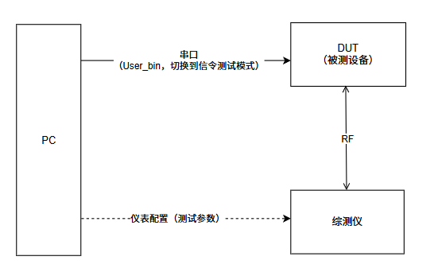
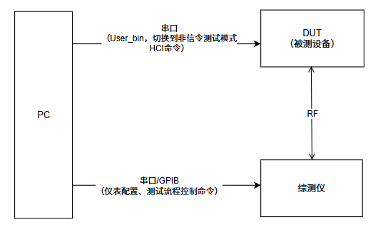
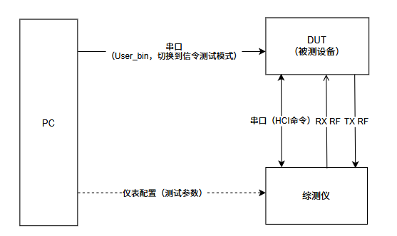
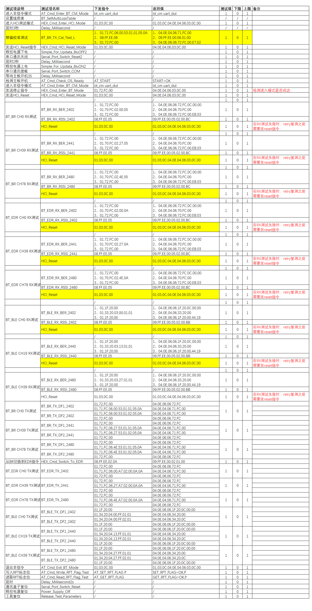

# Run SiFli SDK RF Tests

The SDK separates Bluetooth RF validation into signaling, non-signaling, and single-item tests. Choose the route from the test objective before loading a test firmware.

<div align="center"><em>Table: RF-test content scope by family</em></div>

| Content | Family scope |
|---|---|
| Test-mode comparison and measurement sequence | Consolidated workflow for SF32LB52x, SF32LB55x, SF32LB56x, and SF32LB58x. |
| Topology screenshots and HCI command matrix | SF32LB52x source examples; use the target family's command and pin documentation for implementation. |
| `CONFIG_BT_RF_TEST` configuration | Applies to the documented non-55x path; SF32LB55x `bt_rftest` does not use this symbol. |
| UART pins, packet values, and command syntax | Target-family and SDK-release dependent; verify the project configuration and `bt_rftest help`. |

## Select the test mode

<div align="center"><em>Table: Bluetooth and RF test-mode selection</em></div>

| Mode | Use it for | SDK entry | Control path |
|---|---|---|---|
| BT signaling | BQB/QDID qualification and protocol-conformant performance | `bt_cm dut`, `gap_enb_dut_mode_req()` | Tester air interface and LMP test control |
| BT non-signaling | Development RF tuning and production screening | `bt_rftest`, `bt_enter_no_signal_dut_mode()` | Local vendor HCI |
| BLE non-signaling (SIG DTM) | BLE RF screening and SIG DTM items | `bt_rftest bletx/blerx`, `ble_enter_dut_mode()` | Local HCI or standard HCI forwarded by `bt_cm uart_dut` |
| Single-item | Board-level RF tuning and FCC/CE pre-compliance | `bt_cm uart_dut` + `SiFli_RfTool` | PC tool sends one low-level operation at a time |

Signaling establishes a real Bluetooth link and is the qualification route. Non-signaling directly holds RF in a fixed channel/power/transmit or receive state and is the usual development/production path. Single-item tests use the PC tool for precise carrier or modulation control and an analyzer or power meter. BT non-signaling and single-item tests are SiFli vendor workflows, not BQB tests.

The topology figures below come from the SF32LB52x RF-test guide. They highlight the differences between the PC, DUT, tester, and UART/HCI/RF paths; use the target family's table for the actual default UART and pin map.

{ loading="lazy" }
<div align="center"><em>Figure: SF32LB52x source example — BT signaling: the PC configures the tester while the DUT and tester establish the RF link.</em></div>

{ loading="lazy" }
<div align="center"><em>Figure: SF32LB52x source example — BT non-signaling: the PC controls the DUT RF state directly through serial/HCI commands.</em></div>

{ loading="lazy" }
<div align="center"><em>Figure: SF32LB52x source example — BLE DTM: the UART/HCI control path and RF measurement path both connect to the tester.</em></div>

## Choose firmware and configure the project

`rf_test.bin` is an internal SiFli RF-test build and is not distributed as a normal SDK artifact. `User.bin` is any SDK-built application firmware; the RF functions are integrated into the protocol stack and are entered with FinSH commands such as `bt_cm dut`, `bt_cm uart_dut`, and `bt_rftest`.

For a user build, enable the relevant options:

```kconfig
CONFIG_RT_USING_FINSH=y
CONFIG_BSP_BT_CONNECTION_MANAGER=y
CONFIG_BT_RF_TEST=y
```

`CONFIG_BT_RF_TEST` is not used for the SF32LB55x `bt_rftest` path. `CONFIG_BT_FINSH` is for tracing and is not required for the test commands. When the control path uses the SDK's own IPC UART, set `CONFIG_IPC_USE_OWN_DEVICE=y` and `CONFIG_IPC_OWN_DEVICE_NAME="uart2"` as appropriate for the board. The SDK examples `example/bt/spp/` and `example/bt/HCI_over_uart/` provide starting points.

## BT signaling test

1. Expose `VBAT`, `GND`, and UART1 TX/RX on the DUT. Default UART1 pins vary by package; use the project's pin configuration.
2. For BLE signaling, connect UART1 to a PC and send `bt_cm uart_dut`. Verify `04 0E 04 XX 03 0C 00`, then move the UART to the tester.
3. For BT signaling, keep the DUT awake, send `bt_cm dut`, verify `Write scan enable success`, and connect RF coax to the tester.
4. In Bluetooth Signaling, BLE uses USB-to-RS232 EUT control at 1,000,000 baud; BT uses `None (EUT Control off)` and discovers the DUT over the air.
5. Run TX in `Bluetooth 1 Multi Eval.` and RX in `Bluetooth 1 RX Meas.`. Use BER for Classic BT and PER for BLE; reduce tester TX level to determine sensitivity.

## BT/BLE non-signaling commands

Use the FinSH shell after the RF test path is enabled:

```text
bt_rftest enter
bt_rftest bttx <channel> <packet_type> <power> <length>
bt_rftest btrx <channel> <packet_type> <power>
bt_rftest btstop
bt_rftest exit
```

The exact argument order and accepted packet values are release-specific; copy the syntax printed by `bt_rftest help` in the target SDK. RX packet statistics are meaningful; TX packet count is not a received-packet measurement. BLE DTM uses `bt_rftest bletx`/`blerx`, or standard HCI `LE_Transmitter_Test`, `LE_Receiver_Test v2`, and `LE_Test_End`. BLE channels are 0–39 and PHY values are 1M/2M/Coded; Classic BT channels are 0–78. BT and BLE share the RF, so do not run them simultaneously.

## Single-item testing with SiFli_RfTool

Connect DUT UART1 to the PC at 1,000,000 baud and RF through coax to a tester, spectrum analyzer, or power meter. Send `bt_cm uart_dut`, verify `04 0E 04 XX 03 0C 00`, then select the family, BLE or BT non-signaling mode, and COM port in `SiFli_RfTool.exe`. Stop TX/RX before changing channel, PHY, packet type, or power. For BLE RX, a tester can send 1,500 packets; calculate `PER = (1500 - received) / 1500 × 100%` and record RSSI. For Classic BT RX, use a CMW500 GPRF waveform and record RSSI, packet/bit error counts, and BER/PER. Apply cable-loss compensation and distinguish conducted from radiated results.

## Record the result

The source guide also includes a complete HCI command/return-value matrix. Use it when a command is sent but the DUT does not enter the expected state; do not treat every vector in that table as a portable API. Match commands to the target SDK and chip family.

{ loading="lazy" }
<div align="center"><em>Figure: SF32LB52x source example — matrix of HCI commands, return values, and RF test items.</em></div>

Keep the family, SDK revision, firmware identity, UART pins, RF path, cable loss, instrument model/configuration, channel, PHY/packet type, power setting, RX counts, RSSI, BER/PER, and board revision with every result. See the detailed official guides for [SF32LB52x](https://docs.sifli.com/projects/sdk/latest/sf32lb52x/app_note/rf_test_guide.html), [SF32LB55x](https://docs.sifli.com/projects/sdk/latest/sf32lb55x/app_note/rf_test_guide.html), [SF32LB56x](https://docs.sifli.com/projects/sdk/latest/sf32lb56x/app_note/rf_test_guide.html), and [SF32LB58x](https://docs.sifli.com/projects/sdk/latest/sf32lb58x/app_note/rf_test_guide.html).
