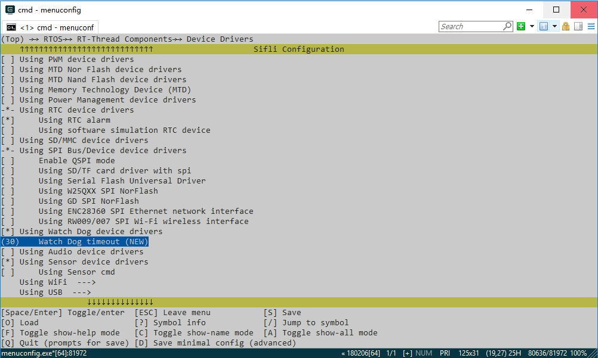
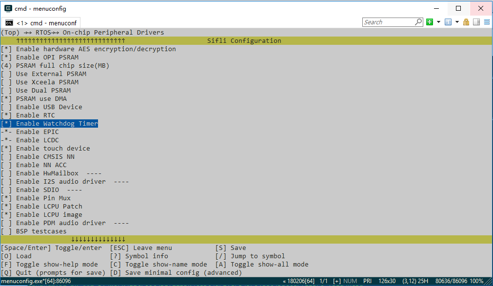

# Configure the Watchdog

This article consolidates the watchdog guidance in the SF32 SiFli-SDK application notes. SF32 devices provide a watchdog for each processing subsystem: HCPU uses the system watchdog, while LCPU uses the LCPU-subsystem watchdog. The SDK enables the chip watchdog together with the RT-Thread watchdog driver.

<div align="center"><em>Table: Watchdog scope and family-specific evidence</em></div>

| Item | Scope in this article |
|---|---|
| HCPU/LCPU watchdog behavior | Consolidated SF32 behavior from the 52x, 55x, 56x, and 58x guides. |
| 30-second default timeout | Source-guide default; verify the selected family and SDK release in `menuconfig`. |
| Menuconfig screenshots | SF32LB52x source examples only; they illustrate menu locations, not a universal path or default. |

## Enable and configure the watchdog

Run `sdk.py menuconfig` in the project directory and enable the watchdog option under the RT-Thread device-driver configuration. The exact menu label can vary with the SDK release; use the target family's source page and confirm the generated `rtconfig.h` before building.

The default watchdog timeout in the SDK guide is 30 seconds. Use the timeout option in the same menu to select a different value, then keep the generated configuration with the firmware image.

The source figures below show the menu location and timeout field. They are SF32LB52x examples; menu paths and defaults can vary with the target SDK release, so they do not replace checking the project's own `menuconfig` output.

{ loading="lazy" }
<div align="center"><em>Figure: Watchdog driver menu from the SF32LB52x source guide.</em></div>

{ loading="lazy" }
<div align="center"><em>Figure: Watchdog timer configuration from the SF32LB52x source guide.</em></div>

## Feeding policy

The system feeds the watchdog from the RT-Thread `IDLE` thread. If application threads do not run continuously for longer than the configured timeout, no additional application code is required.

If a high-priority thread must run continuously longer than the timeout, feed the watchdog from that thread with:

```c
rt_hw_watchdog_pet();
```

Do not add an unconditional feed loop that masks a scheduler stall or a deadlock. The feed point should represent healthy progress in the work being supervised.

## Sleep and reset behavior

- Entering `Standby` or `hibernate` disables the watchdog; it is enabled again after wake.
- In the other sleep modes the watchdog continues running, so the system must wake and feed it before the timeout expires.
- HCPU uses the system watchdog. A timeout restarts the entire chip.
- LCPU uses the LCPU-subsystem watchdog. A timeout first generates an interrupt; the interrupt handler then triggers a software restart of the entire chip.

## Validation sequence

1. Record the chip family, SDK revision, timeout, feeding owner, and sleep mode.
2. Verify that a healthy workload reaches the intended feed point.
3. Stop the feed path deliberately and confirm the expected reset scope and boot behavior.
4. Repeat from every supported sleep mode, especially `Standby` and `hibernate`.
5. Retain the reset observation and any boot-time diagnostic evidence with the product recovery test.

## Official sources

- [SF32LB52x Watchdog Guide](https://docs.sifli.com/projects/sdk/latest/sf32lb52x/app_note/watchdog.html)
- [SF32LB55x Watchdog Guide](https://docs.sifli.com/projects/sdk/latest/sf32lb55x/app_note/watchdog.html)
- [SF32LB56x Watchdog Guide](https://docs.sifli.com/projects/sdk/latest/sf32lb56x/app_note/watchdog.html)
- [SF32LB58x Watchdog Guide](https://docs.sifli.com/projects/sdk/latest/sf32lb58x/app_note/watchdog.html)
