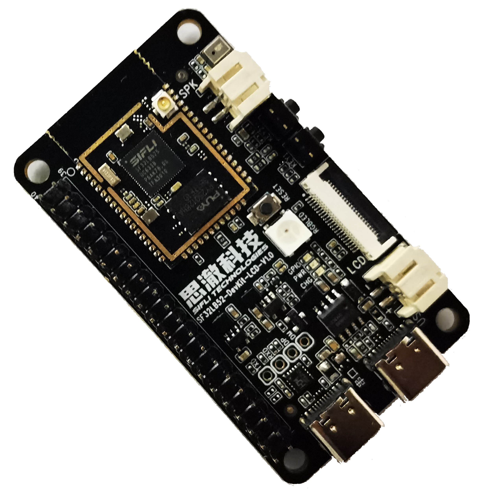
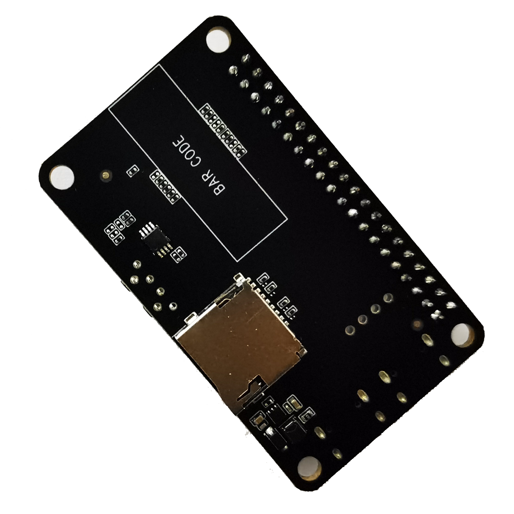
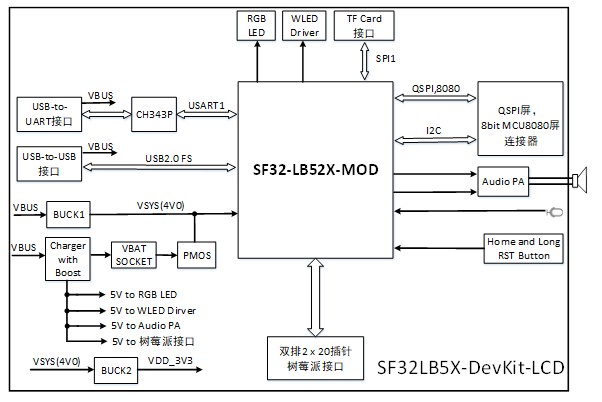
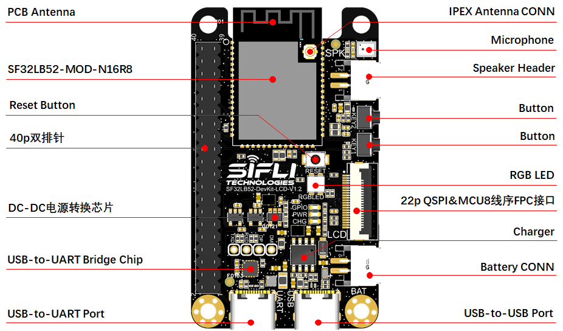
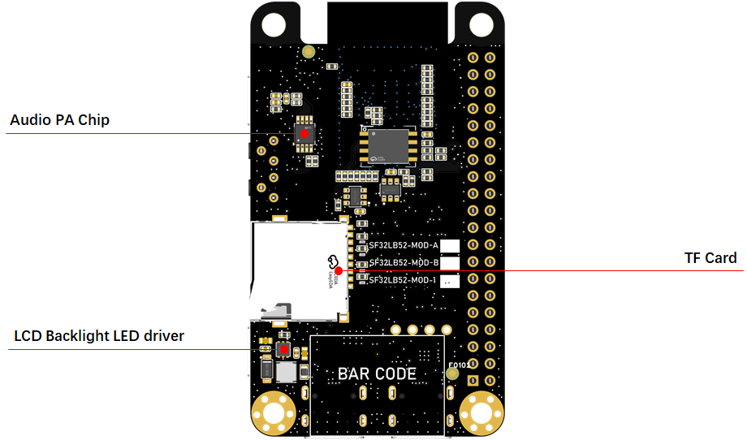
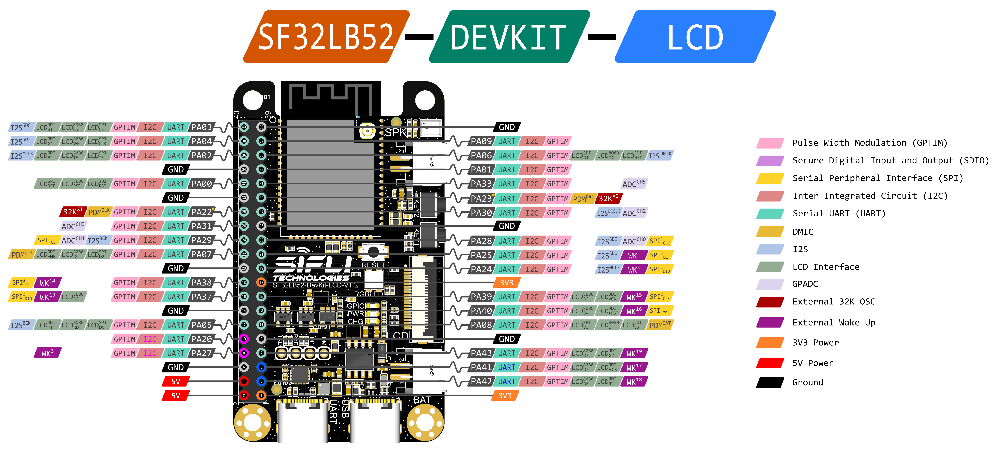

# SF32LB52-DevKit-LCD

## Overview

The SF32LB52-DevKit-LCD is a display-focused development board for the SF32LB52x family. It is built around an SF32LB52x module and is intended for rapid development of products that use SPI, DSPI, QSPI, or MCU/8080 display interfaces.

The board combines the MCU module, display connectors, touch interface, analog microphone input, analog audio output, USB-C, USB-to-UART debug, TF-card storage, and battery support on one evaluation platform. It is a practical starting point for smartwatch-style HMIs, compact dashboards, display peripherals, and other SF32LB52x applications that need a screen early in development.

{ loading="lazy" }

<em>SF32LB52-DevKit-LCD — Front View</em>

{ loading="lazy" }

<em>SF32LB52-DevKit-LCD — Back View</em>

{ loading="lazy" }

<em>SF32LB52-DevKit-LCD — Block Diagram</em>

## Board Highlights

- SF32LB52x module platform, compatible with SF32LB-MOD-1, SF32LB-MOD-A, and SF32LB-MOD-B
- QSPI/SPI/DSPI LCD support through a 22-pin FPC connector
- 8-bit MCU/8080 LCD support through the FPC and 40-pin expansion header
- I2C touch-panel support
- USB-C for USB-to-UART download/debug and board power
- Separate USB-C interface for USB2.0 FS use cases
- On-board MEMS microphone and Class-D audio power amplifier
- MicroSD card slot using SPI
- Battery connector and ETA9640P linear charger
- 40-pin expansion header for display, GPIO, storage, audio, and power signals

## When to Use This Board

Choose SF32LB52-DevKit-LCD when the project needs a ready display platform instead of a minimal breakout board.

- Bring up QSPI, SPI, DSPI, or MCU/8080 LCD panels
- Validate touch-panel integration
- Test LVGL or custom UI applications on SF32LB52x
- Evaluate microphone input and speaker output
- Prototype TF-card storage
- Compare module options before committing to a custom PCB

For a smaller board with castellated edges, use [SF32LB52-DevKit-Nano](SF32LB52-DevKit-Nano.md). For maximum pin breakout and direct signal access, use [SF32LB52-DevKit-Core-3p3](SF32LB52-DevKit-Core-3p3.md).

## Hardware Configuration

<em>Hardware Configuration Summary</em>

| Area | Configuration |
| :--- | :--- |
| MCU module | SF32LB52x module, module variant dependent |
| Standard module configuration | SF32LB525UC6 with 8MB OPI-PSRAM |
| External Flash on module | 128Mb QSPI-NOR Flash, 72MHz STR mode |
| Clocks | 48MHz main crystal and 32.768kHz RTC crystal on the module |
| RF | On-board antenna or IPEX connector selected by 0-ohm resistor |
| Display | QSPI/SPI/DSPI and 8-bit MCU/8080 |
| Touch | I2C touch interface |
| Audio | MEMS microphone input and Class-D speaker amplifier |
| Storage | MicroSD card slot over SPI |
| USB | USB-to-UART Type-C and USB2.0 FS Type-C |
| Battery | Single-cell Li-ion/Li-poly battery connector |
| Charger | ETA9640P linear charger, default 450mA charge current |

## Version Notes

<em>Board Version History</em>

| Version | Module Basis | Notes |
| :--- | :--- | :--- |
| V1.2.0 | SF32LB-MOD-1/A/B | Updated SD-card detect to PA26; planned support for SF32LB-MOD-1 with SF32LB525UC6 |
| V1.1.0 | SF32LB-MOD-A/B | Updated charger circuit, power switching, audio PA gain, reset behavior, RGB LED circuit, module pin compatibility, RF power filtering, dual-Flash support, SD-card detect, optional SDIO Wi-Fi, antenna keep-out, and VBUS protection |
| V1.0.0 | Earlier SF32LB52 module | Initial public board version |

Check the silkscreen and design package for the exact board revision before using the pin map for production carrier-board or fixture design.

{ loading="lazy" }

<em>SF32LB52-DevKit-LCD — Front Annotated View</em>

{ loading="lazy" }

<em>SF32LB52-DevKit-LCD — Back Annotated View</em>

## Getting Started

### Required Hardware

- SF32LB52-DevKit-LCD board
- LCD module compatible with the selected interface
- USB 2.0 data cable, Type-A to Type-C or equivalent
- Host computer running Windows, Linux, or macOS

### Optional Hardware

- Speaker
- TF card
- Single-cell Li-ion/Li-poly battery, typically 450mAh to 500mAh
- Second USB cable when UART debug and native USB testing are needed at the same time

### Basic Setup

1. Connect the LCD module to the correct LCD connector.
2. Connect the USB-to-UART Type-C port to the host computer.
3. Open SifliTrace or the SiFli firmware download tool.
4. Select the detected serial port.
5. Power the board and download or run the target firmware.
6. After the display lights, verify touch, graphics, storage, and audio functions as required by the application.

Use a real data-capable USB cable. Charge-only cables can power the board but will not expose the serial or USB data interface.

## Power

SF32LB52-DevKit-LCD can be powered in two main ways:

- USB Type-C power from either USB connector
- Battery power through the on-board battery connector

For firmware download and normal debugging, use the USB-to-UART Type-C port. Battery power is useful when testing untethered display, audio, and low-power behavior.

The board integrates an ETA9640P linear charger. The maximum supported charge current is 1A, and the default constant-current setting is 450mA. Use a single-cell Li-ion or Li-poly battery and verify connector polarity against the board silkscreen before connecting the battery.

## Download and Debug

The USB-to-UART port is the primary firmware download and log interface.

- **Download mode**: enable the BOOT option in the download tool, then power or reset the board.
- **Debug/log mode**: disable the BOOT option, then power or reset the board to enter normal serial-log operation.

Some SF32LB52x boards use the USB-to-UART RTS signal for reset. If the board resets unexpectedly when the serial port is first opened, disable modem or hardware flow control in the host serial-port settings.

{ loading="lazy" }

<em>Disabling Modem Flow Control in Serial-Port Settings</em>

## LCD and Touch Interface

The board supports QSPI LCD panels through a 22-pin, 0.5mm-pitch FPC connector. The connector is a vertical, flip-lock style connector. If a panel uses a different pin order, use an adapter board before connecting it.

Supported LCD and touch capabilities include:

- SPI, DSPI, and QSPI LCD signaling
- DDR-mode QSPI LCD signaling
- 8-bit MCU/8080 LCD signaling
- LCD reset, chip select, clock, data, TE, and backlight PWM
- I2C touch-panel SDA/SCL, interrupt, and reset

The original SiFli board note lists `TFT-H043A28WQISTKN22_V0-3` as a supported display model.

### 22-Pin QSPI FPC Signal Map

<em>22-Pin QSPI FPC Signal Map</em>

| Pin | Signal | Function |
| :--- | :--- | :--- |
| 1 | LEDK | LCD backlight cathode |
| 2 | LEDA | LCD backlight anode |
| 3 | PA07 | MCU8080 DB0 / QSPI D2 |
| 4 | PA08 | MCU8080 DB1 / QSPI D3 |
| 5 | PA37 | MCU8080 DB2 |
| 6 | PA39 | MCU8080 DB3 |
| 7 | PA40 | MCU8080 DB4 |
| 8 | PA41 | MCU8080 DB5 |
| 9 | PA42 | MCU8080 DB6 |
| 10 | PA43 | MCU8080 DB7 |
| 11 | PA02 | MCU8080 TE / QSPI TE |
| 12 | PA00 | LCD reset |
| 13 | PA04 | MCU8080 WR / QSPI CLK / SPI CLK |
| 14 | PA05 | MCU8080 RD / QSPI D0 / SPI SDI |
| 15 | PA03 | MCU8080 CS / QSPI CS / SPI CS |
| 16 | PA06 | MCU8080 DC / QSPI D1 / SPI DC |
| 17 | VDD_3V3 | 3.3V output |
| 18 | PA31 | Touch interrupt |
| 19 | PA33 | Touch I2C SDA |
| 20 | PA30 | Touch I2C SCL |
| 21 | PA09 | Touch reset |
| 22 | GND | Ground |

## Key Module Pin Assignments

{ loading="lazy" }

<em>40-Pin Header Definition</em>

<em>Key Module Pin Assignments</em>

| Module Pin | Signal | Board Function |
| :--- | :--- | :--- |
| PA44 | VBUS_DET | Charger insertion detection |
| PA43..PA37 | DB7..DB2 | MCU/8080 LCD data |
| PA08..PA07 | DB1..DB0 / QSPI D3..D2 | LCD data |
| PA06 | DC / QSPI D1 | LCD data/command |
| PA05 | RD / QSPI D0 | LCD data |
| PA04 | WR / QSPI CLK | LCD clock |
| PA03 | CS / QSPI CS | LCD chip select |
| PA02 | TE / QSPI TE | LCD tearing-effect signal |
| PA01 | BL_PWM | Backlight control |
| PA00 | RSTB | LCD reset |
| PA33 / PA30 | I2C SDA / SCL | Touch panel |
| PA31 / PA09 | Touch INT / RST | Touch panel |
| PA24, PA25, PA28, PA29 | SPI1 | TF-card interface |
| PA26 | Card detect / LED | Shared function |
| PA20 / PA27 | UART RX/TX | User UART |
| PA18 / PA19 | Debug UART RX/TX | Download and software debug |
| PA10 | AU_PA_EN | Audio amplifier enable |
| MIC_ADC_IN / MIC_BIAS | Analog microphone | Microphone input |
| AU_DAC1P_OUT / AU_DAC1N_OUT | Analog audio | Speaker amplifier input |

## Module Compatibility Notes

- SF32LB-MOD-1 uses pin 17 as a 3.3V output that is disabled by default and must be enabled in software.
- SF32LB-MOD-A/B use pin 17 as a 3.3V power input.
- SF32LB-MOD-1 uses pin 27 as a 3.2V to 4.7V VBAT input.
- SF32LB-MOD-A/B use pin 27 as a 3.3V power input.
- On SF32LB-MOD-1, the VBAT power-on threshold is 3.58V and the power-off threshold is 3.48V. For non-battery supply testing, 3.8V is recommended on VBAT.
- PA21 on module pin 62 is only available on SF32LB-MOD-A/B. It is not connected on SF32LB-MOD-1.
- Module pins 62 to 68 may be connected internally to NOR Flash by default. To use SDIO externally, select a module variant without internal Flash on those pins.

## Audio

The board includes a MEMS microphone and an audio power amplifier.

- Use the on-board microphone path for analog audio input validation.
- Use the speaker connector for audio output testing.
- The external speaker path supports up to 3W into 4ohm according to the original board note.

## Storage

The MicroSD socket is connected over SPI. It is suitable for validating file systems, image assets, logs, and data recording before moving to a custom board.

## Related Documents

[SF32LB52x Chip Introduction]: ../chips/SF32LB52x.md
[SF32LB52x Hardware Design Guide]: ../../hardware/chip-guides/SF32LB52x_hardware_design_guide.md
[SF32LB52-MOD-1]: ../modules/SF32LB52-MOD-1.md
[Original SiFli Wiki Article]: https://github.com/OpenSiFli/SiFli-Wiki/blob/main/source/en/board/sf32lb52x/SF32LB52-DevKit-LCD.md
[Design Package]: https://downloads.sifli.com/hardware/files/documentation/SF32LB52-DevKit-LCD_V1.2.0.zip?
[Buy Samples]: https://sifli.taobao.com/

- :fontawesome-solid-microchip: __[SF32LB52x Chip Introduction]__
- :fontawesome-solid-file-lines: __[SF32LB52x Hardware Design Guide]__
- :fontawesome-solid-cubes: __[SF32LB52-MOD-1]__
- :fontawesome-brands-github: __[Original SiFli Wiki Article]__
- :fontawesome-solid-download: __[Design Package]__
- :fontawesome-solid-cart-shopping: __[Buy Samples]__

