# SF32LB58-DevKit-LCD

## Overview

The SF32LB58-DevKit-LCD is a flagship development board built around the SF32LB58-MOD module family. It is intended for products that use DSI, DPI/RGB, or QSPI displays and need a practical bring-up platform for high-resolution UI, audio, storage, USB, and peripheral integration.

The board brings together the SF32LB58x module, multiple display connectors, analog microphone input, stereo speaker output, MicroSD, dual USB Type-C ports, large-core and low-power-core expansion headers, and accessory interfaces such as CAN and SDIO Wi-Fi expansion.

This makes it a strong fit for high-end wearable HMIs, rich dashboards, connected control panels, and other products that need to validate display, storage, audio, and external-peripheral behavior before committing to a custom flagship board.

{ loading="lazy" }

<em>SF32LB58-DevKit-LCD — Front View</em>

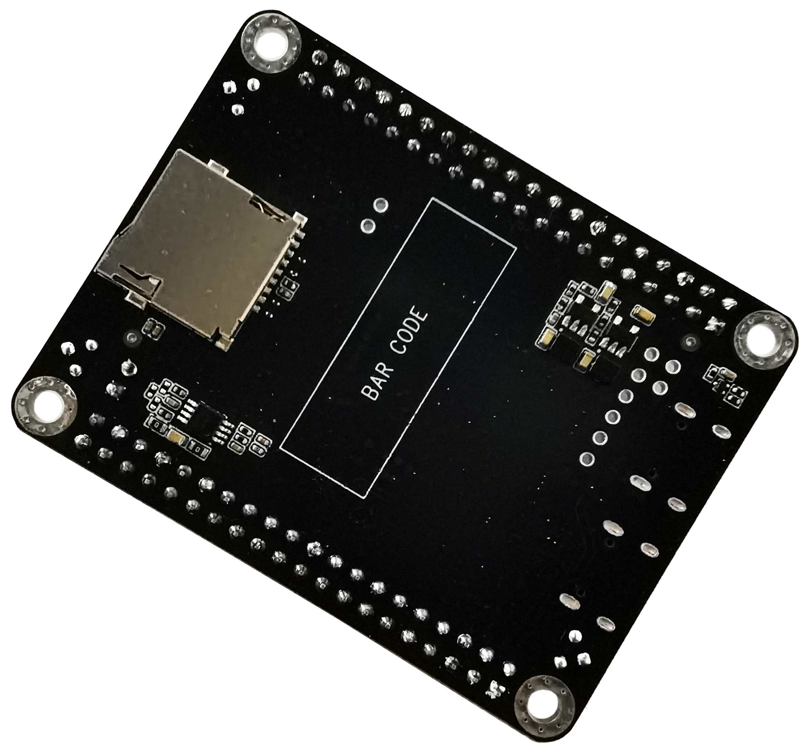{ loading="lazy" }

<em>SF32LB58-DevKit-LCD — Back View</em>

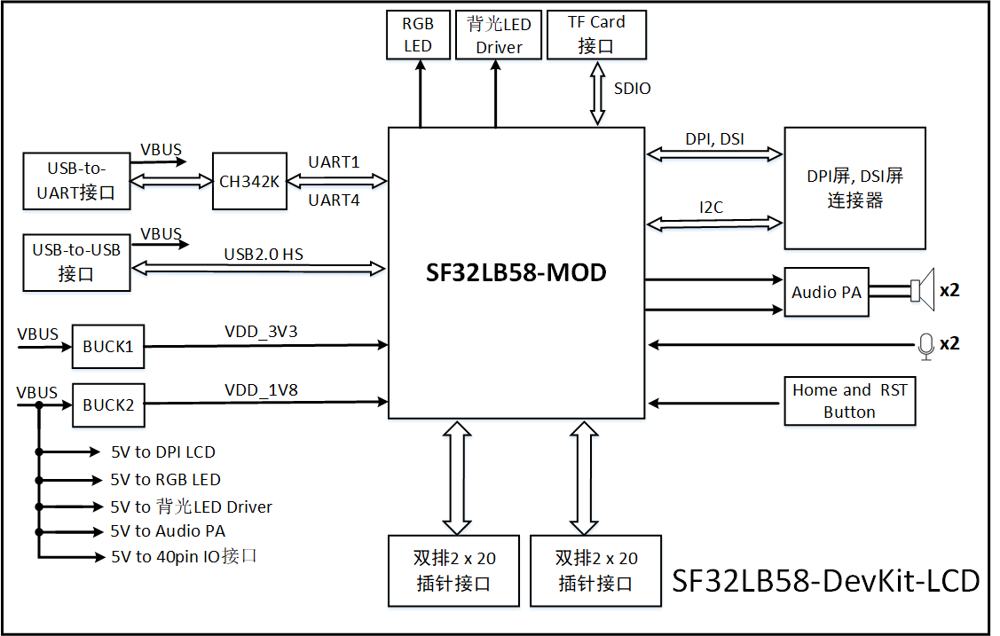{ loading="lazy" }

<em>SF32LB58-DevKit-LCD — Block Diagram</em>

## Board and Module Version Notes

<em>Module Version Summary</em>

| Module Version | Basis | Notes |
| :--- | :--- | :--- |
| V1.0.1 | SF32LB58-MOD-N16R32N1 and SF32LB58-MOD-A128R32N1 using SF32LB586VDD36 | Current version; updated eMMC power-control IO split between PA74 and PA80 |
| V1.0.0 | SF32LB58-MOD-N16R32N1 using SF32LB586VDD36 | Initial module version |

<em>Board Version Summary</em>

| Board Version | Basis | Notes |
| :--- | :--- | :--- |
| V1.0.1 | SF32LB58-MOD-N16R32N1-V1.0.1 and SF32LB58-MOD-A128R32N1-V1.0.1 | Current version; adds USB plug-detect on PB24, strengthens power delivery for dual-audio output, removes RGB LED level-shift stage, updates DCDC device, and fixes USB slave interrupt behavior |
| V1.0.0 | SF32LB58-MOD-N16R32N1-V1.0.0 with SF32LB587VEE56 | Initial public board version |

Confirm the exact module and board silkscreen revision before choosing a firmware target, storage assumption, or debug wiring plan.

## Board Highlights

- SF32LB58-MOD-N16R32N1 or SF32LB58-MOD-A128R32N1 module, depending on board version
- Standard SF32LB586VDD36 platform with dual 16MB HPI-PSRAM and 1MB in-package QSPI-NOR
- Additional 16MB QSPI-NOR or 128MB QSPI-NAND, depending on module variant
- 48MHz main crystal and 32.768kHz RTC crystal
- IPEX antenna connector and module RF matching network
- MIPI DSI / RGB888 display support through dedicated FPC connectors
- Dual QSPI / DSPI / SPI display paths exposed through 40-pin headers
- I2C touch-panel support
- On-board analog microphone input and stereo Class-D audio output
- Two USB Type-C ports: one for USB-to-UART download/debug, one for USB2.0 HS
- MicroSD card slot over SDIO
- Large-core and low-power-core GPIO expansion through two 40-pin headers
- CAN and SDIO Wi-Fi expansion capability

## When to Use This Board

Choose SF32LB58-DevKit-LCD when the project needs a realistic high-end display and peripheral validation platform rather than a minimal breakout board.

- Bring up MIPI DSI, RGB888, or QSPI display panels
- Validate touch, audio, storage, and USB together
- Test high-resolution UI behavior on the SF32LB58x platform
- Evaluate CAN or SDIO Wi-Fi expansion
- Compare NOR and NAND-backed module configurations
- Validate firmware on a flagship-class board before custom PCB work

For module-level integration planning, also review [SF32LB58-MOD](../modules/SF32LB58-MOD.md). For chip-family architecture and display/memory capability, see [SF32LB58x](../chips/SF32LB58x.md).

## Hardware Configuration

<em>Hardware Configuration Summary</em>

| Area | Configuration |
| :--- | :--- |
| Core module | SF32LB58-MOD-N16R32N1 or SF32LB58-MOD-A128R32N1 |
| Standard MCU | SF32LB586VDD36 |
| In-package memory | 16MB + 16MB HPI-PSRAM, plus 1MB QSPI-NOR |
| Additional storage | 16MB QSPI-NOR or 128MB QSPI-NAND, depending on module variant |
| Display | MIPI DSI, DPI/RGB888, and QSPI panel support |
| Audio | On-board analog microphone path plus stereo speaker output |
| USB | USB-to-UART Type-C and USB2.0 HS Type-C |
| Storage | MicroSD card slot over SDIO |
| Antenna | Module RF path with IPEX connector |
| Expansion | Two 40-pin headers for large-core and low-power-core expansion |

## Getting Started

### Required Hardware

- SF32LB58-DevKit-LCD board
- LCD module using MIPI DSI, RGB888, or QSPI, as appropriate
- USB 2.0 data cable, Type-A to Type-C or equivalent
- Host computer running Windows, Linux, or macOS

### Optional Hardware

- Two speakers
- TF / MicroSD card
- J-Link or compatible SWD debugger
- CAN transceiver board
- SDIO Wi-Fi module

### Basic Setup

1. Connect the target display panel to the correct LCD connector.
2. Connect the USB-to-UART Type-C port to the host computer.
3. Open SiFli's download tool and select the correct COM port.
4. Install or remove the Mode jumper depending on whether you want download mode or normal run mode.
5. Power the board and download or run the target firmware.
6. After display bring-up, validate touch, audio, storage, and any expansion peripherals required by the product.

Use a real data-capable USB cable. Some Type-C cables provide power only and will not expose the UART or USB data path.

## Power

SF32LB58-DevKit-LCD is powered from USB Type-C.

- Both on-board USB Type-C connectors can supply power to the board
- For firmware download and UART logging, use the USB-to-UART Type-C port
- Plan the USB2.0 HS Type-C port separately when validating native USB functions

## Download and Debug

The primary firmware download and serial-log interface is the USB-to-UART Type-C port.

- **Download mode**: install the Mode jumper, then power or reset the board
- **Software debug/log mode**: remove the Mode jumper, then power or reset the board

The board also supports J-Link / SWD debug.

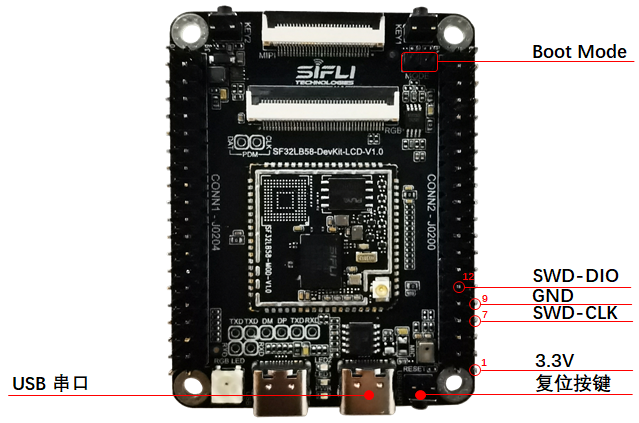{ loading="lazy" }

<em>SF32LB58-DevKit-LCD — J-Link Wiring Reference</em>

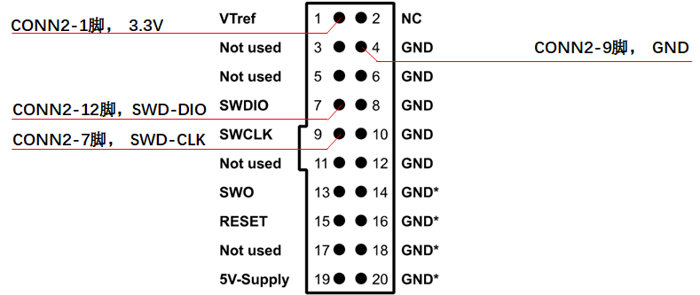{ loading="lazy" }

<em>J-Link Adapter Reference</em>

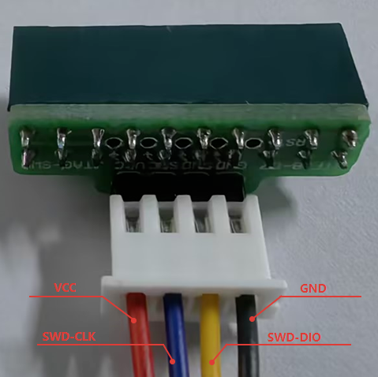{ loading="lazy" }

<em>SWD Adapter Reference</em>

## Key Module and Expansion Signals

The board exposes both module-level signals and two 40-pin expansion headers. Use the module datasheet and schematic package for the exhaustive pin map; the summary below covers the most design-relevant groups.

<em>Key Functional Signal Groups</em>

| Signal Group | Typical Pins / Signals | Main Use |
| :--- | :--- | :--- |
| Download and debug | PB36, PB37, SWDIO, SWCLK, Boot_Mode, RSTN | UART download, software debug, SWD bring-up |
| MicroSD | PA75, PA76, PA77, PA70, PA81, PA79, PB58 | SDIO card interface and card detect |
| RGB LCDC1 | PA12–PA15, PA22–PA67 | RGB888 display path |
| MIPI DSI LCDC1 | DSI_D0, DSI_D1, DSI_CLK lanes | MIPI DSI display path |
| QSPI LCDC1 | PA82, PA84, PA86, PA88, PA90, PA91, PA51, PA52 | QSPI display path on the large-core side |
| QSPI LCDC2 | PB02–PB10, PB23, PB27, PB30, PB31, PB34 | QSPI display path on the low-power-core side |
| Touch | PA16, PA17, PA59, PA60, PA92, PA93 | Reset, interrupt, and I2C touch-panel signals |
| Audio | AU_DAC1/2, AU_ADC1/2, MIC_BIAS, PB23 | Analog audio input/output and PA enable |
| CAN / general expansion | PA02, PA11 and header GPIO groups | CAN and peripheral expansion |

## Display Interfaces

The board supports three main display paths:

- **MIPI DSI** through a 30-pin, 0.5mm-pitch FPC connector
- **RGB888** through a 40-pin, 0.5mm-pitch FPC connector compatible with a common 正点原子-style pin order
- **QSPI / DSPI / SPI** through the two 40-pin expansion headers

Supported display guidance from the SiFli source includes:

- MIPI DSI panels up to 2-lane transfer and up to 1280 × 800 resolution
- RGB888 panels up to 1280 × 800 resolution
- QSPI panels up to 512 × 512 resolution

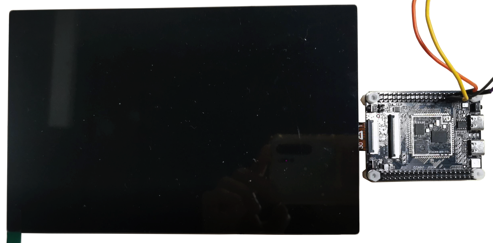{ loading="lazy" }

<em>SF32LB58-DevKit-LCD — MIPI Display Wiring Reference</em>

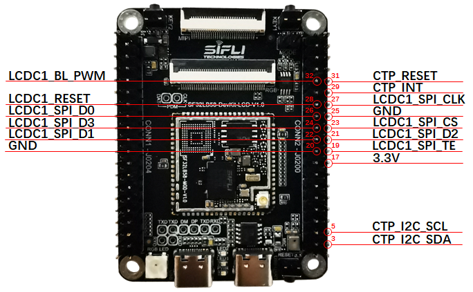{ loading="lazy" }

<em>SF32LB58-DevKit-LCD — LCDC1 QSPI Display Wiring</em>

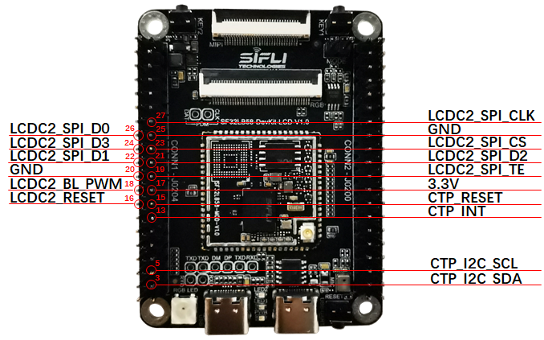{ loading="lazy" }

<em>SF32LB58-DevKit-LCD — LCDC2 QSPI Display Wiring</em>

## Audio

The board supports:

- One on-board microphone input path
- Two audio ADC input paths, with one multiplexed against the on-board microphone path
- Two speaker outputs
- One PDM signal path that is multiplexed with RGB signals and therefore unavailable while the RGB display path is active

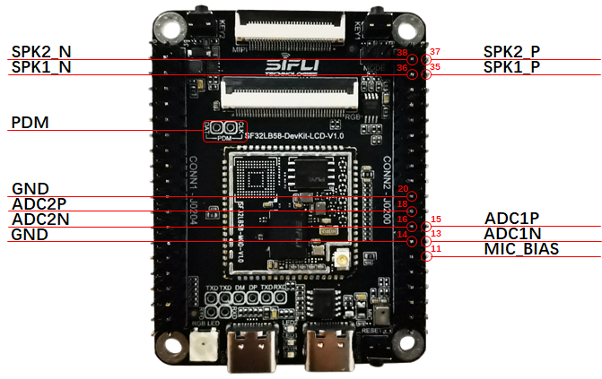{ loading="lazy" }

<em>SF32LB58-DevKit-LCD — Audio Wiring Reference</em>

## CAN and SDIO Wi-Fi Expansion

The underlying SF32LB58 module includes a CAN controller, and the board exposes the interface for use with an external transceiver.

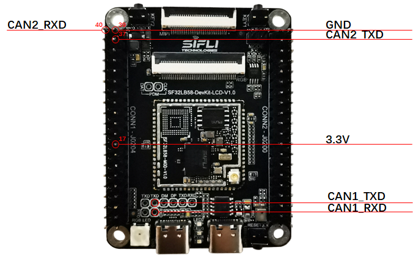{ loading="lazy" }

<em>SF32LB58-DevKit-LCD — CAN Wiring Reference</em>

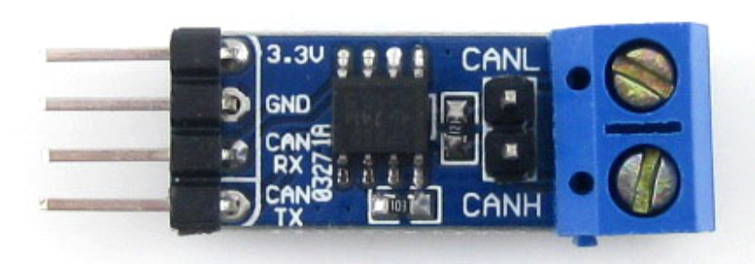{ loading="lazy" }

<em>Reference CAN Transceiver Board</em>

The board also supports SDIO Wi-Fi expansion through the header interface.

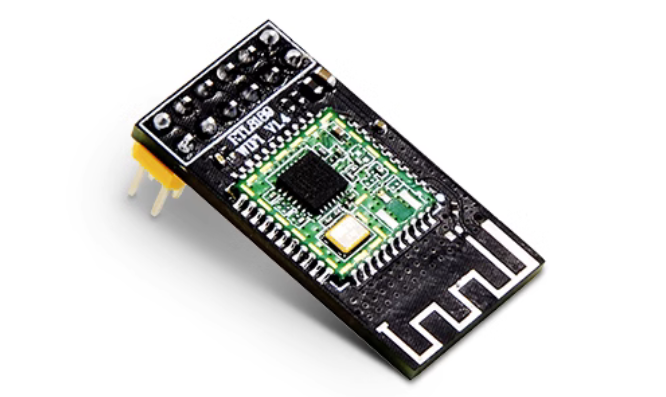{ loading="lazy" }

<em>Reference SDIO Wi-Fi Module</em>

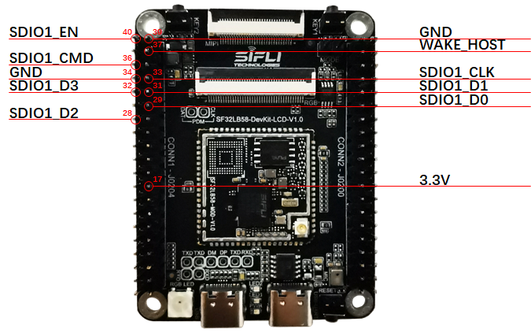{ loading="lazy" }

<em>SF32LB58-DevKit-LCD — SDIO Wi-Fi Wiring Reference</em>

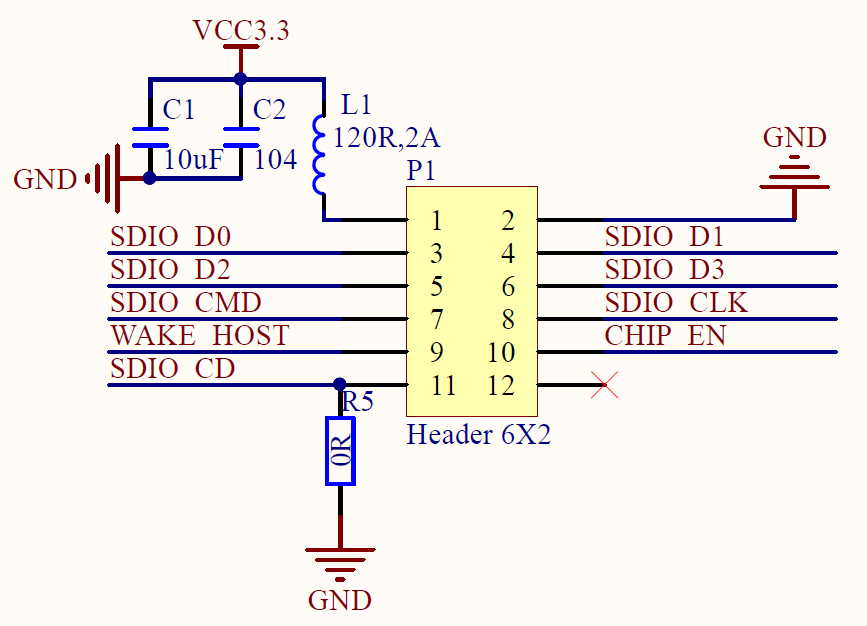{ loading="lazy" }

<em>Reference SDIO Wi-Fi Schematic</em>

## Related Documents

[SF32LB58x Chip Introduction]: ../chips/SF32LB58x.md
[SF32LB58x User Manual]: https://downloads.sifli.com/docs/user%20manual/SF32LB58x/UM5801%E2%80%90SF32LB58x%E2%80%90EN.pdf
[SF32LB58-MOD]: ../modules/SF32LB58-MOD.md
[SF32LB58-MOD Design Package]: https://downloads.sifli.com/hardware/files/documentation/SF32LB58-MOD-V1.0.1.zip?
[SF32LB58-DevKit-LCD Design Package]: https://downloads.sifli.com/hardware/files/documentation/SF32LB58-DevKit-LCD-V1.0.1.zip?
[SF32LB58-DevKit-LCD LCEDA Project]: https://downloads.sifli.com/hardware/files/documentation/ProPrj_SF32LB58-DevKit-LCD_2025-09-24.epro?
[Buy Samples]: https://sifli.taobao.com/

- :fontawesome-solid-microchip: __[SF32LB58x Chip Introduction]__
- :fontawesome-solid-file-pdf: __[SF32LB58x User Manual]__
- :fontawesome-solid-cubes: __[SF32LB58-MOD]__
- :fontawesome-solid-download: __[SF32LB58-MOD Design Package]__
- :fontawesome-solid-download: __[SF32LB58-DevKit-LCD Design Package]__
- :fontawesome-solid-download: __[SF32LB58-DevKit-LCD LCEDA Project]__
- :fontawesome-solid-cart-shopping: __[Buy Samples]__

