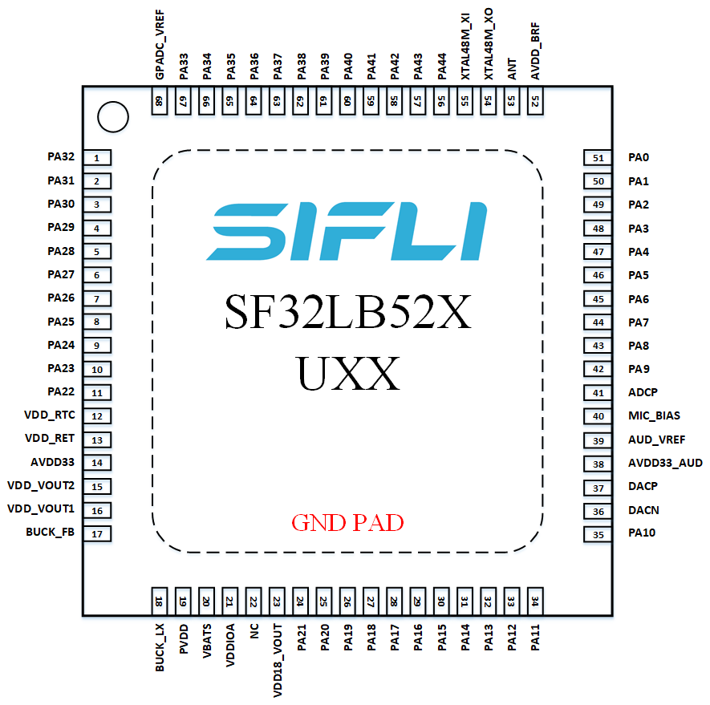

# SF32LB52x Hardware Design Guide

## 1. Introduction

This hardware design guide provides design recommendations and source-backed reference material for products based on the SF32LB52x family of ultra-low-power AIoT microcontrollers. It is intended for hardware engineers, PCB designers, and product developers building battery-powered wearable devices and other compact embedded systems.

The guide covers the complete hardware development process, including power-supply design, clock circuits, RF layout, display and storage interfaces, audio circuits, PCB layout recommendations, and manufacturing considerations. Following these guidelines helps reduce development risk, improve system reliability, and shorten the product development cycle.

This document assumes a basic understanding of embedded hardware design and schematic capture. It complements the SF32LB52x datasheet, reference manual, and SDK documentation, which remain the authority for detailed electrical specifications, peripheral operation, and software development.

It consolidates two original SiFli hardware application notes — one for the battery-powered SF32LB520/3/5/7 path and one for the externally regulated 52B/D/E/G/J path — into a single engineering workflow. Where the original source wording is inconsistent, this guide favors exact orderable part numbers, explicit supply-domain behavior, and release-review clarity.

## 2. Development Resources
[SF32LB52x Product Brief]: https://downloads.sifli.com/user%20manual/PB5201-SF32LB52x-Product%20Brief.pdf
[SF32LB52x Datasheet]: https://downloads.sifli.com/user%20manual/DS5201-SF32LB52x-Datasheet%20V2p5p3.pdf
[SF32LB52x Reference Manual]: https://downloads.sifli.com/user%20manual/UM5201-SF32LB52x-User%20Manual%20V0p8p4.pdf
[SF32LB52x Hardware Design Guide (520/3/5/7)]: https://wiki.sifli.com/en/hardware/SF32LB520-3-5-7-HW-Application.html
[SF32LB52x Hardware Design Guide (52B/D/E/G/J)]: https://wiki.sifli.com/en/hardware/SF32LB52B-E-G-J-HW-Application.html
[SF32LB52-MOD-1]: ../../explore-sf32/modules/SF32LB52-MOD-1.md
[KiCad Files]: https://github.com/OpenSiFli/kicad-libraries
[Buy Samples]: https://sifli.taobao.com/
[Buy Dev Kits]: https://sifli.taobao.com/
[SiFli Approved Vendor List]: ../cad-components/sifli-approved-vendor-list.md
[SiFli Approved Vendor List (AVL)]: https://downloads.sifli.com/hardware/files/documentation/SIFLI-MCU-AVL-%E8%AE%A4%E8%AF%81%E8%A1%A8-V0.3-20260121.xlsx

- :fontawesome-solid-file-pdf: __[SF32LB52x Product Brief]__
- :fontawesome-solid-file-pdf: __[SF32LB52x Datasheet]__
- :fontawesome-solid-file-pdf: __[SF32LB52x Reference Manual]__
- :fontawesome-solid-file-lines: __[SF32LB52x Hardware Design Guide (520/3/5/7)]__
- :fontawesome-solid-file-lines: __[SF32LB52x Hardware Design Guide (52B/D/E/G/J)]__
- :fontawesome-solid-file-excel: __[SiFli Approved Vendor List (AVL)]__
- :fontawesome-solid-cart-shopping: __[Buy Samples]__
- :fontawesome-solid-cart-shopping: __[Buy Dev Kits]__
- :fontawesome-brands-github: __[KiCad Files]__
- :fontawesome-solid-sim-card: __[SF32LB52-MOD-1]__

## 3. Device Overview

The SF32LB52x family combines dual-core STAR-MC1 processors, Bluetooth connectivity, graphics acceleration, integrated audio, display interfaces, storage controllers, and power management in a compact QFN68 package. The family is optimized for products where BOM cost, battery life, and PCB area all matter.

### 3.1. Features

The family integrates:

- Dual-core Arm China STAR-MC1 processors with FPU and MPU, Arm Cortex-M33 compatible
- Dual-mode Bluetooth 6.3 radio
- ePicasso 2.0 2D/2.5D graphics accelerator
- Display controller supporting SPI, QSPI, 8080, JDI, and 8-bit EPD interfaces
- USB 2.0 Full-Speed device
- SDIO/eMMC storage interface on supported variants
- Analog and digital audio interfaces
- Integrated PMU, DC/DC converter, and LDO regulators
- QFN68 package with up to 44/45 GPIOs

### 3.2. Variants

The SF32LB52x family is divided into two practical design groups by power architecture: battery-powered devices and externally regulated devices, as shown below.

=== "SF32LB520/3/5/7 (Battery-Powered)"

    This group integrates an on-chip **charging management module and PMU**. It can connect directly to a single-cell lithium battery, while still supporting external charging solutions.

    
<em>Table 3.2-1: Model Cross-Reference (Battery-Powered Variant)</em>

    

    | Model | Co-Packaged Memory | Supply | Design Note |
    |:---|:---|:---|:---|
    | SF32LB520U36 | 1 MB QSPI-NOR Flash | Li-ion battery, 3.2–4.7 V, rechargeable | Boots from co-packaged Flash by default; `VDD18_VOUT` requires an external 3.3 V supply |
    | SF32LB523UB6 | 4 MB OPI-PSRAM | Li-ion battery, 3.2–4.7 V, rechargeable | Must boot from external storage |
    | SF32LB525UC6 | 8 MB OPI-PSRAM | Li-ion battery, 3.2–4.7 V, rechargeable | Must boot from external storage |
    | SF32LB527UD6 | 16 MB OPI-PSRAM | Li-ion battery, 3.2–4.7 V, rechargeable | Must boot from external storage |

    

=== "52B/D/E/G/J (Regular-Powered)"

    This group integrates the on-chip **PMU** but does not include charging circuitry. It is powered from a regulated external supply.

    
<em>Table 3.2-2: Model Cross-Reference (Regular-Powered Variant)</em>

    

    | Model | Co-Packaged Memory | Supply | Design Note |
    |:---|:---|:---|:---|
    | SF32LB52BU36 | 1 MB QSPI-NOR Flash | 2.97–3.63 V, non-rechargeable | `VDD_SIP` requires an external 1.8 V or 3.3 V supply |
    | SF32LB52BU56 | 4 MB QSPI-NOR Flash | 2.97–3.63 V, non-rechargeable | `VDD_SIP` requires an external 3.3 V supply |
    | SF32LB52DUB6 | 4 MB OPI-PSRAM | 1.71–1.98 V, non-rechargeable | `VDD_SIP` requires an external 1.8 V supply |
    | SF32LB52EUB6 | 4 MB OPI-PSRAM | 2.97–3.63 V, non-rechargeable | `VDD_SIP` can be supplied by the internal LDO |
    | SF32LB52GUC6 | 8 MB OPI-PSRAM | 2.97–3.63 V, non-rechargeable | `VDD_SIP` can be supplied by the internal LDO |
    | SF32LB52JUD6 | 16 MB OPI-PSRAM | 2.97–3.63 V, non-rechargeable | `VDD_SIP` can be supplied by the internal LDO |

    

### 3.3. Packages

Both design groups use the same QFN68 package.

<em>Table 3.3-1: Package Information</em>

| Package Name | Dimensions | Pin Pitch |
|:---|:---|:---|
| QFN68L | 7 mm x 7 mm x 0.85 mm | 0.35 mm |

The two design groups differ slightly in peripheral resources. The battery-powered group has 44 GPIOs, while the regular-powered group has 45 GPIOs; the difference comes from pins reserved for charging on the battery-powered devices.

- 44/45 GPIOs
- 3x UART
- 4x I2C
- 2x GPTIM
- 2x SPI
- 1x I2S audio interface
- 1x SDIO storage interface
- 1x PDM audio interface
- 1x differential analog audio output
- 1x single-ended analog audio input
- Single/dual/quad-data-line SPI display interface, serial JDI display interface
- Supports displays both with and without GRAM
- Supports UART download and software debug

The pin layout diagrams are shown below, and their differences will be revisited in the schematic design section.

{ width="100%" loading="lazy" }

<em>Figure 3.3-1: QFN68L Pin Layout for SF32LB520/3/5/7</em>

{ width="100%" loading="lazy" }

<em>Figure 3.3-2: QFN68L Pin Layout for SF32LB52B/E/G/J</em>

### 3.4. Applications

Typical applications are portable embedded systems where long battery life and compact form factors are essential. Examples include:

- Entry-level smartwatches and fitness bands
- Bluetooth modules and wireless adapters
- Bluetooth audio accessories
- Smart sensors and wearable devices
- Electronic shelf labels and smart badges
- E-book readers
- Portable label printers
- eBike and eScooter displays
- Connected human-machine interface (HMI) devices
- Portable industrial and medical equipment
- Other battery-powered AIoT devices

## 4. Design at a Glance

### 4.1. Hardware Architecture

The following table summarizes the recommended hardware architecture for a typical SF32LB52x application. Use it as a quick reference before reading the detailed design guidance in the later sections.

<em>Table 4.1-1: Design at a Glance Summary</em>

| Hardware Block | Typical Implementation |
|:---|:---|
| Package | QFN68L, 7 mm x 7 mm x 0.85 mm, 0.35 mm pitch |
| PCB | 4-layer PTH PCB recommended |
| Power Supply | Single-cell Li-ion/Li-Po battery or regulated external supply, depending on device variant |
| Battery Charging | Integrated charger on supported variants, or external charger IC with or without PPM |
| Buck Inductor | 4.7 uH +/-20%, DCR <= 0.4 Ω, Isat >= 450 mA |
| Crystal | 48 MHz main crystal and 32.768 kHz RTC crystal |
| RF | 50 Ω controlled-impedance trace with reserved π matching network |
| Display | 3-line SPI, 4-line SPI, Dual-SPI, Quad-SPI (up to 512 x 512), JDI, and 8-bit EPD |
| Touch | I2C capacitive touch controller with interrupt wake support |
| Storage | SiP Flash/PSRAM, external SPI NOR, SPI NAND, SD NAND, or eMMC depending on variant |
| Audio | Analog microphone input, differential DAC output, external PA |
| Sensors | I2C/SPI sensors such as accelerometer, gyroscope, geomagnetic sensor, heart-rate sensor, SpO2 sensor, and ECG sensor |
| Haptics | PWM-controlled vibration motor |
| Debug | DBG_UART on PA18/PA19, multiplexed with SWD |

### 4.2. Hardware Design Flow

Follow the guide in the order that hardware decisions typically get locked in. The flow below keeps early architecture choices visible before the design moves into schematic and PCB details.

<em>Table 4.2-1: Hardware Design Flow</em>

| Step | Design Decision | Primary Sections |
|:---|:---|:---|
| 1 | Select the exact orderable device and power variant | Device Overview, Variant Selection |
| 2 | Confirm package, GPIO count, and fixed-function pins | Packages, Schematic Design Guidelines |
| 3 | Lock the minimum system: power tree, boot storage, bootstrap pins, debug access, clocks, and wake strategy | Minimum System Design, Storage, Debug, Clock Generation |
| 4 | Select RF topology, display, audio, sensors, and remaining product interfaces | Clock Generation, RF, User Interfaces, Storage and Connectivity |
| 5 | Review PCB stack-up, fanout, impedance, and sensitive routing | PCB Layout Guidelines |
| 6 | Compare against source reference schematics, PCB layouts, mechanical, and power figures | Appendices A-E |
| 7 | Reserve bring-up, debug, calibration, and production test access | Debug, Production, Design Review Checklist |

**Design decision tree**

- Need USB-rechargeable single-cell battery operation? Start with `SF32LB520/3/5/7`.
- Need an externally regulated supply or eMMC boot? Start with `52B/D/E/G/J`.
- Need 8-bit parallel EPD? Use the regular-powered design path unless SiFli confirms the battery-powered path for the exact design.
- Need the lowest standby current? Decide storage power switching, sensor load switches, and display power isolation before PCB placement.

### 4.3. How to Use This Guide

Start with the exact orderable part number before schematic work begins, because the SF32LB52x family splits into two practical design groups: the battery-powered `SF32LB520/3/5/7` group and the externally regulated `52B/D/E/G/J` group. Use Section 3.2 to select the group, Sections 5.1 and 5.2 to complete the minimum-system and power-system reviews, Sections 5.6.1 and 5.7.1 to verify boot storage and debug access, Sections 5 and 6 to review schematic and PCB guidance, Appendices A-E to compare the source reference figures, and Section 7 as the release checklist.

When a design reuses an older SF32LB52x schematic, review the supply pins, SIP-memory supply, boot-storage rail, DBG_UART/SWD pins, crystal loading, RF matching footprint, and production test points first. Those items are the most common sources of silent bring-up risk.

### 4.4. Review Evidence Pack

Before hardware release, collect the schematic PDF, PCB stack-up, impedance report, component AVL cross-check, DRC report, and screenshots of the RF, crystal, USB, SDIO/eMMC, audio, power, and boot-storage layouts. Keep the evidence with the board revision so later firmware, RF, and production issues can be traced back to the reviewed hardware baseline.

## Using the Checklists

This guide includes two levels of checklist coverage. The short checklists embedded throughout Sections 5.1.1.5, 5.5.3, and 7 give the highest-risk items for quick engineering self-checks. The [Schematic Checklist](SF32LB52x_schematic_checklist.md) (Section 5.8) and [PCB Layout Checklist](SF32LB52x_pcb_layout_checklist.md) (Section 6.15) reproduce SiFli's complete, item-by-item [*SF32LB52 Schematic & PCB Checklist*][SiFli SF32LB52 Schematic & PCB Checklist (XLSX)] (V1.0, 2026-01-21), published alongside the hardware design guide on [SiFli's wiki][SiFli Chip Hardware Design Guide Index (Wiki)], covering both the SF32LB520/3/5/7 battery-powered variants and the SF32LB52B/D/E/G/J externally powered variants.

Each check point in both checklists lists which SF32LB52x variant(s) it applies to and whether it is Required (must pass before release) or Optional (recommended if the feature is used). "All variants" covers SF32LB520/3/5/7 and SF32LB52B/D/E/G/J unless narrowed further. Colored text and text with a yellow background preserve the source spreadsheet's review emphasis; the source doesn't state a reason for each highlight, so treat these marks as additional review flags, not as replacements for any non-highlighted item in the same table. The checklist format intentionally keeps the spreadsheet layout, but reads it together with the design guide, datasheet, reference manual, and SiFli's model-number guidance when the raw checklist wording is incomplete, inconsistent, or too terse to stand on its own.

Run the [Schematic Checklist](SF32LB52x_schematic_checklist.md) during schematic review, before PCB layout begins. Run the [PCB Layout Checklist](SF32LB52x_pcb_layout_checklist.md) during layout review, before Gerber release. In practice, each pass is usually performed twice: first by the design engineer, then by an independent reviewer before design freeze or manufacturing release.

For best results, treat the checklist as a sign-off record rather than a reading checklist:

1. Confirm the exact target silicon variant first, especially when the design could be built around either 520/3/5/7 or 52B/D/E/G/J devices.
2. Mark every item as pass / fail / not applicable during review instead of reading the table passively.
3. Where a check point references boot media, display type, or power-switch behavior, verify it against the actual schematic and the matching subsystem chapter in the design guide.
4. For any ambiguous source wording, record the exact part number and design assumption in the review notes before release.

<em>Review Record Template</em>

| Field | Value |
|:---|:---|
| Customer name | |
| Customer design name | |
| Submission date for review | |
| Initial reviewer | |
| Initial review date | |
| Follow-up reviewer | |
| Follow-up review date | |

<em>Checklist Document Version History</em>

| No. | Version | Date | Release Notes |
|:---|:---|:---|:---|
| 1 | V1.0 | 2026-01-21 | Initial release of the Schematic & PCB Checklist document |

[SiFli SF32LB52 Schematic & PCB Checklist (XLSX)]: https://downloads.sifli.com/hardware/files/documentation/SF32LB52%20Schematic%26PCB%20checklist_V1.0_20260121.xlsx
[SiFli Chip Hardware Design Guide Index (Wiki)]: https://wiki.sifli.com/en/hardware/index.html

## Continue the Design Guide

The full guide continues across the pages below. Each covers one stage of the design process and can be reached from here.

- :fontawesome-solid-bolt: __[Schematic Design Guidelines](SF32LB52x_schematic_design.md)__ — minimum system, power system, clock generation, RF, user interfaces, storage and connectivity, and manufacturing access, across three pages
- :fontawesome-solid-list-check: __[Schematic Checklist](SF32LB52x_schematic_checklist.md)__ — item-by-item schematic review checklist (Section 5.8)
- :fontawesome-solid-microchip: __[PCB Layout Guidelines](SF32LB52x_pcb_layout.md)__ — footprint, stack-up, fanout, and routing guidance for clock, RF, audio, USB, SDIO, and power
- :fontawesome-solid-list-check: __[PCB Layout Checklist](SF32LB52x_pcb_layout_checklist.md)__ — item-by-item PCB layout review checklist (Section 6.15)
- :fontawesome-solid-book-open: __[Design Review Checklist and References](SF32LB52x_review_and_reference.md)__ — release checklist, related documents, reference schematic/PCB/mechanical/power appendices, and revision history

