# SF32LB52x Hardware Design Guide — PCB Layout Guidelines

!!! note "Part of the SF32LB52x Hardware Design Guide"
    This page covers Section 6, PCB Layout Guidelines. Return to [Schematic Design Guidelines](SF32LB52x_schematic_design.md) (the first of its three pages), continue to the [PCB Layout Checklist](SF32LB52x_pcb_layout_checklist.md), or skip ahead to [Design Review Checklist and References](SF32LB52x_review_and_reference.md).

## 6. PCB Layout Guidelines

Use this chapter as the layout-review companion to Section 5. The schematic should already define the variant, power tree, clock parts, RF reserve, display/storage pins, and test access before final placement begins.

**Design Goal**

Translate the schematic into a manufacturable 4-layer PTH board while protecting the sensitive RF, crystal, audio, power, USB, and SDIO paths from impedance, noise, and return-current problems.

**PCB Review Flow**

1. Confirm package footprint and paste/land pattern.
2. Confirm stack-up, trace/space, drill, and impedance rules with the PCB vendor.
3. Place chip, crystals, RF path, DC/DC, charger, display/storage connectors, and audio components.
4. Review fanout and sensitive routing before filling less critical GPIO routes.
5. Capture evidence screenshots for RF, crystals, USB, SDIO, audio, DC/DC, charger, and power rails.

### 6.1. PCB Footprint Design

The SF32LB52x QFN68L package is 7 mm x 7 mm x 0.85 mm, with 68 pins and 0.35 mm pitch.

{ width="100%" loading="lazy" }

<em>Figure 6.1-1: QFN68L Package Dimensions</em>

{ width="100%" loading="lazy" }

<em>Figure 6.1-2: QFN68L Package Shape</em>

{ width="100%" loading="lazy" }

<em>Figure 6.1-3: QFN68L PCB Land Pattern Reference</em>

### 6.2. PCB Stack-Up

The reference design supports single- or double-sided placement. Components can be placed on one side, or capacitors and similar passives can be placed on the back side under the chip. A 4-layer through-hole via (PTH) stack-up is recommended.

{ width="100%" loading="lazy" }

<em>Figure 6.2-1: Reference Stack-Up Structure</em>

### 6.3. General PCB Design Rules

Follow the general PTH-board PCB design rules from the reference design.

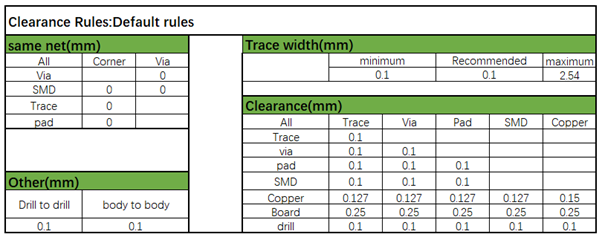{ width="100%" loading="lazy" }

<em>Figure 6.3-1: General PCB Design Rules</em>

### 6.4. PCB Trace Fanout

Fan out all QFN package signals through the top layer.

{ width="100%" loading="lazy" }

<em>Figure 6.4-1: Top-Layer Fanout Reference</em>

### 6.5. Clock Interface Routing

Apply these clock-routing rules across both design groups:

- Place crystals inside the shield can, more than 1 mm from the PCB edge, and as far as practical from heat-generating components (PA, charger, PMU circuits) — ideally more than 5 mm — to avoid affecting crystal frequency drift
- Keep the crystal keep-out zone larger than 0.25 mm, free of other metal or components
- Route 48 MHz crystal traces on the top layer, 3–10 mm long, 0.1 mm wide, with full ground shielding, away from VBAT/VCC, DC/DC, and high-speed signal lines; keep the top layer and adjacent layer under the crystal area clear of other routing
- Route 32.768 kHz crystal traces on the top layer, ≤10 mm long, 0.1 mm wide, with ≥0.15 mm spacing between the parallel 32K_XI/32K_XO traces, and full ground shielding

{ width="100%" loading="lazy" }

<em>Figure 6.5-1: Crystal Placement</em>

{ width="100%" loading="lazy" }

<em>Figure 6.5-2: 48 MHz Crystal Schematic</em>

{ width="100%" loading="lazy" }

<em>Figure 6.5-3: 48 MHz Crystal Routing Model</em>

{ width="100%" loading="lazy" }

<em>Figure 6.5-4: 48 MHz Crystal Routing Reference</em>

{ width="100%" loading="lazy" }

<em>Figure 6.5-5: 32.768 kHz Crystal Schematic</em>

{ width="100%" loading="lazy" }

<em>Figure 6.5-6: 32.768 kHz Crystal Routing Model</em>

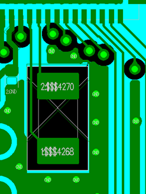{ width="100%" loading="lazy" }

<em>Figure 6.5-7: 32.768 kHz Crystal Routing Reference</em>

### 6.6. RF Interface Routing

Apply these RF-routing rules across both design groups:

- Place the RF matching circuit close to the chip side, not the antenna side
- Place the AVDD_BRF filter capacitor close to the chip pin, with its ground pin vias connected directly to the main ground
- Route RF traces on the top layer where possible, avoiding vias that would hurt RF performance; keep trace width above 10 mil with full ground shielding, and avoid acute or right-angle bends
- Control RF trace impedance to 50 Ω, with dense shielding ground vias along both sides

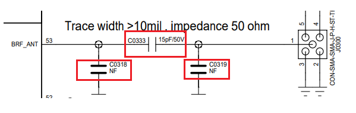{ width="100%" loading="lazy" }

<em>Figure 6.6-1: π-Network and Power Circuit Schematic</em>

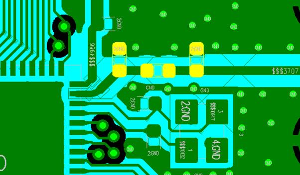{ width="100%" loading="lazy" }

<em>Figure 6.6-2: π-Network and Power Circuit PCB Layout</em>

{ width="100%" loading="lazy" }

<em>Figure 6.6-3: RF Signal Circuit Schematic</em>

{ width="100%" loading="lazy" }

<em>Figure 6.6-4: RF Signal PCB Routing</em>

### 6.7. Audio Interface Routing

Apply these audio-routing rules across both design groups:

- Place the AVDD33_AUD filter capacitor close to its pin; place the MIC_BIAS filter capacitor close to its pin
- Keep components for the ADCP analog input close to the chip pin, with short traces, full ground shielding, and away from other strong interference sources
- Keep components for the DACP/DACN analog output close to the chip pin, routed as a differential pair, with short traces, parasitic capacitance below 10 pF, and full ground shielding

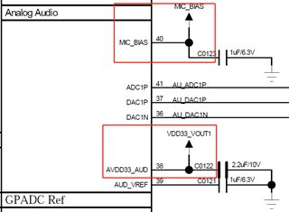{ width="100%" loading="lazy" }

<em>Figure 6.7-1: Audio Power Filtering Schematic</em>

{ width="100%" loading="lazy" }

<em>Figure 6.7-2: Audio Power Filtering PCB Reference Routing</em>

{ width="100%" loading="lazy" }

<em>Figure 6.7-3: Analog Audio Input Schematic</em>

{ width="100%" loading="lazy" }

<em>Figure 6.7-4: Analog Audio Input PCB Design</em>

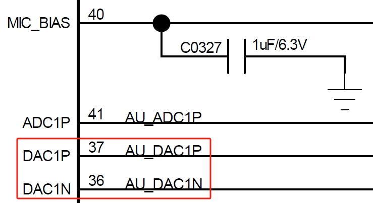{ width="100%" loading="lazy" }

<em>Figure 6.7-5: Analog Audio Output Schematic</em>

{ width="100%" loading="lazy" }

<em>Figure 6.7-6: Analog Audio Output PCB Design</em>

### 6.8. USB Interface Routing

Route USB DP (PA35) / DN (PA36) through the ESD device pins first, then to the chip, and ensure the ESD device ground connects solidly to the main ground. Route the pair with 90 Ω differential impedance control and full ground shielding.

{ width="100%" loading="lazy" }

<em>Figure 6.8-1: USB Signal Schematic</em>

{ width="100%" loading="lazy" }

<em>Figure 6.8-2: USB Signal PCB Design</em>

{ width="100%" loading="lazy" }

<em>Figure 6.8-3: USB Signal Component Placement Reference</em>

{ width="100%" loading="lazy" }

<em>Figure 6.8-4: USB Signal Routing Model</em>

### 6.9. SDIO Interface Routing

Route SDIO signals together as a group, with total trace length ≤50 mm and within-group length matching ≤6 mm. Provide full ground shielding for the clock signal, and shield the DATA and CMD signals as well.

{ width="100%" loading="lazy" }

<em>Figure 6.9-1: SDIO Interface Circuit Schematic</em>

{ width="100%" loading="lazy" }

<em>Figure 6.9-2: SDIO PCB Routing Model</em>

### 6.10. DC/DC Circuit Routing

Place the power inductor and filter capacitors close to the chip pins. Keep the BUCK_LX trace short and wide, and keep the BUCK_FB feedback trace no thinner than 0.25 mm. Connect all DC/DC output filter capacitor ground pins to the main ground plane with multiple vias. Do not pour top-layer copper in the power inductor area, and keep the adjacent layer as a complete reference ground.

{ width="100%" loading="lazy" }

<em>Figure 6.10-1: DC/DC Key Component Schematic</em>

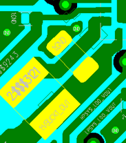{ width="100%" loading="lazy" }

<em>Figure 6.10-2: DC/DC Key Component PCB Layout</em>

### 6.11. Power Supply Routing

=== "SF32LB520/3/5/7 (Battery-Powered)"

    VCC is the input pin for the chip's internal PMU module — place its capacitor close to the pin, with trace width no less than 0.4 mm. Place filter capacitors for VDD_VOUT1, VDD_VOUT2, VDD_RET, VDD_RTC, VDD18_VOUT, VDD33_VOUT1, VDD33_VOUT2, AVDD33_AUD, and AVDD_BRF close to their respective pins, with trace widths sized for the required input current.

    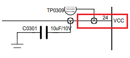{ width="100%" loading="lazy" }

    
<em>Figure 6.11-1: VCC Power Routing (Schematic)</em>

    { width="100%" loading="lazy" }

    
<em>Figure 6.11-2: VCC Power Routing (PCB)</em>

    **Charging Circuit Routing**

    VBUS and VBAT are the input/output pins of the chip's internal charging module — place their filter capacitors close to the pins. Because the charging loop carries relatively high current, use trace widths of at least 0.4 mm and avoid routing sensitive signals in parallel with them. Use star routing so the charging path does not share routing with sensitive circuit modules.

    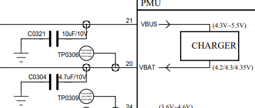{ width="100%" loading="lazy" }

    
<em>Figure 6.11-3: VBUS & VBAT Power Routing (Schematic)</em>

    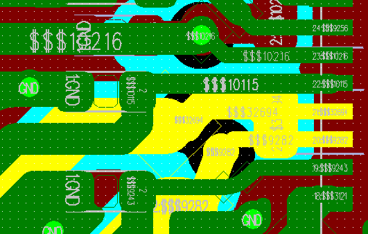{ width="100%" loading="lazy" }

    
<em>Figure 6.11-4: VBUS & VBAT Power Routing (PCB)</em>

=== "52B/D/E/G/J (Regular-Powered)"

    PVDD is the input pin for the chip's internal PMU module — place its capacitor close to the pin, with trace width no less than 0.4 mm. Place filter capacitors for AVDD33, VDDIOA, VDD_SIP, AVDD33_AUD, and AVDD_BRF close to their respective pins, with trace widths sized for the required input current, kept as short and wide as practical to reduce power-supply ripple and improve system stability.

    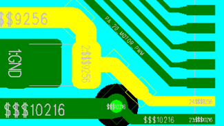{ width="100%" loading="lazy" }

    
<em>Figure 6.11-5: PVDD Power Routing</em>

    !!! info "Not Applicable"
        This variant has no charging management circuitry, so no charging-circuit routing is required.

### 6.12. Other Interface Routing

Pins configured as GPADC inputs must have full ground shielding and must stay away from interference sources such as battery-level sensing and temperature-detection circuits.

### 6.13. EMI & ESD

Apply these EMI and ESD rules across both design groups:

- Avoid long top-layer traces outside the shield can, especially for clock and power interference sources — route them on inner layers where possible
- Place ESD protection devices close to the connector pins, routing signals through the ESD device before anything else
- Ensure ESD device ground pins connect to the main ground through vias, with short and wide ground pad traces to reduce impedance and improve ESD performance

### 6.14. Other Considerations

Place USB charging-line test points before the TVS diode, and place the battery-holder TVS diode before the platform connection. Route the signal so it always passes through the TVS before reaching the chip. Keep TVS ground-pin traces as short as possible.

{ width="100%" loading="lazy" }

<em>Figure 6.14-1: Power TVS Placement Reference</em>

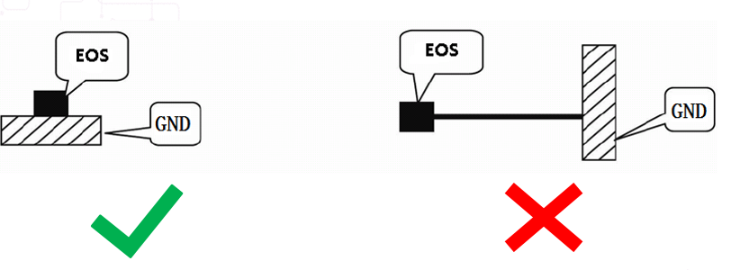{ width="100%" loading="lazy" }

<em>Figure 6.14-2: TVS Routing Reference</em>

