# SF32LB52x Hardware Design Guide — Design Review Checklist and References

!!! note "Part of the SF32LB52x Hardware Design Guide"
    This page covers Sections 7-10: Design Review Checklist, Related Documents and References, Appendices, and Revision History. Return to [PCB Layout Guidelines](SF32LB52x_pcb_layout.md).

## 7. Design Review Checklist

- [ ] Minimum-system review is complete: exact variant, package, power tree, boot medium, bootstrap pins, debug/download access, clocks, and wake strategy are all documented
- [ ] The exact chip model and power variant are confirmed, and power schematics from the two variants are not mixed
- [ ] Processor power pins (VBUS/VBAT/VCC, or PVDD/VDDIOA/VDD_SIP) are within the datasheet voltage range
- [ ] BUCK inductor meets 4.7 uH ±20%, DCR ≤0.4 Ω, Isat ≥450 mA
- [ ] Battery-powered variant: charging path, OVP device voltage range, and integrated-LDO output capacitance are verified
- [ ] 48 MHz and 32.768 kHz crystals meet the recommended specifications, with routing and keep-out zones satisfied
- [ ] RF trace is 50 Ω impedance, with the matching network placed close to the chip
- [ ] Storage boot configuration (including the regular-powered variant's eMMC option) matches the Bootstrap pin settings
- [ ] Storage power switches are uniformly controlled through PA21, active high (on) / low (off)
- [ ] USB and SDIO differential trace impedance and length matching meet requirements
- [ ] DBG_UART/SWD multiplexed pins and production test points are reserved
- [ ] Key component part numbers have been verified against the latest [SiFli Approved Vendor List][SiFli Approved Vendor List (AVL)]

## 8. Related Documents and References

[SF32LB52x Datasheet (Official PDF)]: https://downloads.sifli.com/silicon/DS0052-SF32LB52x-%E8%8A%AF%E7%89%87%E6%8A%80%E6%9C%AF%E8%A7%84%E6%A0%BC%E4%B9%A6%20V2p4.pdf?
[SF32LB52x User Manual (Official PDF)]: https://downloads.sifli.com/silicon/UM0052-SF32LB52x-%E7%94%A8%E6%88%B7%E6%89%8B%E5%86%8C%20V0p3.pdf?
[SF32LB52 Hardware Reference Design Package]: https://downloads.sifli.com/hardware/files/documentation/SF32LB52-%E7%A1%AC%E4%BB%B6%E5%8F%82%E8%80%83%E8%AE%BE%E8%AE%A1-20250619.zip?
[SF32LB520/3/5/7 Hardware Application Note (Source)]: https://github.com/OpenSiFli/SiFli-Wiki/blob/main/source/en/hardware/SF32LB520-3-5-7-HW-Application.md
[52B/D/E/G/J Hardware Application Note (Source)]: https://github.com/OpenSiFli/SiFli-Wiki/blob/main/source/en/hardware/SF32LB52B-E-G-J-HW-Application.md
[Local SiFli Approved Vendor List]: ../cad-components/sifli-approved-vendor-list.md
[SiFli SF32LB52 Schematic & PCB Checklist (XLSX)]: https://downloads.sifli.com/hardware/files/documentation/SF32LB52%20Schematic%26PCB%20checklist_V1.0_20260121.xlsx
[SiFli Chip Hardware Design Guide Index (Wiki)]: https://wiki.sifli.com/en/hardware/index.html

- :fontawesome-solid-file-pdf: __[SF32LB52x Datasheet (Official PDF)]__
- :fontawesome-solid-file-pdf: __[SF32LB52x User Manual (Official PDF)]__
- :fontawesome-solid-file-zipper: __[SF32LB52 Hardware Reference Design Package]__
- :fontawesome-brands-github: __[SF32LB520/3/5/7 Hardware Application Note (Source)]__
- :fontawesome-brands-github: __[52B/D/E/G/J Hardware Application Note (Source)]__
- :fontawesome-solid-file-excel: __[Local SiFli Approved Vendor List]__
- :fontawesome-solid-file-excel: __[SiFli SF32LB52 Schematic & PCB Checklist (XLSX)]__
- :fontawesome-brands-wikipedia-w: __[SiFli Chip Hardware Design Guide Index (Wiki)]__

Additional source references:

- [SF32LB52x Product Brief](https://downloads.sifli.com/user%20manual/PB5201-SF32LB52x-Product%20Brief.pdf)
- [SF32LB52x Datasheet](https://downloads.sifli.com/user%20manual/DS5201-SF32LB52x-Datasheet%20V2p5p3.pdf)
- [SF32LB52x Reference Manual](https://downloads.sifli.com/user%20manual/UM5201-SF32LB52x-User%20Manual%20V0p8p4.pdf)
- [SF32LB520/3/5/7 Hardware Application Note](https://github.com/OpenSiFli/SiFli-Wiki/blob/main/source/en/hardware/SF32LB520-3-5-7-HW-Application.md)
- [52B/D/E/G/J Hardware Application Note](https://github.com/OpenSiFli/SiFli-Wiki/blob/main/source/en/hardware/SF32LB52B-E-G-J-HW-Application.md)

The [Schematic Checklist](SF32LB52x_schematic_checklist.md) (Section 5.8) and [PCB Layout Checklist](SF32LB52x_pcb_layout_checklist.md) (Section 6.15) reproduce the same *SF32LB52 Schematic & PCB Checklist* (V1.0, 2026-01-21) item by item, alongside the schematic and PCB layout guidance they check against.

## 9. Appendices

The original SiFli application notes include the following schematic, PCB layout, mechanical, and power reference figures. These appendices preserve those source figures for review evidence, while Sections 5 and 6 remain the primary design guidance.

!!! note "How to use these figures"
    Treat these figures as reference circuits and layout examples from the source application notes. Use the rule text, tables, datasheet, reference manual, latest reference design package, and AVL to confirm the final implementation for the exact device and product.

<em>Table 9-1: Appendix Map</em>

| Need | Start Here |
|:---|:---|
| Smart watch block-diagram examples for both SF32LB52x design groups | Appendix A: A Typical Smart Watch Application |
| Circuit-level schematic examples for RF, storage/boot, buttons, motor, audio, clock, USB, and DC/DC | Appendix B: Reference Schematics |
| PCB placement and routing examples for RF, storage, audio, stack-up, fanout, clock, USB, and DC/DC | Appendix C: Reference PCB Layouts |
| Package outline, shape, and land-pattern drawings | Appendix D: Mechanical |
| Charging, OVP, power-tree, and PMU reference circuits and layouts | Appendix E: Power |

### Appendix A. A Typical Smart Watch Application

A typical SF32LB52x smart watch design includes the MCU, display, touch controller, storage, sensors, vibration motor, audio input/output, Bluetooth antenna, clock sources, power management, debug access, and production-test access. The battery-powered design additionally includes charging management.

{ loading="lazy" }

<em>Figure A-1: SF32LB520/3/5/7 Smart Watch Application Diagram</em>

{ loading="lazy" }

<em>Figure A-2: 52B/D/E/G/J Smart Watch Application Diagram</em>

### Appendix B. Reference Schematics

**RF**

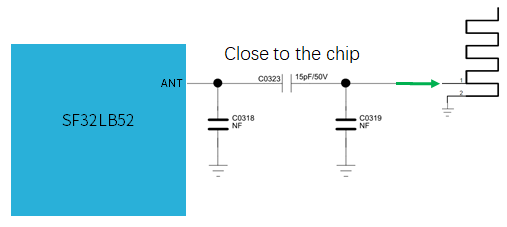{ loading="lazy" }

<em>Figure B-1: RF Front-End Block Diagram</em>

{ loading="lazy" }

<em>Figure B-2: RF Schematic Reference</em>

{ loading="lazy" }

<em>Figure B-3: RF Schematic Routing Reference</em>

**Storage and Boot**

{ loading="lazy" }

<em>Figure B-4: SF32LB520/3/5/7 Bootstrap Reference</em>

{ loading="lazy" }

<em>Figure B-5: 52B/D/E/G/J Bootstrap Reference</em>

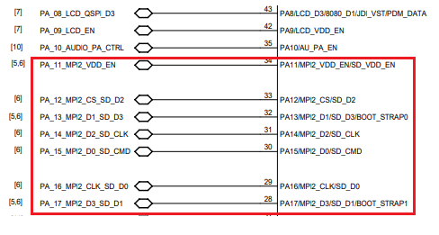{ loading="lazy" }

<em>Figure B-6: SDIO Schematic Reference</em>

**Buttons, Motor, and Audio**

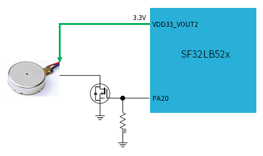{ loading="lazy" }

<em>Figure B-7: SF32LB520/3/5/7 Vibration Motor Reference</em>

{ loading="lazy" }

<em>Figure B-8: 52B/D/E/G/J Vibration Motor Reference</em>

{ loading="lazy" }

<em>Figure B-9: Power Key Reference</em>

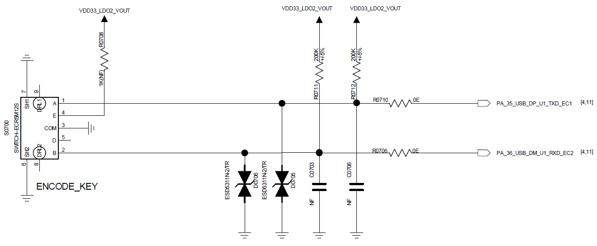{ loading="lazy" }

<em>Figure B-10: Rotary Encoder Key Reference</em>

{ loading="lazy" }

<em>Figure B-11: Analog MEMS Microphone Reference</em>

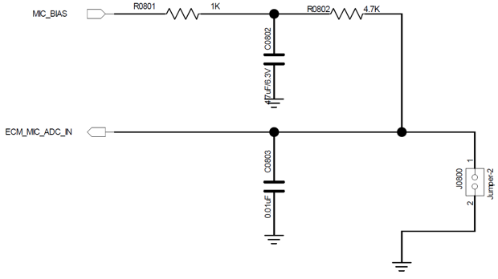{ loading="lazy" }

<em>Figure B-12: Analog ECM Microphone Reference</em>

{ loading="lazy" }

<em>Figure B-13: Analog DAC to PA Reference</em>

{ loading="lazy" }

<em>Figure B-14: Audio Power Schematic Reference</em>

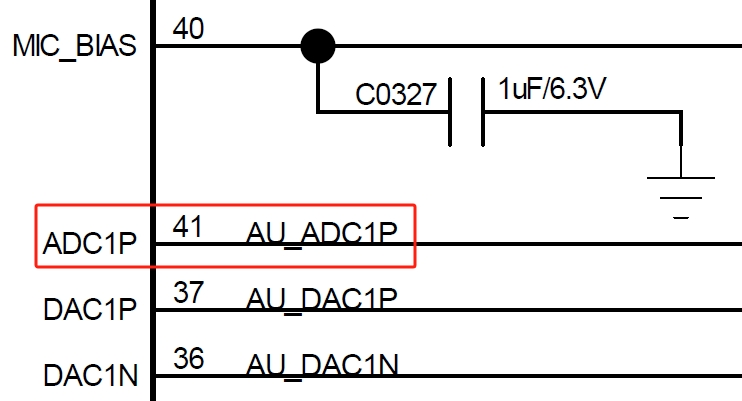{ loading="lazy" }

<em>Figure B-15: Audio ADC Schematic Reference</em>

{ loading="lazy" }

<em>Figure B-16: Audio DAC Schematic Reference</em>

**Clock**

{ loading="lazy" }

<em>Figure B-17: 48 MHz Crystal Schematic</em>

{ loading="lazy" }

<em>Figure B-18: 32.768 kHz Crystal Schematic</em>

**USB**

{ loading="lazy" }

<em>Figure B-19: USB Schematic Reference</em>

**DC/DC**

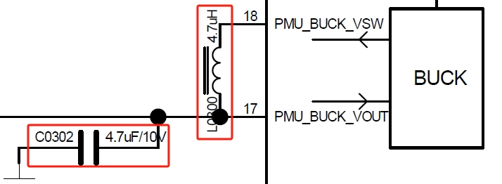{ loading="lazy" }

<em>Figure B-20: DC/DC Schematic Reference</em>

### Appendix C. Reference PCB Layouts

**RF**

{ loading="lazy" }

<em>Figure C-1: RF PCB Matching Reference</em>

{ loading="lazy" }

<em>Figure C-2: RF PCB Routing Reference</em>

**Storage**

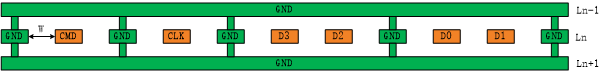{ loading="lazy" }

<em>Figure C-3: SDIO PCB Reference</em>

**Audio**

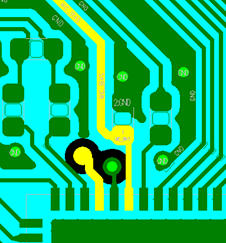{ loading="lazy" }

<em>Figure C-4: Audio Power PCB Reference</em>

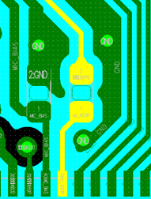{ loading="lazy" }

<em>Figure C-5: Audio ADC PCB Reference</em>

{ loading="lazy" }

<em>Figure C-6: Audio DAC PCB Reference</em>

**PCB Foundation**

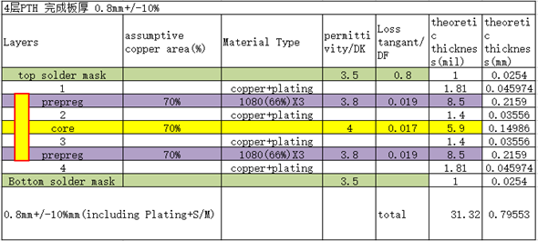{ loading="lazy" }

<em>Figure C-7: PCB Stack-Up Reference</em>

{ loading="lazy" }

<em>Figure C-8: PCB Design Rule Reference</em>

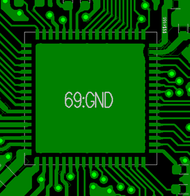{ loading="lazy" }

<em>Figure C-9: QFN Fanout Reference</em>

{ loading="lazy" }

<em>Figure C-10: Crystal Placement Reference</em>

**Clock Routing**

{ loading="lazy" }

<em>Figure C-11: 48 MHz Crystal Routing Model</em>

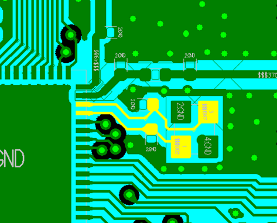{ loading="lazy" }

<em>Figure C-12: 48 MHz Crystal Routing Reference</em>

{ loading="lazy" }

<em>Figure C-13: 32.768 kHz Crystal Routing Model</em>

{ loading="lazy" }

<em>Figure C-14: 32.768 kHz Crystal Routing Reference</em>

**USB**

{ loading="lazy" }

<em>Figure C-15: USB PCB Reference</em>

{ loading="lazy" }

<em>Figure C-16: USB Layout Reference</em>

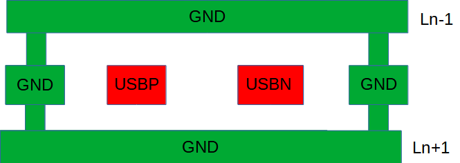{ loading="lazy" }

<em>Figure C-17: USB Routing Reference</em>

**DC/DC**

{ loading="lazy" }

<em>Figure C-18: DC/DC PCB Reference</em>

### Appendix D. Mechanical

{ loading="lazy" }

<em>Figure D-1: SF32LB520/3/5/7 Package Layout</em>

{ loading="lazy" }

<em>Figure D-2: 52B/D/E/G/J Package Layout</em>

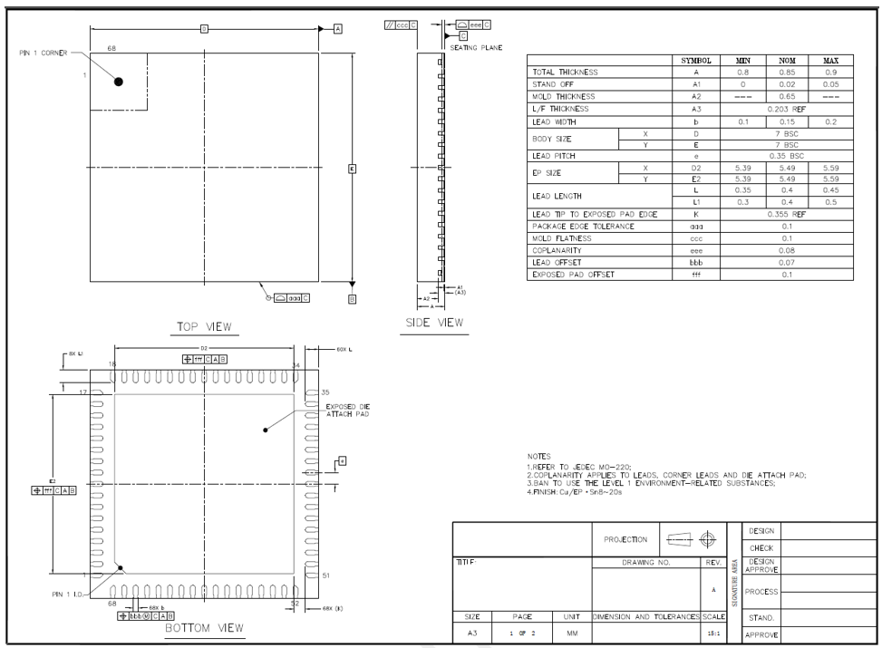{ loading="lazy" }

<em>Figure D-3: QFN68L Package Dimensions</em>

{ loading="lazy" }

<em>Figure D-4: QFN68L Package Shape</em>

{ loading="lazy" }

<em>Figure D-5: QFN68L Recommended Footprint</em>

### Appendix E. Power

**SF32LB520/3/5/7 (Battery-Powered)**

{ loading="lazy" }

<em>Figure E-1: External Charger Without PPM</em>

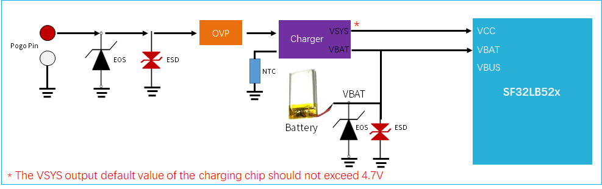{ loading="lazy" }

<em>Figure E-2: External Charger With PPM</em>

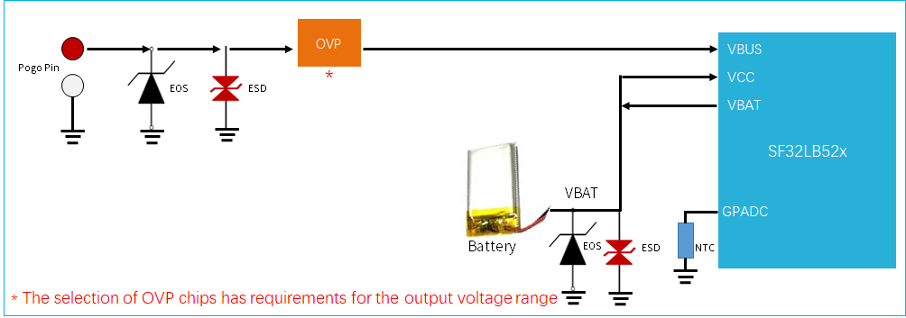{ loading="lazy" }

<em>Figure E-3: Integrated Charger Circuit</em>

{ loading="lazy" }

<em>Figure E-4: OVP Threshold Setting</em>

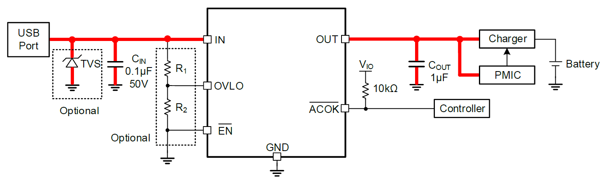{ loading="lazy" }

<em>Figure E-5: Adjustable OVLO OVP Application</em>

{ loading="lazy" }

<em>Figure E-6: Regulated-Output OVP Application</em>

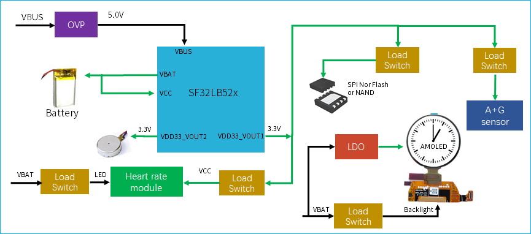{ loading="lazy" }

<em>Figure E-7: SF32LB520/3/5/7 Power Structure</em>

{ loading="lazy" }

<em>Figure E-8: VCC Schematic Reference</em>

{ loading="lazy" }

<em>Figure E-9: VCC PCB Reference</em>

{ loading="lazy" }

<em>Figure E-10: Charging Schematic Reference</em>

{ loading="lazy" }

<em>Figure E-11: Charging PCB Reference</em>

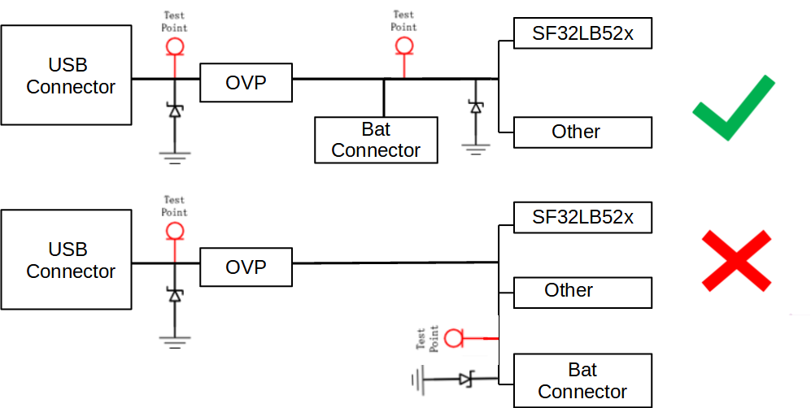{ loading="lazy" }

<em>Figure E-12: PMU TVS Reference</em>

{ loading="lazy" }

<em>Figure E-13: PMU EOS Reference</em>

**52B/D/E/G/J (Regular-Powered)**

{ loading="lazy" }

<em>Figure E-14: 52B/D/E/G/J PMU PCB Reference</em>

## 10. Revision History

<em>Table 10-1: Revision History</em>

| Version | Date | Note |
|:---|:---|:---|
| 1.1 | 2026-07 | Promoted Power System to a peer schematic section, split Clock Generation and RF into separate schematic sections, and renumbered the following schematic guidance sections. |
| 0.0.1 | 10/2024 | Original release of `SF32LB520-3-5-7-HW-Application` |
| 0.0.1 | 10/2024 | Original release of `SF32LB52B-E-G-J-HW-Application` |
| 1.0 | This document | Combined both official hardware application notes into a single guide, using tabs to separate battery-powered vs. regular-powered variant content |

### 10.1. Checklist Revision History

The item-by-item checklist in the [Schematic Checklist](SF32LB52x_schematic_checklist.md) and [PCB Layout Checklist](SF32LB52x_pcb_layout_checklist.md) is versioned separately from the guide, following SiFli's own *SF32LB52 Schematic & PCB Checklist* spreadsheet.

<em>Table 10.1-1: Checklist Revision History</em>

| Version | Date | Note |
|:---|:---|:---|
| 1.0 | 2026-01-21 | Initial release, based on SiFli's *SF32LB52 Schematic & PCB Checklist* V1.0 |

[SiFli Approved Vendor List]: ../cad-components/sifli-approved-vendor-list.md
[SiFli Approved Vendor List (AVL)]: https://downloads.sifli.com/hardware/files/documentation/SIFLI-MCU-AVL-%E8%AE%A4%E8%AF%81%E8%A1%A8-V0.3-20260121.xlsx
