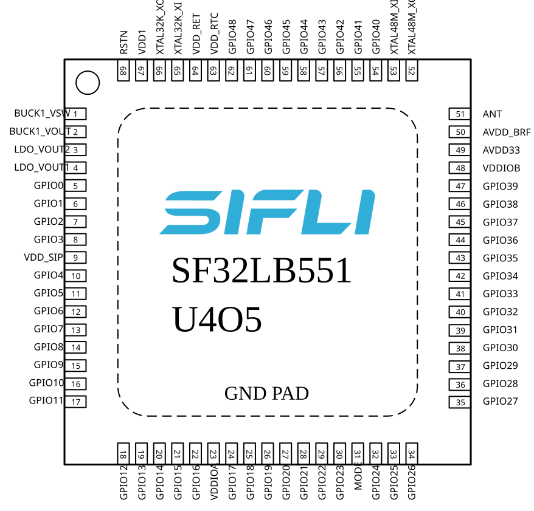
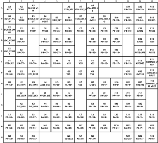
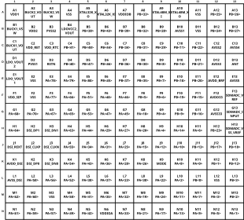
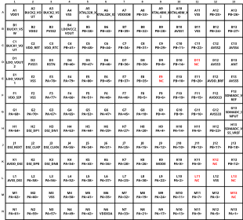

# SF32LB55x Hardware Design Guide

## 1. Introduction

This hardware design guide provides recommendations and reference material for products based on the SF32LB55x family of mainstream AIoT microcontrollers. It is intended for hardware engineers, PCB designers, and product developers building BLE wearables, sensor-rich battery products, health-monitoring devices, and compact connected systems.

The guide covers the complete hardware development process, including package selection, power-supply design, clock circuits, RF layout, external memory, display interfaces, wake sources, sensors, audio, debug access, PCB layout, validation, and manufacturing preparation. Following these guidelines helps reduce schematic and layout risk, preserve low-power behavior, and keep the design aligned with SF32LB55x package, power, memory, RF, and interface requirements.

This document assumes a basic understanding of embedded hardware design and schematic capture. It complements the SF32LB55x datasheet, user manual, official hardware application note, reference designs, and SiFli Approved Vendor List, which remain the authority for electrical specifications, pin multiplexing, package dimensions, component qualification, and production limits.

SiFli's chip model guide notes one important caveat: the 55x suffix naming predates the later 52/56/58 convention and does not fully follow it. For interface availability, package-dependent capability, and exact memory topology, use the exact orderable part number and package reference rather than suffix inference alone.

## 2. Development Resources

[SF32LB55x Hardware Application Note]: https://wiki.sifli.com/en/hardware/SF32LB55x-HW-Application.html
[SF32LB55x Hardware Application Source]: https://github.com/OpenSiFli/SiFli-Wiki/blob/main/source/en/hardware/SF32LB55x-HW-Application.md
[SF32LB55x Datasheet]: https://downloads.sifli.com/user%20manual/DS5501-SF32LB55x-Datasheet%20V1p7p2.pdf
[SF32LB55x User Manual]: https://downloads.sifli.com/docs/user%20manual/SF32LB55x/UM5501%E2%80%90SF32LB55x%E2%80%90EN.pdf
[SF32LB55x SDK Documentation]: https://docs.sifli.com/projects/sdk/latest/sf32lb55x/index.html
[SF32LB55x API Reference]: https://docs.sifli.com/projects/sdk/latest/sf32lb55x/api/index.html
[SF32 Family Overview]: ../../explore-sf32/family/SF32_family.md
[SiFli Approved Vendor List (AVL)]: ../cad-components/sifli-approved-vendor-list.md
[Buy Samples]: https://sifli.taobao.com/
[Buy Dev Kits]: https://sifli.taobao.com/

- :fontawesome-solid-file-lines: __[SF32LB55x Hardware Application Note]__
- :fontawesome-brands-github: __[SF32LB55x Hardware Application Source]__
- :fontawesome-solid-file-pdf: __[SF32LB55x Datasheet]__
- :fontawesome-solid-file-pdf: __[SF32LB55x User Manual]__
- :fontawesome-solid-book: __[SF32LB55x SDK Documentation]__
- :fontawesome-solid-book-open: __[SF32LB55x API Reference]__
- :fontawesome-solid-microchip: __[SF32 Family Overview]__
- :fontawesome-solid-file-excel: __[SiFli Approved Vendor List (AVL)]__
- :fontawesome-solid-cart-shopping: __[Buy Samples]__
- :fontawesome-solid-cart-shopping: __[Buy Dev Kits]__

## 3. Device Overview

### 3.1. Architecture

SF32LB55x is a mainstream AIoT MCU family for BLE-connected, sensor-rich, low-power products. The source design guide focuses on package selection, PMU rails, boot mode, dual crystal design, RF matching, external memory, MIPI/SPI/MCU8080/JDI display options, GPADC, sensors, external Bluetooth audio, debug/flashing, and production calibration.

### 3.2. Variants and Packages

<em>Table 3.2-1: Package Options</em>

| Package Name | Size | Pin Pitch | Ball Diameter |
| :--- | :--- | :--- | :--- |
| QFN68L | 7x7x0.75 mm | 0.35 mm | - |
| BGA145 | 7x7x0.94 mm | 0.5 mm | 0.25 mm |
| BGA169 | 7x7x0.94 mm | 0.5 mm | 0.25 mm |

SF32LB55x supports QFN68L and multiple BGA packages. Select the package early because memory interfaces, fanout, PCB process requirements, and available GPIO differ by package.

{ width="100%" loading="lazy" }

<em>Figure 3.2-1: QFN68L Pin Distribution</em>

{ width="100%" loading="lazy" }

<em>Figure 3.2-2: BGA145 Pin Distribution</em>

{ width="100%" loading="lazy" }

<em>Figure 3.2-3: BGA169 SF32LB557V8N6 Pin Distribution</em>

{ width="100%" loading="lazy" }

<em>Figure 3.2-4: BGA169 SF32LB557VD3A6 Pin Distribution</em>

### 3.3. Major Hardware Features

- QFN68L, BGA145, and BGA169 package options.
- Dual 48 MHz and 32.768 kHz crystal design requirements.
- RF matching and Bluetooth antenna layout requirements.
- OPI PSRAM, QSPI NOR/NAND Flash and PSRAM, SDIO eMMC or Micro SD interfaces.
- MIPI DSI, SPI/QSPI, MCU8080, and JDI display options.
- Wake button, vibration motor, wake interrupt, GPADC, sensor, and external Bluetooth audio design guidance.
- DBG-UART, SWD, production flashing, and crystal calibration support.

### 3.4. Typical Applications

SF32LB55x fits BLE wearables, fitness bands, sports and cycling computers, health-monitoring devices, sensor-rich portable products, and compact battery-powered AIoT nodes.

## 4. Design at a Glance

### 4.1. Engineering Summary

<em>Table 4.1-1: SF32LB55x Design Summary</em>

| Topic | Design Focus |
|:---|:---|
| Package | Choose QFN68L or BGA package before pin planning and PCB stack-up. |
| Power | Review PMU rails, other power pins, required capacitors, POR/BOR/reset, and BUCK mode. |
| Clock | Use 48 MHz and 32.768 kHz crystals that meet CL, ppm, and ESR requirements. |
| RF | Keep matching network close to the chip and preserve a clean 50 ohm antenna path. |
| Memory | Select OPI, QSPI, or SDIO storage based on package and boot strategy. |
| Display | Select MIPI DSI, SPI/QSPI, MCU8080, or JDI early because pin groups and layout differ. |
| Production | Reserve DBG-UART, SWD, boot-mode, power, and RF/crystal calibration access. |

### 4.2. Hardware Design Flow

1. Confirm package, memory strategy, display interface, and low-power target.
2. Define the power tree, PMU rails, BUCK/LDO behavior, and reset circuit.
3. Select crystals, RF matching topology, and antenna layout constraints.
4. Assign memory, display, wake, sensor, audio, debug, and production-test pins.
5. Lock PCB stack-up, fanout, impedance, ESD, RF, and high-speed interface constraints.
6. Review the Section 7 checklist before schematic freeze, layout release, and EVT.

### 4.3. Review Evidence Pack

Before EVT, archive the datasheet/user-manual versions, package drawing, schematic PDF, PCB stack-up, impedance report, DRC/ERC reports, power tree, boot-mode table, RF layout screenshots, crystal layout screenshots, memory/display routing screenshots, and production test-point plan.

## Using the Checklists

This guide includes two levels of checklist coverage. The short checklist in Section 7 gives the highest-risk items for a quick engineering self-check. The [Schematic Checklist](SF32LB55x_schematic_checklist.md) (Section 5.8) and Section 6.4 of the [PCB Layout Guidelines](SF32LB55x_pcb_layout.md) reproduce SiFli's complete, item-by-item *SF32LB55x Schematic & PCB Checklist* (V1.0, 2026-01-21), published alongside the hardware design materials on [SiFli's wiki][SiFli Chip Hardware Design Guide Index (Wiki)], spanning the 551/555/557 devices and the SS6600A8 variant.

Each check point lists which variant group(s) it applies to and whether it is Required (must pass before release) or Optional (recommended if the feature is used). Colored text and text with a yellow background preserve the source workbook's review emphasis; the workbook doesn't state a reason for each highlight, so treat these marks as additional review flags, not as replacements for any non-highlighted item in the same table.

Run the [Schematic Checklist](SF32LB55x_schematic_checklist.md) during schematic review, before PCB layout begins. Run the PCB layout checklist (Section 6.4) during layout review, before Gerber release. In practice, each pass is usually performed twice: first by the design engineer, then by an independent reviewer before design freeze or manufacturing release.

For best results, treat the checklist as a sign-off record rather than a reading checklist:

1. Confirm the exact target part number and package first.
2. Mark every item as pass / fail / not applicable during review instead of reading the table passively.
3. Cross-check display, storage, wake-up, and low-power rows against the matching hardware design guide sections.
4. Record package-specific assumptions — especially BGA vs. QFN, DSI vs. SPI display, and QSPI2/QSPI3 storage usage — in the review notes.

<em>Review Record Template</em>

| Field | Value |
|:---|:---|
| Customer name | |
| Customer design name | |
| Submission date for review | |
| Initial reviewer | |
| Initial review date | |
| Follow-up reviewer | |
| Follow-up review date | |

<em>Checklist Document Version History</em>

| No. | Version | Date | Release Notes |
|:---|:---|:---|:---|
| 1 | V1.0 | 2026-01-21 | Initial release of the Schematic & PCB Checklist document |

[SiFli Chip Hardware Design Guide Index (Wiki)]: https://wiki.sifli.com/hardware/index.html

## Continue the Design Guide

The full guide continues across the pages below. Each covers one stage of the design process and can be reached from here.

- :fontawesome-solid-bolt: __[Schematic Design Guidelines](SF32LB55x_schematic_design.md)__ — power system, boot mode, clock generation, RF, storage interfaces, display and touch interfaces, and wake/GPADC/manufacturing interfaces
- :fontawesome-solid-list-check: __[Schematic Checklist](SF32LB55x_schematic_checklist.md)__ — item-by-item schematic review checklist (Section 5.8)
- :fontawesome-solid-microchip: __[PCB Layout Guidelines](SF32LB55x_pcb_layout.md)__ — footprint, stack-up, general PCB rules, interface routing, and the item-by-item PCB layout checklist
- :fontawesome-solid-book-open: __[Design Review Checklist and References](SF32LB55x_review_and_reference.md)__ — release checklist, related documents, appendices, and revision history

