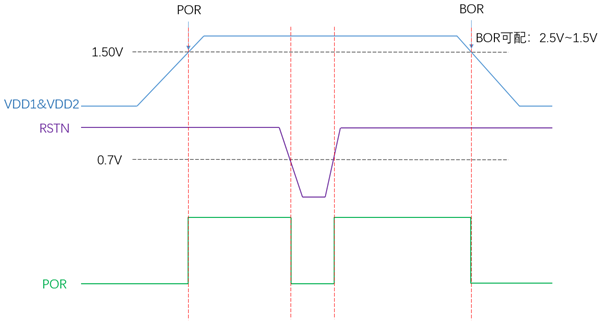
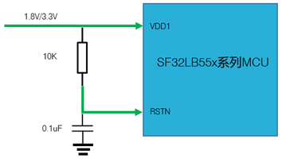
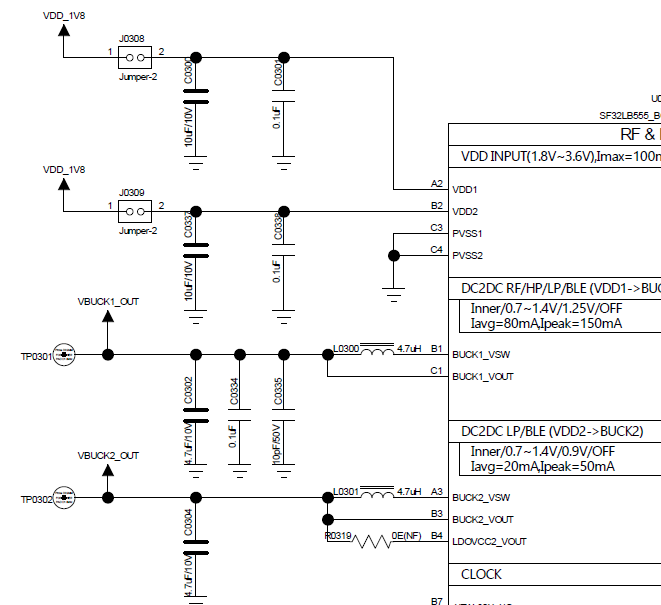
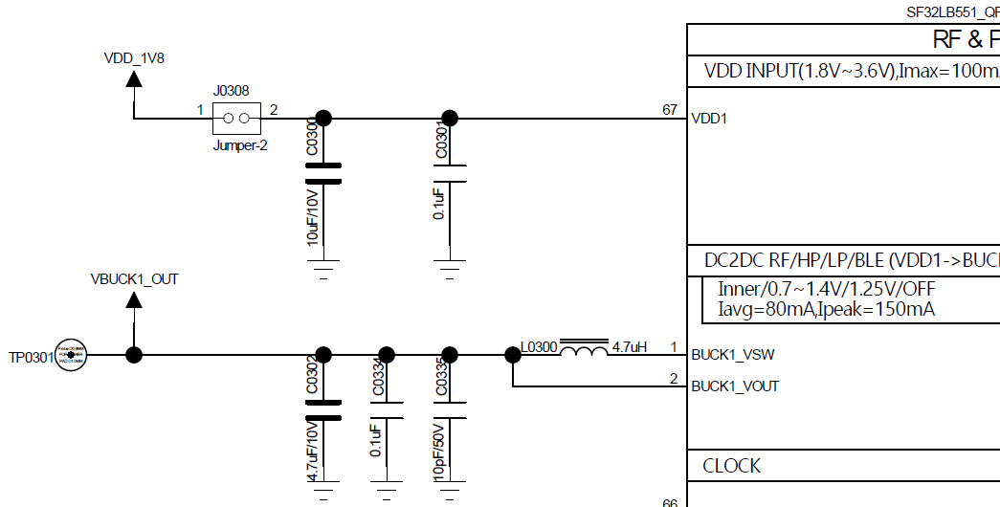

# SF32LB55x Hardware Design Guide — Schematic Design Guidelines

!!! note "Part of the SF32LB55x Hardware Design Guide"
    This page covers Section 5, Schematic Design Guidelines. Start from the [SF32LB55x Hardware Design Guide overview](SF32LB55x_hardware_design_guide.md) for device selection and the full design flow, continue to the [Schematic Checklist](SF32LB55x_schematic_checklist.md), or skip ahead to [PCB Layout Guidelines](SF32LB55x_pcb_layout.md).

## 5. Schematic Design Guidelines

<em>Table 5-1: Schematic Section Map</em>

| Group | Topics |
|:---|:---|
| Power System | PMU rails, other rails, capacitors, POR/BOR/reset, BUCK inductor. |
| Clock Generation | 48 MHz crystal, 32.768 kHz crystal, and matching-capacitor review. |
| RF | RF matching, 50-ohm antenna path, AVDD_BRF filtering, and RF keep-out. |
| Storage Interfaces | OPI PSRAM, QSPI NOR/NAND/PSRAM, and SDIO eMMC/Micro SD. |
| Display and Touch | MIPI DSI, SPI/QSPI, MCU8080, JDI, touch interrupt, reset, backlight, and panel power. |
| Wake, Analog, and Manufacturing | Wake pins, GPADC divider examples, DBG-UART, SWD, download, and calibration access. |
| User Interfaces | Wake button, vibration motor, GPADC, sensors, Bluetooth audio. |
| Manufacturing | Debug/flashing, production flashing, crystal calibration. |

### 5.1. Power System

<em>Table 5.1-1: PMU Power Supply Pins</em>

| PMU Power Supply Pins | Minimum Voltage (V) | Typical Voltage (V) | Maximum Voltage (V) | Maximum Current (mA) | Detailed Description |
| :--- | :--- | :--- | :--- | :--- | :--- |
| VDD1 | 1.71 | 1.8 | 3.6 | 50 | VDD1 Power Supply input |
| VDD2 | 1.71 | 1.8 | 3.6 | 50 | VDD2 Power Supply input |
| BUCK1_VSW BUCK1_VOUT | - | 1.25 | - | 50 | BUCK1 VSW output, connected to the inductor; internal Power Supply input 1, connected to the other end of the inductor and an external capacitor |
| BUCK2_VSW BUCK2_VOUT LDOVCC2_VOUT | - | 0.9 | - | 50 | BUCK2 VSW output, connected to the inductor; internal Power Supply input 2, connected to the other end of the inductor and an external capacitor |
| LDO_VOUT1 | - | 1.1 | - | 50 | LDO output 1, connect an external capacitor |
| LDO_VOUT2 | - | 0.9 | - | 20 | LDO output 2, connect an external capacitor |
| VDD_RET | - | 0.9 | - | 1 | RET LDO output, connect an external capacitor |
| VDD_RTC | - | 1.1 | - | 1 | RTC LDO output, connect an external capacitor |

<em>Table 5.1-2: Other Power Supply Pins</em>

| Other Power Supply Pins | Minimum Voltage (V) | Typical Voltage (V) | Maximum Voltage (V) | Maximum Current (mA) | Detailed Description |
| :--- | :--- | :--- | :--- | :--- | :--- |
| AVDD_BRF | 1.71 | 1.8 | 3.63 | 30 | RF Power Supply input |
| AVDD_DSI | 1.71 | 1.8 | 2.75 | 20 | MIPI DSI Power Supply input; power must be supplied |
| VDD_SIP | 1.71 | 1.8 | 1.98 | 30 | Power Supply input for the co-packaged memory chip |
| AVDD33 | 3.15 | 3.3 | 3.63 | 50 | Power Supply input |
| VDDIOA | 1.71 | 1.8 | 3.63 | - | PA I/O Power Supply input |
| VDDIOB | 1.71 | 1.8 | 3.63 | - | PB I/O Power Supply input |

<em>Table 5.1-3: Required Power Capacitors</em>

| Power Supply pins | Capacitor | Detailed description |
| :--- | :--- | :--- |
| VDD1 VDD2 | 0.1uF + 10uF | Short VDD1 and VDD2 together. Place at least two capacitors, 10uF and 0.1uF, close to the pins |
| BUCK1_VSW BUCK1_VOUT | 0.1uF + 4.7uF | Place at least two capacitors, 4.7uF and 0.1uF, close to the pins |
| BUCK2_VSW BUCK2_VOUT | 0.1uF + 4.7uF | Place at least two capacitors, 4.7uF and 0.1uF, close to the pins |
| LDOVCC2_VOUT | 0.1uF + 4.7uF | When BUCK2 is configured in BUCK mode, leave this pin floating; when BUCK2 is configured in LDO mode, leave BUCK2_VSW floating, short LDOVCC2_VOUT and BUCK2_VOUT together, and place at least two capacitors, 4.7uF and 0.1uF, close to the pins |
| LDO_VOUT1 | 4.7uF | Place at least one 4.7uF capacitor close to the pin |
| LDO_VOUT2 | 4.7uF | Place at least one 4.7uF capacitor close to the pin |
| VDD_RET | 0.47uF | Place at least one 0.47uF capacitor close to the pin |
| VDD_RTC | 1uF | Place at least one 1uF capacitor close to the pin |
| VDD_SIP | 1uF | Place at least one 1uF capacitor close to the pin |
| SDMADC_VREF | 4.7uF | Place at least one 4.7uF capacitor close to the pin |
| AVDD_DSI | 0.1uF + 10uF | Place at least two capacitors, 10uF and 0.1uF, close to the pins |
| AVDD33 | 4.7uF | Place at least one 4.7uF capacitor close to the pin |
| AVDD_BRF | 1uF | Place at least one 1uF capacitor close to the pin |
| VDDIOA VDDIOB | 2 × 0.1uF + 2 × 1uF | Place at least two capacitors, 1uF and 0.1uF, close to each pin |

Place the required capacitors close to the corresponding pins, keep BUCK current loops compact, and verify the BUCK/LDO operating mode before layout. The reset circuit and POR/BOR timing should be checked on actual hardware.

{ width="100%" loading="lazy" }

<em>Figure 5.1-1: Power-On and Power-Off Timing</em>

{ width="100%" loading="lazy" }

<em>Figure 5.1-2: Reset Circuit</em>

{ width="100%" loading="lazy" }

<em>Figure 5.1-3: BGA DC-DC Reference Circuit</em>

{ width="100%" loading="lazy" }

<em>Figure 5.1-4: QFN DC-DC Reference Circuit</em>

### 5.2. Boot Mode

<em>Table 5.2-1: Boot Mode Configuration</em>

| Mode configuration | Detailed description |
| :--- | :--- |
| High | After the chip powers on and starts up, it enters download mode |
| Low | After the chip powers on and starts up, it jumps to the user program area to start |

High mode enters download mode after power-on; low mode boots the user program. Ensure production fixtures can force the required boot state and that boot-related pins are not blocked by product enclosure or test access limitations.

### 5.3. Clock Generation

<em>Table 5.3-1: Crystal Requirements</em>

| Crystal | Crystal specification requirements | Detailed description |
| :--- | :--- | :--- |
| 48MHz | 7pF≦CL≦12pF (recommended value 8.8pF) △F/F0≦±10ppm ESR≦30 ohms (recommended value 22ohms) | Crystal oscillator power consumption is related to CL and ESR. The smaller the CL and ESR, the lower the power consumption. For optimal power performance, it is recommended to use components with relatively smaller CL and ESR values within the required range. Reserve parallel matching capacitors next to the crystal. When CL<12pF, no capacitors need to be mounted |
| 32.768KHz | CL≦12.5pF (recommended value 7pF) △F/F0≦±20ppm ESR≦80k ohms (recommended value 38Kohms) | Crystal power consumption is related to CL and ESR. The smaller the CL and ESR, the lower the power consumption. For optimal power consumption performance, it is recommended to use components with relatively small CL and ESR values within the required range. Reserve parallel matching capacitors next to the crystal. When CL<12.5pF, no capacitor needs to be soldered |

Place both crystals close to the chip, keep traces short and symmetric, reserve matching capacitor footprints, and protect crystal nets from RF, BUCK, display, and motor noise.

### 5.4. RF

The SF32LB55x RF front end uses on-chip wideband matching-filter technology. Keep the RF PCB trace at 50 ohms characteristic impedance, reserve a π-type matching network for spurious filtering and antenna matching, and determine final component values by testing the actual antenna and PCB layout. If the selected antenna is already matched, no additional RF components are normally required beyond the reserved network.

Keep RF routing on a continuous reference ground, place the matching circuit close to the chip side, keep AVDD_BRF filtering close to the pin, and keep DC-DC, VBAT, crystal, high-speed clock, SPI, SDIO, I2S, and UART traces away from the RF area.

### 5.5. Storage Interfaces

SF32LB55x supports OPI PSRAM, QSPI NOR/NAND Flash and PSRAM, and SDIO eMMC or Micro SD options. Package selection affects which pins and interfaces are available, so storage selection should be completed before pin locking and PCB stack-up review.

<em>Table 5.5-1: OPI PSRAM Interface 1</em>

| PSRAM signal | I/O | Detailed description |
| :--- | :--- | :--- |
| CS# | PA37 | Chip select output |
| CLK | PA20 | Clock output |
| DQS | PA35 | DQ strobe clock output for DQ[7:0] |
| DQ0 | PA28 | Data In/Out 0 |
| DQ1 | PA29 | Data In/Out 1 |
| DQ2 | PA30 | Data In/Out 2 |
| DQ3 | PA31 | Data In/Out 3 |
| DQ4 | PA34 | Data In/Out 4 |
| DQ5 | PA36 | Data In/Out 5 |
| DQ6 | PA38 | Data In/Out 6 |
| DQ7 | PA42 | Data In/Out 7 |

<em>Table 5.5-2: OPI PSRAM Interface 2</em>

| PSRAM signal | I/O | Detailed description |
| :--- | :--- | :--- |
| CS# | PA07 | Chip select input |
| CLK | PA08 | Clock input |
| DQS | PA15 | DQ strobe clock input for DQ[7:0] |
| DQ0 | PA02 | Data In/Out 0 |
| DQ1 | PA04 | Data In/Out 1 |
| DQ2 | PA05 | Data In/Out 2 |
| DQ3 | PA06 | Data In/Out 3 |
| DQ4 | PA09 | Data In/Out 4 |
| DQ5 | PA11 | Data In/Out 5 |
| DQ6 | PA12 | Data In/Out 6 |
| DQ7 | PA13 | Data In/Out 7 |

<em>Table 5.5-3: OPI PSRAM Interface 3</em>

| PSRAM signal | I/O | Detailed description |
| :--- | :--- | :--- |
| CS# | PA07 | Chip select input |
| CLK | PA08 | Clock input |
| DQS | PA26 | DQ strobe clock input for DQ[7:0] |
| DQ0 | PA18 | Data In/Out 0 |
| DQ1 | PA22 | Data In/Out 1 |
| DQ2 | PA24 | Data In/Out 2 |
| DQ3 | PA32 | Data In/Out 3 |
| DQ4 | PA33 | Data In/Out 4 |
| DQ5 | PA59 | Data In/Out 5 |
| DQ6 | PA62 | Data In/Out 6 |
| DQ7 | PA64 | Data In/Out 7 |

<em>Table 5.5-4: QSPI NOR/NAND Flash or PSRAM Interface 1</em>

| Flash signal | QFN68 | BGA145/169 | Detailed description |
| :--- | :--- | :--- | :--- |
| CS# | GPIO9 | PA61 | Chip select, active low |
| SO | GPIO7 | PA65 | Data Input (Data Input Output 1) |
| WP# | GPIO6 | PA66 | Write Protect Output (Data Input Output 2) |
| SI | GPIO8 | PA63 | Data Output (Data Input Output 0) |
| SCLK | GPIO10 | PA60 | Serial Clock Output |
| Hold# | GPIO5 | PA68 | Data Output (Data Input Output 3) |

<em>Table 5.5-5: QSPI NOR/NAND Flash or PSRAM Interface 2</em>

| Flash signal | QFN68 | BGA145/169 | Detailed description |
| :--- | :--- | :--- | :--- |
| CS# | GPIO16 | PA45 | Chip select, active low |
| SO | GPIO14 | PA49 | Data Input (Data Input Output 1) |
| WP# | GPIO13 | PA51 | Write Protect Output (Data Input Output 2) |
| SI | GPIO15 | PA47 | Data Output (Data Input Output 0) |
| SCLK | GPIO17 | PA44 | Serial Clock Output |
| Hold# | GPIO12 | PA55 | Data Output (Data Input Output 3) |

<em>Table 5.5-6: QSPI NOR/NAND Flash or PSRAM Interface 3</em>

| Flash signal | QFN68 | BGA145/169 | Detailed description |
| :--- | :--- | :--- | :--- |
| CS# | - | PB33 | Chip select, active low |
| SO | - | PB36 | Data Input (Data Input Output 1) |
| WP# | - | PB37 | Write Protect Output (Data Input Output 2) |
| SI | - | PB35 | Data Output (Data Input Output 0) |
| SCLK | - | PB32 | Serial Clock Output |
| Hold# | - | PB07 | Data Output (Data Input Output 3) |

<em>Table 5.5-7: SDIO eMMC or Micro SD Interface 1</em>

| Flash signal | QFN68 | BGA145/169 | Detailed description |
| :--- | :--- | :--- | :--- |
| CLK | GPIO10 | PA34 | Clock input |
| CMD | GPIO9 | PA36 | Command input |
| DATA0 | GPIO8 | PA28 | Data 0 |
| DATA1 | GPIO7 | PA29 | Data 1 |
| DATA2 | GPIO6 | PA30 | Data 2 |
| DATA3 | GPIO5 | PA31 | Data 3 |

<em>Table 5.5-8: SDIO eMMC or Micro SD Interface 2</em>

| Flash signal | QFN68 | BGA145/169 | Detailed description |
| :--- | :--- | :--- | :--- |
| CLK | GPIO10 | PA34 | Clock input |
| CMD | GPIO9 | PA36 | Command input |
| DATA0 | GPIO8 | PA28 | Data 0 |
| DATA1 | GPIO7 | PA29 | Data 1 |
| DATA2 | GPIO6 | PA30 | Data 2 |
| DATA3 | GPIO5 | PA31 | Data 3 |
| DATA4 | GPIO15 | PA47 | Data 4 |
| DATA5 | GPIO14 | PA49 | Data 5 |
| DATA6 | GPIO13 | PA51 | Data 6 |
| DATA7 | GPIO12 | PA55 | Data 7 |

<em>Table 5.5-9: SDIO eMMC or Micro SD Interface 3</em>

| Flash signal | QFN68 | BGA145/169 | Detailed description |
| :--- | :--- | :--- | :--- |
| CLK | GPIO17 | PA44 | Clock input |
| CMD | GPIO16 | PA45 | Command input |
| DATA0 | GPIO15 | PA47 | Data 0 |
| DATA1 | GPIO14 | PA49 | Data 1 |
| DATA2 | GPIO13 | PA51 | Data 2 |
| DATA3 | GPIO12 | PA55 | Data 3 |

### 5.6. Display and Touch Interfaces

Display choices include MIPI DSI, SPI/QSPI, MCU8080, and JDI. Choose the panel before pin assignment and PCB routing so the interface width, clocking, power control, touch interrupt, and backlight strategy are reviewed together.

<em>Table 5.6-1: MIPI DSI Display Interface</em>

| MIPI DSI signal | BGA145/169 I/O | Description |
| :--- | :--- | :--- |
| CLKP | DSI_CLKP | MIPI Clock signal + |
| CLKN | DSI_CLKN | MIPI Clock signal - |
| D0P | DSI_D0P | MIPI data lane 0+ |
| D0N | DSI_D0N | MIPI data lane 0- |
| D1P | DSI_D1P | MIPI data lane 1+ |
| D1N | DSI_D1N | MIPI data lane 1- |
| - | AVDD18_DSI | MIPI Power Supply input |
| - | DSI_REXT | Connect an external 10K resistor to ground |
| - | AVSS_DSI | Ground |
| TE | PA77 | Tearing effect to MCU frame signal |
| RESET | PB17 | Reset signal for the Display panel |

<em>Table 5.6-2: SPI/QSPI Display Interface</em>

| SPI signal | QFN68 | BGA145/169 | Detailed description |
| :--- | :--- | :--- | :--- |
| CSX | GPIO22 | PB33 | Enable signal |
| WRX_SCL | GPIO23 | PB32 | Clock signal |
| DCX | GPIO20 | PB36 | Data/command signal in 4-wire SPI mode; data 1 in Quad-SPI mode |
| SDI_RDX | GPIO21 | PB35 | Data input signal in 3/4-wire SPI mode; data 0 in Quad-SPI mode |
| SDO | GPIO21 | PB35 | Data output signal in 3/4-wire SPI mode; short it together with SDI_RDX |
| D[0] | GPIO19 | PB37 | Data 2 in Quad-SPI mode |
| D[1] | GPIO18 | PB07 | Data 3 in Quad-SPI mode |
| REST | GPIO2 | PB17 | Reset signal for the Display panel |
| TE | GPIO3 | PB77 | Tearing effect to MCU frame signal |

<em>Table 5.6-3: MCU8080 Display Interface</em>

| MCU8080 signal | QFN68 | BGA145/169 | Detailed description |
| :--- | :--- | :--- | :--- |
| CSX | GPIO22 | - | Chip select |
| WRX | GPIO23 | - | Writes strobe signal to write data |
| DCX | GPIO20 | - | Display data / command selection |
| RDX | GPIO21 | - | Reads strobe signal to write data |
| D[0] | GPIO19 | - | Data 0 |
| D[1] | GPIO18 | - | Data 1 |
| D[2] | GPIO17 | - | Data 2 |
| D[3] | GPIO16 | - | Data 3 |
| D[4] | GPIO15 | - | Data 4 |
| D[5] | GPIO14 | - | Data 5 |
| D[6] | GPIO13 | - | Data 6 |
| D[7] | GPIO12 | - | Data 7 |
| REST | GPIO2 | - | Reset |
| TE | GPIO3 | - | Tearing effect to MCU frame signal |

<em>Table 5.6-4: JDI Parallel Display Interface</em>

| JDI signal | I/O（LCDC1） | Detailed description |
| :--- | :--- | :--- |
| JDI_VCK | PA20 | Shift clock for the vertical driver |
| JDI_VST | PA31 | Start signal for the vertical driver |
| JDI_XRST | PA34 | Reset signal for the horizontal and vertical driver |
| JDI_HCK | PA36 | Shift clock for the horizontal driver |
| JDI_HST | PA38 | Start signal for the horizontal driver |
| JDI_ENB | PA42 | Write enable signal for the pixel memory |
| JDI_R1 | PA49 | Red image data (odd pixels) |
| JDI_R2 | PA51 | Red image data (even pixels) |
| JDI_G1 | PA55 | Green image data (odd pixels) |
| JDI_G2 | PA77 | Green image data (even pixels) |
| JDI_B1 | PA78 | Blue image data (odd pixels) |
| JDI_B2 | PA79 | Blue image data (even pixels) |
| JDI_XFRP | PA45 | Liquid crystal driving signal (“On” pixel) |
| JDI_VCOM/FRP | PA47 | Common electrode driving signal/ Liquid crystal driving signal (“Off” pixel) |

<em>Table 5.6-5: JDI Serial Display Interface</em>

| JDI signal | I/O（LCDC1） | Detailed description |
| :--- | :--- | :--- |
| JDI_SCS | PA31 | Chip Select Signal |
| JDI_SCLK | PA20 | Serial Clock Signal |
| JDI_SO | PA34 | Serial Data Output Signal |
| JDI_DISP | PA36 | Display ON/OFF Switching Signal |
| JDI_EXTCOMIN | PA38 | COM Inversion Polarity Input |

<em>Table 5.6-6: Touch and Backlight Interfaces</em>

| Touchscreen and backlight signals | QFN68 | BGA145 | BGA169 | Detailed description |
| :--- | :--- | :--- | :--- | :--- |
| Interrupt | GPIO1 | PA79 | PA79 | Touch status interrupt signal (wake-up capable) |
| I2C1_SCL | GPIO25 | PA10 | PA10 | Touchscreen I2C Clock signal |
| I2C1_SDA | GPIO24 | PA14 | PA14 | Touchscreen I2C data signal |
| BL_PWM | GPIO0 | - | - | Backlight PWM control signal |
| Reset | GPIO16 | PA00 | PA00 | Touch reset signal |
| Power Enable | GPIO26 | PA06 | PA03 | Touchscreen Power Supply enable signal |

### 5.7. Wake, GPADC, and Manufacturing Interfaces

Wake, analog, debug, and production access must be planned with the enclosure and fixture in mind. Wake pins need defined idle levels and ESD protection, GPADC dividers must balance settling time and leakage, and debug/download access must remain reachable in EVT and production.

<em>Table 5.7-1: Wake-Up Interrupt Sources</em>

| Interrupt Source | QFN68 | BGA145/169 | Detailed Description |
| :--- | :--- | :--- | :--- |
| WKUP_A0 | GPIO3 | PA77 | HCPU interrupt signal 0 |
| WKUP_A1 | GPIO2 | PA78 | HCPU interrupt signal 1 |
| WKUP_A2 | GPIO1 | PA79 | HCPU interrupt signal 2 |
| WKUP_A3 | GPIO0 | PA80 | HCPU interrupt signal 3 |
| WKUP_B0 | GPIO43 | PB43 | LCPU interrupt signal 0 |
| WKUP_B1 | GPIO44 | PB44 | LCPU interrupt signal 1 |
| WKUP_B2 | GPIO45 | PB45 | LCPU interrupt signal 2 |
| WKUP_B3 | GPIO46 | PB46 | LCPU interrupt signal 3 |
| WKUP_B4 | GPIO47 | PB47 | LCPU interrupt signal 4 |
| WKUP_B5 | GPIO48 | PB48 | LCPU interrupt signal 5 |

<em>Table 5.7-2: GPADC Divider Examples</em>

| Resistor Combination | R1(Kohm) ±%1 | R2(Kohm) ±%1 | Voltage settling time(ms) | Iq(uA) (VIN = 4.2V) |
| :--- | :--- | :--- | :--- | :--- |
| 1 | 1000 | 220 | 138 | 3.44 |
| 2 | 2000 | 430 | 250 | 1.73 |
| 3 | 3000 | 680 | 302 | 1.14 |
| 4 | 4300 | 910 | - | 0.81 |
| 5 | 5100 | 1100 | 420 | 0.68 |

<em>Table 5.7-3: Debug and Flashing Interface</em>

| UART Signal | QFN68 | BGA145/169 | Detailed Description |
| :--- | :--- | :--- | :--- |
| TXD1 | GPIO13 | PA19 | UART1 RXD signal |
| RXD1 | GPIO14 | PA17 | UART1 TXD signal |
| TXD2 | - | PA07 | UART2 RXD signal |
| RXD2 | - | PA05 | UART2 TXD signal |
| TXD3 | GPIO46 | PB46 | UART3 RXD signal, system default log port |
| RXD3 | GPIO45 | PB45 | UART3 TXD signal, system default log port |
| TXD4 | - | PB14 | UART4 RXD signal |
| RXD4 | - | PB12 | UART4 TXD signal |
| TXD5 | - | PB11 | UART5 RXD signal |
| RXD5 | - | PB06 | UART5 TXD signal |
| SWCLK | GPIO41 | PB31 | SWD Clock signal |
| SWDIO | GPIO42 | PB34 | SWD data signal |

