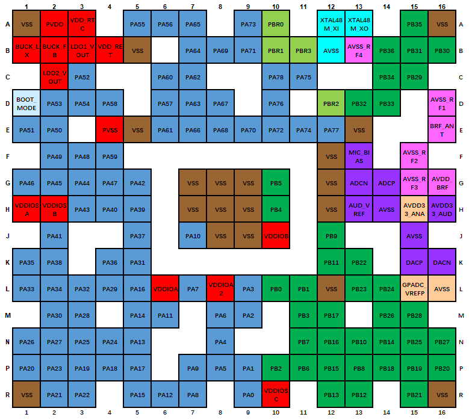
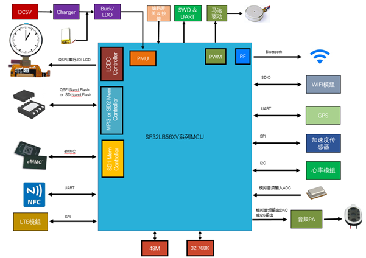

# SF32LB56x Hardware Design Guide

## 1. Introduction

This hardware design guide provides recommendations and reference material for products based on the SF32LB56x family of graphics-optimized AIoT microcontrollers. It is intended for hardware engineers, PCB designers, and product developers building smartwatches, connected HMI systems, medical and healthcare devices, industrial handhelds, portable instruments, and advanced e-bike or e-scooter displays.

The guide covers the complete hardware development process for both SF32LB56xU and SF32LB56xV designs, including package selection, PMIC and processor power, reset, boot mode, operating modes, crystals, RF, display, storage, audio, sensors, UART/I2C/GPTIM pin planning, PCB layout, validation, and production preparation. Following these guidelines helps reduce schematic and layout risk, protect low-power behavior, and keep U/V variant differences visible throughout the design.

This document assumes a basic understanding of embedded hardware design, schematic capture, and PCB layout. It complements the SF32LB56xU and SF32LB56xV hardware application notes, datasheets, user manuals, reference designs, and SiFli Approved Vendor List, which remain the authority for electrical specifications, pin multiplexing, package dimensions, component qualification, and production limits.

## 2. Development Resources

[SF32LB56xU Hardware Application Note]: https://wiki.sifli.com/en/hardware/SF32LB56xU-HW-Application.html
[SF32LB56xV Hardware Application Note]: https://wiki.sifli.com/en/hardware/SF32LB56xV-HW-Application.html
[SF32LB56xU Hardware Application Source]: https://github.com/OpenSiFli/SiFli-Wiki/blob/main/source/en/hardware/SF32LB56xU-HW-Application.md
[SF32LB56xV Hardware Application Source]: https://github.com/OpenSiFli/SiFli-Wiki/blob/main/source/en/hardware/SF32LB56xV-HW-Application.md
[SF32 Family Overview]: ../../explore-sf32/family/SF32_family.md
[SiFli Approved Vendor List (AVL)]: ../cad-components/sifli-approved-vendor-list.md
[Buy Samples]: https://sifli.taobao.com/
[Buy Dev Kits]: https://sifli.taobao.com/

- :fontawesome-solid-file-lines: __[SF32LB56xU Hardware Application Note]__
- :fontawesome-solid-file-lines: __[SF32LB56xV Hardware Application Note]__
- :fontawesome-brands-github: __[SF32LB56xU Hardware Application Source]__
- :fontawesome-brands-github: __[SF32LB56xV Hardware Application Source]__
- :fontawesome-solid-file-excel: __[SiFli Approved Vendor List (AVL)]__
- :fontawesome-solid-cart-shopping: __[Buy Samples]__

## 3. Device Overview

### 3.1. Architecture

SF32LB56x targets richer display and HMI products than BLE-only sensor nodes. The official U and V hardware application notes share the same engineering themes: PMIC-based power distribution, 48 MHz and 32.768 kHz crystals, RF design, display interface selection, storage interface selection, audio, PBR pins, sensors, UART/I2C/GPTIM planning, debug/flashing, and production crystal calibration.

### 3.2. Variants and Packages

<em>Table 3.2-1: SF32LB56x Package Variants</em>

| Variant | Package | Dimensions | Pin Pitch | Ball Diameter |
|:---|:---|:---|:---|:---|
| SF32LB56xU | QFN68L | 7x7x0.75 mm | 0.35 mm | - |
| SF32LB56xV | WBBGA175 | 6.5x6.1x0.94 mm | 0.4 mm | 0.25 mm |

The U variant uses a QFN68L package. The V variant uses a WBBGA175 package and requires more careful fanout, via, and HDI-process planning.

{ width="100%" loading="lazy" }

<em>Figure 3.2-1: SF32LB56xU QFN68L Pin Distribution</em>

{ width="100%" loading="lazy" }

<em>Figure 3.2-2: SF32LB56xV WBBGA175 Pin Distribution</em>

### 3.3. Major Hardware Features

- PMIC-centered power distribution using SF30147C examples.
- 48 MHz and 32.768 kHz crystal requirements and recommended crystal models.
- Bluetooth RF design and antenna matching requirements.
- SPI/QSPI and JDI display on U; SPI/QSPI, MCU8080, DPI, and JDI display on V.
- External memory and boot storage options, including SDIO/eMMC/SD NAND style interfaces.
- Buttons, vibration motor, audio interface, PBR pins, sensors, UART/I2C, GPTIM, debug/flashing, and calibration.

### 3.4. Typical Applications

{ width="100%" loading="lazy" }

<em>Figure 3.4-1: SF32LB56xU Smart Watch Application Block Diagram</em>

{ width="100%" loading="lazy" }

<em>Figure 3.4-2: SF32LB56xV Smart Watch Application Block Diagram</em>

SF32LB56x fits smartwatches, connected HMI panels, healthcare products, industrial handhelds, portable instruments, and advanced display products that need Bluetooth, audio, sensors, external memory, and richer UI capability.

## 4. Design at a Glance

### 4.1. Engineering Summary

<em>Table 4.1-1: SF32LB56x Design Summary</em>

| Topic | SF32LB56xU | SF32LB56xV |
|:---|:---|:---|
| Package | QFN68L, 7x7x0.75 mm, 0.35 mm pitch | WBBGA175, 6.5x6.1x0.94 mm, 0.4 mm pitch |
| Display | SPI/QSPI and JDI are primary documented interfaces | SPI/QSPI, MCU8080, DPI, and JDI are documented |
| PCB process | Compact QFN routing and fanout | BGA/HDI planning, blind/buried via review, and tighter fanout control |
| Power | Processor rails plus SF30147C PMIC distribution | Processor rails plus SF30147C PMIC distribution, with V-specific load assignments |
| Storage | External memory design through documented SF32LB56xU storage pins | External memory design through documented SF32LB56xV storage pins |

### 4.2. Hardware Design Flow

1. Select U or V variant, package, display interface, storage option, and target PCB process.
2. Define PMIC power distribution, processor rails, reset, charging, and low-power control.
3. Select crystals, RF matching, display, storage, audio, sensor, button, motor, and PBR circuits.
4. Lock pin assignments and check conflicts between display, storage, audio, debug, wake, and production functions.
5. Review PCB fanout, stack-up, impedance, RF, clocks, USB/SDIO, audio, DC-DC, and ESD.
6. Run the design checklist before schematic freeze, layout release, EVT, and production fixture release.

### 4.3. Review Evidence Pack

Before EVT, archive the U/V source document version, datasheet/user-manual versions, schematic PDF, PCB stack-up, PCB process capability, DRC/ERC reports, PMIC configuration, power tree, boot/storage configuration, display routing screenshots, RF/crystal layout screenshots, audio/analog screenshots, and production flashing/calibration plan.

## Using the Checklists

This guide includes two levels of checklist coverage. The short checklist in Section 7 gives the highest-risk items for a quick engineering self-check. The [Schematic Checklist](SF32LB56x_schematic_checklist.md) (Section 5.8) and Section 6.3 of the [PCB Layout Guidelines](SF32LB56x_pcb_layout.md) reproduce SiFli's complete, item-by-item *SF32LB56x Schematic & PCB Checklist* (V1.0, 2026-01-21), published alongside the hardware design materials on [SiFli's wiki][SiFli Chip Hardware Design Guide Index (Wiki)], spanning the SF32LB56xU family, the SF32LB56xV family, and the SS6700A variant.

Each check point lists which chip group(s) it applies to and whether it is Required (must pass before release) or Optional (recommended if the feature is used). Colored text and text with a yellow background preserve the source workbook's review emphasis; the workbook doesn't state a reason for each highlight, so treat these marks as additional review flags, not as replacements for any non-highlighted item in the same table.

Run the [Schematic Checklist](SF32LB56x_schematic_checklist.md) during schematic review, before PCB layout begins. Run the PCB layout checklist (Section 6.3) during layout review, before Gerber release. In practice, each pass is usually performed twice: first by the design engineer, then by an independent reviewer before design freeze or manufacturing release.

For best results, treat the checklist as a sign-off record rather than a reading checklist:

1. Confirm the exact target part number and package first.
2. Mark every item as pass / fail / not applicable during review instead of reading the table passively.
3. Cross-check display, storage, wake-up, and low-power rows against the matching hardware design guide sections.
4. Record package-specific assumptions — especially 56xU vs. 56xV, QFN vs. WBBGA, DSI vs. SPI display, and SD2/MPI3 storage usage — in the review notes.

<em>Review Record Template</em>

| Field | Value |
|:---|:---|
| Customer name | |
| Customer design name | |
| Submission date for review | |
| Initial reviewer | |
| Initial review date | |
| Follow-up reviewer | |
| Follow-up review date | |

<em>Checklist Document Version History</em>

| No. | Version | Date | Release Notes |
|:---|:---|:---|:---|
| 1 | V1.0 | 2026-01-21 | Initial release of the Schematic & PCB Checklist document |

[SiFli Chip Hardware Design Guide Index (Wiki)]: https://wiki.sifli.com/hardware/index.html

## Continue the Design Guide

The full guide continues across the pages below. Each covers one stage of the design process and can be reached from here.

- :fontawesome-solid-bolt: __[Schematic Design Guidelines](SF32LB56x_schematic_design.md)__ — power system, operating modes and wake sources, clock generation, RF, display/touch/backlight interfaces, storage/sensors/audio/connectivity, and manufacturing
- :fontawesome-solid-list-check: __[Schematic Checklist](SF32LB56x_schematic_checklist.md)__ — item-by-item schematic review checklist (Section 5.8)
- :fontawesome-solid-microchip: __[PCB Layout Guidelines](SF32LB56x_pcb_layout.md)__ — footprint, stack-up, critical routing, and the item-by-item PCB layout checklist
- :fontawesome-solid-book-open: __[Design Review Checklist and References](SF32LB56x_review_and_reference.md)__ — release checklist, related documents, appendices, and revision history

