# SF32LB58x Hardware Design Guide — PCB Layout Guidelines

!!! note "Part of the SF32LB58x Hardware Design Guide"
    This page covers Section 6, PCB Layout Guidelines. Return to [Schematic Design Guidelines](SF32LB58x_schematic_design.md), continue to the [PCB Layout Checklist](SF32LB58x_pcb_layout_checklist.md), or skip ahead to [Design Review Checklist and References](SF32LB58x_review_and_reference.md).

## 6. PCB Layout Guidelines

### 6.1. Package Footprint Design

The SF32LB58x series uses a BGA256 package, 8.5 mm x 6.5 mm x 0.94 mm, 0.4 mm pitch. Refer to the official Datasheet for full package qualification data.

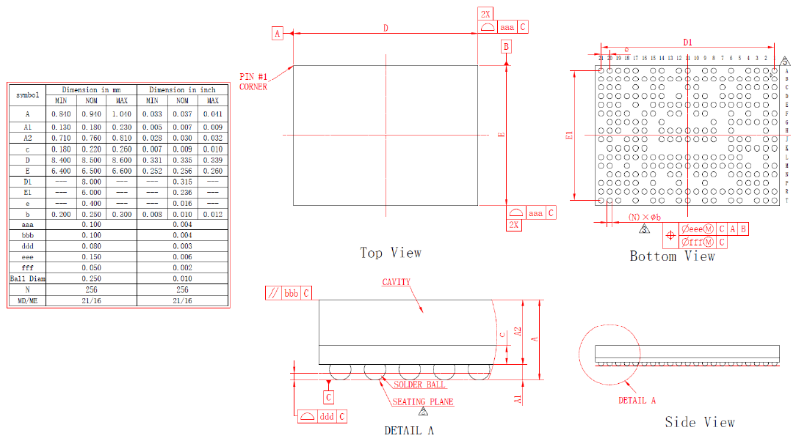{ width="100%" loading="lazy" }

<em>Figure 6.1-1: BGA256 Package Dimensions</em>

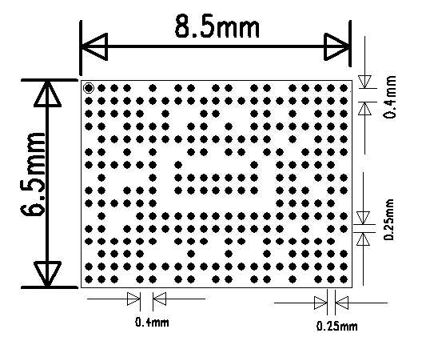{ width="100%" loading="lazy" }

<em>Figure 6.1-2: Package Footprint Shape</em>

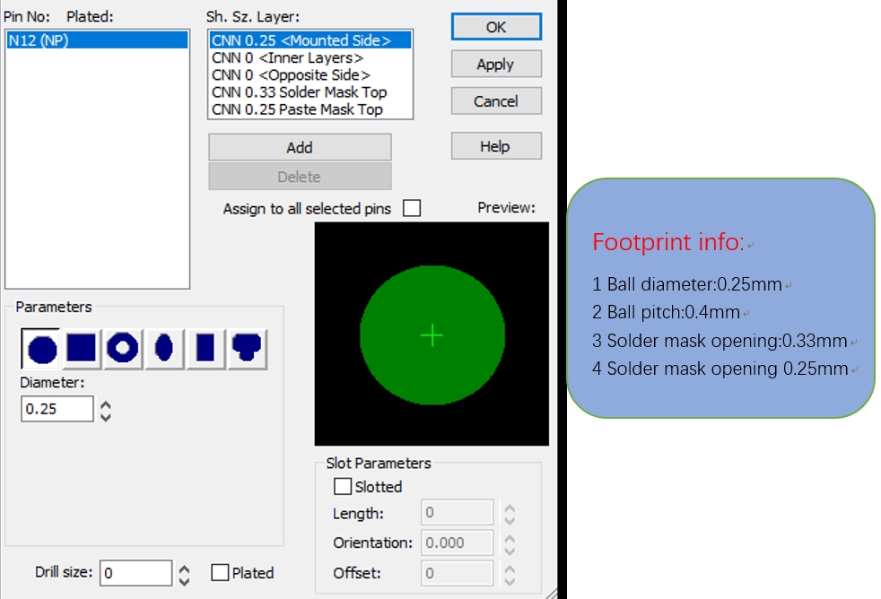{ width="100%" loading="lazy" }

<em>Figure 6.1-3: PCB Land Pattern Reference</em>

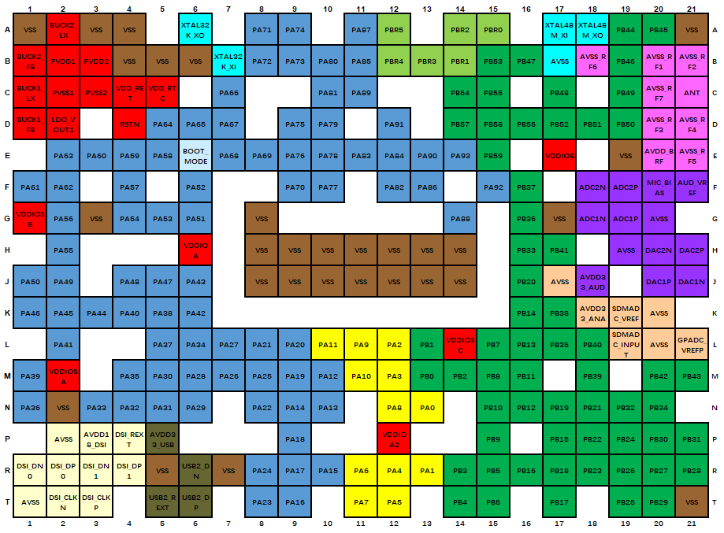{ width="100%" loading="lazy" }

<em>Figure 6.1-4: Package Ball Map</em>

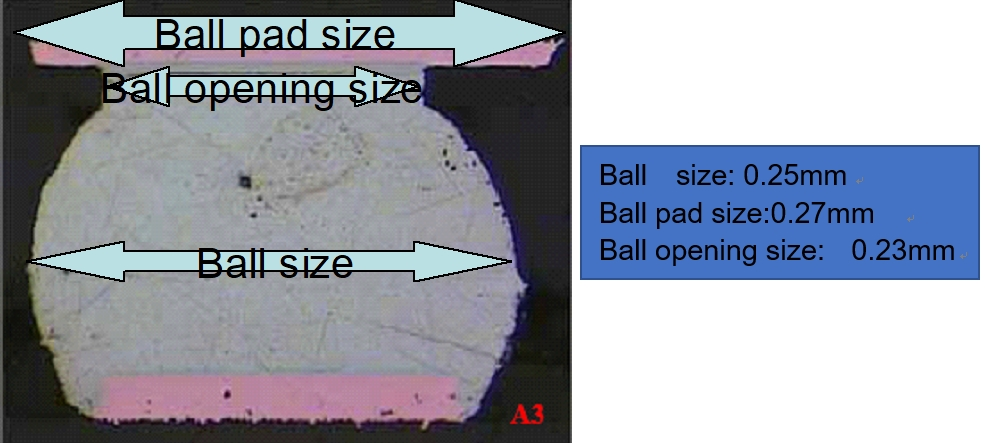{ width="100%" loading="lazy" }

<em>Figure 6.1-5: Package Substrate Ball Information</em>

### 6.2. PCB Stack-Up

The SF32LB58x series layout supports single- or double-sided assembly. The PCB must be an HDI board — PTH is not supported; a 6HDI-2 stack-up is recommended.

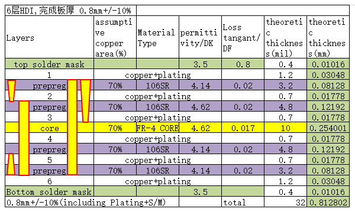{ width="100%" loading="lazy" }

<em>Figure 6.2-1: Reference Stack-Up Structure</em>

### 6.3. General PCB Design Rules

Refer to the general PCB design-rule figure in the official Datasheet (dimensions in mm).

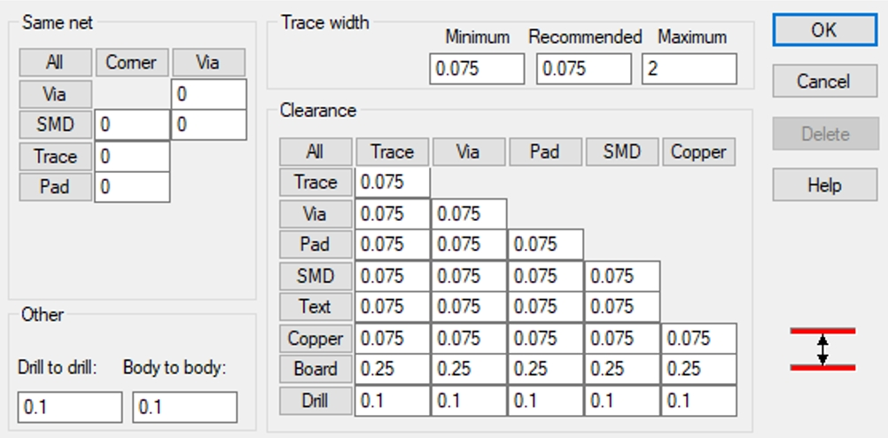{ width="100%" loading="lazy" }

<em>Figure 6.3-1: General PCB Design Rules</em>

#### 6.3.1. Blind Via Design

Refer to the blind-via design figures (layers 1-2 and 1-3) in the official Datasheet (dimensions in mm).

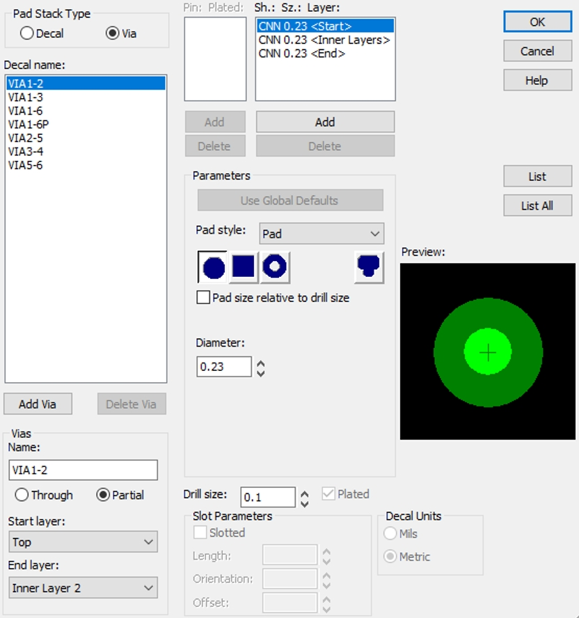{ width="100%" loading="lazy" }

<em>Figure 6.3-1: 1-2 Layer Blind Via Design</em>

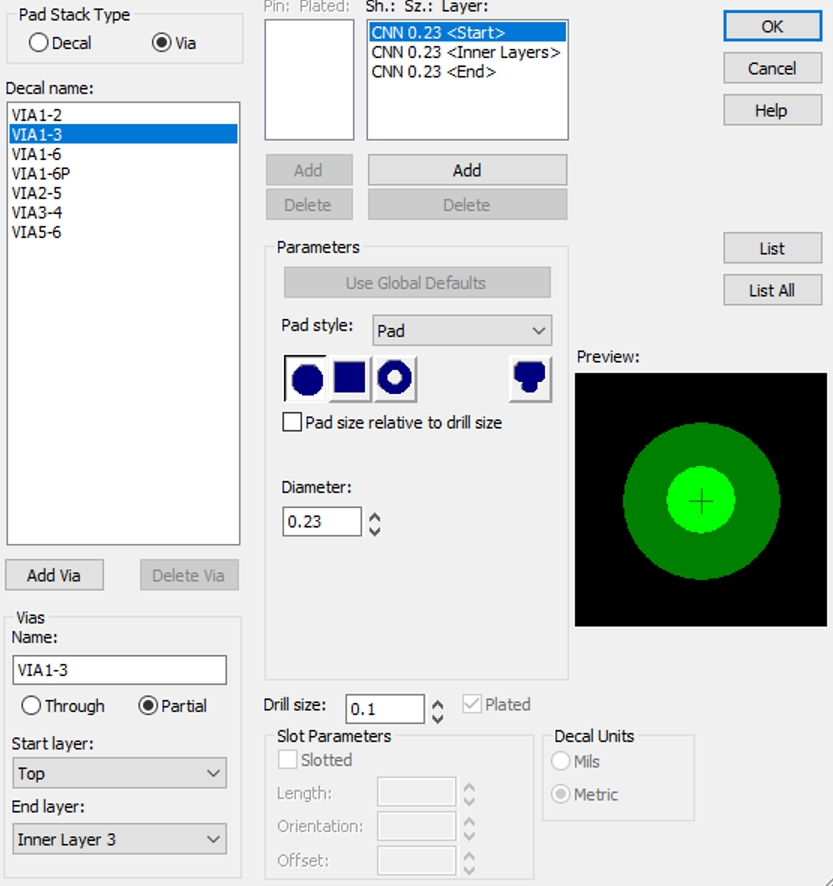{ width="100%" loading="lazy" }

<em>Figure 6.3-2: 1-3 Layer Blind Via Design</em>

#### 6.3.2. Buried Via Design

Refer to the buried-via design figure (layers 2-5) in the official Datasheet (dimensions in mm).

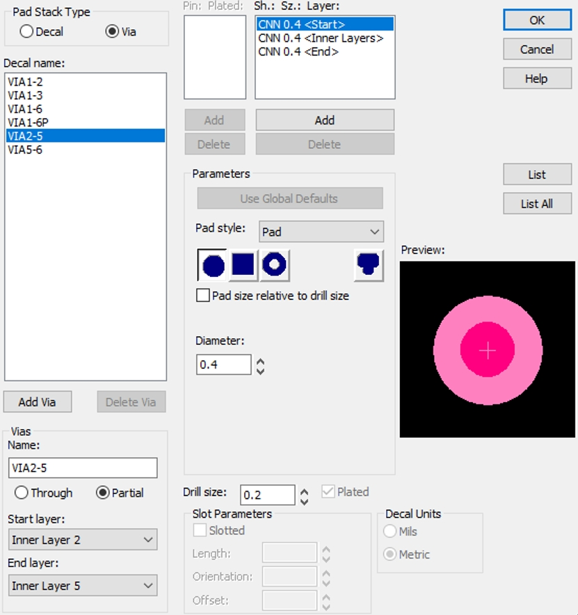{ width="100%" loading="lazy" }

<em>Figure 6.3-3: 2-5 Layer Buried Via Design</em>

### 6.4. Trace Fanout

The first two rows of BGA balls are fanned out on the top layer; the remaining balls are fanned out through vias to inner layers.

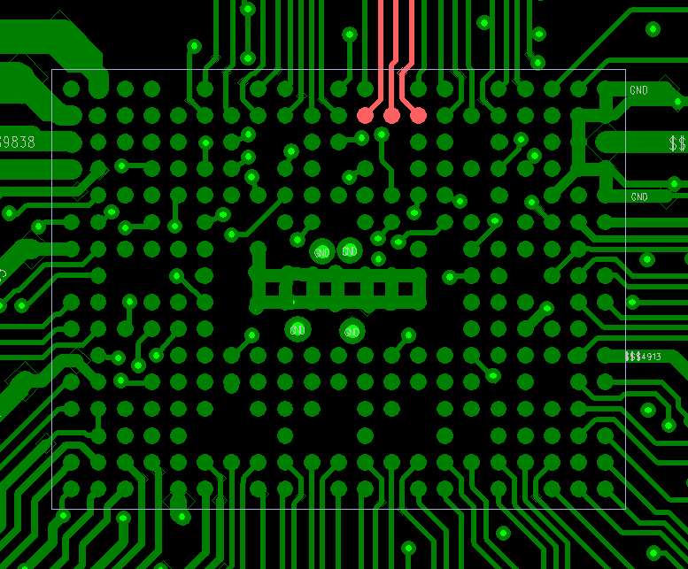{ width="100%" loading="lazy" }

<em>Figure 6.4-1: Top-Layer Fanout Reference</em>

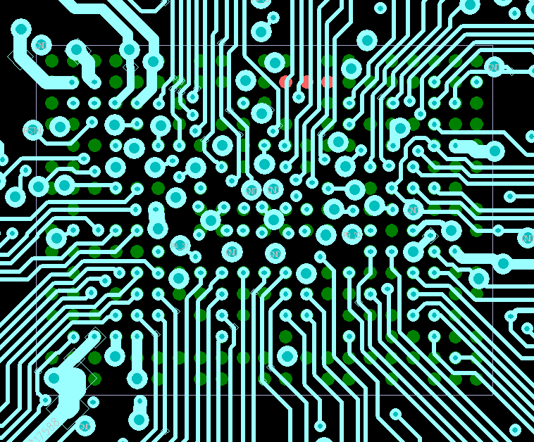{ width="100%" loading="lazy" }

<em>Figure 6.4-2: Inner-Layer Fanout Reference</em>

### 6.5. Clock Interface Routing

Place the crystal inside a shield can, more than 1 mm from the PCB board edge, and as far as possible from heat-generating components (such as PA, charging, and PMU circuitry) — ideally more than 5 mm away — to avoid affecting crystal frequency offset. Keep the crystal keep-out zone at least 0.25 mm from other metal or components.

Route the 48 MHz crystal on the top layer with a length of 3-10 mm, trace width 0.075 mm, with full 3D shielding, and route away from VBAT, DC/DC, and high-speed signal lines. Keep the top layer and adjacent layer beneath the 48 MHz crystal area clear of any other routing.

Route the 32.768 kHz crystal on the top layer with a length ≤10 mm, trace width 0.075 mm, and 32K_XI/32K_XO parallel-trace spacing ≥0.15 mm, with full 3D shielding. Keep the top layer and adjacent layer beneath the crystal area clear of any other routing.

{ width="100%" loading="lazy" }

<em>Figure 6.5-1: Crystal Placement</em>

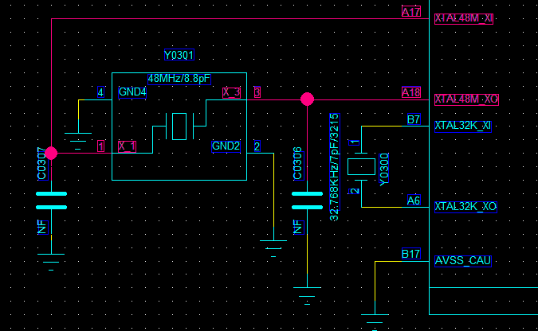{ width="100%" loading="lazy" }

<em>Figure 6.5-2: 48 MHz Crystal Schematic</em>

{ width="100%" loading="lazy" }

<em>Figure 6.5-3: 48 MHz Crystal Routing Model</em>

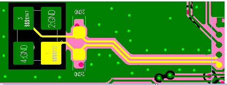{ width="100%" loading="lazy" }

<em>Figure 6.5-4: 48 MHz Crystal Routing Reference</em>

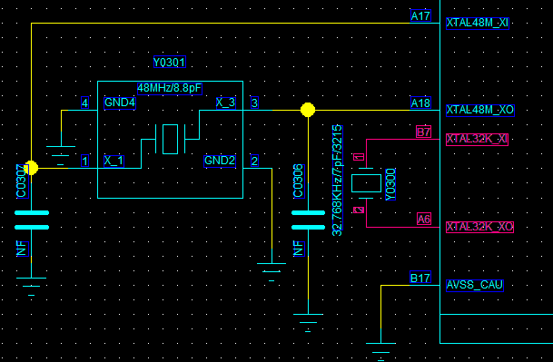{ width="100%" loading="lazy" }

<em>Figure 6.5-5: 32.768 kHz Crystal Schematic</em>

{ width="100%" loading="lazy" }

<em>Figure 6.5-6: 32.768 kHz Crystal Routing Model</em>

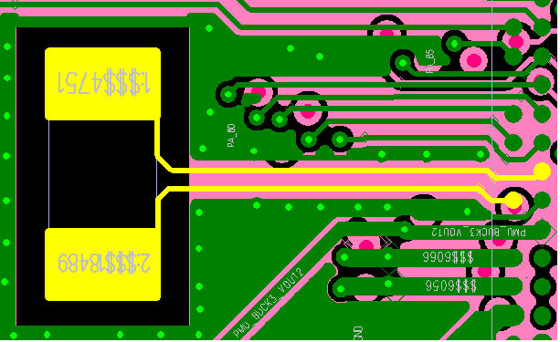{ width="100%" loading="lazy" }

<em>Figure 6.5-7: 32.768 kHz Crystal Routing Reference</em>

### 6.6. RF Interface Routing

Place the RF matching circuit as close to the chip as possible, not near the antenna end. Place the AVDD_BRF RF power decoupling capacitor as close to the chip pin as possible, with its ground pin vias landing directly on the main ground plane.

Route RF traces on the top layer where possible to avoid vias that would degrade RF performance; use a trace width greater than 10 mil, apply full 3D shielding, and avoid sharp or right angles. Add extra shielding ground vias along both sides of the RF trace, and control the RF trace to 50 Ω impedance. Keep DC-DC, VBAT, and high-speed digital signals (such as the crystal, high-frequency clocks, and I2C/SPI/SDIO/I2S/UART interface signals) out of the RF routing area. AVSS_RRF, AVSS_TRF, AVSS_TRF2, AVSS_VCO, and AVSS_BB are RF circuit ground pins that must be well grounded — place blind vias directly on their pads connecting to the main ground.

{ width="100%" loading="lazy" }

<em>Figure 6.6-1: π-Network and Power Circuit Schematic</em>

{ width="100%" loading="lazy" }

<em>Figure 6.6-2: π-Network and Power Circuit PCB Layout</em>

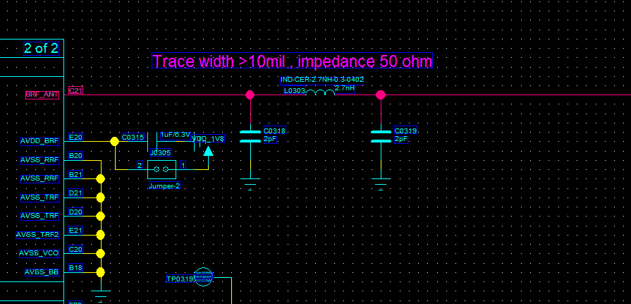{ width="100%" loading="lazy" }

<em>Figure 6.6-3: RF Signal Circuit Schematic</em>

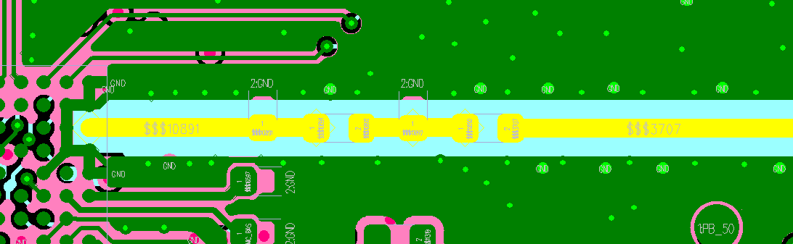{ width="100%" loading="lazy" }

<em>Figure 6.6-4: RF Signal PCB Routing</em>

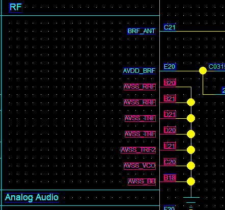{ width="100%" loading="lazy" }

<em>Figure 6.6-5: RF Circuit Ground Signal Schematic</em>

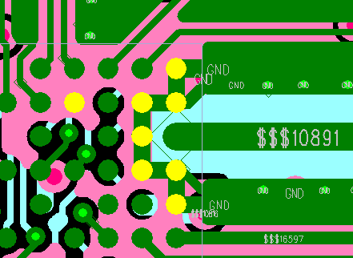{ width="100%" loading="lazy" }

<em>Figure 6.6-6: RF Circuit Ground Signal PCB</em>

### 6.7. Audio Interface Routing

Place the AVDD33_AUD audio-supply decoupling capacitor close to its pin, with its ground pin well connected to the main ground. Place the MIC_BIAS microphone-supply decoupling capacitor close to its pin, similarly well grounded. Place the AUD_VREF decoupling capacitor close to its pin.

AU_ADC1P/AU_ADC1N and AU_ADC2P/AU_ADC2N are the two analog input pairs — place associated components as close to their pins as possible, route each P/N pair as a differential line with as short a trace length as possible, apply 3D shielding to the differential pair, and keep other strongly interfering signals away from these traces.

AU_DAC1P/AU_DAC1N and AU_DAC2P/AU_DAC2N are the two analog output pairs — place associated components as close to their pins as possible, route each P/N pair as a differential line as short as possible and under 2 mm, with trace parasitic capacitance below 10 pF and a differential trace width of 0.075 mm. Apply 3D shielding to the differential pair, and keep other strongly interfering signals away from these traces.

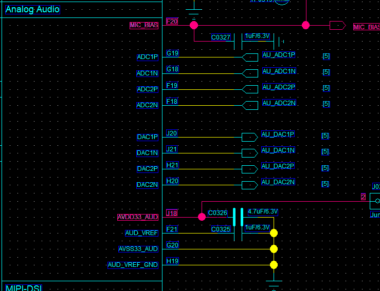{ width="100%" loading="lazy" }

<em>Figure 6.7-1: Audio Power Schematic</em>

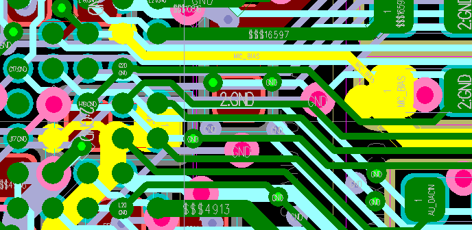{ width="100%" loading="lazy" }

<em>Figure 6.7-2: Audio Power Filtering PCB Design</em>

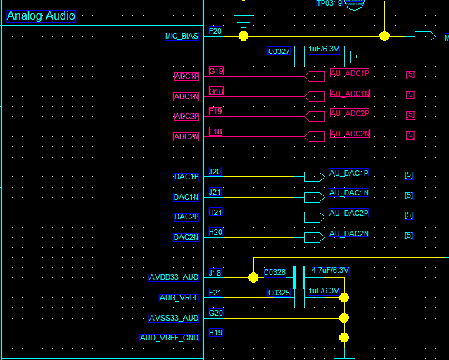{ width="100%" loading="lazy" }

<em>Figure 6.7-3: Analog Audio Input Schematic</em>

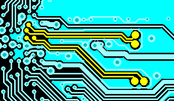{ width="100%" loading="lazy" }

<em>Figure 6.7-4: Analog Audio Input PCB Design</em>

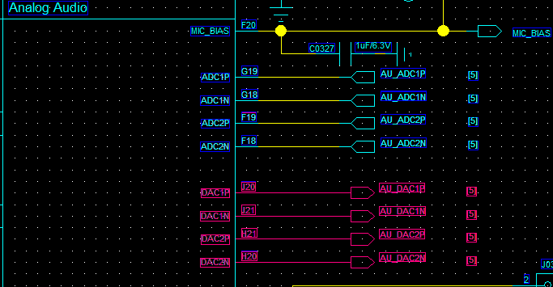{ width="100%" loading="lazy" }

<em>Figure 6.7-5: Analog Audio Output Schematic</em>

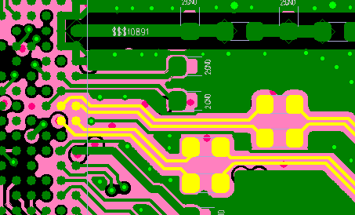{ width="100%" loading="lazy" }

<em>Figure 6.7-6: Analog Audio Output PCB Design</em>

### 6.8. USB Interface Routing

Place the AVDD33_USB decoupling capacitor close to its pin, and place the USB2_REXT calibration resistor close to its pin. USB traces must pass through the ESD-protection component pins before reaching the chip, with the ESD device's ground pin well connected to the main ground. Route USB DP/DN as a differential pair controlled to 90 Ω differential impedance, with 3D shielding applied.

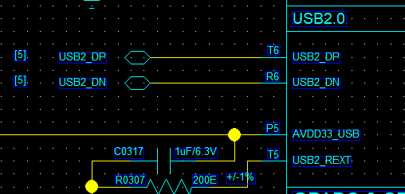{ width="100%" loading="lazy" }

<em>Figure 6.8-1: USB Signal Schematic</em>

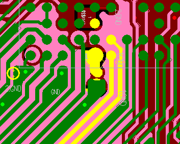{ width="100%" loading="lazy" }

<em>Figure 6.8-2: USB Signal PCB Design</em>

{ width="100%" loading="lazy" }

<em>Figure 6.8-3: USB Signal Component Placement Reference</em>

{ width="100%" loading="lazy" }

<em>Figure 6.8-4: USB Signal Routing Model</em>

### 6.9. SDIO Interface Routing

The SF32LB58x provides 2 SDIO interfaces, SDIO1 and SDIO2. Route all signals of each SDIO interface together rather than splitting them — total trace length ≤50 mm, with intra-group length control ≤6 mm. Apply 3D shielding to the SDIO clock signal, and shield the DATA and CMD signals as well.

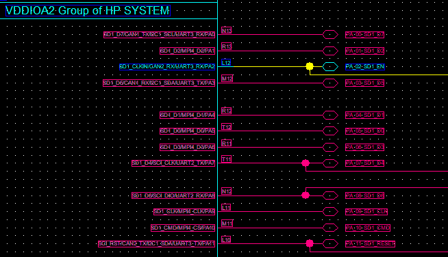{ width="100%" loading="lazy" }

<em>Figure 6.9-1: SDIO1 Interface Circuit</em>

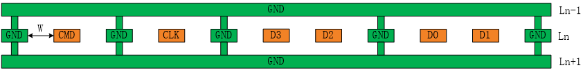{ width="100%" loading="lazy" }

<em>Figure 6.9-2: SDIO1 PCB Routing Model</em>

### 6.10. DSI Interface Routing

Place the AVDD18_DSI decoupling capacitor close to its pin, and place the DSI_REXT calibration resistor close to its pin. Route DSI signals as differential pairs controlled to 100 Ω differential impedance, with clock and data length-matched: intra-pair skew ≤0.5 mm and inter-pair skew ≤2 mm. Apply 3D shielding to each differential pair.

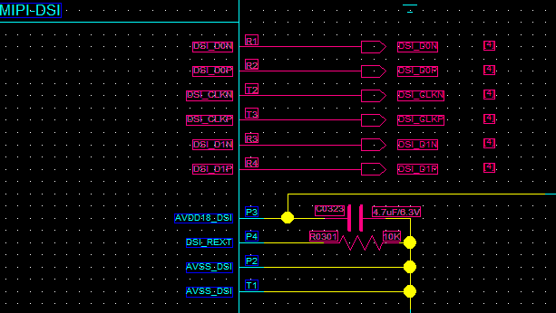{ width="100%" loading="lazy" }

<em>Figure 6.10-1: DSI Signal Circuit</em>

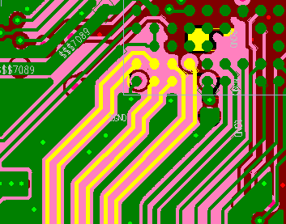{ width="100%" loading="lazy" }

<em>Figure 6.10-2: DSI Signal PCB Routing</em>

### 6.11. DC-DC Circuit Routing

Place the DC-DC power inductor and decoupling capacitors close to the chip pins. Keep BUCK_LX traces as short and wide as possible to minimize loop inductance in the DC-DC circuit. Add extra ground vias on all DC-DC output decoupling-capacitor ground pins connecting to the main ground plane. The BUCK_FB feedback trace must not be too thin — keep it above 0.25 mm. Prohibit copper pour on the top layer beneath the power inductor, keep the adjacent layer as a complete reference ground, and avoid routing other traces through the inductor area.

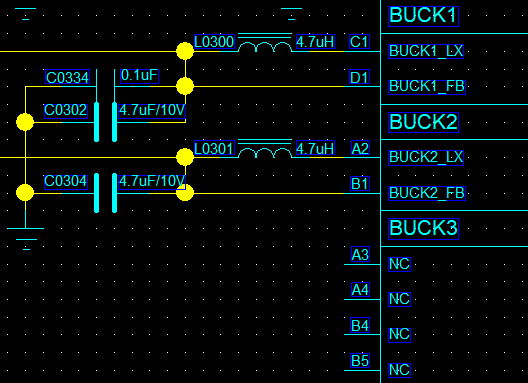{ width="100%" loading="lazy" }

<em>Figure 6.11-1: DC-DC Key Component Circuit</em>

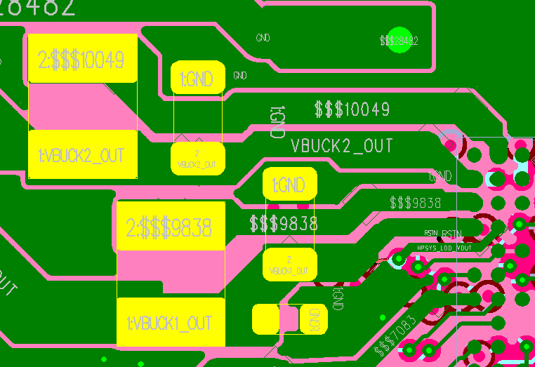{ width="100%" loading="lazy" }

<em>Figure 6.11-2: DC-DC Key Component PCB Layout</em>

### 6.12. Power Supply Routing

PVDD1 and PVDD2 are the power inputs to the built-in PMU module — place their decoupling capacitors close to the pins and keep the traces as wide as possible, never below 0.5 mm. PVSS1 and PVSS2 are PMU module ground pins that must be connected to the main ground through vias — avoid leaving them floating, which would affect overall PMU performance.

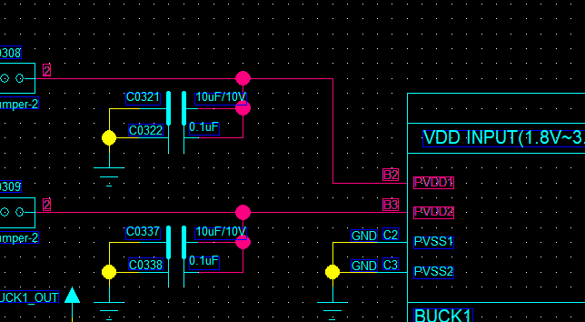{ width="100%" loading="lazy" }

<em>Figure 6.12-1: DC-DC Circuit Diagram</em>

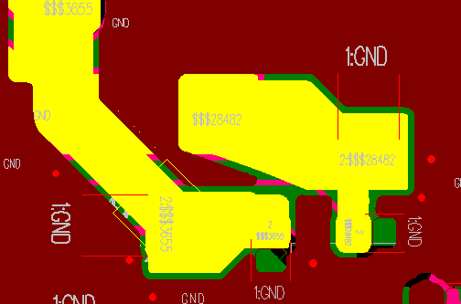{ width="100%" loading="lazy" }

<em>Figure 6.12-2: DC-DC PCB Routing</em>

### 6.13. LDO and IO Power Input Routing

Place decoupling capacitors for all LDO outputs and IO power inputs close to their respective pins, with trace widths meeting the input current requirement — keep traces as short and wide as possible to reduce power-rail ripple and improve system stability.

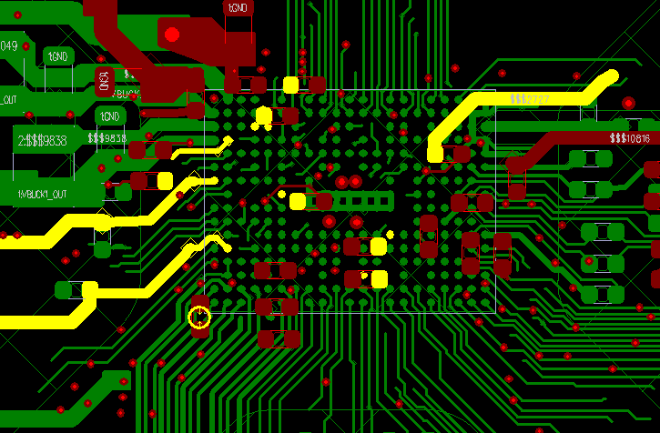{ width="100%" loading="lazy" }

<em>Figure 6.13-1: LDO and IO Input Power Routing Reference</em>

### 6.14. Other Interface Routing

GPADC pin signal nets require full 3D shielding and must be kept away from other interference sources, such as battery-level sensing and temperature-sensing circuits.

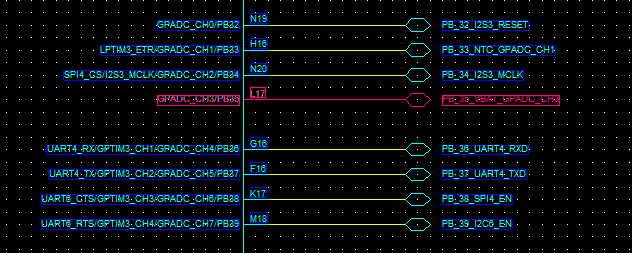{ width="100%" loading="lazy" }

<em>Figure 6.14-1: GPADC Circuit</em>

Clock input/output pin signal nets, such as the 32 kHz output, likewise require full 3D shielding and must be kept away from other interference sources.

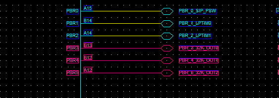{ width="100%" loading="lazy" }

<em>Figure 6.14-2: 32 kHz Clock Output Circuit</em>

### 6.15. Chip Ground Routing

The ground network under the SF32LB58x chip's central area must be fully connected by traces, ensuring an adequate ground plane connected to the main ground plane through blind/buried vias.

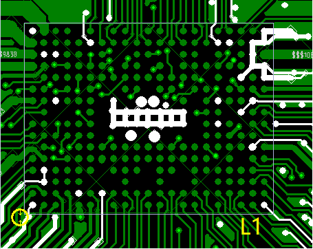{ width="100%" loading="lazy" }

<em>Figure 6.15-1: Top-Layer Ground Signal Beneath the Chip</em>

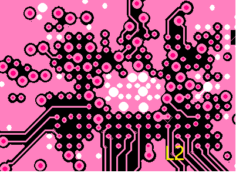{ width="100%" loading="lazy" }

<em>Figure 6.15-2: Second-Layer Ground Signal Beneath the Chip</em>

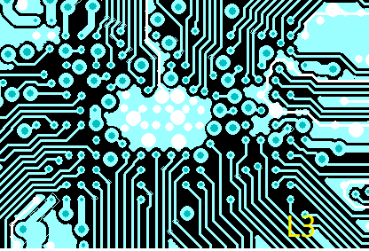{ width="100%" loading="lazy" }

<em>Figure 6.15-3: Third-Layer Ground Signal Beneath the Chip</em>

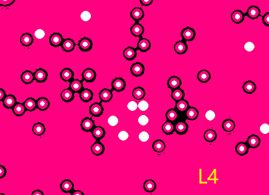{ width="100%" loading="lazy" }

<em>Figure 6.15-4: Fourth-Layer Ground Signal Beneath the Chip</em>

### 6.16. EMI & ESD

Avoid long top-layer traces outside the shield can, especially for clock and power interference sources — route them on inner layers where possible. Place ESD protection devices close to the connector pins, routing signals through the ESD device before anything else to avoid signal branching. Ensure ESD device ground pins connect to the main ground through vias, with short and wide ground pad traces to reduce impedance and improve ESD performance.

### 6.17. Other Considerations

Place USB charging-line test points before the TVS diode, and place the battery-holder TVS diode before the platform connection — route so the signal always passes through the TVS before reaching the chip. Keep TVS ground-pin traces as short as possible.

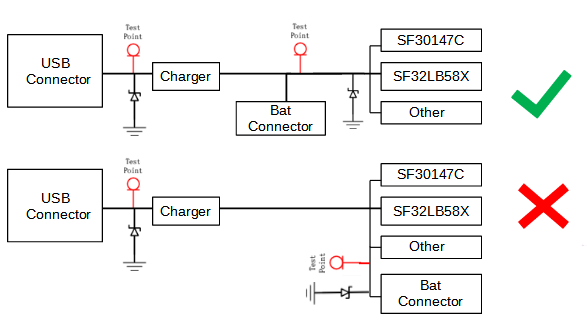{ width="100%" loading="lazy" }

<em>Figure 6.17-1: Power TVS Placement Reference</em>

{ width="100%" loading="lazy" }

<em>Figure 6.17-2: TVS Routing Reference</em>

To keep solder mask off the pads and preserve solder-joint reliability, vias in BGA pads must land at the center of the ball — avoid off-center placement. For improved manufacturability yield, refer to the BGA ball-connection reference figures.

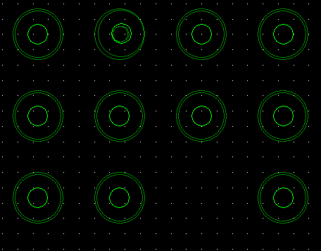{ width="100%" loading="lazy" }

<em>Figure 6.17-3: BGA Via Placement Reference</em>

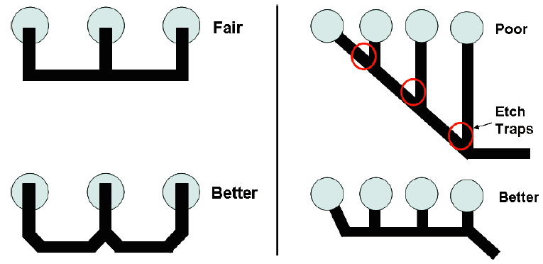{ width="100%" loading="lazy" }

<em>Figure 6.17-4: BGA Ball Connection Reference 1</em>

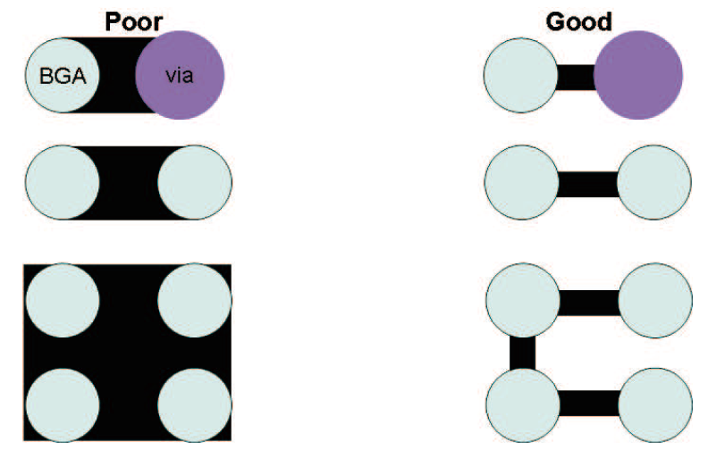{ width="100%" loading="lazy" }

<em>Figure 6.17-5: BGA Ball Connection Reference 2</em>

