# SF32LB58x Hardware Design Guide — Schematic Design Guidelines

!!! note "Part of the SF32LB58x Hardware Design Guide"
    This page covers Section 5, Schematic Design Guidelines. Start from the [SF32LB58x Hardware Design Guide overview](SF32LB58x_hardware_design_guide.md) for device selection and the full design flow, continue to the [Schematic Checklist](SF32LB58x_schematic_checklist.md), or skip ahead to [PCB Layout Guidelines](SF32LB58x_pcb_layout.md).

## 5. Schematic Design Guidelines

This chapter groups the SF32LB58x schematic topics by engineering function: power, clock generation, RF, user interfaces, storage and connectivity, and manufacturing support. Each subsection starts from the design intent, then captures the circuit requirements, common risks, and release checks for the SF32LB58x platform.

<em>Table 5-1: Schematic Section Map</em>

| Group | Main Decisions | Release Evidence |
|:---|:---|:---|
| Power System | System PMIC, chip PMU rails, BUCK inductors, LDO capacitors, reset, low-power wake sources | Power tree, PMIC settings, rail measurements, POR/BOR/reset review |
| Clock Generation | 48 MHz and 32.768 kHz crystals | Crystal specification check, matching-capacitor plan, crystal layout screenshots |
| RF | RF matching and antenna path | Impedance plan, RF matching network, antenna keep-out, layout screenshots |
| User Interfaces | Display, touch/backlight, audio, buttons, motor, PBR control | Interface schematics, pin assignments, power sequencing, analog/audio review |
| Storage and Connectivity | Boot mode, MPI4, SD1/SD2, eMMC/SD NAND/SD card, USB2.0 HS | Boot configuration, storage power plan, differential/high-speed routing evidence |
| Manufacturing | SWD, UART debug outputs, production test access, schematic/PCB checklist | Test-point drawing, recovery path, production flashing/calibration plan |

### 5.1. Power System

#### 5.1.1. Power Supply
The SF32LB58x series has a built-in PMU power unit supporting 2 BUCK outputs, which require an external inductor and capacitor returning to the internal power input, plus 3 internal LDO outputs that require external capacitors. For watch-class designs, the SF32LB58x can be paired with SiFli's PMIC chip SF30147C, which supplies power to both the SF32LB58x and its associated peripherals.

##### 5.1.1.1. SiFli PMIC Power Distribution

The SF30147C is a highly integrated, high-efficiency power management chip for ultra-low-power wearable products. It integrates 4 LDOs, each with a wide input/output voltage range and up to 100 mA load current. For different peripherals, the SF30147C integrates 7 low-leakage, low-Ron load switches: 2 high-voltage switches for peripherals driven directly from battery voltage (such as an audio PA), and 5 low-voltage switches for 1.8 V-powered peripherals. The SF32LB58x uses two GPIOs to emulate a TWI signal to control the SF30147C.

<em>Table 5.1-1: SF30147C Power Distribution</em>

| SF30147C Power Pin | Min Voltage (V) | Max Voltage (V) | Max Current (mA) | Description |
|:---|:---|:---|:---|:---|
| VBUCK | 1.8 | 1.8 | 500 | Powers the SF32LB58x's PVDD1, PVDD2, VDDIOA, VDDIOA2, VDDIOB, AVDD_BRF, AVDD18_DSI, and other 1.8 V rails |
| LVSW1 | 1.8 | 1.8 | 100 | I2S Class-K PA logic supply |
| LVSW2 | 1.8 | 1.8 | 100 | G-sensor 1.8 V supply |
| LVSW3 | 1.8 | 1.8 | 150 | Heart-rate sensor 1.8 V supply |
| LVSW4 | 1.8 | 1.8 | 150 | LCD 1.8 V supply |
| LVSW5 | 1.8 | 1.8 | 150 | eMMC core supply |
| LDO1 | 2.8 | 3.3 | 100 | Powers the SF32LB58x's AVDD33_USB, AVDD33_ANA, AVDD33_AUD, AVDDIOA2, and other 3.3 V rails |
| LDO2 | 2.8 | 3.3 | 100 | eMMC or SD NAND supply |
| LDO3 | 2.8 | 3.3 | 100 | LCD 3.3 V supply |
| LDO4 | 2.8 | 3.3 | 100 | Heart-rate sensor 3.3 V supply |
| HVSW1 | 2.8 | 5 | 150 | Analog Class-K PA supply |
| HVSW2 | 2.8 | 5 | 150 | GPS supply |

Refer to the SF30147C chip datasheet for full details.

##### 5.1.1.2. SF32LB58x Power Requirements

The SF32LB58x series integrates the following PMU power specifications.

<em>Table 5.1-2: PMU Power Specification</em>

| PMU Power Pin | Min Voltage (V) | Typ Voltage (V) | Max Voltage (V) | Max Current (mA) | Description |
|:---|:---|:---|:---|:---|:---|
| PVDD1 | 1.71 | 1.8 | 3.6 | 100 | PVDD1 power input |
| PVDD2 | 1.71 | 1.8 | 3.6 | 50 | PVDD2 power input |
| BUCK1_LX / BUCK1_FB | - | 1.25 | - | 100 | BUCK1_LX output connects to the inductor and internal power input 1; the other end of the inductor connects to an external capacitor |
| BUCK2_LX / BUCK2_FB | - | 0.9 | - | 50 | BUCK2_LX output connects to the inductor and internal power input 2; the other end of the inductor connects to an external capacitor |
| LDO_VOUT1 | - | 1.1 | - | 100 | LDO output, external capacitor required |
| VDD_RET | - | 0.9 | - | 1 | RET LDO output, external capacitor required |
| VDD_RTC | - | 1.1 | - | 1 | RTC LDO output, external capacitor required |
| MIC_BIAS | 1.4 | - | 2.8 | - | Microphone power output |

Other power pins requiring external supply are specified below.

<em>Table 5.1-3: Other Power Specifications</em>

| Other Power Pin | Min Voltage (V) | Typ Voltage (V) | Max Voltage (V) | Max Current (mA) | Description |
|:---|:---|:---|:---|:---|:---|
| AVDD_BRF | 1.71 | 1.8 | 3.3 | 1 | RF power input |
| AVDD18_DSI | 1.71 | 1.8 | 2.5 | 20 | MIPI DSI power input; leave floating if unused |
| AVDD33_ANA | 3.15 | 3.3 | 3.45 | 50 | Analog power + RF PA power input |
| AVDD33_AUD | 3.15 | 3.3 | 3.45 | 50 | Analog audio power input |
| AVDD33_USB | 3.15 | 3.3 | 3.45 | 50 | USB power input |
| VDDIOA | 1.71 | 1.8 | 3.45 | - | PA12-PA93 I/O power input |
| VDDIOA2 | 1.71 | 1.8 | 3.45 | - | PA0-PA11 I/O power input |
| VDDIOB | 1.71 | 1.8 | 3.45 | - | PB I/O power input |
| VDDIOSA | 1.71 | 1.8 | 1.98 | - | SIPA power input |
| VDDIOSB | 1.71 | 1.8 | 1.98 | - | SIPB power input |
| VDDIOSC | 1.71 | 1.8 | 1.98 | - | SIPC power input |
| GPADC_VREFP | - | - | - | - | GPADC reference voltage input; capacitor only, no external supply |
| AUD_VREF | - | - | - | - | Audio reference voltage input; capacitor only, no external supply |

##### 5.1.1.3. Recommended Capacitor Values

<em>Table 5.1-4: Recommended Decoupling Capacitors</em>

| Power Pin | Capacitor | Description |
|:---|:---|:---|
| PVDD1 | 0.1 uF + 10 uF | Place at least 10 uF and 0.1 uF (2 capacitors total) close to the pin |
| PVDD2 | 0.1 uF + 10 uF | Place at least 10 uF and 0.1 uF (2 capacitors total) close to the pin |
| BUCK1_LX / BUCK1_FB | 0.1 uF + 4.7 uF | Place at least 4.7 uF and 0.1 uF (2 capacitors total) close to the pin |
| BUCK2_LX / BUCK2_FB | 0.1 uF + 4.7 uF | Place at least 4.7 uF and 0.1 uF (2 capacitors total) close to the pin |
| LDO_VOUT1 | 4.7 uF | Place at least one 4.7 uF capacitor close to the pin |
| VDD_RET | 0.47 uF | Place at least one 0.47 uF capacitor close to the pin |
| VDD_RTC | 0.1 uF | Place at least one 0.1 uF capacitor close to the pin |
| AVDD_BRF | 1 uF | Place at least one 1 uF capacitor close to the pin |
| AVDD18_DSI | 4.7 uF | Place at least one 4.7 uF capacitor close to the pin |
| AVDD33_ANA | 1 uF | Place at least one 1 uF capacitor close to the pin |
| AVDD33_AUD | 4.7 uF | Place at least one 4.7 uF capacitor close to the pin |
| AVDD33_USB | 1 uF | Place at least one 1 uF capacitor close to the pin |
| MIC_BIAS | 1 uF | Place at least one 1 uF capacitor close to the pin |
| VDDIOA / VDDIOA2 / VDDIOB | 1 uF | Place at least one 1 uF capacitor close to the pin |
| VDDIOSA / VDDIOSB / VDDIOSC | 1 uF | Place at least one 1 uF capacitor close to the pin |

##### 5.1.1.4. BUCK Inductor Selection

!!! important "Key power inductor parameters"
    L (inductance) = 4.7 uH, DCR (DC resistance) ≤ 0.4 Ω, Isat (saturation current) ≥ 500 mA

##### 5.1.1.5. Power-Up Sequencing and Reset

The SF32LB58x series has built-in POR (Power-On Reset) and BOR (Brownout Reset), and also supports an external hardware reset signal, RSTN.

The RSTN reset signal should be pulled up to the PVDD1 input voltage domain, with a 0.1 uF capacitor to ground forming an RC delayed reset.

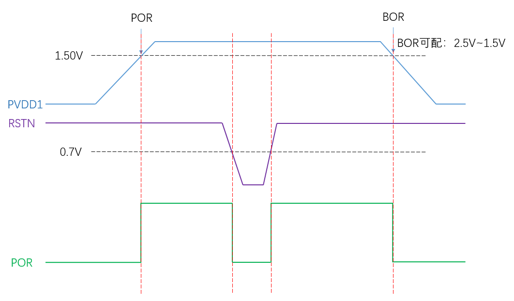{ width="100%" loading="lazy" }

<em>Figure 5.1-1: Power-Up/Power-Down Sequence</em>

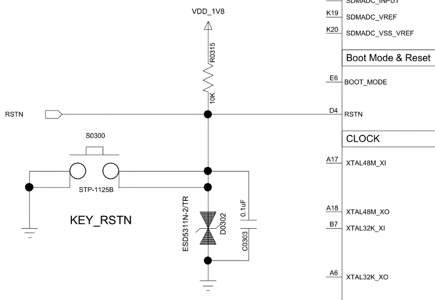{ width="100%" loading="lazy" }

<em>Figure 5.1-2: Reset Circuit</em>

##### 5.1.1.6. Typical Power Circuit

The SF32LB58x series can use SiFli's PMIC SF30147C to supply its power rails; see Table 5-1 for the assignment. The chip package also has 2 built-in BUCK outputs and 3 built-in LDO outputs.

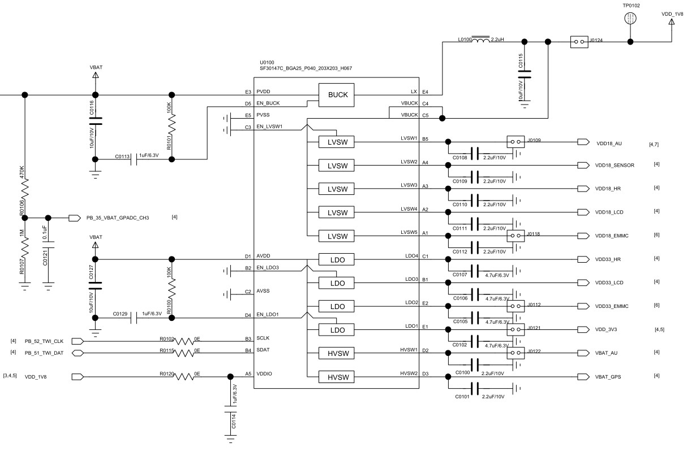{ width="100%" loading="lazy" }

<em>Figure 5.1-3: SF30147C Power Supply Diagram</em>

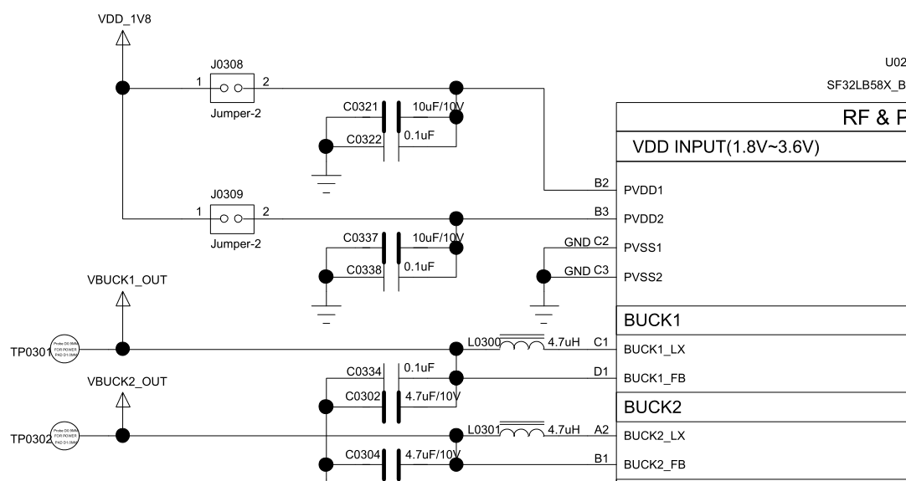{ width="100%" loading="lazy" }

<em>Figure 5.1-4: Built-In DC-DC (BUCK) Circuit</em>

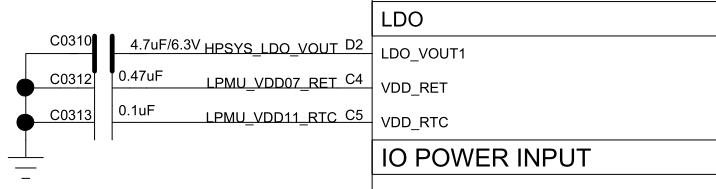{ width="100%" loading="lazy" }

<em>Figure 5.1-5: Built-In LDO Circuit</em>

##### 5.1.1.7. Power Design Checklist

- [ ] Confirm the selected model's PVDD1/PVDD2 supply range (1.71 V–3.6 V) matches the actual power scheme
- [ ] BUCK inductor meets 4.7 uH, DCR ≤ 0.4 Ω, Isat ≥ 500 mA
- [ ] PVDD1/PVDD2, BUCK1/2_LX/FB, LDO_VOUT1, VDD_RET, and VDD_RTC decoupling capacitors use the recommended values listed in this section
- [ ] If using SF30147C, the voltage/current allocation of the 7 load switches matches peripheral requirements
- [ ] The RSTN reset circuit's RC delay meets the device's reset timing requirements

#### 5.1.2. Operating Modes and Wake Sources

The low-power strategy should be reviewed together with PBR functions, wake-capable interrupts, storage power switches, sensor supplies, and external PMIC load switches.

The SF32LB58x series provides 6 PBR interfaces, with these key characteristics:

1. PBR0 transitions from 0 to 1 during power-up, useful for driving certain external LSWs; PBR1-PBR5 default to output 0;
2. PBR0-PBR5 can all act as outputs in both Standby and Hibernate modes;
3. PBR0-PBR5 can output the LPTIM signal;
4. PBR0-PBR5 can output a 32 kHz clock signal;
5. PBR0-PBR3 can be configured as inputs for wake-up signal input — the MCU does not receive an interrupt while it is awake.

All GPIOs on the SF32LB58x series support wake-up in light/deep sleep mode. In Standby and Hibernate modes, 16 wake-capable interrupt sources are supported — 6 on PA and 10 on PB.

<em>Table 5.1-5: Interrupt Source Connections</em>

| Interrupt Source | I/O | Description |
|:---|:---|:---|
| WKUP_PIN0 | PB54 | Interrupt signal 0 |
| WKUP_PIN1 | PB55 | Interrupt signal 1 |
| WKUP_PIN2 | PB56 | Interrupt signal 2 |
| WKUP_PIN3 | PB57 | Interrupt signal 3 |
| WKUP_PIN4 | PB58 | Interrupt signal 4 |
| WKUP_PIN5 | PB59 | Interrupt signal 5 |
| WKUP_PIN6 | PA64 | Interrupt signal 6 |
| WKUP_PIN7 | PA65 | Interrupt signal 7 |
| WKUP_PIN8 | PA66 | Interrupt signal 8 |
| WKUP_PIN9 | PA67 | Interrupt signal 9 |
| WKUP_PIN10 | PA68 | Interrupt signal 10 |
| WKUP_PIN11 | PA69 | Interrupt signal 11 |
| WKUP_PIN12 | PBR0 | Interrupt signal 12 |
| WKUP_PIN13 | PBR1 | Interrupt signal 13 |
| WKUP_PIN14 | PBR2 | Interrupt signal 14 |
| WKUP_PIN15 | PBR3 | Interrupt signal 15 |

### 5.2. Clock Generation
The SF32LB58x series requires 2 external clock sources: a 48 MHz main crystal and a 32.768 kHz RTC crystal.

<em>Table 5.2-1: Crystal Specification Requirements</em>

| Crystal | Specification | Description |
|:---|:---|:---|
| 48 MHz | 7 pF ≤ CL ≤ 12 pF (recommended 8.8 pF), ΔF/F0 ≤ ±10 ppm, ESR ≤ 30 Ω (recommended 22 Ω) | Crystal power consumption correlates with CL and ESR — smaller values give lower power. Reserve parallel matching capacitors next to the crystal; not required when CL < 12 pF |
| 32.768 kHz | CL ≤ 12.5 pF (recommended 7 pF), ΔF/F0 ≤ ±20 ppm, ESR ≤ 80 kΩ (recommended 38 kΩ) | Crystal power consumption correlates with CL and ESR — smaller values give lower power. Reserve parallel matching capacitors next to the crystal; not required when CL < 12.5 pF |

<em>Table 5.2-2: Qualified Crystal Models</em>

| Model | Vendor | Parameters |
|:---|:---|:---|
| E1SB48E001G00E | Hosonic | F0 = 48.000000 MHz, ΔF/F0 = -6 ~ 8 ppm, CL = 8.8 pF, ESR ≤ 22 Ω Max, TOPR = -30 ~ 85°C, Package 2016 (metric) |
| ETST00327000LE | Hosonic | F0 = 32.768 kHz, ΔF/F0 = -20 ~ 20 ppm, CL = 7 pF, ESR ≤ 70 kΩ Max, TOPR = -40 ~ 85°C, Package 3215 (metric) |
| SX20Y048000B31T-8.8 | TKD | F0 = 48.000000 MHz, ΔF/F0 = -10 ~ 10 ppm, CL = 8.8 pF, ESR ≤ 40 Ω Max, TOPR = -20 ~ 75°C, Package 2016 (metric) |
| SF32K32768D71T01 | TKD | F0 = 32.768 kHz, ΔF/F0 = -20 ~ 20 ppm, CL = 7 pF, ESR ≤ 70 kΩ Max, TOPR = -40 ~ 85°C, Package 3215 (metric) |

!!! note
    SX20Y048000B31T-8.8 has a slightly larger ESR, which also slightly increases static power consumption. When routing the PCB, remove the layer-2 GND copper directly beneath the crystal to reduce parasitic load capacitance on the clock signal.

See the [SiFli Approved Vendor List][SiFli Approved Vendor List (AVL)] for detailed qualified-material information.

### 5.3. RF

The SF32LB58x's RF front end uses on-chip integrated wideband matching-filter technology, so only a 50 Ω controlled-impedance RF PCB trace is required. A π-matching network for spurious filtering and antenna matching should be reserved in the design.

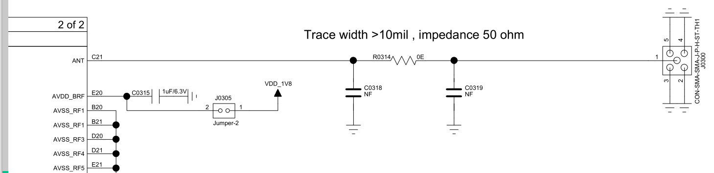{ width="100%" loading="lazy" }

<em>Figure 5.3-1: RF Circuit Diagram</em>

!!! note "Note"
    The component values in the matching network must be determined by testing against the actual antenna and PCB layout.

### 5.4. User Interfaces

#### 5.4.1. Display
##### 5.4.1.1. MIPI DSI Display Interface

The SF32LB58x series supports a 2-lane MIPI DSI display interface.

<em>Table 5.4-1: MIPI-DSI Signal Connections</em>

| MIPI DSI Signal | I/O | Description |
|:---|:---|:---|
| CLKP | DSI_CLKP | MIPI clock signal + |
| CLKN | DSI_CLKN | MIPI clock signal - |
| D0P | DSI_D0P | MIPI data lane 0 + |
| D0N | DSI_D0N | MIPI data lane 0 - |
| D1P | DSI_D1P | MIPI data lane 1 + |
| D1N | DSI_D1N | MIPI data lane 1 - |
| - | AVDD18_DSI | MIPI power input |
| - | DSI_REXT | External 10 kΩ resistor to ground |
| - | AVSS_DSI | Ground |
| TE | PB2 | Tearing effect to MCU frame signal |
| RESET | PB5 | Display reset signal |

##### 5.4.1.2. SPI/QSPI Display Interface

The SF32LB58x series supports 3/4-wire SPI and Quad-SPI interfaces for connecting an LCD panel — the big core uses LCDC1 on PA, the little core uses LCDC2 on PB.

<em>Table 5.4-2: SPI/QSPI Signal Connections</em>

| SPI Signal | I/O (LCDC1) | I/O (LCDC2) | Description |
|:---|:---|:---|:---|
| CSX | PA44 | PB08 | Chip enable |
| WRX_SCL | PA46 | PB10 | Clock signal |
| DCX | PA48 | PB03 | Data/command signal in 4-wire SPI mode; data 1 in Quad-SPI mode |
| SDI_RDX | PA50 | PB09 | Data input in 3/4-wire SPI mode; data 0 in Quad-SPI mode |
| SDO | PA50 | PB09 | Data output in 3/4-wire SPI mode; tie together with SDI_RDX |
| D[0] | PA47 | PB04 | Data 2 in Quad-SPI mode |
| D[1] | PA45 | PB06 | Data 3 in Quad-SPI mode |
| REST | PA74 | PB05 | Display reset signal |
| TE | PA43 | PB02 | Tearing effect to MCU frame signal |

##### 5.4.1.3. MCU8080 Display Interface

The SF32LB58x series supports an MCU8080 interface for connecting an LCD panel.

<em>Table 5.4-3: MCU8080 Signal Connections</em>

| MCU8080 Signal | I/O | Description |
|:---|:---|:---|
| CSX | PA44 | Chip select |
| WRX | PA46 | Write strobe signal for write data |
| DCX | PA48 | Display data / command selection |
| RDX | PA50 | Read strobe signal for write data |
| D[0] | PA47 | Data 0 |
| D[1] | PA45 | Data 1 |
| D[2] | PA26 | Data 2 |
| D[3] | PA27 | Data 3 |
| D[4] | PA42 | Data 4 |
| D[5] | PA51 | Data 5 |
| D[6] | PA52 | Data 6 |
| D[7] | PA58 | Data 7 |
| REST | PA24 | Reset |
| TE | PA43 | Tearing effect to MCU frame signal |

##### 5.4.1.4. DPI Display Interface

The SF32LB58x series supports a DPI interface for connecting an LCD panel.

<em>Table 5.4-4: DPI Signal Connections</em>

| DPI Signal | I/O | Description |
|:---|:---|:---|
| CLK | PA12 | Clock signal |
| DE | PA13 | Data-enable signal |
| HSYNC | PA14 | Horizontal sync signal |
| VSYNC | PA15 | Vertical sync signal |
| SD | PA18 | Display shutdown control |
| CM | PA19 | Switches between Normal Color and Reduced Color mode |
| R0-R7 | PA22/PA23/PA24/PA25/PA26/PA27/PA43/PA44 | Pixel data (red R0-R7) |
| G0-G7 | PA45/PA46/PA47/PA48/PA50/PA53/PA54/PA55 | Pixel data (green G0-G7) |
| B0-B7 | PA56/PA57/PA58/PA61/PA62/PA63/PA65/PA67 | Pixel data (blue B0-B7) |

##### 5.4.1.5. JDI Display Interface

The SF32LB58x series supports both parallel and serial JDI interfaces for connecting an LCD panel, multiplexed onto either LCDC1 (PA) or LCDC2 (PB) signals — LCDC2 (PB) is recommended.

<em>Table 5.4-5: Parallel JDI Signal Connections</em>

| JDI Signal | I/O (LCDC1) | I/O (LCDC2) | Description |
|:---|:---|:---|:---|
| JDI_VCK | PA19 | PB15 | Shift clock for the vertical driver |
| JDI_VST | PA22 | PB19 | Start signal for the vertical driver |
| JDI_XRST | PA25 | PB16 | Reset signal for the horizontal and vertical driver |
| JDI_HCK | PA43 | PB05 | Shift clock for the horizontal driver |
| JDI_HST | PA44 | PB10 | Start signal for the horizontal driver |
| JDI_ENB | PA45 | PB12 | Write enable signal for the pixel memory |
| JDI_R1 | PA46 | PB09 | Red image data (odd pixels) |
| JDI_R2 | PA47 | PB06 | Red image data (even pixels) |
| JDI_G1 | PA48 | PB08 | Green image data (odd pixels) |
| JDI_G2 | PA50 | PB04 | Green image data (even pixels) |
| JDI_B1 | PA65 | PB02 | Blue image data (odd pixels) |
| JDI_B2 | PA67 | PB03 | Blue image data (even pixels) |
| JDI_XFRP | PBR1 | PBR1 | Liquid crystal driving signal ("on" pixel) |
| JDI_VCOM/FRP | PBR2 | PBR2 | Common electrode driving signal / liquid crystal driving signal ("off" pixel) |

<em>Table 5.4-6: Serial JDI Signal Connections</em>

| JDI Signal | I/O (LCDC1) | I/O (LCDC2) | Description |
|:---|:---|:---|:---|
| JDI_SCS | PA82 | PB03 | Chip select signal |
| JDI_SCLK | PA84 | PB02 | Serial clock signal |
| JDI_SO | PA86 | PB06 | Serial data output signal |
| JDI_DISP | PA90 | PB04 | Display ON/OFF switching signal |
| JDI_EXTCOMIN | PA91 | PB05 | COM inversion polarity input |

#### 5.4.2. Touch and Backlight

The SF32LB58x series supports an I2C-format touch controller interface with a touch-status interrupt input, plus 1 PWM signal to control backlight-driver enable and brightness.

<em>Table 5.4-7: Touch and Backlight Connections</em>

| Touch/Backlight Signal | I/O | Description |
|:---|:---|:---|
| Interrupt | PA69 | Touch status interrupt (wake-capable) |
| I2C1_SCL | PA17 | Touch panel I2C clock |
| I2C1_SDA | PA16 | Touch panel I2C data |
| BL_PWM | PB44 | Backlight PWM control signal |
| Reset | PA15 | Touch reset signal |
| Power Enable | PA12 | Touch panel power enable signal |

#### 5.4.3. Audio

The SF32LB58x series provides a variety of audio-related interfaces, with the following characteristics:

1. Supports 3 groups of I2S; I2S1 is input-only, while I2S2 and I2S3 support both input and output. All 3 I2S groups only support Master mode, not Slave mode;
2. I2S1 is recommended for an I2S MIC input;
3. I2S2 is recommended for an audio DAC;
4. I2S3 is recommended for an audio codec;
5. Supports 2 PDM MIC inputs;
6. Supports 2 analog MIC inputs, each requiring a DC-blocking capacitor of at least 2.2 uF; analog MIC power is supplied from the SF32LB58x's MIC_BIAS;
7. Supports an external analog audio PA — both DAC output traces should be routed as differential pairs with 3D shielding, and additionally satisfy: trace parasitic capacitance < 10 pF, trace length < 2 cm;
8. Supports stereo analog headphone connection.

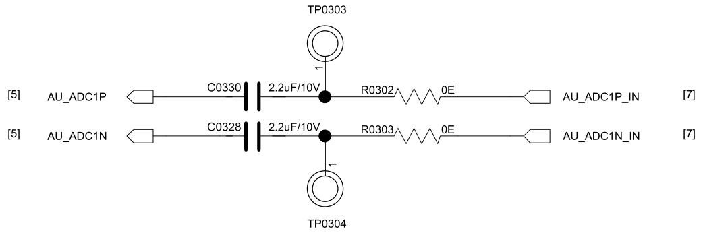{ width="100%" loading="lazy" }

<em>Figure 5.4-1: Differential Analog Audio Input Circuit</em>

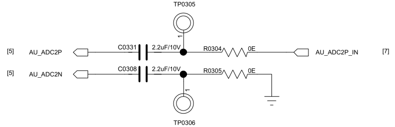{ width="100%" loading="lazy" }

<em>Figure 5.4-2: Single-Ended Analog Audio Input Circuit</em>

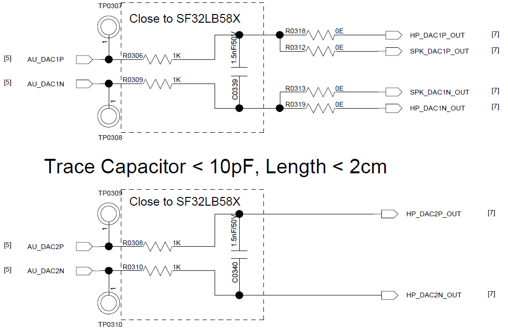{ width="100%" loading="lazy" }

<em>Figure 5.4-3: Analog Audio Output Circuit</em>

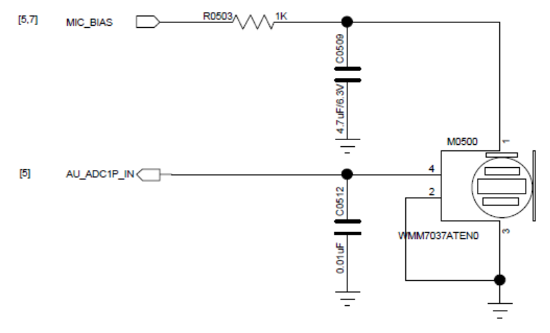{ width="100%" loading="lazy" }

<em>Figure 5.4-4: Analog MIC Circuit</em>

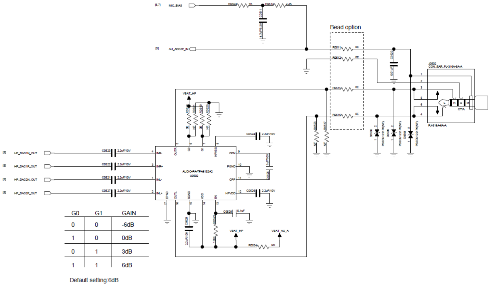{ width="100%" loading="lazy" }

<em>Figure 5.4-5: Stereo Headphone Circuit</em>

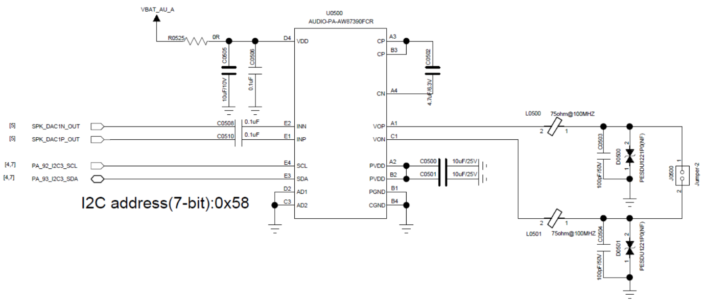{ width="100%" loading="lazy" }

<em>Figure 5.4-6: Analog Audio PA Circuit</em>

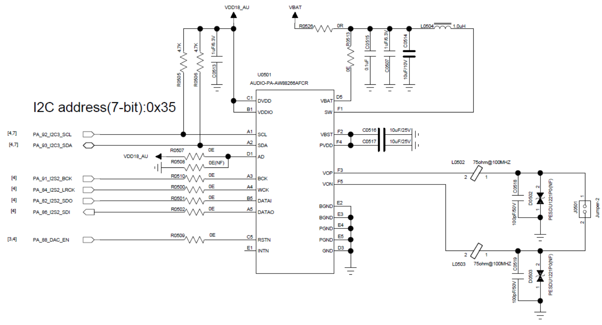{ width="100%" loading="lazy" }

<em>Figure 5.4-7: I2S Audio PA Circuit</em>

<em>Table 5.4-8: Audio Signal Connections</em>

| Audio Signal | I/O | Description |
|:---|:---|:---|
| I2S1_LRCK | PA14 | I2S1 frame clock |
| I2S1_SDI | PA18 | I2S1 data input |
| I2S1_BCK | PA23 | I2S1 bit clock |
| I2S2_LRCK | PA84 | I2S2 frame clock |
| I2S2_SDI | PA86 | I2S2 data input |
| I2S2_SDO | PA82 | I2S2 data output |
| I2S2_BCK | PA91 | I2S2 bit clock |
| I2S3_LRCK | PB31 | I2S3 frame clock |
| I2S3_SDI | PB27 | I2S3 data input |
| I2S3_SDO | PB24 | I2S3 data output |
| I2S3_BCK | PB30 | I2S3 bit clock |
| I2S3_MCLK | PB34 | I2S3 master clock |
| PDM1_CLK | PA23 | PDM1 clock |
| PDM1_DATA | PA18 | PDM1 data |
| PDM2_CLK | PA25 | PDM2 clock |
| PDM2_DATA | PA22 | PDM2 data |
| AU_ADC1P/AU_ADC1N | ADC1P/ADC1N | Analog input 1P/1N |
| AU_ADC2P/AU_ADC2N | ADC2P/ADC2N | Analog input 2P/2N |
| AU_DAC1P/AU_DAC1N | DAC1P/DAC1N | Analog output 1P/1N |
| AU_DAC2P/AU_DAC2N | DAC2P/DAC2N | Analog output 2P/2N |

!!! note "Pin-multiplexing note"
    I2S1_SDI shares PA18 with PDM1_DATA, and I2S1_BCK shares PA23 with PDM1_CLK. I2S1_LRCK uses PA14, while PDM2_DATA uses PA22. Confirm the active audio function in the software interface configuration before finalizing the schematic.

The SF32LB58x's analog MIC input supports both single-ended and differential modes, with a series 2.2 uF capacitor in either case; AU_ADC1P/AU_ADC1N/AU_ADC2P/AU_ADC2N connect to the SF32LB58x side. On the analog output side, AU_DAC1P/AU_DAC1N/AU_DAC2P/AU_DAC2N are SF32LB58x outputs that can drive either a stereo headphone PA input or an external analog audio PA input. Both the analog audio PA and the I2S audio PA are configured over I2C3.

#### 5.4.4. Buttons

##### 5.4.4.1. Power and Long-Press-Reset Button

PB54 is the recommended power-key signal for the SF32LB58x series, combining a short-press power on/off function and a long-press reset function on a single button. The design is active-high; holding the button for more than 10 seconds triggers an automatic chip reset.

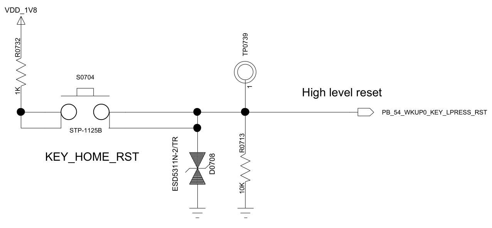{ width="100%" loading="lazy" }

<em>Figure 5.4-8: Power/Reset Button Circuit</em>

##### 5.4.4.2. Function Button or Rotary Encoder

The SF32LB58x series supports function-button input and rotary-encoder signal input, both of which need to be pulled up. It also supports a light-tracking sensor, recommended over the I2C4 interface.

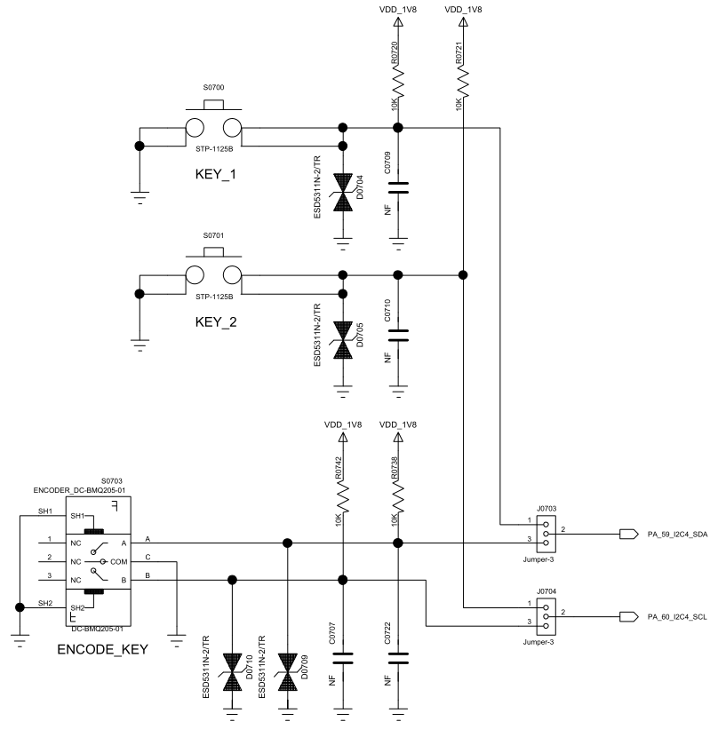{ width="100%" loading="lazy" }

<em>Figure 5.4-9: Function Button / Rotary Encoder Circuit</em>

<em>Table 5.4-9: Light-Tracking Sensor Signals</em>

| I2C Signal | I/O | Description |
|:---|:---|:---|
| INT | PA58 | Light-tracking sensor interrupt input |
| SDA | PA59 | Light-tracking sensor I2C data |
| SCL | PA60 | Light-tracking sensor I2C clock |

#### 5.4.5. Vibration Motor

The SF32LB58x series supports multiple PWM outputs, which can drive a vibration motor.

!!! important
    If the software enables the HCPU frequency-scaling macro `#define BSP_PM_FREQ_SCALING 1`, the HCPU clock drops when it enters the idle thread, and the PWM frequency on the corresponding PA pins changes accordingly. It is therefore recommended to output the PWM signal on a PB pin instead.

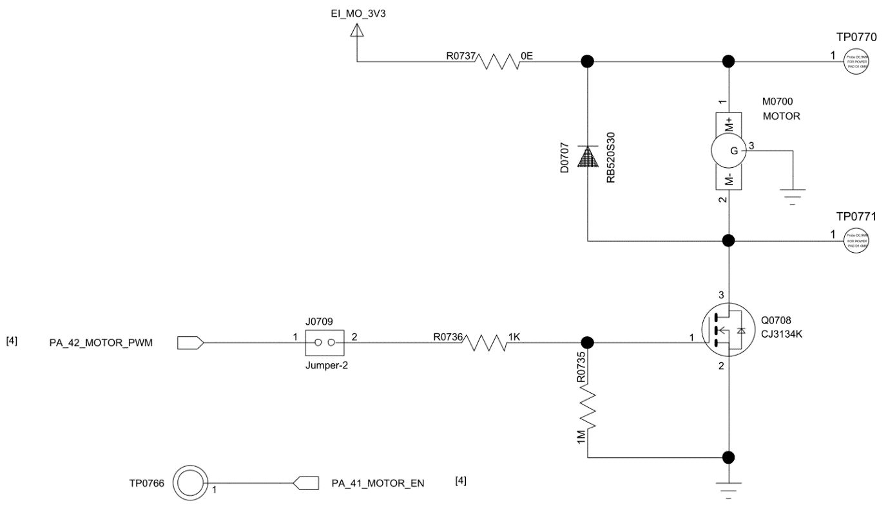{ width="100%" loading="lazy" }

<em>Figure 5.4-10: Vibration Motor Circuit</em>

### 5.5. Storage and Connectivity

#### 5.5.1. Boot Configuration
The SF32LB58x series provides a Mode pin to configure the boot mode.

<em>Table 5.5-1: Mode Configuration</em>

| Mode Setting | Description |
|:---|:---|
| High | Enters download mode after power-up |
| Low | Jumps to the user application area after power-up |

!!! note "Notes"
    1. The Mode pin's voltage domain is the same as VDDIOA;
    2. Pull Mode to supply or GND through a 10 kΩ resistor to keep the level stable — it must not float or toggle;
    3. A test point for the Mode pin must be reserved on production boards for firmware download and crystal calibration; a jumper is not required;
    4. On test boards, it is recommended to reserve a jumper for the Mode pin so the board can be started in download mode after a firmware crash.

#### 5.5.2. Storage

The SF32LB58x series supports MPI3 or MPI4 interfaces for external NOR Flash and SPI NAND Flash, and an SD1 interface for external SD NAND and eMMC.

##### 5.5.2.1. QSPI NAND Flash Interface

The SF32LB58x EVB reference board uses MPI4 by default to connect an external SPI NAND Flash device.

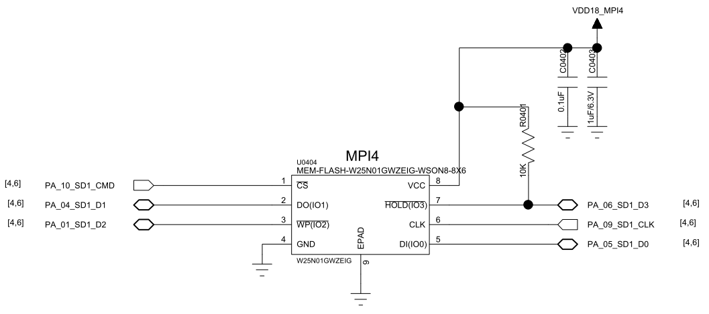{ width="100%" loading="lazy" }

<em>Figure 5.5-1: SPI NAND Flash Reference Circuit</em>

<em>Table 5.5-2: MPI4 Signal Connections</em>

| Flash Signal | I/O Signal (MPI4) | Description |
|:---|:---|:---|
| CS# | PA10 | Chip select, active low |
| SO | PA04 | Data Input (Data Input Output 1) |
| WP# | PA01 | Write Protect Output (Data Input Output 2) |
| SI | PA05 | Data Output (Data Input Output 0) |
| SCLK | PA09 | Serial Clock Output |
| Hold# | PA06 | Data Output (Data Input Output 3) |

!!! note "Notes"
    1. If the production line needs to flash firmware to the external Flash, the download-tool software must drive the external Flash's power-control pin PA43 high to enable its power.
    2. The SPI NAND Flash's Hold# pin must be pulled up to the SPI NAND Flash supply through a 10 kΩ resistor.

##### 5.5.2.2. SDIO eMMC/Micro SD Interface

The SF32LB58x series supports 2 SDIO interfaces. On the EVB, SD1 connects to eMMC or SD NAND by default, and SD2 connects to an SD card or Wi-Fi chip.

SD1 uses 12 GPIOs (PA00-PA11) powered from the VDDIOA2 domain, supporting 1.8 V or 3.3 V, selectable according to the peripheral's interface level. SPI NAND Flash and eMMC are recommended at 1.8 V; SD NAND Flash dies only support 3.3 V interface levels, so VDDIOA2 must be set to 3.3 V in that case.

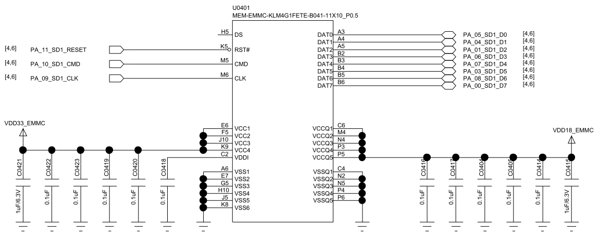{ width="100%" loading="lazy" }

<em>Figure 5.5-2: eMMC Reference Circuit</em>

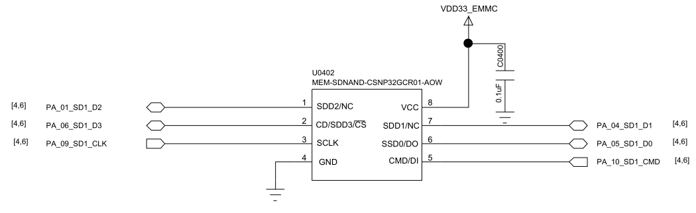{ width="100%" loading="lazy" }

<em>Figure 5.5-3: SD NAND Reference Circuit</em>

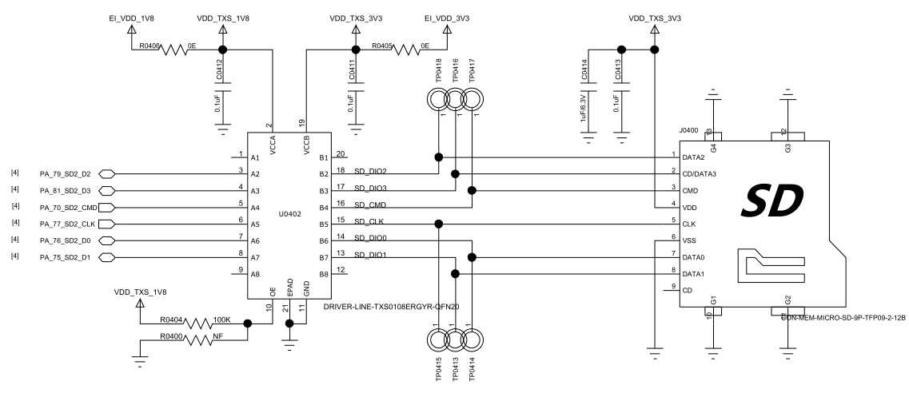{ width="100%" loading="lazy" }

<em>Figure 5.5-4: SD Card Reference Circuit</em>

<em>Table 5.5-3: SD1 Signal Connections</em>

| SD1 Signal | I/O Signal | Description |
|:---|:---|:---|
| SD1_D7 | PA00 | Data 7 |
| SD1_D2 | PA01 | Data 6 |
| SD1_D5 | PA03 | Data 5 |
| SD1_D1 | PA04 | Data 1 |
| SD1_D0 | PA05 | Data 0 |
| SD1_D3 | PA06 | Data 3 |
| SD1_D4 | PA07 | Data 4 |
| SD1_D6 | PA08 | Data 6 |
| SD1_CLK | PA09 | Clock signal |
| SD1_CMD | PA10 | Command signal |

!!! note "SD1 label check"
    Some SF32LB58x application-note tables label both SD1_D2 and SD1_D6 as "Data 6," while SD1_D7 is labeled "Data 7." Treat the SD1 pin definitions in the chip datasheet as authoritative before release.

<em>Table 5.5-4: SD2 Signal Connections</em>

| SD2 Signal | I/O Signal | Description |
|:---|:---|:---|
| SD2_CMD | PA70 | Command signal |
| SD2_D1 | PA75 | Data 1 |
| SD2_D0 | PA76 | Data 0 |
| SD2_CLK | PA77 | Clock signal |
| SD2_D2 | PA79 | Data 2 |
| SD2_D3 | PA81 | Data 3 |

#### 5.5.3. USB

The SF32LB58x series USB supports USB2.0 HS in both Host and Device modes. A TVS diode must be connected across USB DP and DM to ground, with junction capacitance below 5 pF; DP/DM PCB traces should be controlled to 90 Ω differential impedance.

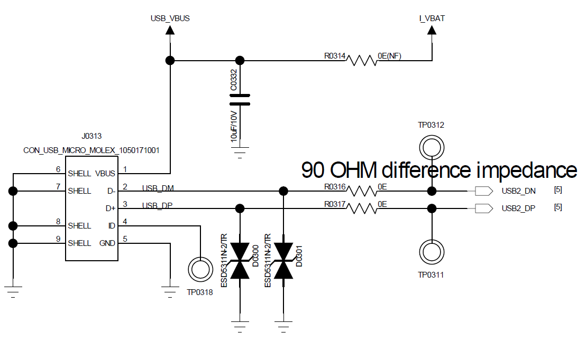{ width="100%" loading="lazy" }

<em>Figure 5.5-5: USB Interface Circuit</em>

### 5.6. Manufacturing

#### 5.6.1. Debug and Download Interface
The SF32LB58x series supports the Arm®-standard SWD debug interface for connection to EDA tools for single-step debugging. When connecting a SEGGER® J-Link® probe, its power source must be reconfigured for external supply, powered from the SF32LB58x board itself.

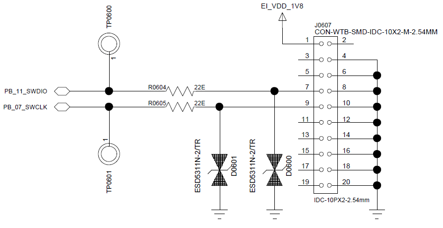{ width="100%" loading="lazy" }

<em>Figure 5.6-1: SWD Debug Interface Circuit</em>

The SF32LB58x offers 1 SWD interface plus 6 selectable UART interfaces for debug output.

<em>Table 5.6-1: Debug Port Connections</em>

| UART Signal | I/O | Description |
|:---|:---|:---|
| TXD1 | PA31 | UART1 RXD, HCPU default print port |
| RXD1 | PA32 | UART1 TXD, HCPU default print port |
| TXD2 | PA28 | UART2 RXD |
| RXD2 | PA29 | UART2 TXD |
| TXD3 | PA21 | UART3 RXD |
| RXD3 | PA20 | UART3 TXD |
| TXD4 | PB37 | UART4 RXD, LCPU default print port |
| RXD4 | PB36 | UART4 TXD, LCPU default print port |
| TXD5 | PB18 | UART5 RXD |
| RXD5 | PB17 | UART5 TXD |
| TXD6 | PB14 | UART6 RXD |
| RXD6 | PB13 | UART6 TXD |
| SWCLK | PB07 | J-Link clock signal |
| SWDIO | PB11 | J-Link data signal |

!!! note "Note"
    UARTx RXD signals must not float; enable an internal pull-up during software initialization.

#### 5.6.2. Production Flashing and Hardware Access

Production flashing, recovery, and calibration access should be planned before enclosure and fixture freeze. At minimum, preserve access to power, ground, SWD, required UART debug outputs, boot/configuration pins, and any board-level reset or PMIC control points needed to recover a non-booting image.

#### 5.6.3. Schematic and PCB Drawing Checklists

- [ ] The power scheme (integrated PMU direct supply, or paired with SF30147C) matches the system power budget
- [ ] The Mode boot-configuration pin has an external 10 kΩ resistor and a reserved test point on production boards
- [ ] The 48 MHz/32.768 kHz crystal specifications match the recommendations, with layer-2 GND removed beneath the crystal
- [ ] Storage interface selection (MPI4/SD1/SD2) matches the boot configuration, and the PA43 external Flash power-control pin is confirmed
- [ ] Display interface selection (MIPI-DSI/SPI-QSPI/MCU8080/DPI/JDI) matches the LCDC1/LCDC2 pin assignment
- [ ] Debug port (SWD + 6x UART) pins are assigned as needed, with UART RXD internal pull-up enabled
- [ ] Audio interface I2S/PDM and analog-audio multiplexing has been verified, with differential-trace budget satisfied
- [ ] USB DP/DM has a parallel TVS with junction capacitance < 5 pF

[SiFli Approved Vendor List (AVL)]: ../cad-components/sifli-approved-vendor-list.md
