# SF32LB52x Hardware Design Guide

## 1. Introduction

This hardware design guide provides design recommendations and source-backed reference material for products based on the SF32LB52x family of ultra-low-power AIoT microcontrollers. It is intended for hardware engineers, PCB designers, and product developers building battery-powered wearable devices and other compact embedded systems.

The guide covers the complete hardware development process, including power-supply design, clock circuits, RF layout, display and storage interfaces, audio circuits, PCB layout recommendations, and manufacturing considerations. Following these guidelines helps reduce development risk, improve system reliability, and shorten the product development cycle.

This document assumes a basic understanding of embedded hardware design and schematic capture. It complements the SF32LB52x datasheet, reference manual, and SDK documentation, which remain the authority for detailed electrical specifications, peripheral operation, and software development.

It consolidates two original SiFli hardware application notes — one for the battery-powered SF32LB520/3/5/7 path and one for the externally regulated 52B/D/E/G/J path — into a single engineering workflow. Where the original source wording is inconsistent, this guide favors exact orderable part numbers, explicit supply-domain behavior, and release-review clarity.

## 2. Development Resources
[SF32LB52x Product Brief]: https://downloads.sifli.com/user%20manual/PB5201-SF32LB52x-Product%20Brief.pdf
[SF32LB52x Datasheet]: https://downloads.sifli.com/user%20manual/DS5201-SF32LB52x-Datasheet%20V2p5p3.pdf
[SF32LB52x Reference Manual]: https://downloads.sifli.com/user%20manual/UM5201-SF32LB52x-User%20Manual%20V0p8p4.pdf
[SF32LB52x Hardware Design Guide (520/3/5/7)]: https://wiki.sifli.com/en/hardware/SF32LB520-3-5-7-HW-Application.html
[SF32LB52x Hardware Design Guide (52B/D/E/G/J)]: https://wiki.sifli.com/en/hardware/SF32LB52B-E-G-J-HW-Application.html
[SF32LB52-MOD-1]: ../modules/SF32LB52-MOD-1.md
[KiCad Files]: https://github.com/OpenSiFli/kicad-libraries
[Buy Samples]: https://sifli.taobao.com/
[Buy Dev Kits]: https://sifli.taobao.com/
[SiFli Approved Vendor List]: ../others/sifli-approved-vendor-list.md
[SiFli Approved Vendor List (AVL)]: https://downloads.sifli.com/hardware/files/documentation/SIFLI-MCU-AVL-%E8%AE%A4%E8%AF%81%E8%A1%A8-V0.3-20260121.xlsx

- :fontawesome-solid-file-pdf: __[SF32LB52x Product Brief]__
- :fontawesome-solid-file-pdf: __[SF32LB52x Datasheet]__
- :fontawesome-solid-file-pdf: __[SF32LB52x Reference Manual]__
- :fontawesome-solid-file-lines: __[SF32LB52x Hardware Design Guide (520/3/5/7)]__
- :fontawesome-solid-file-lines: __[SF32LB52x Hardware Design Guide (52B/D/E/G/J)]__
- :fontawesome-solid-file-excel: __[SiFli Approved Vendor List (AVL)]__
- :fontawesome-solid-cart-shopping: __[Buy Samples]__
- :fontawesome-solid-cart-shopping: __[Buy Dev Kits]__
- :fontawesome-brands-github: __[KiCad Files]__
- :fontawesome-solid-sim-card: __[SF32LB52-MOD-1]__

## 3. Device Overview

The SF32LB52x family combines dual-core STAR-MC1 processors, Bluetooth connectivity, graphics acceleration, integrated audio, display interfaces, storage controllers, and power management in a compact QFN68 package. The family is optimized for products where BOM cost, battery life, and PCB area all matter.

### 3.1. Features

The family integrates:

- Dual-core Arm China STAR-MC1 processors with FPU and MPU, Arm Cortex-M33 compatible
- Dual-mode Bluetooth 6.3 radio
- ePicasso 2.0 2D/2.5D graphics accelerator
- Display controller supporting SPI, QSPI, 8080, JDI, and 8-bit EPD interfaces
- USB 2.0 Full-Speed device
- SDIO/eMMC storage interface on supported variants
- Analog and digital audio interfaces
- Integrated PMU, DC/DC converter, and LDO regulators
- QFN68 package with up to 44/45 GPIOs

### 3.2. Variants

The SF32LB52x family is divided into two practical design groups by power architecture: battery-powered devices and externally regulated devices, as shown below.

=== "SF32LB520/3/5/7 (Battery-Powered)"

    This group integrates an on-chip **charging management module and PMU**. It can connect directly to a single-cell lithium battery, while still supporting external charging solutions.

    
<em>Table 3.2-1: Model Cross-Reference (Battery-Powered Variant)</em>

    

    | Model | Co-Packaged Memory | Supply | Design Note |
    |:---|:---|:---|:---|
    | SF32LB520U36 | 1 MB QSPI-NOR Flash | Li-ion battery, 3.2–4.7 V, rechargeable | Boots from co-packaged Flash by default; `VDD18_VOUT` requires an external 3.3 V supply |
    | SF32LB523UB6 | 4 MB OPI-PSRAM | Li-ion battery, 3.2–4.7 V, rechargeable | Must boot from external storage |
    | SF32LB525UC6 | 8 MB OPI-PSRAM | Li-ion battery, 3.2–4.7 V, rechargeable | Must boot from external storage |
    | SF32LB527UD6 | 16 MB OPI-PSRAM | Li-ion battery, 3.2–4.7 V, rechargeable | Must boot from external storage |

    

=== "52B/D/E/G/J (Regular-Powered)"

    This group integrates the on-chip **PMU** but does not include charging circuitry. It is powered from a regulated external supply.

    
<em>Table 3.2-2: Model Cross-Reference (Regular-Powered Variant)</em>

    

    | Model | Co-Packaged Memory | Supply | Design Note |
    |:---|:---|:---|:---|
    | SF32LB52BU36 | 1 MB QSPI-NOR Flash | 2.97–3.63 V, non-rechargeable | `VDD_SIP` requires an external 1.8 V or 3.3 V supply |
    | SF32LB52BU56 | 4 MB QSPI-NOR Flash | 2.97–3.63 V, non-rechargeable | `VDD_SIP` requires an external 3.3 V supply |
    | SF32LB52DUB6 | 4 MB OPI-PSRAM | 1.71–1.98 V, non-rechargeable | `VDD_SIP` requires an external 1.8 V supply |
    | SF32LB52EUB6 | 4 MB OPI-PSRAM | 2.97–3.63 V, non-rechargeable | `VDD_SIP` can be supplied by the internal LDO |
    | SF32LB52GUC6 | 8 MB OPI-PSRAM | 2.97–3.63 V, non-rechargeable | `VDD_SIP` can be supplied by the internal LDO |
    | SF32LB52JUD6 | 16 MB OPI-PSRAM | 2.97–3.63 V, non-rechargeable | `VDD_SIP` can be supplied by the internal LDO |

    

### 3.3. Packages

Both design groups use the same QFN68 package.

<em>Table 3.3-1: Package Information</em>

| Package Name | Dimensions | Pin Pitch |
|:---|:---|:---|
| QFN68L | 7 mm x 7 mm x 0.85 mm | 0.35 mm |

The two design groups differ slightly in peripheral resources. The battery-powered group has 44 GPIOs, while the regular-powered group has 45 GPIOs; the difference comes from pins reserved for charging on the battery-powered devices.

- 44/45 GPIOs
- 3x UART
- 4x I2C
- 2x GPTIM
- 2x SPI
- 1x I2S audio interface
- 1x SDIO storage interface
- 1x PDM audio interface
- 1x differential analog audio output
- 1x single-ended analog audio input
- Single/dual/quad-data-line SPI display interface, serial JDI display interface
- Supports displays both with and without GRAM
- Supports UART download and software debug

The pin layout diagrams are shown below, and their differences will be revisited in the schematic design section.

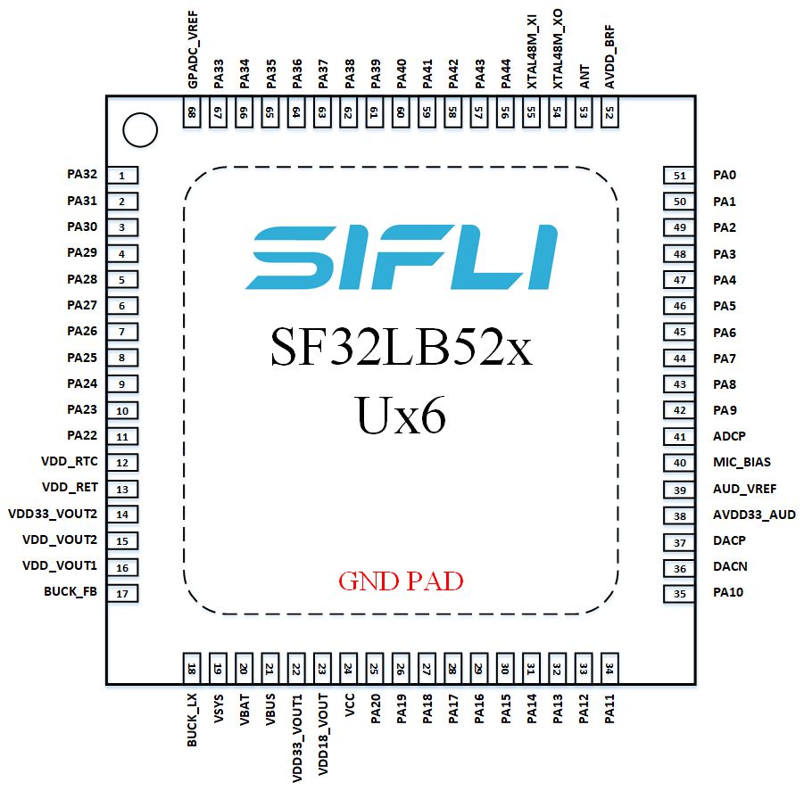{ width="100%" loading="lazy" }

<em>Figure 3.3-1: QFN68L Pin Layout for SF32LB520/3/5/7</em>

{ width="100%" loading="lazy" }

<em>Figure 3.3-2: QFN68L Pin Layout for SF32LB52B/E/G/J</em>

### 3.4. Applications

Typical applications are portable embedded systems where long battery life and compact form factors are essential. Examples include:

- Entry-level smartwatches and fitness bands
- Bluetooth modules and wireless adapters
- Bluetooth audio accessories
- Smart sensors and wearable devices
- Electronic shelf labels and smart badges
- E-book readers
- Portable label printers
- eBike and eScooter displays
- Connected human-machine interface (HMI) devices
- Portable industrial and medical equipment
- Other battery-powered AIoT devices

## 4. Design at a Glance

### 4.1. Hardware Architecture

The following table summarizes the recommended hardware architecture for a typical SF32LB52x application. Use it as a quick reference before reading the detailed design guidance in the later sections.

<em>Table 4.1-1: Design at a Glance Summary</em>

| Hardware Block | Typical Implementation |
|:---|:---|
| Package | QFN68L, 7 mm x 7 mm x 0.85 mm, 0.35 mm pitch |
| PCB | 4-layer PTH PCB recommended |
| Power Supply | Single-cell Li-ion/Li-Po battery or regulated external supply, depending on device variant |
| Battery Charging | Integrated charger on supported variants, or external charger IC with or without PPM |
| Buck Inductor | 4.7 uH +/-20%, DCR <= 0.4 Ω, Isat >= 450 mA |
| Crystal | 48 MHz main crystal and 32.768 kHz RTC crystal |
| RF | 50 Ω controlled-impedance trace with reserved π matching network |
| Display | 3-line SPI, 4-line SPI, Dual-SPI, Quad-SPI (up to 512 x 512), JDI, and 8-bit EPD |
| Touch | I2C capacitive touch controller with interrupt wake support |
| Storage | SiP Flash/PSRAM, external SPI NOR, SPI NAND, SD NAND, or eMMC depending on variant |
| Audio | Analog microphone input, differential DAC output, external PA |
| Sensors | I2C/SPI sensors such as accelerometer, gyroscope, geomagnetic sensor, heart-rate sensor, SpO2 sensor, and ECG sensor |
| Haptics | PWM-controlled vibration motor |
| Debug | DBG_UART on PA18/PA19, multiplexed with SWD |

### 4.2. Hardware Design Flow

Follow the guide in the order that hardware decisions typically get locked in. The flow below keeps early architecture choices visible before the design moves into schematic and PCB details.

<em>Table 4.2-1: Hardware Design Flow</em>

| Step | Design Decision | Primary Sections |
|:---|:---|:---|
| 1 | Select the exact orderable device and power variant | Device Overview, Variant Selection |
| 2 | Confirm package, GPIO count, and fixed-function pins | Packages, Schematic Design Guidelines |
| 3 | Lock the minimum system: power tree, boot storage, bootstrap pins, debug access, clocks, and wake strategy | Minimum System Design, Storage, Debug, Clock Generation |
| 4 | Select RF topology, display, audio, sensors, and remaining product interfaces | Clock Generation, RF, User Interfaces, Storage and Connectivity |
| 5 | Review PCB stack-up, fanout, impedance, and sensitive routing | PCB Layout Guidelines |
| 6 | Compare against source reference schematics, PCB layouts, mechanical, and power figures | Appendices A-E |
| 7 | Reserve bring-up, debug, calibration, and production test access | Debug, Production, Design Review Checklist |

**Design decision tree**

- Need USB-rechargeable single-cell battery operation? Start with `SF32LB520/3/5/7`.
- Need an externally regulated supply or eMMC boot? Start with `52B/D/E/G/J`.
- Need 8-bit parallel EPD? Use the regular-powered design path unless SiFli confirms the battery-powered path for the exact design.
- Need the lowest standby current? Decide storage power switching, sensor load switches, and display power isolation before PCB placement.

### 4.3. How to Use This Guide

Start with the exact orderable part number before schematic work begins, because the SF32LB52x family splits into two practical design groups: the battery-powered `SF32LB520/3/5/7` group and the externally regulated `52B/D/E/G/J` group. Use Section 3.2 to select the group, Sections 5.1 and 5.2 to complete the minimum-system and power-system reviews, Sections 5.6.1 and 5.7.1 to verify boot storage and debug access, Sections 5 and 6 to review schematic and PCB guidance, Appendices A-E to compare the source reference figures, and Section 7 as the release checklist.

When a design reuses an older SF32LB52x schematic, review the supply pins, SIP-memory supply, boot-storage rail, DBG_UART/SWD pins, crystal loading, RF matching footprint, and production test points first. Those items are the most common sources of silent bring-up risk.

### 4.4. Review Evidence Pack

Before hardware release, collect the schematic PDF, PCB stack-up, impedance report, component AVL cross-check, DRC report, and screenshots of the RF, crystal, USB, SDIO/eMMC, audio, power, and boot-storage layouts. Keep the evidence with the board revision so later firmware, RF, and production issues can be traced back to the reviewed hardware baseline.

## 5. Schematic Design Guidelines

This chapter follows the schematic workflow. Complete the minimum-system review first, then expand into clock generation, RF, user interfaces, storage, manufacturing access, and PCB-dependent decisions. For each major block, confirm the design goal and variant scope before checking circuit requirements, pin assignment, common mistakes, and release checklist items.

<em>Table 5-1: Schematic Chapter Navigation</em>

| Block | Main Decision | Release Evidence |
|:---|:---|:---|
| Minimum System Design | Exact variant, package, boot storage, bootstrap pins, debug/download access, and minimum bring-up path | Minimum-system review, bootstrap table, debug test points, boot and recovery plan |
| Power System | Variant power tree, charger path, BUCK, LDOs, boot-storage rail, operating modes, and wake sources | Power tree review, AVL parts, charger/OVP settings, low-power and wake-source plan |
| Clock Generation | 48 MHz and 32.768 kHz crystal selection, loading, and calibration assumptions | Crystal CL/ESR check, placement and routing screenshots, calibration plan |
| RF | RF matching, antenna path, and tuning access | RF impedance plan, matching-network placement screenshot, antenna tuning plan |
| User Interfaces | Display, audio, buttons, and vibration motor | Interface schematic review, timing/control pins, power sequencing, analog review |
| Storage and Connectivity | Boot medium, bootstrap pins, storage power switch, sensors, UART/I2C, and GPTIM | Bootstrap table, PA21 power control, bus assignment, storage rail review |
| Manufacturing | DBG_UART/SWD, test points, production flashing, calibration access, and release checklists | Test-point drawing, production fixture plan, completed release evidence |

### 5.1. Minimum System Design

Minimum system design is the first schematic release gate for an SF32LB52x board. It covers the decisions that must be correct before product peripherals are added: exact device variant, package, power tree, boot medium, bootstrap resistors, storage power control, debug/download access, clock sources, and wake behavior. A board can often tolerate late changes to display or sensor wiring; it usually cannot tolerate a wrong storage strap, missing debug access, unstable rail, or incompatible power-state assumption.

Use the following sequence for the first schematic pass:

1. Select the exact device and package from Section 3.2 and Section 3.3.
2. Choose the correct power path: `SF32LB520/3/5/7` for rechargeable battery-powered products, or `52B/D/E/G/J` for externally regulated products.
3. Lock the power-system decisions in Section 5.2, including `VBUS`/`VBAT`/`VCC` or `PVDD`/`VDDIOA`/`VDD_SIP`, BUCK, internal LDO decoupling, RF/audio rails, and all low-power load switches.
4. Select the boot medium and populate `PA13`/`PA17` bootstrap pull options to match the boot table in Section 5.6.1.
5. Route all boot-storage power switches to `PA21`, including large NOR Flash designs that must exit 4-byte mode after restart or Hibernate.
6. Reserve `PA18`/`PA19`, ground, and a valid power reference for DBG_UART/SWD access before the enclosure and production fixture are frozen.
7. Select the 48 MHz and 32.768 kHz crystals from Section 5.3.1 and keep their placement constraints visible during schematic review.
8. Assign wake pins, power-key behavior, charger events, and storage/sensor shutdown states before firmware low-power policy is finalized.

At the end of this gate, the schematic should be able to power up, boot from the selected medium, expose a recovery path, run clock calibration, and enter the intended low-power state without relying on optional product peripherals.

### 5.2. Power System

Power-system design defines the rails, load switches, charger path, OVP, internal LDO usage, wake behavior, and low-power states that make the minimum system reliable. Complete this section before PCB placement, because later display, storage, RF, audio, and sensor decisions depend on these rail assumptions.

#### 5.2.1. Power Supply

**Quick Summary**

- Battery-powered devices use the `SF32LB520/3/5/7` path with `VBUS`, `VBAT`, `VCC`, charging, and OVP decisions.
- Regular-powered devices use the `52B/D/E/G/J` path with externally regulated `PVDD`, `VDDIOA`, `VDD_SIP`, and no internal charging path.
- BUCK inductor, internal LDO decoupling, RF/audio rails, and standby load switches must be fixed before PCB placement.

**Design Goal**

Create a stable, low-leakage power tree that supports the selected variant, avoids overloading internal LDO outputs, keeps RF and audio rails quiet, and allows unused loads and boot storage to be switched off in low-power modes.

##### 5.2.1.1. Processor Power Supply Requirements

=== "SF32LB520/3/5/7 (Battery-Powered)"

    
<em>Table 5.2-1: Power Supply Requirements (Battery-Powered Variant)</em>

    

    | Pin | Min (V) | Typ (V) | Max (V) | Max Current (mA) | Description |
    |:---|:---|:---|:---|:---|:---|
    | VBUS | 4.6 | 5.0 | 5.5 | 500 | VBUS power input |
    | VBAT | 3.2 | - | 4.7 | 500 | VBAT power output |
    | VCC | 3.2 | - | 4.7 | 500 | System power input (1) |
    | VSYS | - | 3.3 | - | 500 | VSYS power output (2) |
    | BUCK_LX | - | 1.25 | - | 50 | BUCK output pin, connects to inductor |
    | BUCK_FB | - | 1.25 | - | 50 | BUCK feedback / internal supply input, connects to the other end of the inductor plus an external capacitor |
    | VDD_VOUT1 | - | 1.1 | - | 50 | Internal LDO, external capacitor, does not power peripherals |
    | VDD_VOUT2 | - | 0.9 | - | 20 | Internal LDO, external capacitor, does not power peripherals |
    | VDD_RET | - | 0.9 | - | 1 | Internal LDO, external capacitor, does not power peripherals |
    | VDD_RTC | - | 1.1 | - | 1 | Internal LDO, external capacitor, does not power peripherals |
    | VDD18_VOUT | - | 1.8 | - | 30 | SIP supply (3), internal, does not power peripherals; can be externally supplied when the LDO is disabled |
    | VDD33_VOUT1 | - | 3.3 | - | 150 | 3.3 V LDO output 1 (4), no output by default; requires software configuration |
    | VDD33_VOUT2 | - | 3.3 | - | 150 | 3.3 V LDO output 2, no output by default; requires software configuration |
    | AVDD33_AUD | 2.97 | 3.3 | 3.63 | 50 | 3.3 V audio power input |
    | AVDD_BRF | 2.97 | 3.3 | 3.63 | 100 | RF power input |
    | MIC_BIAS | 1.4 | - | 2.8 | - | Microphone power output |

    

    (1) VCC input, powered by a lithium battery: the default software low-battery threshold is 3.48 V. When powered from a constant-voltage supply, the supported range is 3.6–4.7 V, with 3.8 V recommended.
    (2) VSYS supplies power to AVDD_BRF.
    (3) VDD18_VOUT: SF32LB520U36 requires an external 3.3 V supply; SF32LB523/5/7Ux6 use the internal LDO and need no external supply. Configure the internal VDD18 LDO according to the chip model in software, and do not enable it when externally supplied.
    (4) VDD33_VOUT1: on SF32LB520U36 it only powers VDD18_VOUT, external Flash, and AVDD33_AUD; on SF32LB523/5/7Ux6 it only powers external Flash and AVDD33_AUD.

=== "52B/D/E/G/J (Regular-Powered)"

    
<em>Table 5.2-2: Power Supply Requirements (Regular-Powered Variant)</em>

    

    | Pin | Min (V) | Typ (V) | Max (V) | Max Current (mA) | Description |
    |:---|:---|:---|:---|:---|:---|
    | PVDD | 2.97 | 3.3 | 3.63 | 150 | PVDD system power input, 10 uF capacitor |
    | BUCK_LX | - | 1.25 | - | 50 | BUCK output pin, connects to a 4.7 uH inductor |
    | BUCK_FB | - | 1.25 | - | 50 | BUCK feedback / internal supply input, connects to the other end of the inductor plus a 4.7 uF capacitor |
    | VDD_VOUT1 | - | 1.1 | - | 50 | Internal LDO, 4.7 uF capacitor, does not power peripherals |
    | VDD_VOUT2 | - | 0.9 | - | 20 | Internal LDO, 4.7 uF capacitor, does not power peripherals |
    | VDD_RET | - | 0.9 | - | 1 | Internal LDO, 0.47 uF capacitor, does not power peripherals |
    | VDD_RTC | - | 1.1 | - | 1 | Internal LDO, 1 uF capacitor, does not power peripherals |
    | VDDIOA | 1.71 | 1.8/3.3 | 3.63 | - | GPIO power input, 1 uF capacitor |
    | AVDD33 | 2.97 | 3.3 | 3.63 | 100 | 3.3 V analog power input, 4.7 uF capacitor |
    | AVDD33_AUD | 2.97 | 3.3 | 3.63 | 50 | 3.3 V audio power input, 2.2 uF capacitor |
    | VDD_SIP | 1.71 | 1.8/3.3 | 3.63 | 30 | Internal LDO or external supply (1), 1 uF capacitor |
    | AVDD_BRF | 2.97 | 3.3 | 3.63 | 100 | Analog power input, 4.7 uF capacitor |
    | MIC_BIAS | 1.4 | - | 2.8 | - | Microphone power output, 1 uF capacitor |

    

    (1) VDD_SIP: SF32LB52BU36 requires an external 1.8 V or 3.3 V supply; SF32LB52BU56 requires an external 3.3 V supply; SF32LB52DUB6 requires an external 1.8 V supply; SF32LB52E/G/JUx6 are powered directly by the internal LDO and need no external supply.

    !!! important "Hibernate mode note"
        When the system enters Hibernate mode, VDD_SIP must be switched off, otherwise there is a leakage risk on the I/O of the co-packaged storage. Use the dedicated PA21 pin to control the VDD_SIP power switch.

##### 5.2.1.2. BUCK Inductor Selection

Both design groups use the same inductor specification.

!!! important "Key Power Inductor Parameters"
    L (inductance) = 4.7 uH ± 20%, DCR (DC resistance) ≤ 0.4 Ω, Isat (saturation current) ≥ 450 mA.

##### 5.2.1.3. Battery and Charging Control

=== "SF32LB520/3/5/7 (Battery-Powered)"

    There are two charging-circuit scenarios: an external charging management chip, or the on-chip integrated charging management module.

    **External Charging Management Chip**

    External charging chips come in two common types: without PPM (power path management) and with PPM. Without PPM, the battery directly supplies the VBAT and VCC pins. With PPM, the charger's VSYS supplies VCC, and the charger's VBAT connects to both the battery and the chip's VBAT pin. Both approaches measure battery voltage through the VBAT pin, which has an integrated GPADC channel with sampling accuracy within ±30 mV.

    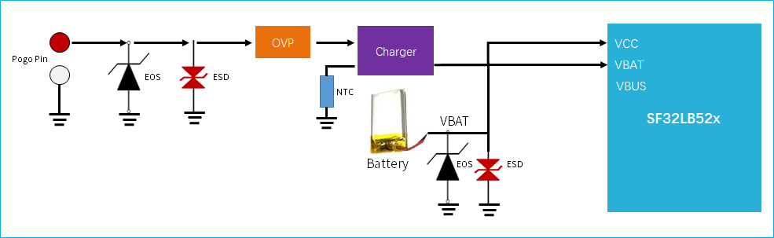{ width="100%" loading="lazy" }

    
<em>Figure 5.2-1: External Charging Circuit without PPM</em>

    { width="100%" loading="lazy" }

    
<em>Figure 5.2-2: External Charging Circuit with PPM</em>

    **On-Chip Integrated Charging Management Module**

    When using the integrated charging module, if the battery is low and the device is off, plugging in a charger requires the battery to charge up to the power-on threshold before the system can boot and display the charging screen.

    { width="100%" loading="lazy" }

    
<em>Figure 5.2-3: Integrated Charging Management Circuit</em>

    **OVP Chip Selection (When Using the Integrated Charging Module)**

    The VBUS input range is 4.5 V–5.5 V, so choose one of these OVP chip types:

    - Adjustable-OVLO OVP chip, e.g. AW32905FCR — set OVLO between 5.2 V and 5.5 V (VOVLO_TH tolerance ≤3%, resistor tolerance ≤1%)
    - Regulated-output OVP chip, e.g. SGM4064YDE8G or LP5305AQVF — regulator output must be between 4.5 V and 5.5 V

    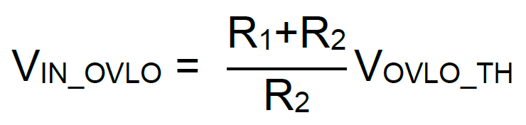{ width="100%" loading="lazy" }

    
<em>Figure 5.2-4: OVLO Set-Point Formula</em>

    { width="100%" loading="lazy" }

    
<em>Figure 5.2-5: Adjustable-OVLO OVP Application Circuit</em>

    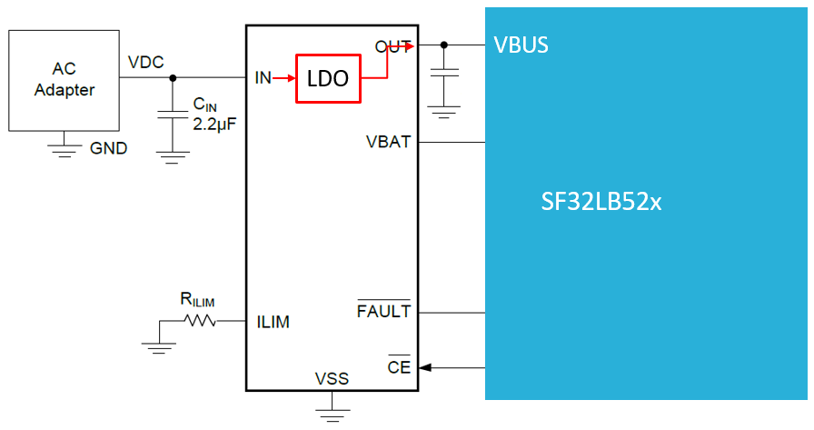{ width="100%" loading="lazy" }

    
<em>Figure 5.2-6: Regulated-Output OVP Application Circuit</em>

    !!! important "Integrated Charging Module Notes"
        - VBUS input range: 4.6 V–5.5 V
        - VCC input range: 3.2 V–4.7 V
        - Default trickle current: 56 mA, trickle-to-constant-current transition voltage: 3.0 V
        - Default constant charge current: 65 mA, adjustable 5–560 mA
        - Default full-charge voltage: 4.2 V, adjustable up to 4.45 V
        - Recharge voltage: full-charge voltage - 0.15 V
        - The charger's VBUS must supply at least 350 mA; VBUS pin voltage must not drop below 4.6 V at maximum charge current
        - For wireless charging, ensure the wireless charger's supply capability exceeds the constant charge current

    !!! important "Integrated LDO Notes"
        - Total capacitance on the VDD33_VOUT1 and VDD33_VOUT2 output paths must not exceed 9.6 uF
        - AVDD33_AUD must be powered from VDD33_VOUT1, not from VSYS
        - The LCD must not be powered from the internal LDO — use an external LDO

=== "52B/D/E/G/J (Regular-Powered)"

    !!! info "Not Applicable"
        The regular-powered variant is powered directly from a regulated external supply and **has no charging management circuitry**. This section does not apply. If your product needs battery power and charging, use the SF32LB520/3/5/7 series instead.

##### 5.2.1.4. Reducing Standby Power

=== "SF32LB520/3/5/7 (Battery-Powered)"

    Recommended power structure: **VDD33_VOUT2** supplies the vibration motor, **VDD33_VOUT1** supplies external Flash and sensors, and the LCD uses an external LDO.

    { width="100%" loading="lazy" }

    
<em>Figure 5.2-7: SF32LB52x System Power Structure Diagram</em>

    Control the default hardware state of power-switch GPIO pins carefully, and add megohm-range pull-up/pull-down resistors so load switches default to off. For LDO and load-switch selection, choose devices with low quiescent current (Iq) and low shutdown current (Istb), and pay particular attention to Iq on always-on power devices.

=== "52B/D/E/G/J (Regular-Powered)"

    Use load switches for dynamic power management of each functional block; for always-on modules or paths, select devices with low quiescent current.

    Control the default hardware state of power-switch GPIO pins carefully, and add megohm-range pull-up/pull-down resistors so load switches default to off. For LDO and load-switch selection, choose devices with low quiescent current (Iq) and low shutdown current (Istb), and pay particular attention to Iq on always-on power devices.

##### 5.2.1.5. Power Design Checklist

- [ ] Confirmed which power variant (battery-powered / regular-powered) matches the exact chip model
- [ ] BUCK inductor meets 4.7 uH ±20%, DCR ≤0.4 Ω, Isat ≥450 mA
- [ ] All internal LDO decoupling capacitors are placed per requirements
- [ ] LCD power is isolated and not fed directly from the internal LDO
- [ ] Audio and RF power rails are properly filtered
- [ ] Battery-powered variant: charging path and OVP device voltage ranges verified; regular-powered variant: VDD_SIP/VDDIOA supply configured correctly for the chip model

**Common Mistakes - Power**

- Powering the LCD directly from an internal LDO instead of an external LDO.
- Mixing battery-powered and regular-powered supply assumptions in the same schematic.
- Leaving `VDD_SIP` powered during Hibernate on variants where storage leakage is a risk.
- Choosing a charger or OVP device without verifying the worst-case VBUS current and voltage range.

**Bring-Up Checks - Power**

- Measure `VCC`/`PVDD`, BUCK output, RF/audio rails, and storage supply before firmware enables peripherals.
- Confirm charger attach, trickle charge, constant-current charge, and recharge behavior on battery-powered designs.
- Measure standby and Hibernate current with display, sensors, storage, and motor load switches off.

#### 5.2.2. Operating Modes and Wake Sources

**Quick Summary**

- Active and Sleep retain fast interrupt response; DeepSleep and Standby trade wake time for lower current.
- Hibernate is the lowest-power state, but SRAM is not retained and some external supplies must be shut down.
- Wake-capable GPIO selection affects buttons, touch interrupt, charger events, and sensor wake behavior.

**Design Goal**

Select wake sources and external power-switch defaults so the product can enter the intended low-power state without leakage paths or missing wake events.

!!! note "Shared Design"
    Operating modes and wake-source behavior apply across the SF32LB52x family unless a product-specific power tree intentionally disables an external wake source.

<em>Table 5.2-3: CPU Mode Table</em>

| Mode | CPU | Peripherals | SRAM | IO | LPTIM | Wake Source | Wake Time |
|:---|:---|:---|:---|:---|:---|:---|:---|
| Active | Run | Run | Accessible | Can toggle | Run | - | - |
| Sleep | Stop | Run | Accessible | Can toggle | Run | Any interrupt | <0.5 us |
| DeepSleep | Stop | Stop | Inaccessible, fully retained | Level held | Run | RTC, wake-up IO, GPIO, LPTIM, Bluetooth | 250 us |
| Standby | Reset | Reset | Inaccessible, fully retained | Level held | Run | RTC, wake-up IO, LPTIM, Bluetooth | 1 ms |
| Hibernate | Reset | Reset | Inaccessible, not retained | High-Z | Reset | RTC, wake-up IO | >2 ms |

The whole family supports 15 wake-capable interrupt sources in Standby and Hibernate modes:

<em>Table 5.2-4: Interrupt Wake-Up Source Table</em>

| Wake Source | Pin | Wake Source | Pin |
|:---|:---|:---|:---|
| LWKUP_PIN0 | PA24 | LWKUP_PIN12 | PA36 |
| LWKUP_PIN1 | PA25 | LWKUP_PIN13 | PA37 |
| LWKUP_PIN2 | PA26 | LWKUP_PIN14 | PA38 |
| LWKUP_PIN3 | PA27 | LWKUP_PIN15 | PA39 |
| LWKUP_PIN10 | PA34 | LWKUP_PIN16 | PA40 |
| LWKUP_PIN11 | PA35 | LWKUP_PIN17 | PA41 |
| — | — | LWKUP_PIN18 | PA42 |
| — | — | LWKUP_PIN19 | PA43 |
| — | — | LWKUP_PIN20 | PA44 |

**Operating-Mode Checklist**

- [ ] Required wake pins are assigned before pin-mux is frozen.
- [ ] Pull states on wake pins are compatible with Standby and Hibernate.
- [ ] External storage and sensor supplies do not leak through I/O pins in Hibernate.
- [ ] Firmware and hardware teams agree which state is used for shipping, shelf, and normal standby modes.

### 5.3. Clock Generation

#### 5.3.1. Crystal Selection

**Quick Summary**

- Use a 48 MHz main crystal and a 32.768 kHz RTC crystal.
- Favor low CL and low ESR parts from the AVL to reduce startup and static current.
- Keep crystal traces short, shielded, and away from heat, RF, charger, PMU, and DC/DC noise.

**Design Goal**

Provide stable, low-jitter clock sources while minimizing oscillator current, frequency drift, RF interference, and bring-up risk.

The chip requires two external clock sources: a 48 MHz main crystal and a 32.768 kHz RTC crystal. Requirements are identical for both variants.

!!! important "Crystal Specification Requirements"
    
<em>Table 5.3-1: Crystal Specification Requirements</em>

    

    | Crystal | Requirement | Notes |
    |:---|:---|:---|
    | 48 MHz | 7 pF ≤ CL ≤ 12 pF (8.8 pF recommended), ΔF/F0 ≤ ±10 ppm, ESR ≤ 30 Ω (22 Ω recommended) | Lower CL and ESR reduce power consumption; matching capacitors are typically unnecessary when CL < 12 pF |
    | 32.768 kHz | CL ≤ 12.5 pF (7 pF recommended), ΔF/F0 ≤ ±20 ppm, ESR ≤ 80 kΩ (38 kΩ recommended) | Lower CL and ESR reduce power consumption; matching capacitors are typically unnecessary when CL < 12.5 pF |

    

Recommended crystals:

<em>Table 5.3-2: Recommended Crystal List</em>

| Part Number | Manufacturer | Parameters |
|:---|:---|:---|
| E1SB48E001G00E | Hosonic | F0=48 MHz, ΔF/F0=-6~8 ppm, CL=8.8 pF, ESR≤22 Ω, TOPR=-30~85°C, 2016 metric package |
| SX20Y048000B31T-8.8 | TKD | F0=48 MHz, ΔF/F0=-10~10 ppm, CL=8.8 pF, ESR≤40 Ω, TOPR=-20~75°C, 2016 metric package |
| ETST00327000LE | Hosonic | F0=32.768 kHz, ΔF/F0=-20~20 ppm, CL=7 pF, ESR≤70 kΩ, TOPR=-40~85°C, 3215 metric package |
| SF32K32768D71T01 | TKD | F0=32.768 kHz, ΔF/F0=-20~20 ppm, CL=7 pF, ESR≤70 kΩ, TOPR=-40~85°C, 3215 metric package |

!!! note "Additional Notes"
    The TKD SX20Y048000B31T-8.8 has a somewhat higher ESR, which slightly increases static power consumption. During PCB layout, remove the second-layer ground copper directly under the crystal to reduce parasitic load capacitance on the clock signal.

For the complete, continuously maintained qualification data, refer to the [SiFli Approved Vendor List][SiFli Approved Vendor List (AVL)].

**Common Mistakes - Clock**

- Selecting a crystal only by frequency and package, without checking CL, ESR, tolerance, and temperature range.
- Placing the crystal near PA, charger, PMU, RF matching, or other heat/noise sources.
- Leaving copper or high-speed routing under the crystal keep-out region.
- Making 32 kHz traces long and parallel without spacing or ground shielding.

**Clock Checklist**

- [ ] 48 MHz and 32.768 kHz crystals match AVL/datasheet requirements.
- [ ] Crystal load capacitance and ESR are verified against the oscillator limits.
- [ ] Keep-out, trace length, trace width, spacing, and ground shielding are checked in PCB review.
- [ ] Bring-up plan includes measuring 48 MHz, 32 kHz, and Bluetooth frequency calibration behavior.

### 5.4. RF

#### 5.4.1. RF Schematic and Antenna Path

**Quick Summary**

- Route the antenna path as a 50 Ω controlled-impedance trace.
- Reserve a π matching network even if the selected antenna is already matched.
- Keep the RF path short, shielded, and isolated from crystal, DC/DC, display, and charger noise.

**Design Goal**

Maximize Bluetooth sensitivity and radiated performance by preserving impedance control, minimizing discontinuities, and leaving enough matching flexibility for final antenna tuning.

RF trace characteristic impedance is 50 Ω. If the antenna is already matched, no additional RF components are required, but a reserved π-type matching network is still recommended for spurious filtering or antenna tuning.

{ width="100%" loading="lazy" }

<em>Figure 5.4-1: RF Circuit Diagram</em>

#### 5.4.2. RF Review and Tuning

**Common Mistakes - RF**

- Placing the matching network near the antenna instead of close to the chip-side RF pin.
- Routing RF through unnecessary vias or sharp bends.
- Sharing noisy ground return paths with DC/DC, display, USB, or charger circuits.
- Omitting the matching reserve and leaving no practical antenna-tuning path.

**RF Checklist**

- [ ] RF trace impedance target is defined with the PCB vendor.
- [ ] Pi matching network is reserved and placed close to the chip.
- [ ] Ground-via fence and RF keep-out are reviewed.
- [ ] Antenna tuning and certification access are planned before enclosure freeze.

### 5.5. User Interfaces

#### 5.5.1. Display

**Quick Summary**

- Supported interfaces include SPI, Dual-SPI, Quad-SPI, serial JDI, and EPD on supported regular-powered variants.
- Maximum documented display resolution is 512 x 512.
- Reset, TE, backlight PWM, touch I2C, touch interrupt, and display power sequencing should be reviewed together.

**Design Goal**

Select a display interface that meets bandwidth and power targets while preserving wake, reset, backlight, and touch behavior across normal operation and low-power states.

The chip supports 3-Line SPI, 4-Line SPI, Dual-data SPI, Quad-data SPI, and serial JDI interfaces, with 16.7M-color (RGB888), 262K-color (RGB666), 65K-color (RGB565), and 8-color (RGB111) depth modes, up to 512x512 resolution.

Supported LCD driver models:

<em>Table 5.5-1: Supported LCD Driver List</em>

| Model | Manufacturer | Resolution | Type | Interface |
|:---|:---|:---|:---|:---|
| RM69090 | Raydium | 368x448 | AMOLED | 3/4-Line SPI, Dual/Quad-data SPI, MIPI-DSI |
| RM69330 | Raydium | 454x454 | AMOLED | 3/4-Line SPI, Dual/Quad-data SPI, 8-bit 8080 MCU, MIPI-DSI |
| ILI8688E | ILITEK | 368x448 | AMOLED | Quad-data SPI, MIPI-DSI |
| SH8601A | Shine World Technology | 454x454 | AMOLED | 3/4-Line SPI, Dual/Quad-data SPI, 8-bit 8080 MCU, MIPI-DSI |
| SPD2012 | Solomon | 356x400 | TFT | Quad-data SPI |
| GC9C01 | Galaxycore | 360x360 | TFT | Quad-data SPI |
| GC9B71 | Galaxycore | 320x380 | TFT | Quad-data SPI |
| ST77903 | Sitronix | 400x400 | TFT | Quad-data SPI |
| ICNA3311 | Chipone | 454x454 | AMOLED | Quad-data SPI |
| FT2308 | FocalTech | 410x494 | AMOLED | Quad-data SPI |

##### 5.5.1.1. SPI/QSPI Display Interface

<em>Table 5.5-2: SPI/QSPI Signal Connections</em>

| SPI Signal | Pin | Description |
|:---|:---|:---|
| CSx | PA03 | Chip select |
| WRx_SCL | PA04 | Clock |
| DCx | PA06 | Data/command in 4-wire SPI; data 1 in Quad-SPI |
| SDI_RDx | PA05 | Data input in 3/4-wire SPI; data 0 in Quad-SPI |
| SDO | PA05 | Data output in 3/4-wire SPI; short together with SDI_RDx |
| D[0] | PA07 | Data 2 in Quad-SPI |
| D[1] | PA08 | Data 3 in Quad-SPI |
| RESET | PA00 | Display reset |
| TE | PA02 | Tearing-effect signal to MCU |

##### 5.5.1.2. JDI Display Interface

<em>Table 5.5-3: Parallel JDI Signal Connections</em>

| JDI Signal | I/O | Description |
|:---|:---|:---|
| JDI_VCK | PA39 | Shift clock for the vertical driver |
| JDI_VST | PA08 | Start signal for the vertical driver |
| JDI_XRST | PA40 | Reset signal for horizontal and vertical drivers |
| JDI_HCK | PA41 | Shift clock for the horizontal driver |
| JDI_HST | PA06 | Start signal for the horizontal driver |
| JDI_ENB | PA07 | Write enable signal for pixel memory |
| JDI_R1 | PA05 | Red image data (odd pixels) |
| JDI_R2 | PA42 | Red image data (even pixels) |
| JDI_G1 | PA04 | Green image data (odd pixels) |
| JDI_G2 | PA43 | Green image data (even pixels) |
| JDI_B1 | PA03 | Blue image data (odd pixels) |
| JDI_B2 | PA02 | Blue image data (even pixels) |

##### 5.5.1.3. EPD Display Interface

=== "52B/D/E/G/J (Regular-Powered)"

    The chip supports an 8-bit parallel EPD display interface:

    
<em>Table 5.5-4: EPD Signal Connections</em>

    

    | EPD Signal | I/O | Description |
    |:---|:---|:---|
    | CLK | PA04 | Clock source driver |
    | CKV/CPV | GPIO | Clock gate driver |
    | SPH | PA06 | Start pulse source driver |
    | SPV/STV | GPIO | Start pulse gate driver |
    | LE | GPIO | Latch enable source driver |
    | OE | GPIO | Output enable source driver |
    | D0–D7 | PA07/PA08/PA37/PA39/PA40/PA41/PA42/PA43 | Data signal source driver, bits 0–7 |
    | GMODE | GPIO | Output mode selection, gate driver |
    | VPOS/VNEG | TPS | Positive/negative power supply, source driver |
    | VGH/VGL | TPS | Positive/negative power supply, gate driver |
    | VCOM | TPS | Common connection |
    | TPS_WAKEUP/TPS_PWRUP | GPIO | TPS PMIC wake-up / power-up control |
    | TPS_SDA/TPS_SCL | I2C | TPS PMIC I2C interface |
    | TPS_PWRCOM | GPIO | TPS PMIC VCOM_CTRL, VCOM enable |
    | TPS_GOOD | GPIO | TPS PMIC power-good output |

    

    !!! note
        Signals marked "PA**" must use the fixed IO assignment shown. Signals marked GPIO can be assigned to any IO. Signals marked TPS come from the display PMIC (TPS) output to the panel. Signals marked I2C require an IO with I2C capability.

=== "SF32LB520/3/5/7 (Battery-Powered)"

    !!! info "Not Applicable"
        SiFli's official SF32LB520/3/5/7 hardware application note does not include an EPD parallel-interface reference design. If your product needs EPD display support, consult the 52B/D/E/G/J documentation and confirm feasibility for the battery-powered variant with SiFli FAE support directly.

##### 5.5.1.4. Touch and Backlight Interface

The SF32LB52x supports an I2C touch-controller interface with a touch-status interrupt input, plus one PWM signal for backlight enable and brightness control.

<em>Table 5.5-5: Touch and Backlight Connections</em>

| Touch/Backlight Signal | Pin | Description |
|:---|:---|:---|
| Interrupt | PA43 | Touch status interrupt (wake-capable) |
| I2C1_SCL | PA42 | Touch I2C clock |
| I2C1_SDA | PA41 | Touch I2C data |
| BL_PWM | PA01 | Backlight PWM control |
| Reset | PA44 | Touch controller reset |

**Common Mistakes - Display**

- Forgetting reset, TE, backlight PWM, or touch interrupt pins during pin assignment.
- Assuming EPD support on the battery-powered variant without confirming the actual device and source design.
- Powering the display from an internal LDO rather than an appropriately sized external rail.
- Routing display clocks and data beside crystal, RF, audio, or high-impedance analog nodes.

**Display Checklist**

- [ ] Display interface, color depth, resolution, and bandwidth match the selected panel.
- [ ] Reset, TE, backlight PWM, touch I2C, and touch interrupt are assigned and documented.
- [ ] Display power rail and sequencing are compatible with standby and wake behavior.
- [ ] Bring-up plan covers reset, panel ID/readback where available, backlight, touch interrupt, and first image.

#### 5.5.2. Audio Interface

**Quick Summary**

- The analog microphone input is single-ended and requires a DC-blocking capacitor.
- The DAC output is differential and should be routed as a short, shielded differential pair.
- Audio power filtering and MIC_BIAS placement strongly affect noise performance.

**Design Goal**

Preserve analog signal quality by keeping microphone, DAC, bias, and audio power paths short, filtered, shielded, and isolated from digital and switching-noise sources.

The shared audio interface provides:

1. One single-ended ADC input for an analog microphone, with a DC-blocking capacitor of at least 2.2 uF in series; the microphone is powered from the chip's MIC_BIAS output
2. One differential DAC output for an external audio PA — route as a differential pair with proper ground shielding; keep trace capacitance < 10 pF and length < 2 cm

<em>Table 5.5-6: Audio Signal Connections</em>

| Audio Signal | Pin | Description |
|:---|:---|:---|
| BIAS | MIC_BIAS | Microphone power |
| AU_ADC1P | ADCP | Single-ended analog microphone input |
| AU_DAC1P | DACP | Differential analog output, positive |
| AU_DAC1N | DACN | Differential analog output, negative |

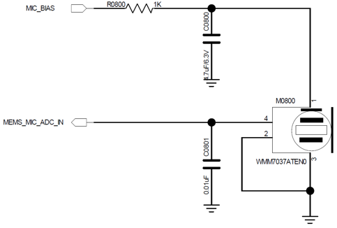{ width="100%" loading="lazy" }

<em>Figure 5.5-1: Analog MEMS MIC Single-Ended Input Circuit</em>

{ width="100%" loading="lazy" }

<em>Figure 5.5-2: Analog ECM MIC Single-Ended Input Circuit</em>

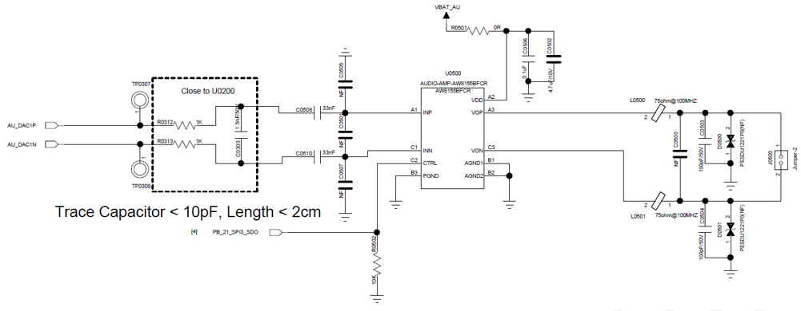{ width="100%" loading="lazy" }

<em>Figure 5.5-3: Analog Audio PA Circuit</em>

**Common Mistakes - Audio**

- Routing microphone or DAC traces near display clocks, DC/DC, RF, USB, or SDIO.
- Placing MIC_BIAS or AVDD33_AUD filter capacitors far from the chip pins.
- Treating DACP/DACN as independent single-ended signals instead of a differential pair.
- Allowing high parasitic capacitance or long trace length on the analog output.

**Audio Checklist**

- [ ] MIC_BIAS, ADCP, DACP, and DACN component placement is reviewed against the layout examples.
- [ ] DACP/DACN are routed as a short, shielded differential pair.
- [ ] Audio filter capacitors are close to their pins and grounded cleanly.
- [ ] Bring-up plan covers microphone bias, ADC noise floor, DAC output, PA enable, and audible noise.

#### 5.5.3. Buttons

**Quick Summary**

- `PA34` supports the power button, power on/off behavior, and long-press reset.
- Rotary encoder buttons should follow the reference circuit and be reviewed together with wake, debounce, and ESD requirements.

**Design Goal**

Provide reliable user-input and reset behavior without false wake events, stuck reset states, or high standby leakage through pull networks.

##### 5.5.3.1. Power Button

PA34 supports long-press reset and can be designed as a combined power on/off and long-press-reset button. The long-press reset function is active-high, so the default state should be pulled low and driven high when the button is pressed.

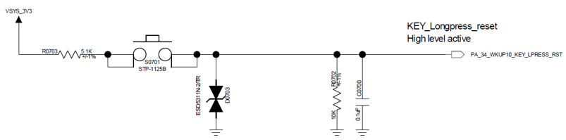{ width="100%" loading="lazy" }

<em>Figure 5.5-4: Power / Long-Press-Reset Button Circuit</em>

##### 5.5.3.2. Mechanical Rotary Encoder Button

Use the reference design as the baseline for the rotary encoder button circuit.

{ width="100%" loading="lazy" }

<em>Figure 5.5-5: Mechanical Rotary Encoder Button Circuit</em>

**Common Mistakes - Buttons**

- Leaving `PA34` floating or biased to the wrong default level.
- Forgetting that button circuits may need wake, ESD, debounce, and production-test access.
- Sharing button nets with noisy or heavily loaded functions without checking wake reliability.

**Button Checklist**

- [ ] Power/long-press-reset default level is correct.
- [ ] Wake behavior is verified for the intended low-power states.
- [ ] ESD and mechanical debounce requirements are reviewed.
- [ ] Bring-up plan includes short press, long press, wake, and reset behavior.

#### 5.5.4. Vibration Motor

**Quick Summary**

- Use a PWM output to drive the vibration motor through an external driver stage.
- Power the motor from a switchable rail where standby current matters.

**Design Goal**

Deliver repeatable haptic feedback while keeping motor surge current, switching noise, and standby leakage away from sensitive rails and wake circuits.

The SF32LB52x supports a PWM output for driving a vibration motor through an external driver stage.

{ width="100%" loading="lazy" }

<em>Figure 5.5-6: Vibration Motor Driver Circuit (SF32LB520/3/5/7 reference; functionally equivalent on the regular-powered variant)</em>

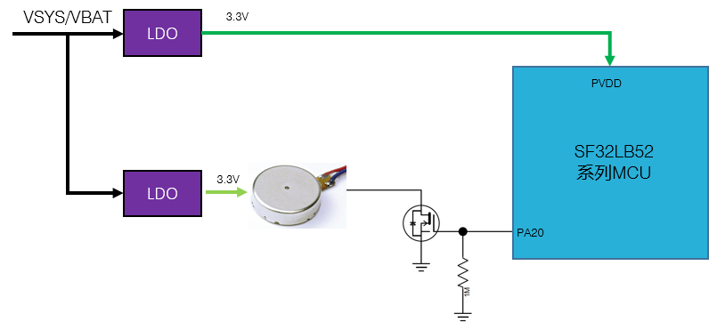{ width="100%" loading="lazy" }

<em>Figure 5.5-7: Vibration Motor Driver Circuit (52B/D/E/G/J Reference)</em>

**Motor Checklist**

- [ ] Motor driver, flyback/ESD protection, and supply current rating are reviewed.
- [ ] Motor rail default state is off in standby and shipping states.
- [ ] PWM pin assignment does not conflict with display, storage, or debug pins.
- [ ] Bring-up plan covers PWM duty sweep, start current, audible noise, and standby leakage.

### 5.6. Storage and Connectivity

#### 5.6.1. Storage

**Quick Summary**

- External boot options include SPI NOR, SPI NAND, SD NAND, and eMMC on supported regular-powered variants.
- Bootstrap pins `PA13` and `PA17` select the boot medium.
- Boot storage power switching uses `PA21`; incorrect storage power behavior can block restart or increase Hibernate leakage.

**Design Goal**

Choose a boot medium and storage power architecture that support firmware size, update strategy, low-power states, and reliable ROM boot after reset or Hibernate.

##### 5.6.1.1. Storage Interface Description

The chip supports external SPI NOR Flash, SPI NAND Flash, and SD NAND Flash. **eMMC is supported only on the 52B/D/E/G/J regular-powered variant.**

<em>Table 5.6-1: SPI NOR/NAND Flash Signal Connections</em>

| Flash Signal | I/O Pin | Description |
|:---|:---|:---|
| CS# | PA12 | Chip select, active low |
| SO | PA13 | Data IO1 |
| WP# | PA14 | Data IO2 / write protect |
| SI | PA15 | Data IO0 |
| SCLK | PA16 | Serial clock |
| Hold# | PA17 | Data IO3 / hold |

<em>Table 5.6-2: SD NAND Flash and eMMC Signal Connections</em>

| SD NAND/eMMC Signal | I/O Pin | Description |
|:---|:---|:---|
| SD2_CMD | PA15 | Command |
| SD2_D1 | PA17 | Data 1 |
| SD2_D0 | PA16 | Data 0 |
| SD2_CLK | PA14 | Clock |
| SD2_D2 | PA12 | Data 2 |
| SD2_D3 | PA13 | Data 3 |

!!! note "eMMC power domains (regular-powered variant only)"
    eMMC chips have two power domains, VCC and VCCQ. Option 1: switch both together — lower shutdown current, but slower eMMC sleep recovery and higher average CPU power. Option 2: switch VCC only, keep VCCQ always on — higher shutdown current than option 1, but faster eMMC sleep recovery and lower average CPU power.

##### 5.6.1.2. Boot Configuration

=== "SF32LB520/3/5/7 (Battery-Powered)"

    The chip supports booting from internal co-packaged SPI NOR Flash, external SPI NOR Flash, external SPI NAND Flash, or external SD NAND Flash (**eMMC boot is not supported**):

    - SF32LB520Ux6 has co-packaged Flash and boots from it by default
    - SF32LB523/5/7Ux6 have co-packaged PSRAM and must boot from external storage

    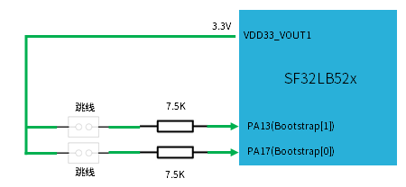{ width="100%" loading="lazy" }

    
<em>Figure 5.6-1: Bootstrap Pin Recommended Circuit (Battery-Powered Variant)</em>

    
<em>Table 5.6-3: Boot Option Settings (Battery-Powered Variant)</em>

    

    | Bootstrap[1] (PA13) | Bootstrap[0] (PA17) | Boot Medium |
    |:---|:---|:---|
    | L | L | SPI NOR Flash |
    | L | H | SPI NAND Flash |
    | H | X | SD NAND Flash |

    

=== "52B/D/E/G/J (Regular-Powered)"

    The chip supports booting from internal co-packaged SPI NOR Flash, external SPI NOR Flash, external SPI NAND Flash, external SD NAND Flash, or external **eMMC**:

    - The model with co-packaged Flash (SF32LB52BU36) boots from it by default
    - Models with co-packaged PSRAM (SF32LB52DUB6/EUB6/GUC6/JUD6) must boot from external storage

    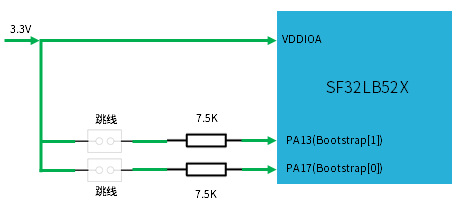{ width="100%" loading="lazy" }

    
<em>Figure 5.6-2: Bootstrap Pin Recommended Circuit (Regular-Powered Variant)</em>

    
<em>Table 5.6-4: Boot Option Settings (Regular-Powered Variant)</em>

    

    | Bootstrap[1] (PA13) | Bootstrap[0] (PA17) | Boot Medium |
    |:---|:---|:---|
    | L | L | SPI NOR Flash |
    | L | H | SPI NAND Flash |
    | H | X | SD NAND Flash |
    | H | H | eMMC |

    

    !!! note "Naming note in the original SiFli documentation"
        SiFli's original source document uses suffix letters "SF32LB52AUx6" and "SF32LB52D/F/HUx6" in this section, which do not match the B/D/E/G/J model naming used at the start of the same source document. This guide restates the distinction by actual co-packaged memory type (Flash vs. PSRAM); if in doubt, verify against the exact chip model and datasheet.

##### 5.6.1.3. Boot Storage Power Control

The chip supports power-switching the boot storage medium to reduce shutdown power. The switch enable pin must be controlled through **PA21**, active high (on), inactive low (off).

=== "SF32LB520/3/5/7 (Battery-Powered)"

    - SF32LB520Ux6 has co-packaged Flash — power VDD18_VOUT from VDD33_VOUT1 and disable the internal VDD18_VOUT LDO
    - SF32LB523/5/7Ux6 have co-packaged PSRAM — use the internal LDO; VDD18_VOUT can be externally supplied
    - For external NOR Flash, power it from VDD33_VOUT1 with no extra power switch needed
    - For external SPI NAND or SD NAND, power it from VDD33_VOUT1 and add a power switch
    - The reference design reserves pull-up resistor footprints at PA13 and PA17 — populate based on the storage type, 7.5 kΩ recommended

=== "52B/D/E/G/J (Regular-Powered)"

    - The model with co-packaged Flash (SF32LB52BU36) — add a power switch on VDD_SIP
    - Models with co-packaged PSRAM (SF32LB52DUB6/EUB6/GUC6/JUD6) — if PVDD = 3.3 V and VDD_SIP uses the internal LDO, a VDD_SIP power switch is optional; if PVDD = 1.8 V, a VDD_SIP power switch is required
    - External storage power is independent of VDD_SIP — add a separate power switch
    - See Section 5.6.1.1 for the eMMC VCC/VCCQ power-domain tradeoffs
    - **All boot-related storage power switches must be controlled through PA21**
    - For a NOR Flash of 32 MB or larger attached via the MPI (Memory Peripheral Interface, which connects to SPI-NOR/SPI-NAND), the Flash must be power-switchable via PA21 so it exits 4-byte mode on MCU restart or Hibernate entry — otherwise ROM won't recognize the Flash. NOR Flash of 16 MB or smaller can remain always powered
    - The reference design reserves pull-up resistor footprints at PA13 and PA17 — populate based on the storage type, 7.5 kΩ recommended

**Common Mistakes - Storage**

- Missing bootstrap resistors or populating them for the wrong boot medium.
- Leaving `PA21` disconnected from the boot-storage power switch.
- Treating eMMC as available on all variants.
- Keeping large NOR Flash always powered when 4-byte mode can break ROM recognition after restart.

**Storage Checklist**

- [ ] Boot medium is selected and documented before PCB layout.
- [ ] `PA13`/`PA17` bootstrap pull options match the boot table.
- [ ] `PA21` controls all required boot-storage power switches.
- [ ] eMMC VCC/VCCQ tradeoff is reviewed for regular-powered designs.
- [ ] Bring-up plan covers boot-mode strapping, storage rail timing, ID read, and firmware download.

#### 5.6.2. Sensors

**Quick Summary**

- Sensors typically connect through I2C or SPI and should be power-gated when low standby current is required.
- Wake-capable sensor interrupts must be assigned before pinout freeze.

**Design Goal**

Keep sensor power, interrupt, and bus routing reliable while allowing unused sensors to shut down cleanly in low-power modes.

The SF32LB52x can connect to heart-rate, accelerometer, geomagnetic, and similar sensors. Choose a load switch with low Iq for sensor power switching.

**Sensor Checklist**

- [ ] Sensor bus, interrupt, reset, and power-enable pins are assigned.
- [ ] Sensor load switch Iq and shutdown current match the standby target.
- [ ] Pull-ups are placed on the correct sensor I/O voltage rail.
- [ ] Bring-up plan covers bus scan, interrupt wake, and sensor power cycling.

#### 5.6.3. UART and I2C Pin Assignment

**Quick Summary**

- UART and I2C functions can be mapped to arbitrary PA pins.
- Pin choices should still account for boot, wake, debug, production test, and board routing constraints.

**Design Goal**

Use flexible pin mapping to simplify routing without blocking required boot straps, wake pins, debug access, or production fixtures.

The SF32LB52x supports UART and I2C function mapping on arbitrary PA pins.

**UART/I2C Checklist**

- [ ] Pull-ups, voltage domains, and bus capacitance are correct for every I2C bus.
- [ ] UART pins needed for logs, download, or external modules are accessible.
- [ ] Pin multiplexing does not conflict with bootstrap, wake, display, storage, or debug functions.

#### 5.6.4. GPTIM Pin Assignment

**Quick Summary**

- GPTIM functions can be mapped to arbitrary PA pins.
- Timer outputs are commonly used for PWM, capture, motor control, backlight, or product-specific timing.

**Design Goal**

Reserve timer-capable functions early enough that PWM, capture, and timing features are not forced onto poor routing or wake-conflicting pins late in the design.

The SF32LB52x supports GPTIM function mapping on arbitrary PA pins.

**GPTIM Checklist**

- [ ] Timer channels required for PWM, capture, or control loops are listed in the pinout table.
- [ ] GPTIM pins do not conflict with backlight, motor, debug, or storage requirements.
- [ ] Bring-up plan includes checking PWM frequency, duty range, and pin polarity.

### 5.7. Manufacturing

#### 5.7.1. Debug and Download Interface

**Quick Summary**

- `PA18` and `PA19` default to DBG_UART after power-up and are multiplexed with SWD.
- Reserve physical access to the debug/download pins on every prototype and production board.

**Design Goal**

Guarantee firmware download, debug logs, single-step debug, and failure recovery access even after the product enclosure and production fixture are defined.

The SF32LB52x supports a DBG_UART interface for download and debug, connected to a PC through a 3.3 V UART-to-USB dongle board. SWD and DBG_UART are multiplexed on PA18 and PA19; the default power-on configuration is DBG_UART, which supports single-step debugging as well as log output.

<em>Table 5.7-1: Debug Port Connections</em>

| Debug Signal | Pin | Description |
|:---|:---|:---|
| DBG_UART_RXD | PA18 | Debug UART receive |
| DBG_UART_TXD | PA19 | Debug UART transmit |

**Debug Checklist**

- [ ] `PA18`/`PA19`, ground, and the required power reference are exposed on test pads or connector pins.
- [ ] Debug access remains available after enclosure, battery, and display assembly.
- [ ] UART voltage level is 3.3 V compatible with the selected adapter or fixture.
- [ ] Recovery path is documented for a board that cannot boot application firmware.

#### 5.7.2. Production Flashing and Crystal Calibration

**Quick Summary**

- Production programming and crystal calibration require stable power, DBG_UART access, PA01, and the required power/ground test points.
- Fixture access should be designed before the PCB mechanical outline and enclosure are frozen.

**Design Goal**

Make every production board programmable, calibratable, and recoverable without manual soldering or product disassembly.

SiFli provides an offline downloader for production firmware flashing and crystal calibration. Reserve at least these test points in the hardware design: PVDD/VBAT, GND, AVDD33, DBG_UART_RXD, DBG_UART_TXD, and PA01. See the "Offline Downloader User Guide" document included in the development package for the detailed flashing and calibration process.

**Production Checklist**

- [ ] PVDD/VBAT, GND, AVDD33, DBG_UART_RXD, DBG_UART_TXD, and PA01 test points are reserved.
- [ ] Test pads are reachable by the intended fixture after mechanical assembly.
- [ ] Crystal calibration flow and pass/fail limits are defined with manufacturing.
- [ ] Programming, calibration, and functional-test records can be tied back to the board revision.

#### 5.7.3. Schematic and PCB Drawing Checklists

Use the official [schematic and PCB checklist][SiFli SF32LB52 Schematic & PCB Checklist (XLSX)] published on SiFli's wiki as the formal release gate — see the [SF32LB52x Hardware Design Checklist][SF32LB52x Hardware Design Checklist - Dev] for the complete, item-by-item version. The local checklists in this guide are intended to catch common engineering issues before the formal checklist review.

[SF32LB52x Hardware Design Checklist - Dev]: SF32LB52x_hardware_design_checklist.md
[SiFli SF32LB52 Schematic & PCB Checklist (XLSX)]: https://downloads.sifli.com/hardware/files/documentation/SF32LB52%20Schematic%26PCB%20checklist_V1.0_20260121.xlsx

**Release Checklist**

- [ ] Schematic checklist, PCB checklist, AVL check, DRC report, and impedance report are complete.
- [ ] Evidence screenshots are archived for power, clock, RF, display, storage, audio, USB, SDIO, DC/DC, and production-test access.
- [ ] Variant-specific assumptions are documented in the review notes.
- [ ] Open hardware risks are assigned to an owner before release.

## 6. PCB Layout Guidelines

Use this chapter as the layout-review companion to Section 5. The schematic should already define the variant, power tree, clock parts, RF reserve, display/storage pins, and test access before final placement begins.

**Design Goal**

Translate the schematic into a manufacturable 4-layer PTH board while protecting the sensitive RF, crystal, audio, power, USB, and SDIO paths from impedance, noise, and return-current problems.

**PCB Review Flow**

1. Confirm package footprint and paste/land pattern.
2. Confirm stack-up, trace/space, drill, and impedance rules with the PCB vendor.
3. Place chip, crystals, RF path, DC/DC, charger, display/storage connectors, and audio components.
4. Review fanout and sensitive routing before filling less critical GPIO routes.
5. Capture evidence screenshots for RF, crystals, USB, SDIO, audio, DC/DC, charger, and power rails.

### 6.1. PCB Footprint Design

The SF32LB52x QFN68L package is 7 mm x 7 mm x 0.85 mm, with 68 pins and 0.35 mm pitch.

{ width="100%" loading="lazy" }

<em>Figure 6.1-1: QFN68L Package Dimensions</em>

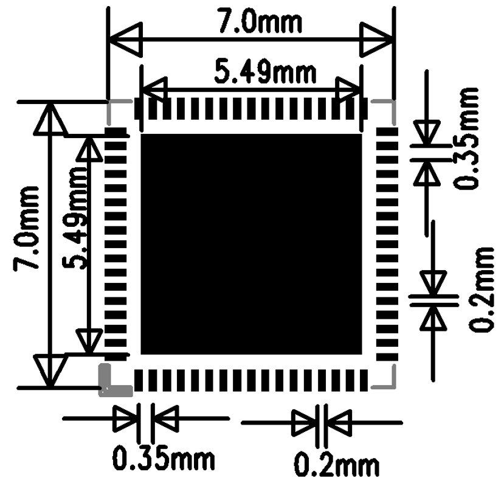{ width="100%" loading="lazy" }

<em>Figure 6.1-2: QFN68L Package Shape</em>

{ width="100%" loading="lazy" }

<em>Figure 6.1-3: QFN68L PCB Land Pattern Reference</em>

### 6.2. PCB Stack-Up

The reference design supports single- or double-sided placement. Components can be placed on one side, or capacitors and similar passives can be placed on the back side under the chip. A 4-layer through-hole via (PTH) stack-up is recommended.

{ width="100%" loading="lazy" }

<em>Figure 6.2-1: Reference Stack-Up Structure</em>

### 6.3. General PCB Design Rules

Follow the general PTH-board PCB design rules from the reference design.

{ width="100%" loading="lazy" }

<em>Figure 6.3-1: General PCB Design Rules</em>

### 6.4. PCB Trace Fanout

Fan out all QFN package signals through the top layer.

{ width="100%" loading="lazy" }

<em>Figure 6.4-1: Top-Layer Fanout Reference</em>

### 6.5. Clock Interface Routing

Apply these clock-routing rules across both design groups:

- Place crystals inside the shield can, more than 1 mm from the PCB edge, and as far as practical from heat-generating components (PA, charger, PMU circuits) — ideally more than 5 mm — to avoid affecting crystal frequency drift
- Keep the crystal keep-out zone larger than 0.25 mm, free of other metal or components
- Route 48 MHz crystal traces on the top layer, 3–10 mm long, 0.1 mm wide, with full ground shielding, away from VBAT/VCC, DC/DC, and high-speed signal lines; keep the top layer and adjacent layer under the crystal area clear of other routing
- Route 32.768 kHz crystal traces on the top layer, ≤10 mm long, 0.1 mm wide, with ≥0.15 mm spacing between the parallel 32K_XI/32K_XO traces, and full ground shielding

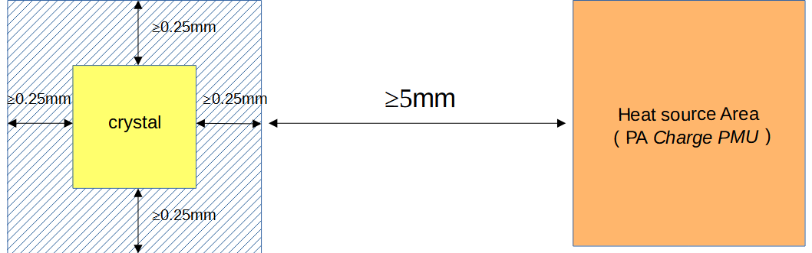{ width="100%" loading="lazy" }

<em>Figure 6.5-1: Crystal Placement</em>

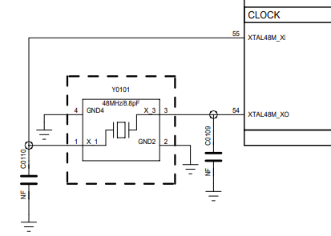{ width="100%" loading="lazy" }

<em>Figure 6.5-2: 48 MHz Crystal Schematic</em>

{ width="100%" loading="lazy" }

<em>Figure 6.5-3: 48 MHz Crystal Routing Model</em>

{ width="100%" loading="lazy" }

<em>Figure 6.5-4: 48 MHz Crystal Routing Reference</em>

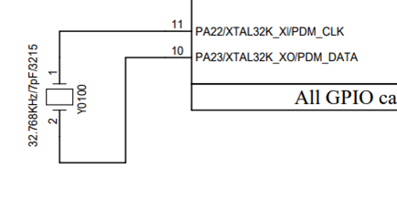{ width="100%" loading="lazy" }

<em>Figure 6.5-5: 32.768 kHz Crystal Schematic</em>

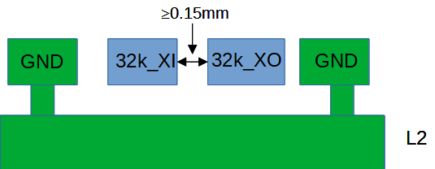{ width="100%" loading="lazy" }

<em>Figure 6.5-6: 32.768 kHz Crystal Routing Model</em>

{ width="100%" loading="lazy" }

<em>Figure 6.5-7: 32.768 kHz Crystal Routing Reference</em>

### 6.6. RF Interface Routing

Apply these RF-routing rules across both design groups:

- Place the RF matching circuit close to the chip side, not the antenna side
- Place the AVDD_BRF filter capacitor close to the chip pin, with its ground pin vias connected directly to the main ground
- Route RF traces on the top layer where possible, avoiding vias that would hurt RF performance; keep trace width above 10 mil with full ground shielding, and avoid acute or right-angle bends
- Control RF trace impedance to 50 Ω, with dense shielding ground vias along both sides

{ width="100%" loading="lazy" }

<em>Figure 6.6-1: π-Network and Power Circuit Schematic</em>

{ width="100%" loading="lazy" }

<em>Figure 6.6-2: π-Network and Power Circuit PCB Layout</em>

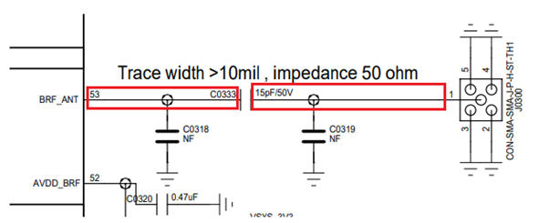{ width="100%" loading="lazy" }

<em>Figure 6.6-3: RF Signal Circuit Schematic</em>

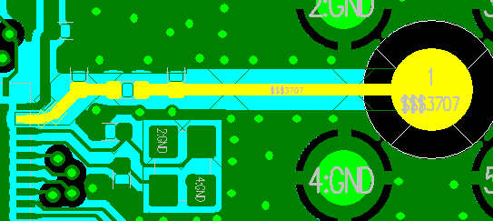{ width="100%" loading="lazy" }

<em>Figure 6.6-4: RF Signal PCB Routing</em>

### 6.7. Audio Interface Routing

Apply these audio-routing rules across both design groups:

- Place the AVDD33_AUD filter capacitor close to its pin; place the MIC_BIAS filter capacitor close to its pin
- Keep components for the ADCP analog input close to the chip pin, with short traces, full ground shielding, and away from other strong interference sources
- Keep components for the DACP/DACN analog output close to the chip pin, routed as a differential pair, with short traces, parasitic capacitance below 10 pF, and full ground shielding

{ width="100%" loading="lazy" }

<em>Figure 6.7-1: Audio Power Filtering Schematic</em>

{ width="100%" loading="lazy" }

<em>Figure 6.7-2: Audio Power Filtering PCB Reference Routing</em>

{ width="100%" loading="lazy" }

<em>Figure 6.7-3: Analog Audio Input Schematic</em>

{ width="100%" loading="lazy" }

<em>Figure 6.7-4: Analog Audio Input PCB Design</em>

{ width="100%" loading="lazy" }

<em>Figure 6.7-5: Analog Audio Output Schematic</em>

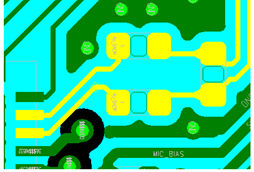{ width="100%" loading="lazy" }

<em>Figure 6.7-6: Analog Audio Output PCB Design</em>

### 6.8. USB Interface Routing

Route USB DP (PA35) / DN (PA36) through the ESD device pins first, then to the chip, and ensure the ESD device ground connects solidly to the main ground. Route the pair with 90 Ω differential impedance control and full ground shielding.

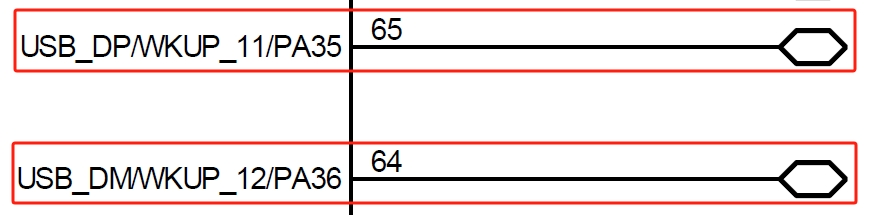{ width="100%" loading="lazy" }

<em>Figure 6.8-1: USB Signal Schematic</em>

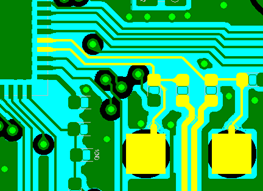{ width="100%" loading="lazy" }

<em>Figure 6.8-2: USB Signal PCB Design</em>

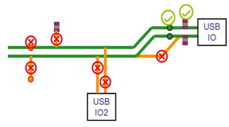{ width="100%" loading="lazy" }

<em>Figure 6.8-3: USB Signal Component Placement Reference</em>

{ width="100%" loading="lazy" }

<em>Figure 6.8-4: USB Signal Routing Model</em>

### 6.9. SDIO Interface Routing

Route SDIO signals together as a group, with total trace length ≤50 mm and within-group length matching ≤6 mm. Provide full ground shielding for the clock signal, and shield the DATA and CMD signals as well.

{ width="100%" loading="lazy" }

<em>Figure 6.9-1: SDIO Interface Circuit Schematic</em>

{ width="100%" loading="lazy" }

<em>Figure 6.9-2: SDIO PCB Routing Model</em>

### 6.10. DC/DC Circuit Routing

Place the power inductor and filter capacitors close to the chip pins. Keep the BUCK_LX trace short and wide, and keep the BUCK_FB feedback trace no thinner than 0.25 mm. Connect all DC/DC output filter capacitor ground pins to the main ground plane with multiple vias. Do not pour top-layer copper in the power inductor area, and keep the adjacent layer as a complete reference ground.

{ width="100%" loading="lazy" }

<em>Figure 6.10-1: DC/DC Key Component Schematic</em>

{ width="100%" loading="lazy" }

<em>Figure 6.10-2: DC/DC Key Component PCB Layout</em>

### 6.11. Power Supply Routing

=== "SF32LB520/3/5/7 (Battery-Powered)"

    VCC is the input pin for the chip's internal PMU module — place its capacitor close to the pin, with trace width no less than 0.4 mm. Place filter capacitors for VDD_VOUT1, VDD_VOUT2, VDD_RET, VDD_RTC, VDD18_VOUT, VDD33_VOUT1, VDD33_VOUT2, AVDD33_AUD, and AVDD_BRF close to their respective pins, with trace widths sized for the required input current.

    { width="100%" loading="lazy" }

    
<em>Figure 6.11-1: VCC Power Routing (Schematic)</em>

    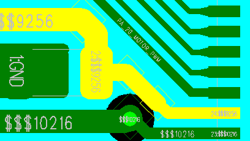{ width="100%" loading="lazy" }

    
<em>Figure 6.11-2: VCC Power Routing (PCB)</em>

    **Charging Circuit Routing**

    VBUS and VBAT are the input/output pins of the chip's internal charging module — place their filter capacitors close to the pins. Because the charging loop carries relatively high current, use trace widths of at least 0.4 mm and avoid routing sensitive signals in parallel with them. Use star routing so the charging path does not share routing with sensitive circuit modules.

    { width="100%" loading="lazy" }

    
<em>Figure 6.11-3: VBUS & VBAT Power Routing (Schematic)</em>

    { width="100%" loading="lazy" }

    
<em>Figure 6.11-4: VBUS & VBAT Power Routing (PCB)</em>

=== "52B/D/E/G/J (Regular-Powered)"

    PVDD is the input pin for the chip's internal PMU module — place its capacitor close to the pin, with trace width no less than 0.4 mm. Place filter capacitors for AVDD33, VDDIOA, VDD_SIP, AVDD33_AUD, and AVDD_BRF close to their respective pins, with trace widths sized for the required input current, kept as short and wide as practical to reduce power-supply ripple and improve system stability.

    { width="100%" loading="lazy" }

    
<em>Figure 6.11-5: PVDD Power Routing</em>

    !!! info "Not Applicable"
        This variant has no charging management circuitry, so no charging-circuit routing is required.

### 6.12. Other Interface Routing

Pins configured as GPADC inputs must have full ground shielding and must stay away from interference sources such as battery-level sensing and temperature-detection circuits.

### 6.13. EMI & ESD

Apply these EMI and ESD rules across both design groups:

- Avoid long top-layer traces outside the shield can, especially for clock and power interference sources — route them on inner layers where possible
- Place ESD protection devices close to the connector pins, routing signals through the ESD device before anything else
- Ensure ESD device ground pins connect to the main ground through vias, with short and wide ground pad traces to reduce impedance and improve ESD performance

### 6.14. Other Considerations

Place USB charging-line test points before the TVS diode, and place the battery-holder TVS diode before the platform connection. Route the signal so it always passes through the TVS before reaching the chip. Keep TVS ground-pin traces as short as possible.

{ width="100%" loading="lazy" }

<em>Figure 6.14-1: Power TVS Placement Reference</em>

{ width="100%" loading="lazy" }

<em>Figure 6.14-2: TVS Routing Reference</em>

## 7. Design Review Checklist

- [ ] Minimum-system review is complete: exact variant, package, power tree, boot medium, bootstrap pins, debug/download access, clocks, and wake strategy are all documented
- [ ] The exact chip model and power variant are confirmed, and power schematics from the two variants are not mixed
- [ ] Processor power pins (VBUS/VBAT/VCC, or PVDD/VDDIOA/VDD_SIP) are within the datasheet voltage range
- [ ] BUCK inductor meets 4.7 uH ±20%, DCR ≤0.4 Ω, Isat ≥450 mA
- [ ] Battery-powered variant: charging path, OVP device voltage range, and integrated-LDO output capacitance are verified
- [ ] 48 MHz and 32.768 kHz crystals meet the recommended specifications, with routing and keep-out zones satisfied
- [ ] RF trace is 50 Ω impedance, with the matching network placed close to the chip
- [ ] Storage boot configuration (including the regular-powered variant's eMMC option) matches the Bootstrap pin settings
- [ ] Storage power switches are uniformly controlled through PA21, active high (on) / low (off)
- [ ] USB and SDIO differential trace impedance and length matching meet requirements
- [ ] DBG_UART/SWD multiplexed pins and production test points are reserved
- [ ] Key component part numbers have been verified against the latest [SiFli Approved Vendor List][SiFli Approved Vendor List (AVL)]

## 8. Related Documents and References

[SF32LB52x Datasheet (Official PDF)]: https://downloads.sifli.com/silicon/DS0052-SF32LB52x-%E8%8A%AF%E7%89%87%E6%8A%80%E6%9C%AF%E8%A7%84%E6%A0%BC%E4%B9%A6%20V2p4.pdf?
[SF32LB52x User Manual (Official PDF)]: https://downloads.sifli.com/silicon/UM0052-SF32LB52x-%E7%94%A8%E6%88%B7%E6%89%8B%E5%86%8C%20V0p3.pdf?
[SF32LB52 Hardware Reference Design Package]: https://downloads.sifli.com/hardware/files/documentation/SF32LB52-%E7%A1%AC%E4%BB%B6%E5%8F%82%E8%80%83%E8%AE%BE%E8%AE%A1-20250619.zip?
[SF32LB520/3/5/7 Hardware Application Note (Source)]: https://github.com/OpenSiFli/SiFli-Wiki/blob/main/source/en/hardware/SF32LB520-3-5-7-HW-Application.md
[52B/D/E/G/J Hardware Application Note (Source)]: https://github.com/OpenSiFli/SiFli-Wiki/blob/main/source/en/hardware/SF32LB52B-E-G-J-HW-Application.md
[Local SiFli Approved Vendor List]: ../others/sifli-approved-vendor-list.md

- :fontawesome-solid-file-pdf: __[SF32LB52x Datasheet (Official PDF)]__
- :fontawesome-solid-file-pdf: __[SF32LB52x User Manual (Official PDF)]__
- :fontawesome-solid-file-zipper: __[SF32LB52 Hardware Reference Design Package]__
- :fontawesome-brands-github: __[SF32LB520/3/5/7 Hardware Application Note (Source)]__
- :fontawesome-brands-github: __[52B/D/E/G/J Hardware Application Note (Source)]__
- :fontawesome-solid-file-excel: __[Local SiFli Approved Vendor List]__

Additional source references:

- [SF32LB52x Product Brief](https://downloads.sifli.com/user%20manual/PB5201-SF32LB52x-Product%20Brief.pdf)
- [SF32LB52x Datasheet](https://downloads.sifli.com/user%20manual/DS5201-SF32LB52x-Datasheet%20V2p5p3.pdf)
- [SF32LB52x Reference Manual](https://downloads.sifli.com/user%20manual/UM5201-SF32LB52x-User%20Manual%20V0p8p4.pdf)
- [SF32LB520/3/5/7 Hardware Application Note](https://github.com/OpenSiFli/SiFli-Wiki/blob/main/source/en/hardware/SF32LB520-3-5-7-HW-Application.md)
- [52B/D/E/G/J Hardware Application Note](https://github.com/OpenSiFli/SiFli-Wiki/blob/main/source/en/hardware/SF32LB52B-E-G-J-HW-Application.md)

## 9. Appendices

The original SiFli application notes include the following schematic, PCB layout, mechanical, and power reference figures. These appendices preserve those source figures for review evidence, while Sections 5 and 6 remain the primary design guidance.

!!! note "How to use these figures"
    Treat these figures as reference circuits and layout examples from the source application notes. Use the rule text, tables, datasheet, reference manual, latest reference design package, and AVL to confirm the final implementation for the exact device and product.

<em>Table 9-1: Appendix Map</em>

| Need | Start Here |
|:---|:---|
| Smart watch block-diagram examples for both SF32LB52x design groups | Appendix A: A Typical Smart Watch Application |
| Circuit-level schematic examples for RF, storage/boot, buttons, motor, audio, clock, USB, and DC/DC | Appendix B: Reference Schematics |
| PCB placement and routing examples for RF, storage, audio, stack-up, fanout, clock, USB, and DC/DC | Appendix C: Reference PCB Layouts |
| Package outline, shape, and land-pattern drawings | Appendix D: Mechanical |
| Charging, OVP, power-tree, and PMU reference circuits and layouts | Appendix E: Power |

### Appendix A. A Typical Smart Watch Application

A typical SF32LB52x smart watch design includes the MCU, display, touch controller, storage, sensors, vibration motor, audio input/output, Bluetooth antenna, clock sources, power management, debug access, and production-test access. The battery-powered design additionally includes charging management.

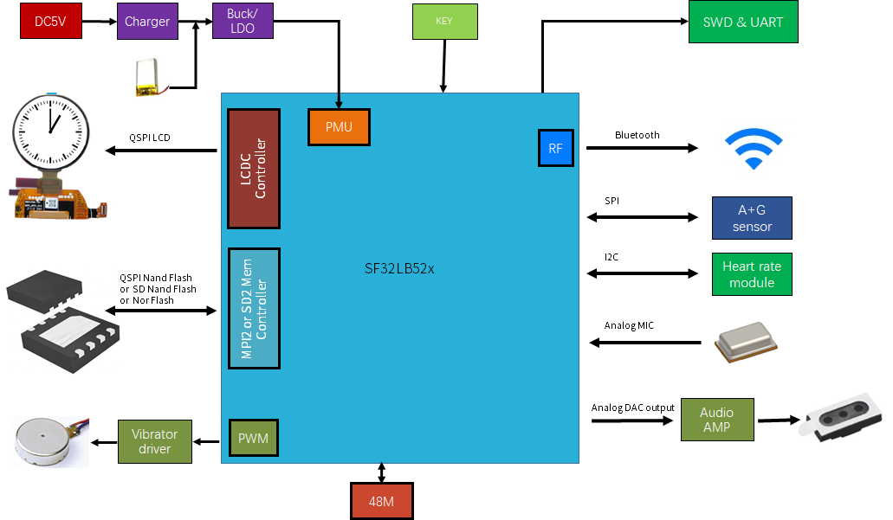{ loading="lazy" }

<em>Figure A-1: SF32LB520/3/5/7 Smart Watch Application Diagram</em>

{ loading="lazy" }

<em>Figure A-2: 52B/D/E/G/J Smart Watch Application Diagram</em>

### Appendix B. Reference Schematics

**RF**

{ loading="lazy" }

<em>Figure B-1: RF Front-End Block Diagram</em>

{ loading="lazy" }

<em>Figure B-2: RF Schematic Reference</em>

{ loading="lazy" }

<em>Figure B-3: RF Schematic Routing Reference</em>

**Storage and Boot**

{ loading="lazy" }

<em>Figure B-4: SF32LB520/3/5/7 Bootstrap Reference</em>

{ loading="lazy" }

<em>Figure B-5: 52B/D/E/G/J Bootstrap Reference</em>

{ loading="lazy" }

<em>Figure B-6: SDIO Schematic Reference</em>

**Buttons, Motor, and Audio**

{ loading="lazy" }

<em>Figure B-7: SF32LB520/3/5/7 Vibration Motor Reference</em>

{ loading="lazy" }

<em>Figure B-8: 52B/D/E/G/J Vibration Motor Reference</em>

{ loading="lazy" }

<em>Figure B-9: Power Key Reference</em>

{ loading="lazy" }

<em>Figure B-10: Rotary Encoder Key Reference</em>

{ loading="lazy" }

<em>Figure B-11: Analog MEMS Microphone Reference</em>

{ loading="lazy" }

<em>Figure B-12: Analog ECM Microphone Reference</em>

{ loading="lazy" }

<em>Figure B-13: Analog DAC to PA Reference</em>

{ loading="lazy" }

<em>Figure B-14: Audio Power Schematic Reference</em>

{ loading="lazy" }

<em>Figure B-15: Audio ADC Schematic Reference</em>

{ loading="lazy" }

<em>Figure B-16: Audio DAC Schematic Reference</em>

**Clock**

{ loading="lazy" }

<em>Figure B-17: 48 MHz Crystal Schematic</em>

{ loading="lazy" }

<em>Figure B-18: 32.768 kHz Crystal Schematic</em>

**USB**

{ loading="lazy" }

<em>Figure B-19: USB Schematic Reference</em>

**DC/DC**

{ loading="lazy" }

<em>Figure B-20: DC/DC Schematic Reference</em>

### Appendix C. Reference PCB Layouts

**RF**

{ loading="lazy" }

<em>Figure C-1: RF PCB Matching Reference</em>

{ loading="lazy" }

<em>Figure C-2: RF PCB Routing Reference</em>

**Storage**

{ loading="lazy" }

<em>Figure C-3: SDIO PCB Reference</em>

**Audio**

{ loading="lazy" }

<em>Figure C-4: Audio Power PCB Reference</em>

{ loading="lazy" }

<em>Figure C-5: Audio ADC PCB Reference</em>

{ loading="lazy" }

<em>Figure C-6: Audio DAC PCB Reference</em>

**PCB Foundation**

{ loading="lazy" }

<em>Figure C-7: PCB Stack-Up Reference</em>

{ loading="lazy" }

<em>Figure C-8: PCB Design Rule Reference</em>

{ loading="lazy" }

<em>Figure C-9: QFN Fanout Reference</em>

{ loading="lazy" }

<em>Figure C-10: Crystal Placement Reference</em>

**Clock Routing**

{ loading="lazy" }

<em>Figure C-11: 48 MHz Crystal Routing Model</em>

{ loading="lazy" }

<em>Figure C-12: 48 MHz Crystal Routing Reference</em>

{ loading="lazy" }

<em>Figure C-13: 32.768 kHz Crystal Routing Model</em>

{ loading="lazy" }

<em>Figure C-14: 32.768 kHz Crystal Routing Reference</em>

**USB**

{ loading="lazy" }

<em>Figure C-15: USB PCB Reference</em>

{ loading="lazy" }

<em>Figure C-16: USB Layout Reference</em>

{ loading="lazy" }

<em>Figure C-17: USB Routing Reference</em>

**DC/DC**

{ loading="lazy" }

<em>Figure C-18: DC/DC PCB Reference</em>

### Appendix D. Mechanical

{ loading="lazy" }

<em>Figure D-1: SF32LB520/3/5/7 Package Layout</em>

{ loading="lazy" }

<em>Figure D-2: 52B/D/E/G/J Package Layout</em>

{ loading="lazy" }

<em>Figure D-3: QFN68L Package Dimensions</em>

{ loading="lazy" }

<em>Figure D-4: QFN68L Package Shape</em>

{ loading="lazy" }

<em>Figure D-5: QFN68L Recommended Footprint</em>

### Appendix E. Power

**SF32LB520/3/5/7 (Battery-Powered)**

{ loading="lazy" }

<em>Figure E-1: External Charger Without PPM</em>

{ loading="lazy" }

<em>Figure E-2: External Charger With PPM</em>

{ loading="lazy" }

<em>Figure E-3: Integrated Charger Circuit</em>

{ loading="lazy" }

<em>Figure E-4: OVP Threshold Setting</em>

{ loading="lazy" }

<em>Figure E-5: Adjustable OVLO OVP Application</em>

{ loading="lazy" }

<em>Figure E-6: Regulated-Output OVP Application</em>

{ loading="lazy" }

<em>Figure E-7: SF32LB520/3/5/7 Power Structure</em>

{ loading="lazy" }

<em>Figure E-8: VCC Schematic Reference</em>

{ loading="lazy" }

<em>Figure E-9: VCC PCB Reference</em>

{ loading="lazy" }

<em>Figure E-10: Charging Schematic Reference</em>

{ loading="lazy" }

<em>Figure E-11: Charging PCB Reference</em>

{ loading="lazy" }

<em>Figure E-12: PMU TVS Reference</em>

{ loading="lazy" }

<em>Figure E-13: PMU EOS Reference</em>

**52B/D/E/G/J (Regular-Powered)**

{ loading="lazy" }

<em>Figure E-14: 52B/D/E/G/J PMU PCB Reference</em>

## 10. Revision History

<em>Table 10-1: Revision History</em>

| Version | Date | Note |
|:---|:---|:---|
| 1.1 | 2026-07 | Promoted Power System to a peer schematic section, split Clock Generation and RF into separate schematic sections, and renumbered the following schematic guidance sections. |
| 0.0.1 | 10/2024 | Original release of `SF32LB520-3-5-7-HW-Application` |
| 0.0.1 | 10/2024 | Original release of `SF32LB52B-E-G-J-HW-Application` |
| 1.0 | This document | Combined both official hardware application notes into a single guide, using tabs to separate battery-powered vs. regular-powered variant content |

