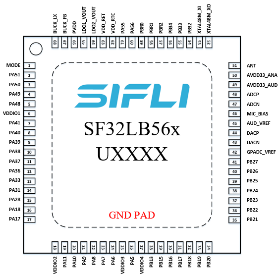
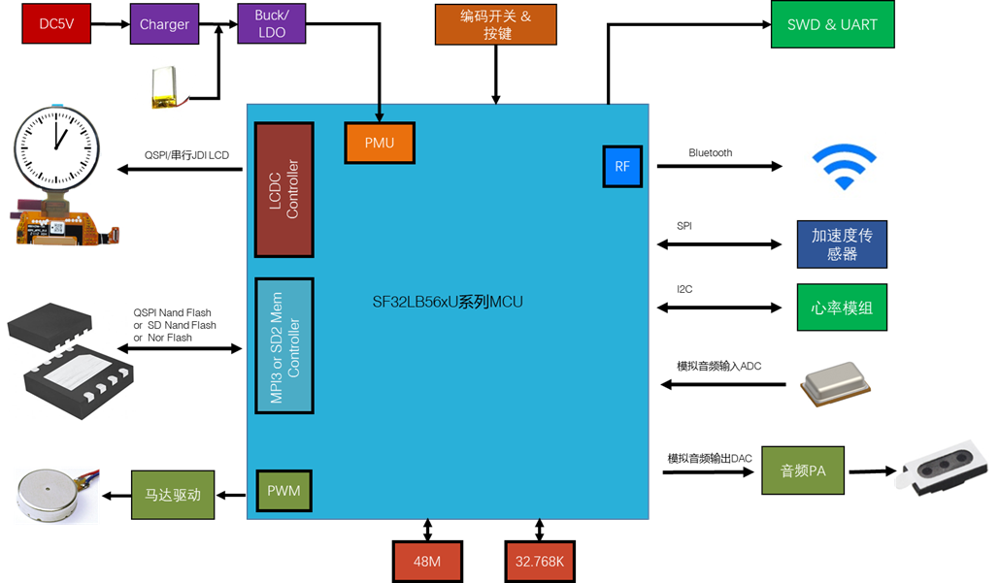
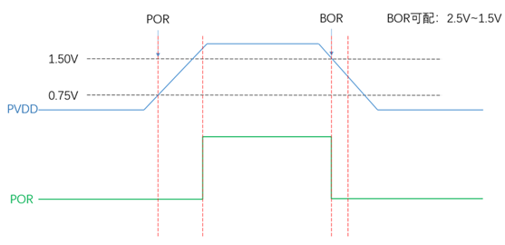
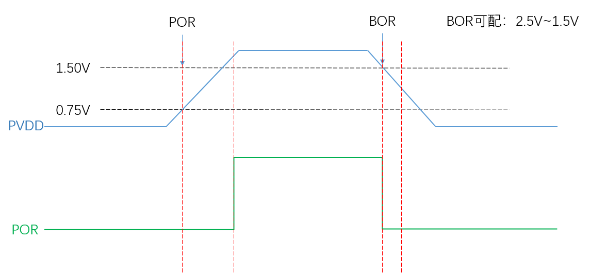
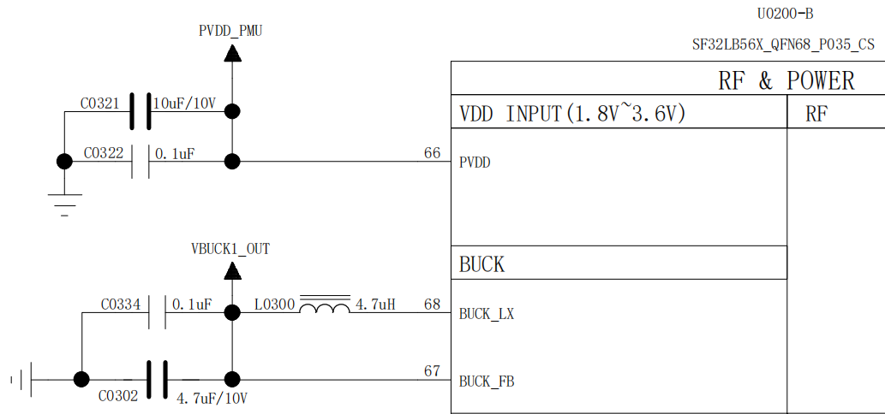
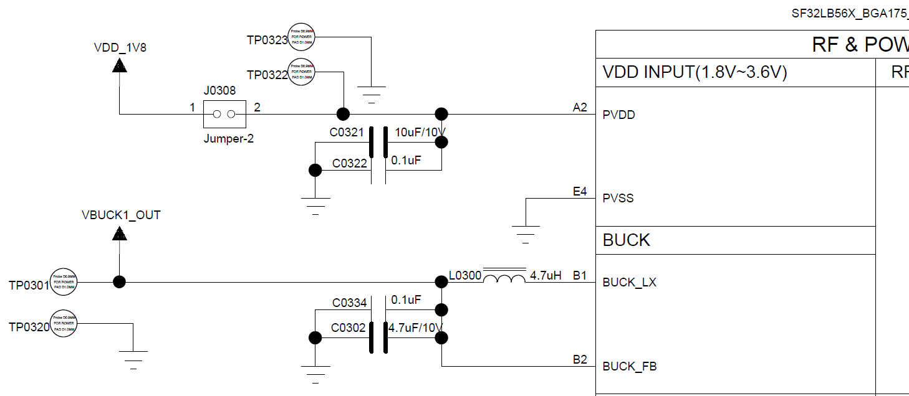
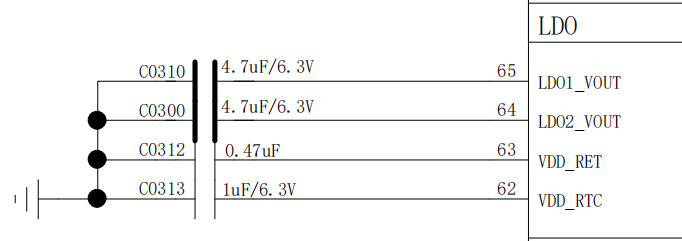
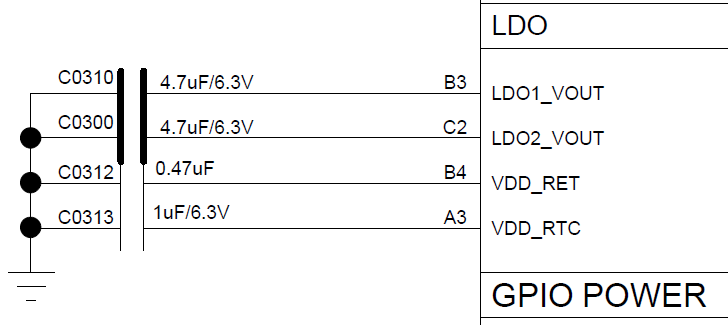
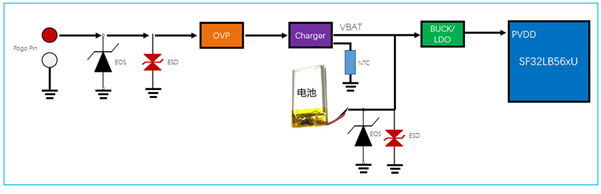
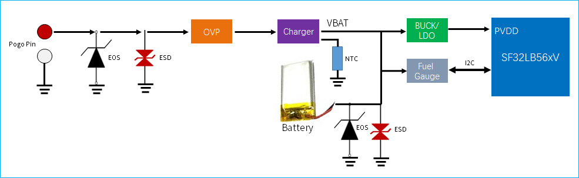

# SF32LB56x Hardware Design Guide

## 1. Introduction

This hardware design guide provides recommendations and reference material for products based on the SF32LB56x family of graphics-optimized AIoT microcontrollers. It is intended for hardware engineers, PCB designers, and product developers building smartwatches, connected HMI systems, medical and healthcare devices, industrial handhelds, portable instruments, and advanced e-bike or e-scooter displays.

The guide covers the complete hardware development process for both SF32LB56xU and SF32LB56xV designs, including package selection, PMIC and processor power, reset, boot mode, operating modes, crystals, RF, display, storage, audio, sensors, UART/I2C/GPTIM pin planning, PCB layout, validation, and production preparation. Following these guidelines helps reduce schematic and layout risk, protect low-power behavior, and keep U/V variant differences visible throughout the design.

This document assumes a basic understanding of embedded hardware design, schematic capture, and PCB layout. It complements the SF32LB56xU and SF32LB56xV hardware application notes, datasheets, user manuals, reference designs, and SiFli Approved Vendor List, which remain the authority for electrical specifications, pin multiplexing, package dimensions, component qualification, and production limits.

## 2. Development Resources

[SF32LB56xU Hardware Application Note]: https://wiki.sifli.com/en/hardware/SF32LB56xU-HW-Application.html
[SF32LB56xV Hardware Application Note]: https://wiki.sifli.com/en/hardware/SF32LB56xV-HW-Application.html
[SF32LB56xU Hardware Application Source]: https://github.com/OpenSiFli/SiFli-Wiki/blob/main/source/en/hardware/SF32LB56xU-HW-Application.md
[SF32LB56xV Hardware Application Source]: https://github.com/OpenSiFli/SiFli-Wiki/blob/main/source/en/hardware/SF32LB56xV-HW-Application.md
[SF32 Family Overview]: SF32_family.md
[SiFli Approved Vendor List (AVL)]: ../others/sifli-approved-vendor-list.md
[Buy Samples]: https://sifli.taobao.com/
[Buy Dev Kits]: https://sifli.taobao.com/

- :fontawesome-solid-file-lines: __[SF32LB56xU Hardware Application Note]__
- :fontawesome-solid-file-lines: __[SF32LB56xV Hardware Application Note]__
- :fontawesome-brands-github: __[SF32LB56xU Hardware Application Source]__
- :fontawesome-brands-github: __[SF32LB56xV Hardware Application Source]__
- :fontawesome-solid-file-excel: __[SiFli Approved Vendor List (AVL)]__
- :fontawesome-solid-cart-shopping: __[Buy Samples]__

## 3. Device Overview

### 3.1. Architecture

SF32LB56x targets richer display and HMI products than BLE-only sensor nodes. The official U and V hardware application notes share the same engineering themes: PMIC-based power distribution, 48 MHz and 32.768 kHz crystals, RF design, display interface selection, storage interface selection, audio, PBR pins, sensors, UART/I2C/GPTIM planning, debug/flashing, and production crystal calibration.

### 3.2. Variants and Packages

<em>Table 3.2-1: SF32LB56x Package Variants</em>

| Variant | Package | Dimensions | Pin Pitch | Ball Diameter |
|:---|:---|:---|:---|:---|
| SF32LB56xU | QFN68L | 7x7x0.75 mm | 0.35 mm | - |
| SF32LB56xV | WBBGA175 | 6.5x6.1x0.94 mm | 0.4 mm | 0.25 mm |

The U variant uses a QFN68L package. The V variant uses a WBBGA175 package and requires more careful fanout, via, and HDI-process planning.

{ width="100%" loading="lazy" }

<em>Figure 3.2-1: SF32LB56xU QFN68L Pin Distribution</em>

{ width="100%" loading="lazy" }

<em>Figure 3.2-2: SF32LB56xV WBBGA175 Pin Distribution</em>

### 3.3. Major Hardware Features

- PMIC-centered power distribution using SF30147C examples.
- 48 MHz and 32.768 kHz crystal requirements and recommended crystal models.
- Bluetooth RF design and antenna matching requirements.
- SPI/QSPI and JDI display on U; SPI/QSPI, MCU8080, DPI, and JDI display on V.
- External memory and boot storage options, including SDIO/eMMC/SD NAND style interfaces.
- Buttons, vibration motor, audio interface, PBR pins, sensors, UART/I2C, GPTIM, debug/flashing, and calibration.

### 3.4. Typical Applications

{ width="100%" loading="lazy" }

<em>Figure 3.4-1: SF32LB56xU Smart Watch Application Block Diagram</em>

{ width="100%" loading="lazy" }

<em>Figure 3.4-2: SF32LB56xV Smart Watch Application Block Diagram</em>

SF32LB56x fits smartwatches, connected HMI panels, healthcare products, industrial handhelds, portable instruments, and advanced display products that need Bluetooth, audio, sensors, external memory, and richer UI capability.

## 4. Design at a Glance

### 4.1. Engineering Summary

<em>Table 4.1-1: SF32LB56x Design Summary</em>

| Topic | SF32LB56xU | SF32LB56xV |
|:---|:---|:---|
| Package | QFN68L, 7x7x0.75 mm, 0.35 mm pitch | WBBGA175, 6.5x6.1x0.94 mm, 0.4 mm pitch |
| Display | SPI/QSPI and JDI are primary documented interfaces | SPI/QSPI, MCU8080, DPI, and JDI are documented |
| PCB process | Compact QFN routing and fanout | BGA/HDI planning, blind/buried via review, and tighter fanout control |
| Power | Processor rails plus SF30147C PMIC distribution | Processor rails plus SF30147C PMIC distribution, with V-specific load assignments |
| Storage | External memory design through documented SF32LB56xU storage pins | External memory design through documented SF32LB56xV storage pins |

### 4.2. Hardware Design Flow

1. Select U or V variant, package, display interface, storage option, and target PCB process.
2. Define PMIC power distribution, processor rails, reset, charging, and low-power control.
3. Select crystals, RF matching, display, storage, audio, sensor, button, motor, and PBR circuits.
4. Lock pin assignments and check conflicts between display, storage, audio, debug, wake, and production functions.
5. Review PCB fanout, stack-up, impedance, RF, clocks, USB/SDIO, audio, DC-DC, and ESD.
6. Run the design checklist before schematic freeze, layout release, EVT, and production fixture release.

### 4.3. Review Evidence Pack

Before EVT, archive the U/V source document version, datasheet/user-manual versions, schematic PDF, PCB stack-up, PCB process capability, DRC/ERC reports, PMIC configuration, power tree, boot/storage configuration, display routing screenshots, RF/crystal layout screenshots, audio/analog screenshots, and production flashing/calibration plan.

## 5. Schematic Design Guidelines

### 5.1. Power System

Review processor rails, required local capacitors, PMIC output assignments, reset timing, and charger wiring together. The U and V variants share the same power-design method, but their power-pin names and load assignments differ.

<em>Table 5.1-1: SF32LB56xU Processor Power Rails</em>

| PMU Power Supply pin | Minimum Voltage(V) | Typical Voltage(V) | Maximum Voltage(V) | Maximum Current(mA) | Detailed Description |
| :--- | :--- | :--- | :--- | :--- | :--- |
| PVDD | 1.7 | 1.8 | 3.6 | 100 | PVDD Power Supply input |
| BUCK_LX BUCK_FB | - | 1.25 | - | 100 | BUCK_LX output, connected to the inductor; internal Power Supply input, connected to the other end of the inductor and to an external capacitor |
| LDO1_VOUT | - | 1.1 | - | 50 | LDO1 output, with external capacitor |
| LDO2_VOUT | - | 0.9 | - | 20 | LDO2 output, with external capacitor |
| VDD_RET | - | 0.9 | - | 1 | RET LDO output, with external capacitor |
| VDD_RTC | - | 1.1 | - | 1 | RTC LDO output, with external capacitor |
| MIC_BIAS | 1.4 | - | 2.8 | - | MIC Power Supply output |
| AVDD33_ANA | 3.15 | 3.3 | 3.45 | 50 | Analog Power Supply + RFPA Power Supply input |
| AVDD33_AUD | 3.15 | 3.3 | 3.45 | 50 | Analog audio Power Supply |
| VDDIO1 | 1.71 | 1.8 | 1.98 | - | Power Supply input for the internally packaged Storage device of the big core |
| VDDIO2 | 1.71 | 1.8 | 3.45 | - | Power Supply input for PA GPIO (except PA5~11) |
| VDDIO3 | 1.71 | 1.8 | 3.45 | - | Power Supply input for PA5~11 |
| VDDIO4 | 1.71 | 1.8 | 3.45 | - | Power Supply input for PB GPIO and internally packaged Flash of the small core |
| GPADC_VREF | - | - | - | - | GPADC reference voltage input; connect only an external capacitor, no external power supply required |
| AUD_VREF | - | - | - | - | Audio reference voltage input; connect only an external capacitor, no external power supply required |

<em>Table 5.1-2: SF32LB56xV Processor Power Rails</em>

| PMU Power Supply Pin | Minimum Voltage (V) | Typical Voltage (V) | Maximum Voltage (V) | Maximum Current (mA) | Detailed Description |
| :--- | :--- | :--- | :--- | :--- | :--- |
| PVDD | 1.71 | 1.8 | 3.6 | 100 | PVDD Power Supply input |
| BUCK_LX BUCK_FB | - | 1.25 | - | 100 | BUCK_LX output, connected to the inductor; internal Power Supply input, connected to the other end of the inductor and to an external capacitor |
| LDO1_VOUT | - | 1.1 | - | 50 | LDO1 output, connected to an external capacitor |
| LDO2_VOUT | - | 0.9 | - | 20 | LDO2 output, connected to an external capacitor |
| VDD_RET | - | 0.9 | - | 1 | RET LDO output, connected to an external capacitor |
| VDD_RTC | - | 1.1 | - | 1 | RTC LDO output, connected to an external capacitor |
| MIC_BIAS | 1.4 | - | 2.8 | - | MIC Power Supply output |
| AVDD_BRF | 1.71 | 1.8 | 3.3 | 1 | RF Power Supply input |
| AVDD33_ANA | 3.15 | 3.3 | 3.45 | 50 | Analog Power Supply + RFPA Power Supply input |
| AVDD33_AUD | 3.15 | 3.3 | 3.45 | 50 | Analog audio Power Supply |
| VDDIOA | 1.71 | 1.8 | 3.45 | - | PA12-PA78 I/O Power Supply input |
| VDDIOA2 | 1.71 | 1.8 | 3.45 | - | PA0-PA11 I/O Power Supply input |
| VDDIOB | 1.71 | 1.8 | 3.45 | - | PB I/O Power Supply input |
| VDDIOSA | 1.71 | 1.8 | 1.98 | - | SIPA Power Supply input |
| VDDIOSB | 1.71 | 1.8 | 1.98 | - | SIPB Power Supply input |
| VDDIOSC | 1.71 | 1.8 | 1.98 | - | SIPC Power Supply input |
| GPADC_VREF | - | - | - | - | GPADC reference voltage input; only an external capacitor is connected, no external power supply is required |
| AUD_VREF | - | - | - | - | Audio reference voltage input; only an external capacitor is connected, no external power supply is required |

<em>Table 5.1-3: SF32LB56xU Required Power Capacitors</em>

| Power Supply Pin | Capacitor | Detailed Description |
| :--- | :--- | :--- |
| PVDD | 0.1uF + 10uF | Place at least two capacitors, 10uF and 0.1uF, close to the pin. |
| BUCK_LX BUCK_FB | 0.1uF + 4.7uF | Place at least two capacitors, 4.7uF and 0.1uF, close to the pin. |
| LDO1_VOUT | 4.7uF | Place at least one 4.7uF capacitor close to the pin. |
| LDO2_VOUT | 4.7uF | Place at least one 4.7uF capacitor close to the pin. |
| VDD_RET | 0.47uF | Place at least one 0.47uF capacitor close to the pin. |
| VDD_RTC | 1uF | Place at least one 1uF capacitor close to the pin. |
| AVDD33_ANA | 4.7uF | Place at least one 4.7uF capacitor close to the pin. |
| GPADC_VREF | 4.7uF | Place at least one 4.7uF capacitor close to the pin. |
| AVDD33_AUD | 4.7uF | Place at least one 4.7uF capacitor close to the pin. |
| AUD_VREF | 1uF | Place at least one 1uF capacitor close to the pin. |
| MIC_BIAS | 1uF | Place at least one 1uF capacitor close to the pin. |
| VDDIO1 | 1uF | Place at least one 1uF capacitor close to the pin. |
| VDDIO2 | 1uF | Place at least one 1uF capacitor close to the pin. |
| VDDIO3 | 1uF | Place at least one 1uF capacitor close to the pin. |
| VDDIO4 | 1uF | Place at least one 1uF capacitor close to the pin. |

<em>Table 5.1-4: SF32LB56xV Required Power Capacitors</em>

| Power Supply pin | Capacitor | Detailed description |
| :--- | :--- | :--- |
| PVDD | 0.1uF + 10uF | Place at least two capacitors, 10uF and 0.1uF, close to the pin. |
| BUCK_LX BUCK_FB | 0.1uF + 4.7uF | Place at least two capacitors, 4.7uF and 0.1uF, close to the pin. |
| LDO1_VOUT | 4.7uF | Place at least one 4.7uF capacitor close to the pin. |
| LDO2_VOUT | 4.7uF | Place at least one 4.7uF capacitor close to the pin. |
| VDD_RET | 0.47uF | Place at least one 0.47uF capacitor close to the pin. |
| VDD_RTC | 1uF | Place at least one 1uF capacitor close to the pin. |
| AVDD_BRF | 4.7uF | Place at least one 4.7uF capacitor close to the pin. |
| AVDD33_ANA | 4.7uF | Place at least one 4.7uF capacitor close to the pin. |
| GPADC_VREFP | 4.7uF | Place at least one 4.7uF capacitor close to the pin. |
| AVDD33_AUD | 4.7uF | Place at least one 4.7uF capacitor close to the pin. |
| AUD_VREF | 1uF | Place at least one 1uF capacitor close to the pin. |
| MIC_BIAS | 1uF | Place at least one 1uF capacitor close to the pin. |
| VDDIOA | 1uF | Place at least one 1uF capacitor close to the pin. |
| VDDIOA2 | 1uF | Place at least one 1uF capacitor close to the pin. |
| VDDIOB | 1uF | Place at least one 1uF capacitor close to the pin. |
| VDDIOSA | 0.1uF | Place at least one 0.1uF capacitor close to the pin. |
| VDDIOSB | 0.1uF | Place at least one 0.1uF capacitor close to the pin. |
| VDDIOSC | 0.1uF | Place at least one 0.1uF capacitor close to the pin. |

<em>Table 5.1-5: SF30147C PMIC Power Distribution Example for U</em>

| SF30147C Power Supply Pin | Minimum Voltage (V) | Maximum Voltage (V) | Maximum Current (mA) | Detailed Description |
| :--- | :--- | :--- | :--- | :--- |
| VBUCK | 1.8 | 1.8 | 500 | 1.8V Power Supply inputs such as PVDD, VDDIOA, VDDIOA2, VDDIOB, VDDIOSA, VDDIOSB, VDDIOSC, AVDD_BRF of SF32LB56xU |
| LVSW1 | 1.8 | 1.8 | 100 | 1.8V power supply output |
| LVSW2 | 1.8 | 1.8 | 100 | G-SENSOR 1.8V power supply input |
| LVSW3 | 1.8 | 1.8 | 150 | Heart rate 1.8V power supply input |
| LVSW4 | 1.8 | 1.8 | 150 | LCD 1.8V power supply input |
| LVSW5 | 1.8 | 1.8 | 150 | 1.8V power supply output |
| LDO1 | 2.8 | 3.3 | 100 | 3.3V Power Supply inputs such as AVDD33_ANA, AVDD33_AUD, VDDIOA2 of SF32LB56xU |
| LDO2 | 2.8 | 3.3 | 100 | Motor power supply input |
| LDO3 | 2.8 | 3.3 | 100 | LCD 3.3V power supply input |
| LDO4 | 2.8 | 3.3 | 100 | Heart rate 3.3V power supply input |
| HVSW1 | 2.8 | 5 | 150 | Analog Class-K PA power supply input |
| HVSW2 | 2.8 | 5 | 150 | GPS power supply input |

<em>Table 5.1-6: SF30147C PMIC Power Distribution Example for V</em>

| SF30147C Power Supply Pin | Minimum Voltage (V) | Maximum Voltage (V) | Maximum Current (mA) | Detailed Description |
| :--- | :--- | :--- | :--- | :--- |
| VBUCK | 1.8 | 1.8 | 500 | 1.8V Power Supply input for SF32LB56xV PVDD, VDDIOA, VDDIOA2, VDDIOB, VDDIOSA, VDDIOSB, VDDIOSC, AVDD_BRF, etc. |
| LVSW1 | 1.8 | 1.8 | 100 | I2S Class-K PA logic power supply input |
| LVSW2 | 1.8 | 1.8 | 100 | G-SENSOR 1.8V power supply input |
| LVSW3 | 1.8 | 1.8 | 150 | Heart rate 1.8V power supply input |
| LVSW4 | 1.8 | 1.8 | 150 | LCD 1.8V power supply input |
| LVSW5 | 1.8 | 1.8 | 150 | EMMC CORE power supply input |
| LDO1 | 2.8 | 3.3 | 100 | 3.3V Power Supply input for SF32LB56xV AVDD33_ANA, AVDD33_AUD, VDDIOA2, etc. |
| LDO2 | 2.8 | 3.3 | 100 | EMMC or SD NAND power supply input |
| LDO3 | 2.8 | 3.3 | 100 | LCD 3.3V power supply input |
| LDO4 | 2.8 | 3.3 | 100 | Heart rate 3.3V power supply input |
| HVSW1 | 2.8 | 5 | 150 | Analog Class-K PA power supply input |
| HVSW2 | 2.8 | 5 | 150 | GPS power supply input |

{ width="100%" loading="lazy" }

<em>Figure 5.1-1: SF32LB56xU POR/BOR Timing</em>

{ width="100%" loading="lazy" }

<em>Figure 5.1-2: SF32LB56xV POR/BOR Timing</em>

{ width="100%" loading="lazy" }

<em>Figure 5.1-3: SF32LB56xU BUCK Reference Circuit</em>

{ width="100%" loading="lazy" }

<em>Figure 5.1-4: SF32LB56xV BUCK Reference Circuit</em>

{ width="100%" loading="lazy" }

<em>Figure 5.1-5: SF32LB56xU LDO Reference Circuit</em>

{ width="100%" loading="lazy" }

<em>Figure 5.1-6: SF32LB56xV LDO Reference Circuit</em>

{ width="100%" loading="lazy" }

<em>Figure 5.1-7: SF32LB56xU Charging Reference Circuit</em>

{ width="100%" loading="lazy" }

<em>Figure 5.1-8: SF32LB56xV Charging Reference Circuit</em>

### 5.2. Operating Modes and Wake Sources

Operating mode, wake source, pull-up rail, and leakage-current decisions should be reviewed as one topic. Use wake-capable pins for buttons, touch, sensor interrupts, charger events, and other low-power wake signals.

<em>Table 5.2-1: SF32LB56xU Operating Modes</em>

| Operating Mode | CPU | Peripheral | SRAM | IO | LPTIM | Wake-up Source | Wake-up Time |
| :--- | :--- | :--- | :--- | :--- | :--- | :--- | :--- |
| Active | Run | Run | Accessible | Toggleable | Run |  |  |
| WFI/WFE | Stop | Run | Accessible | Toggleable | Run | Any interrupt | < 0.5us |
| DEEPWFI | Stop | Run | Accessible | Toggleable | Run | Any interrupt | < 5us |
| Light sleep | Stop | Stop | Not accessible, fully retained | Level held | Run | RTC, GPIO, LPTIM, cross-system, Bluetooth, comparator | < 100us |
| Deep sleep | Stop | Stop | Not accessible, fully retained | Level held | Run | < 300us |  |
| Standby | Reset | Reset | Not accessible, LP fully retained, HP retains only 160KB | Level held | Run | RTC, Buttons, LPTIM, cross-system, Bluetooth | 1.5ms+recovery |
| Hibernate rtc | Reset | Reset | Data not retained | High-Z | Reset | RTC, Buttons | > 2ms |
| Hibernate pin | Reset | Reset | Data not retained | High-Z | Reset | Buttons | > 2ms |

<em>Table 5.2-2: SF32LB56xV Operating Modes</em>

| Operating mode | CPU | Peripheral | SRAM | IO | LPTIM | Wake-up source | Wake-up time |
| :--- | :--- | :--- | :--- | :--- | :--- | :--- | :--- |
| Active | Run | Run | Accessible | Toggleable | Run |  |  |
| WFI/WFE | Stop | Run | Accessible | Toggleable | Run | Any interrupt | < 0.5us |
| DEEPWFI | Stop | Run | Accessible | Toggleable | Run | Any interrupt | < 5us |
| Light sleep | Stop | Stop | Not accessible, fully retained | Level held | Run | RTC/GPIO/ LPTIM/LPCOMP/ cross-system interrupt/Bluetooth | < 100us |
| Deep sleep | Stop | Stop | Not accessible, fully retained | Level held | Run | RTC/GPIO/ LPTIM/LPCOMP/ cross-system interrupt/Bluetooth | < 300us |
| Standby | Reset | Reset | Not accessible, LP fully retained, HP retains only 160KB | Level held | Run | RTC/Buttons/LPTIM/ cross-system interrupt/Bluetooth | 1.5ms +recovery |
| Hibernate rtc | Reset | Reset | Data not retained | High-Z | Reset | RTC/Buttons | > 2ms |
| Hibernate pin | Reset | Reset | Data not retained | High-Z | Reset | Buttons | > 2ms |

<em>Table 5.2-3: SF32LB56xU Wake Interrupt Sources</em>

| Interrupt Source | Pin | Detailed Description |
| :--- | :--- | :--- |
| WKUP_PIN0 | PB32 | Interrupt signal 0 |
| WKUP_PIN1 | PB33 | Interrupt signal 1 |
| WKUP_PIN2 | PB34 | Interrupt signal 2 |
| WKUP_PIN5 | PA50 | Interrupt signal 5 |
| WKUP_PIN6 | PA51 | Interrupt signal 6 |
| WKUP_PIN10 | PBR0 | Interrupt signal 10 |
| WKUP_PIN11 | PBR1 | Interrupt signal 11 |
| WKUP_PIN12 | PBR2 | Interrupt signal 12 |

<em>Table 5.2-4: SF32LB56xV Wake Interrupt Sources</em>

| Interrupt Source | Pin | Detailed Description |
| :--- | :--- | :--- |
| WKUP_PIN0 | PB32 | Interrupt signal 0 |
| WKUP_PIN1 | PB33 | Interrupt signal 1 |
| WKUP_PIN2 | PB34 | Interrupt signal 2 |
| WKUP_PIN3 | PB35 | Interrupt signal 3 |
| WKUP_PIN4 | PB36 | Interrupt signal 4 |
| WKUP_PIN5 | PA50 | Interrupt signal 5 |
| WKUP_PIN6 | PA51 | Interrupt signal 6 |
| WKUP_PIN7 | PA52 | Interrupt signal 7 |
| WKUP_PIN8 | PA53 | Interrupt signal 8 |
| WKUP_PIN9 | PA54 | Interrupt signal 9 |
| WKUP_PIN10 | PBR0 | Interrupt signal 10 |
| WKUP_PIN11 | PBR1 | Interrupt signal 11 |
| WKUP_PIN12 | PBR2 | Interrupt signal 12 |
| WKUP_PIN13 | PBR3 | Interrupt signal 13 |

### 5.3. Clock Generation

<em>Table 5.3-1: Crystal Requirements</em>

| Crystal | Crystal specification requirements | Detailed description |
| :--- | :--- | :--- |
| 48MHz | 7pF≦CL≦12pF (recommended value 8.8pF) △F/F0≦±10ppm ESR≦30 ohms (recommended value 22ohms) | Crystal oscillator power consumption is related to CL and ESR. The smaller the CL and ESR, the lower the power consumption. For optimal power performance, it is recommended to use components with relatively smaller CL and ESR values within the required range. Reserve parallel matching capacitors next to the crystal. When CL<12pF, no capacitors need to be mounted |
| 32.768KHz | CL≦12.5pF (recommended value 7pF) △F/F0≦±20ppm ESR≦80k ohms (recommended value 38Kohms) | Crystal power consumption is related to CL and ESR. The smaller the CL and ESR, the lower the power consumption. For optimal power consumption performance, it is recommended to use components with relatively small CL and ESR values within the required range. Reserve parallel matching capacitors next to the crystal. When CL<12.5pF, no capacitor needs to be soldered |

<em>Table 5.3-2: Recommended Crystal Models</em>

| Model | Manufacturer | Parameters |
| :--- | :--- | :--- |
| E1SB48E001G00E | Hosonic | F0 = 48.000000MHz, △F/F0 = -6 ~ 8 ppm, CL = 8.8 pF, ESR = 22 ohms Max TOPR = -30 ~ 85℃, Package = (2016 metric) |
| ETST00327000LE | Hosonic | F0 = 32.768KHz, △F/F0 = -20 ~ 20 ppm, CL = 7 pF, ESR = 70K ohms Max TOPR = -40 ~ 85℃, Package = (3215 metric) |
| SX20Y048000B31T-8.8 | TKD | F0 = 48.000000MHz, △F/F0 = -10 ~ 10 ppm, CL = 8.8 pF, ESR = 40 ohms Max TOPR = -20 ~ 75℃, Package = (2016 metric) |
| SF32K32768D71T01 | TKD | F0 = 32.768KHz, △F/F0 = -20 ~ 20 ppm, CL = 7 pF, ESR = 70K ohms Max TOPR = -40 ~ 85℃, Package = (3215 metric) |

Keep the 48 MHz and 32.768 kHz crystals close to the chip, reserve matching capacitors, and protect crystal traces from BUCK, RF, display, motor, and charger noise.

### 5.4. RF

For both SF32LB56xU and SF32LB56xV designs, route the RF path as a 50-ohm controlled-impedance trace. If the selected antenna is already matched, no additional RF components are normally required, but the design should still reserve a π-type matching network for spurious filtering and final antenna tuning.

Place the RF matching network close to the chip side, not the antenna side. Keep AVDD_BRF filtering close to the chip pin, connect capacitor grounds directly to the main ground, route RF on the surface layer where practical, avoid vias and sharp corners, add dense ground shielding vias along both sides of the RF trace, and keep DC-DC, VBAT, crystal, high-speed clock, I2C, SPI, SDIO, I2S, and UART signals out of the RF area.

### 5.5. Display, Touch, and Backlight Interfaces

Display interface selection is a package-level decision. The U variant documents SPI/QSPI and JDI display options; the V variant also documents MCU8080 and DPI options. Touch interrupt, reset, and backlight controls should be assigned with wake and production access in mind.

<em>Table 5.5-1: Display Driver Examples</em>

| Model | Manufacturer | Resolution | Type | Interface |
| :--- | :--- | :--- | :--- | :--- |
| RM69090 | Raydium | 368*448 | AMOLED | 3-line SPI, 4-line SPI, dual-data SPI, quad-data SPI, MIPI-DSI |
| RM69330 | Raydium | 454*454 | AMOLED | 3-line SPI, 4-line SPI, dual-data SPI, quad-data SPI, 8-bit 8080-series MCU, MIPI-DSI |
| ILI8688E | ILITEK | 368*448 | AMOLED | Quad-data SPI, MIPI-DSI |
| SH8601A | Shine World Technology | 454*454 | AMOLED | 3-line SPI, 4-line SPI, dual-data SPI, quad-data SPI, 8-bit 8080-series MCU, MIPI-DSI |
| SPD2012 | Solomon | 356*400 | TFT | Quad-data SPI |
| GC9C01 | Galaxycore | 360*360 | TFT | Quad-data SPI |
| ST77903 | Sitronix | 400*400 | TFT | Quad-data SPI |

<em>Table 5.5-2: SF32LB56xU SPI/QSPI Display Interface</em>

| SPI Signal | SF32LB56XU Pin | SS6700A Pin | Detailed Description |
| :--- | :--- | :--- | :--- |
| CSX | PA36 | PA36 | Enable signal |
| WRX_SCL | PA37 | PA37 | Clock signal |
| DCX | PA39 | PA39 | Data/command signal in 4-wire SPI mode Data 1 in Quad-SPI mode |
| SDI_RDX | PA38 | PA38 | Data input signal in 3/4-wire SPI mode Data 0 in Quad-SPI mode |
| SDO | PA38 | PA38 | Data output signal in 3/4-wire SPI mode Please short it together with SDI_RDX |
| D0 | PA40 | PA40 | Data 2 in Quad-SPI mode |
| D1 | PA41 | PA41 | Data 3 in Quad-SPI mode |
| REST | PA05 | PB04 | Display panel reset signal |
| TE | PA33 | PA33 | Tearing effect to MCU frame signal |

<em>Table 5.5-3: SF32LB56xU JDI Display Interface</em>

| JDI Signal | Pin | Detailed Description |
| :--- | :--- | :--- |
| JDI_SCS | PA39 | Chip Select Signal |
| JDI_SCLK | PA41 | Serial Clock Signal |
| JDI_SO | PA40 | Serial Data Output Signal |
| JDI_DISP | PA36 | Display ON/OFF Switching Signal |
| JDI_EXTCOMIN | PA38 | COM Inversion Polarity Input |

<em>Table 5.5-4: SF32LB56xU Touch and Backlight Interfaces</em>

| Touchscreen and Backlight Signal | Pin | Detailed Description |
| :--- | :--- | :--- |
| Interrupt | PA50 | Touch status interrupt signal (wake-up capable) |
| I2C1_SCL | PA48 | Touchscreen I2C Clock signal |
| I2C1_SDA | PA49 | Touchscreen I2C data signal |
| BL_PWM | PA31 | Backlight PWM control signal |
| Reset | PB18 | Touch reset signal |

<em>Table 5.5-5: SF32LB56xV SPI/QSPI Display Interface</em>

| SPI signal | I/O | Detailed description |
| :--- | :--- | :--- |
| CSX | PA36 | Enable signal |
| WRX_SCL | PA37 | Clock signal |
| DCX | PA39 | Data/command signal in 4-wire SPI mode; data 1 in Quad-SPI mode |
| SDI_RDX | PA38 | Data input signal in 3/4-wire SPI mode; data 0 in Quad-SPI mode |
| SDO | PA38 | Data output signal in 3/4-wire SPI mode; short together with SDI_RDX |
| D[0] | PA40 | Data 2 in Quad-SPI mode |
| D[1] | PA41 | Data 3 in Quad-SPI mode |
| REST | PA43 | Reset signal for the display |
| TE | PA33 | Tearing effect to MCU frame signal |

<em>Table 5.5-6: SF32LB56xV MCU8080 Display Interface</em>

| MCU8080 Signal | I/O | Detailed Description |
| :--- | :--- | :--- |
| CSX | PA36 | Chip select |
| WRX | PA37 | Writes strobe signal to write data |
| DCX | PA39 | Display data / command selection |
| RDX | PA38 | Reads strobe signal to write data |
| D[0] | PA40 | Data 0 |
| D[1] | PA41 | Data 1 |
| D[2] | PA28 | Data 2 |
| D[3] | PA29 | Data 3 |
| D[4] | PA30 | Data 4 |
| D[5] | PA31 | Data 5 |
| D[6] | PA32 | Data 6 |
| D[7] | PA34 | Data 7 |
| REST | PA43 | Reset |
| TE | PA33 | Tearing effect to MCU frame signal |

<em>Table 5.5-7: SF32LB56xV DPI Display Interface</em>

| DPI Signal | I/O | Detailed Description |
| :--- | :--- | :--- |
| CLK | PA45 | Clock signal |
| DE | PA47 | Data enable signal |
| HSYNC | PA44 | Horizontal sync signal |
| VSYNC | PA42 | Vertical sync signal |
| SD | PA50 | Controls display shutdown |
| CM | PA51 | Switches between Normal Color and Reduced Color Mode |
| R0 | PA14 | Pixel signal |
| R1 | PA13 | Pixel signal |
| R2 | PA16 | Pixel signal |
| R3 | PA24 | Pixel signal |
| R4 | PA19 | Pixel signal |
| R5 | PA21 | Pixel signal |
| R6 | PA23 | Pixel signal |
| R7 | PA25 | Pixel signal |
| G0 | PA28 | Pixel signal |
| G1 | PA30 | Pixel signal |
| G2 | PA32 | Pixel signal |
| G3 | PA33 | Pixel signal |
| G4 | PA34 | Pixel signal |
| G5 | PA29 | Pixel signal |
| G6 | PA31 | Pixel signal |
| G7 | PA35 | Pixel signal |
| B0 | PA36 | Pixel signal |
| B1 | PA37 | Pixel signal |
| B2 | PA38 | Pixel signal |
| B3 | PA43 | Pixel signal |
| B4 | PA41 | Pixel signal |
| B5 | PA39 | Pixel signal |
| B6 | PA40 | Pixel signal |
| B7 | PA46 | Pixel signal |

<em>Table 5.5-8: SF32LB56xV JDI Parallel Display Interface</em>

| JDI Signal | I/O | Detailed Description |
| :--- | :--- | :--- |
| JDI_VCK | PA41 | Shift clock for the vertical driver |
| JDI_VST | PA40 | Start signal for the vertical driver |
| JDI_XRST | PA39 | Reset signal for the horizontal and vertical driver |
| JDI_HCK | PA36 | Shift clock for the horizontal driver |
| JDI_HST | PA38 | Start signal for the horizontal driver |
| JDI_ENB | PA43 | Write enable signal for the pixel memory |
| JDI_R1 | PA29 | Red image data (odd pixels) |
| JDI_R2 | PA31 | Red image data (even pixels) |
| JDI_G1 | PA34 | Green image data (odd pixels) |
| JDI_G2 | PA32 | Green image data (even pixels) |
| JDI_B1 | PA30 | Blue image data (odd pixels) |
| JDI_B2 | PA28 | Blue image data (even pixels) |
| JDI_XFRP | PBR1 | Liquid crystal driving signal (“On” pixel) |
| JDI_VCOM/FRP | PBR2 | Common electrode driving signal/ Liquid crystal driving signal (“Off” pixel) |

<em>Table 5.5-9: SF32LB56xV JDI Serial Display Interface</em>

| JDI Signal | Pin | Detailed Description |
| :--- | :--- | :--- |
| JDI_SCS | PA39 | Chip Select Signal |
| JDI_SCLK | PA41 | Serial Clock Signal |
| JDI_SO | PA40 | Serial Data Output Signal |
| JDI_DISP | PA36 | Display ON/OFF Switching Signal |
| JDI_EXTCOMIN | PA38 | COM Inversion Polarity Input |

<em>Table 5.5-10: SF32LB56xV Touch and Backlight Interfaces</em>

| Touchscreen and Backlight Signal | Pin | Detailed Description |
| :--- | :--- | :--- |
| Interrupt | PA50 | Touch status interrupt signal (wake-up capable) |
| I2C1_SCL | PA48 | Touchscreen I2C Clock signal |
| I2C1_SDA | PA49 | Touchscreen I2C data signal |
| BL_PWM | PA35 | Backlight PWM control signal |
| Reset | PA44 | Touch reset signal |

### 5.6. Storage, Sensors, Audio, and Connectivity

Storage and display buses should not be assigned independently because both consume high-value GPIO groups and can drive PCB stack-up decisions. Confirm boot storage type, pull-ups, voltage domain, power-switch behavior, and fixture access before schematic freeze.

<em>Table 5.6-1: SF32LB56xU QSPI Flash Interface</em>

| Flash Signal | I/O Signal | Detailed Description |
| :--- | :--- | :--- |
| CS# | PA06 | Chip select, active low. |
| SO | PA07 | Data Input (Data Input Output 1) |
| WP# | PA08 | Write Protect Output (Data Input Output 2) |
| SI | PA09 | Data Output (Data Input Output 0) |
| SCLK | PA10 | Serial Clock Output |
| Hold# | PA11 | Data Output (Data Input Output 3) |

<em>Table 5.6-2: SF32LB56xU SDIO Flash Interface</em>

| Flash Signal | I/O Signal | Detailed Description |
| :--- | :--- | :--- |
| SD2_CMD | PA09 | Command signal |
| SD2_D1 | PA11 | Data 1 |
| SD2_D0 | PA10 | Data 0 |
| SD2_CLK | PA08 | Clock signal |
| SD2_D2 | PA06 | Data 2 |
| SD2_D3 | PA07 | Data 3 |

<em>Table 5.6-3: SF32LB56xV QSPI Flash Interface</em>

| Flash Signal | I/O Signal | Detailed Description |
| :--- | :--- | :--- |
| CS# | PA06 | Chip select, active low. |
| SO | PA07 | Data Input (Data Input Output 1) |
| WP# | PA08 | Write Protect Output (Data Input Output 2) |
| SI | PA09 | Data Output (Data Input Output 0) |
| SCLK | PA10 | Serial Clock Output |
| Hold# | PA11 | Data Output (Data Input Output 3) |

<em>Table 5.6-4: SF32LB56xV SDIO Flash Interface</em>

| Flash Signal | I/O Signal | Detailed Description |
| :--- | :--- | :--- |
| SD2_CMD | PA09 | Command signal |
| SD2_D1 | PA11 | Data 1 |
| SD2_D0 | PA10 | Data 0 |
| SD2_CLK | PA08 | Clock signal |
| SD2_D2 | PA06 | Data 2 |
| SD2_D3 | PA07 | Data 3 |

<em>Table 5.6-5: SF32LB56xV eMMC Interface</em>

| eMMC Signal | I/O Signal | Detailed Description |
| :--- | :--- | :--- |
| SD1_CMD | PA27 | Command signal |
| SD1_CLK | PA26 | Clock signal |
| SD1_D0 | PA22 | Data 0 |
| SD1_D1 | PA15 | Data 1 |
| SD1_D2 | PA12 | Data 6 |
| SD1_D3 | PA20 | Data 3 |
| SD1_D4 | PA21 | Data 4 |
| SD1_D5 | PA19 | Data 5 |
| SD1_D6 | PA13 | Data 6 |
| SD1_D7 | PA14 | Data 7 |

<em>Table 5.6-6: Sensor I2C Interface</em>

| I2C Signal | I/O | Detailed Description |
| :--- | :--- | :--- |
| SDA | PA18 | Light-tracking Sensors I2C data signal |
| SCL | PA17 | Light-tracking Sensors I2C Clock signal |

<em>Table 5.6-7: SF32LB56xU Audio Interface</em>

| Audio Signal | I/O | Detailed Description |
| :--- | :--- | :--- |
| AU_ADC1P | ADCP | Differential P or single-ended analog MIC input |
| AU_ADC1N | ADCN | Differential analog MIC input N or GND |
| AU_DAC1P | DACP | Differential analog output P |
| AU_DAC1N | DACN | Differential analog output N |

<em>Table 5.6-8: SF32LB56xV Audio Interface</em>

| Audio Signal | I/O | Detailed Description |
| :--- | :--- | :--- |
| AU_ADC1P | ADCP | Differential P or single-ended analog MIC input |
| AU_ADC1N | ADCN | Differential analog MIC input N or GND |
| AU_DAC1P | DACP | Differential analog output P |
| AU_DAC1N | DACN | Differential analog output N |
| I2S1_LRCK | PA71 | I2S2 frame clock |
| I2S1_SDI | PA69 | I2S2 data input |
| I2S1_SDO | PA64 | I2S2 data output |
| I2S1_BCK | PA73 | I2S2 bit clock |

### 5.7. Manufacturing

Reserve debug/flashing access, production flashing mode, crystal calibration access, power measurement points, RF test access, and PMIC control visibility. Verify the fixture can power the board, force boot/download mode, communicate with the chip, and collect calibration data.

<em>Table 5.7-1: SF32LB56xU Debug and Flashing Interface</em>

| Signal | Pin | Detailed Description |
| :--- | :--- | :--- |
| SWCLK | PB15 | JLINK Clock signal, debug interface |
| SWDIO | PB13 | JLINK data signal, debug interface |
| UART4_RXD | PB16 | UART receive signal, download and log printing interface |
| UART4_TXD | PB17 | UART transmit signal, download and log printing interface |

<em>Table 5.7-2: SF32LB56xV Debug and Flashing Interface</em>

| Signal | Pin | Detailed Description |
| :--- | :--- | :--- |
| SWCLK | PB15 | JLINK Clock signal, debug interface |
| SWDIO | PB13 | JLINK data signal, debug interface |
| UART4_RXD | PB16 | UART receive signal, download and log printing interface |
| UART4_TXD | PB17 | UART transmit signal, download and log printing interface |

## 6. PCB Layout Guidelines

### 6.1. Footprint and Stack-Up

U designs must meet QFN68L footprint and fanout requirements. V designs must meet WBBGA175 footprint, solder-mask, blind-via, buried-via, and HDI process requirements. Confirm the PCB supplier can support the selected fanout strategy before layout release.

### 6.2. Critical Routing

- Keep DC-DC inductors and capacitors close to the chip and PMIC; keep switching loops compact.
- Route RF as a controlled 50 ohm path with continuous reference ground and dense ground stitching.
- Keep crystal traces short and isolated from switching, display, motor, USB, and RF noise.
- Keep display and storage buses grouped, length-controlled, and referenced to continuous ground.
- Route audio and GPADC signals away from PMIC, BUCK, RF, display, and motor currents.
- Place ESD devices close to connectors, and route signals through the protection device first.

## 7. Design Review Checklist

- [ ] U or V variant, package, pinout, and PCB process are confirmed.
- [ ] Processor rails, PMIC outputs, capacitors, reset, charger, and low-power switches are reviewed.
- [ ] Operating modes, wake sources, pull-up rails, and sleep leakage are reviewed.
- [ ] 48 MHz and 32.768 kHz crystal parameters, placement, and routing are reviewed.
- [ ] RF matching, antenna layout, and tune plan are complete.
- [ ] Display, storage, audio, sensor, PBR, UART/I2C, GPTIM, debug, and production pins have no conflicts.
- [ ] QFN or BGA fanout, stack-up, impedance, DRC, and ESD strategy are complete.
- [ ] Production flashing and crystal calibration flow have been tested.

## 8. Related Documents and References

Use the latest official documents when checking electrical limits, package data, pin multiplexing, software configuration, component qualification, and manufacturing constraints.

- :fontawesome-solid-file-lines: __[SF32LB56xU Hardware Application Note]__
- :fontawesome-solid-file-lines: __[SF32LB56xV Hardware Application Note]__
- :fontawesome-solid-file-excel: __[SiFli Approved Vendor List (AVL)]__

## 9. Appendices

### Appendix A. A Typical SF32LB56x Product

A typical SF32LB56x product includes the MCU, PMIC, display and touch controller, boot storage, optional external memory, sensors, vibration motor, audio input/output, Bluetooth antenna, crystals, debug access, and production test access. The U package favors compact QFN implementation, while the V package enables richer interfaces with BGA/HDI layout planning.

## 10. Revision History

<em>Table 10-1: Revision History</em>

| Version | Date | Notes |
|:---|:---|:---|
| 0.1 | 2026-07 | Initial SF32LB56x hardware design guide generated from the official SF32LB56xU and SF32LB56xV SiFli wiki hardware application notes. |

