# SF32LB57x Hardware Design Guide

## 1. Introduction

This hardware design guide provides recommendations and reference material for products based on the SF32LB57x family of highly integrated AIoT microcontrollers. It is intended for hardware engineers, PCB designers, and product developers building wearable, portable smart-device, smart-home, and low-power connected products.

The guide covers the complete hardware development process, including power-supply architecture, clock circuits, RF design, display and camera interfaces, storage and boot configuration, audio circuits, PCB layout, validation, and manufacturing preparation. Following these guidelines helps reduce schematic and layout risk, preserve low-power behavior, and keep the design aligned with the SF32LB57x package, power, and interface requirements.

This document assumes a basic understanding of embedded hardware design and schematic capture. It complements the SF32LB57x datasheet, user manual, official hardware application note, reference design files, and SiFli Approved Vendor List, which remain the authority for electrical specifications, pin multiplexing, package dimensions, component qualification, and production limits.

## 2. Development Resources

[SF32LB57x Product Brief]: https://downloads.sifli.com/silicon/PB0057-SF32LB57x-Product%20Brief.pdf
[SF32LB57x Datasheet]: https://downloads.sifli.com/user%20manual/DS5701-SF32LB57x-Datasheet.pdf
[SF32LB57x User Manual]: https://downloads.sifli.com/docs/user%20manual/SF32LB57x/UM5701-SF32LB57x-EN.pdf
[SF32LB57x Hardware Application Note]: https://wiki.sifli.com/en/hardware/SF32LB57x-HW-Application.html
[SF32LB57x Hardware Design Guide]: SF32LB57x_hardware_design_guide.md
[SiFli Approved Vendor List (AVL)]: ../others/sifli-approved-vendor-list.md
[Buy Samples]: https://sifli.taobao.com/
[Buy Dev Kits]: https://sifli.taobao.com/

- :fontawesome-solid-file-pdf: __[SF32LB57x Product Brief]__
- :fontawesome-solid-file-pdf: __[SF32LB57x Datasheet]__
- :fontawesome-solid-file-pdf: __[SF32LB57x User Manual]__
- :fontawesome-solid-file-lines: __[SF32LB57x Hardware Application Note]__
- :fontawesome-solid-file-lines: __[SF32LB57x Hardware Design Guide]__
- :fontawesome-solid-file-excel: __[SiFli Approved Vendor List (AVL)]__
- :fontawesome-solid-cart-shopping: __[Buy Samples]__
- :fontawesome-solid-cart-shopping: __[Buy Dev Kits]__

## 3. Device Overview

### 3.1. Features
Typical SF32LB57x resources include:

- GPIO, UART, I2C, SPI, I2S, PDM, CAN, USB 2.0 FS.
- GPTIM, LPTIM, ATIM, PWM, RTC clock outputs.
- SDIO, MPI storage interfaces, and DCMI camera interface.
- GPADC, analog audio input/output, audio reference, and microphone bias.
- LCDC display controller with multiple panel interface options.
- DBG-UART, SWD, UART, and USB download/debug options.
- Multiple low-power wake sources.

### 3.2. Variants

SF32LB57x includes two power-supply families:

<em>Table 3.2-1: Part Number and Power Variant Overview</em>

| Family | Typical Part Numbers | Design Meaning |
|:-------|:---------------------|:---------------|
| Battery-powered variants | 570 / 573 / 575 / 576 / 577 / 578 / 579 | For Li-ion battery products. Designs usually include VBAT, VCC, VBUS, and either internal or external charging. |
| 3.3 V supply variants | 57Z / 57C / 57E / 57F / 57G / 57H / 57J | For externally regulated 3.3 V systems. PVDD, AVDD, VDDIO, and related rails are supplied externally. |

!!! warning
    The two power families have different power connections, power-up behavior, and some package definitions. Confirm the exact orderable part number before reusing another design.

### 3.3. Packages

Common package options include QFN68L, QFN80L, and BGA112. The SF32LB57x package data lists two thickness variants for each package, and the battery-powered and 3.3 V supply families use different pinout diagrams. Always select the pinout, POD, land pattern, and stencil drawing that matches the exact orderable part number.

<em>Table 3.3-1: Package Options and Design Focus</em>

| Package | Typical Size | Pitch | Design Focus |
|:--------|:-------------|:------|:-------------|
| QFN68L | 7 mm x 7 mm | 0.35 mm | Good for compact designs; review exposed-pad grounding, stencil openings, and top-layer fanout capability. |
| QFN80L | 8 mm x 8 mm | 0.35 mm | More IO resources; review power-domain differences and display/storage pin groups. |
| BGA112 | 5.4 mm x 4.4 mm | 0.4 mm | Small area but more difficult fanout; confirm PCB process capability early. |

<em>Table 3.3-2: Package Dimensions</em>

| Package | Body Size | Chip Thickness | Pitch |
|:--------|:----------|:---------------|:------|
| QFN68L | 7 mm x 7 mm | 0.9 mm | 0.35 mm |
| QFN68L | 7 mm x 7 mm | 1.1 mm | 0.35 mm |
| QFN80L | 8 mm x 8 mm | 0.9 mm | 0.35 mm |
| QFN80L | 8 mm x 8 mm | 1.1 mm | 0.35 mm |
| BGA112 | 5.4 mm x 4.4 mm | 0.98 mm | 0.4 mm |
| BGA112 | 5.4 mm x 4.4 mm | 1.03 mm | 0.4 mm |

Recommended review points:

- Pin numbering matches the datasheet pinout.
- Power, ground, RF, crystal, USB, display, boot, and debug pins are not misplaced.
- QFN exposed pad grounding and thermal vias follow assembly rules.
- BGA fanout, blind/buried vias, solder mask, stencil openings, and assembly capability have been confirmed with the PCB vendor.

{ width="100%" loading="lazy" }

<em>Figure 3.3-1: SF32LB57x Part Numbering Rule</em>

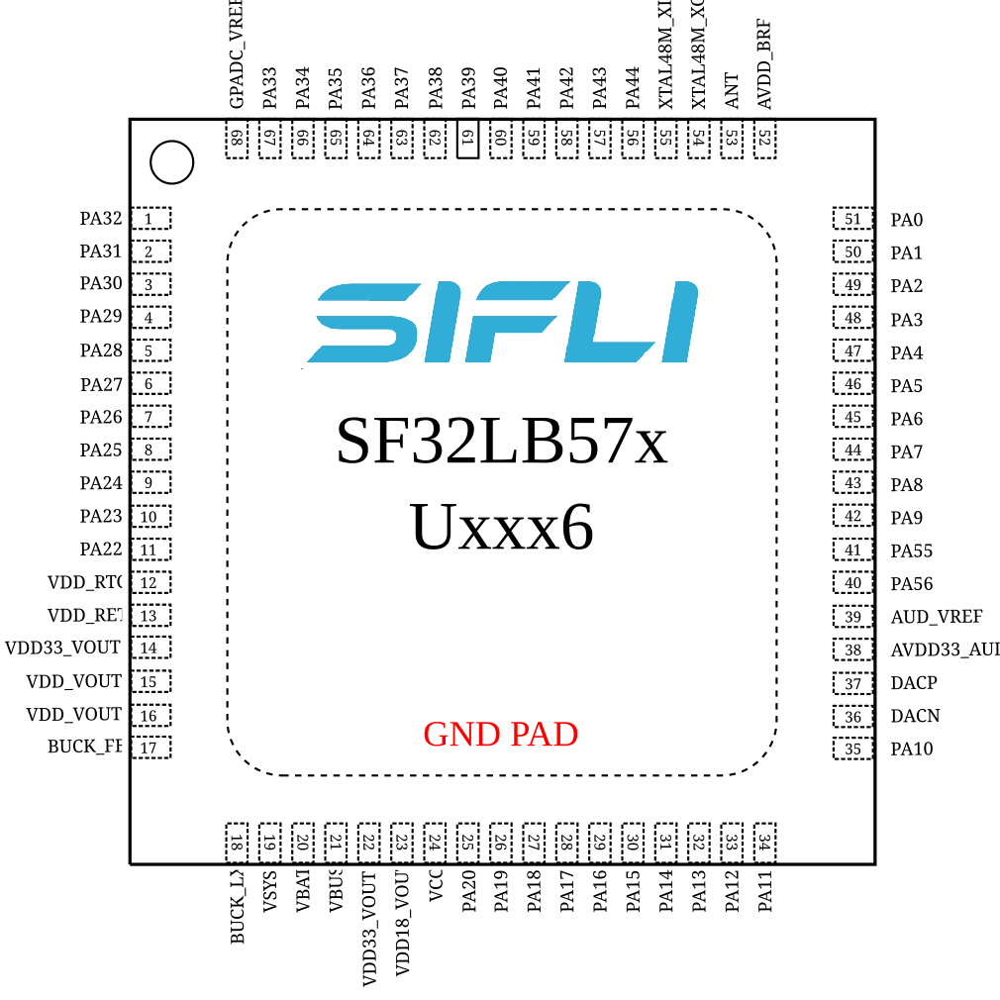{ width="100%" loading="lazy" }

<em>Figure 3.3-2: QFN68L Battery-Powered Variant Pinout</em>

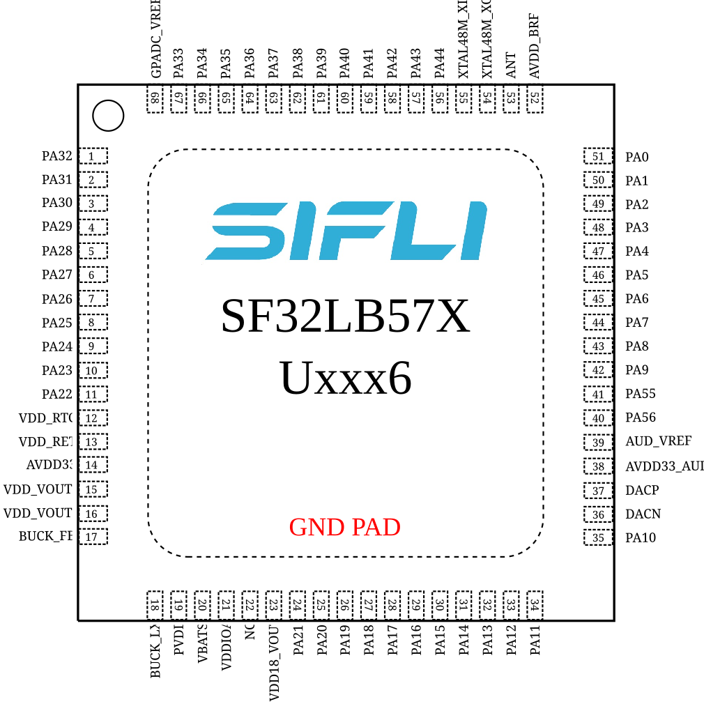{ width="100%" loading="lazy" }

<em>Figure 3.3-3: QFN68L 3.3 V Supply Variant Pinout</em>

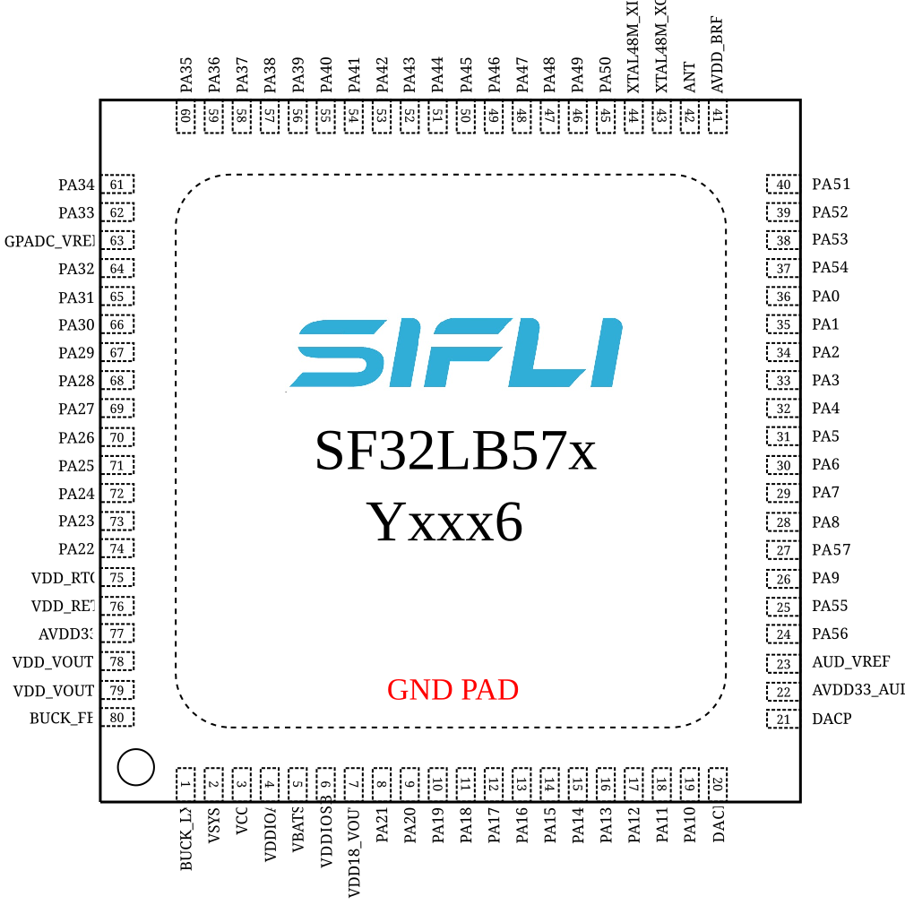{ width="100%" loading="lazy" }

<em>Figure 3.3-4: QFN80L Battery-Powered Variant Pinout</em>

{ width="100%" loading="lazy" }

<em>Figure 3.3-5: QFN80L 3.3 V Supply Variant Pinout</em>

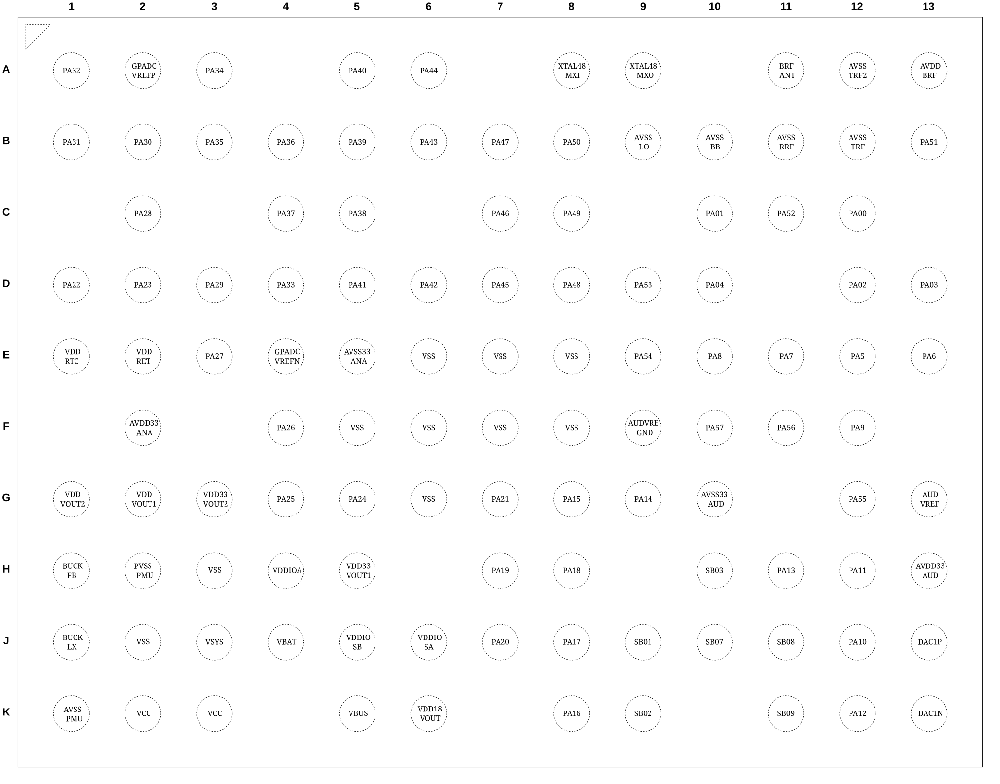{ width="100%" loading="lazy" }

<em>Figure 3.3-6: BGA112 Battery-Powered Variant Pinout</em>

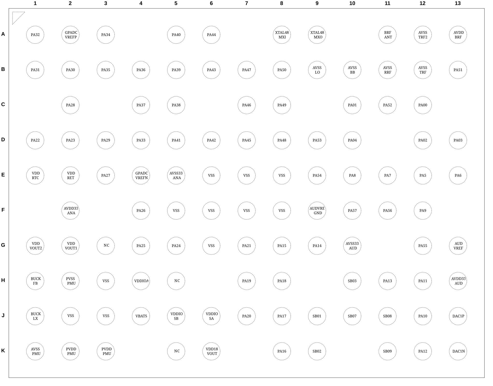{ width="100%" loading="lazy" }

<em>Figure 3.3-7: BGA112 3.3 V Supply Variant Pinout</em>

### 3.4. Major Hardware Features

- Two practical power families: battery-powered variants and externally regulated 3.3 V variants.
- QFN68L, QFN80L, and BGA112 packages, each with package-specific pinout, land-pattern, stencil, and PCB-process requirements.
- Display support for SPI/QSPI, 8080, RGB/DPI, MIPI, EPD, and JDI depending on the exact device and pinout.
- Storage and boot options through package-integrated memory and external MPI/SDIO storage.
- RF, crystal, audio, camera, display, USB, SDIO, and power layouts require early schematic and PCB co-review.

### 3.5. Typical Applications

SF32LB57x is recommended for products that need AI, camera, or advanced display capability alongside Bluetooth connectivity in a compact footprint:

- Smart watches, sports watches, and wearable terminals
- Portable smart terminals and smart-home controls
- AI-enabled sensors and edge inference devices
- Camera-enabled Bluetooth products
- Advanced display devices using SPI/QSPI, RGB/DPI, MIPI, EPD, or JDI panels
- Products that need compact QFN or BGA packaging with rich GPIO and storage options

## 4. Design at a Glance

### 4.1. Hardware Architecture

<em>Table 4.1-1: Design at a Glance</em>

| Design Item | Typical Implementation |
|:---|:---|
| Power families | Battery-powered variants or externally regulated 3.3 V variants; do not mix power schematics |
| Packages | QFN68L, QFN80L, BGA112; select pinout, POD, land pattern, and stencil by exact orderable part number |
| PCB process | QFN supports PTH-style compact routing; BGA requires early fanout/process confirmation |
| Clocks | 48 MHz main crystal and 32.768 kHz RTC crystal |
| RF | 50 Ω antenna path, π matching network near the chip, local RF supply filtering |
| Display | SPI/QSPI, 8080, RGB/DPI, MIPI, EPD, or JDI depending on device capability and pinout |
| Storage | Package-integrated memory and external MPI/SDIO storage options; boot media must be fixed before layout |
| Audio | Analog audio input/output, PDM/I2S, microphone bias, audio reference, and external PA options |
| Camera | DCMI camera interface; route and power it as a noise-sensitive high-speed interface |
| Debug and production | DBG-UART, SWD, boot configuration, PA00/PA01/PA34, power rails, and production test points |

### 4.2. Hardware Design Flow

<em>Table 4.2-1: Hardware Design Flow</em>

| Step | Design Decision | Primary Sections |
|:---|:---|:---|
| 1 | Confirm exact orderable part number, power family, package, and pinout | Device Overview |
| 2 | Freeze boot storage, display interface, camera use, debug access, and low-power targets | Design at a Glance, Schematic Design |
| 3 | Define the power tree, charging/OVP strategy, BUCK/LDO components, and power-up behavior | Power System |
| 4 | Select clock sources, RF topology, storage, display, audio, camera, and general interfaces | Clock Generation, RF, User Interfaces, Storage and Connectivity |
| 5 | Review package footprint, stack-up, fanout, RF, crystals, USB, SDIO, display, audio, and power layouts | PCB Layout Guidelines |
| 6 | Complete the customer self-check and archive schematic, layout, AVL, DRC/ERC, impedance, power, RF, and production evidence before EVT | Customer Design Self-Check |

### 4.3. How to Use This Guide

Use this guide in board-review order. First confirm the exact SF32LB57x orderable part number and power family, lock the package and PCB process, and review the datasheet together with the matching minimum-system schematic in Section 5.1. Next define the power tree, boot medium, and required debug/download access, then assign IO functions from the pin-mux table according to the product requirements. After the minimum-system path is fixed, review clocks, RF, display, storage, audio, camera, general interfaces, PCB layout, and production access. Section 5 is the schematic baseline, Section 6 is the PCB implementation baseline, and Section 7 is the customer self-check before schematic or layout release.

### 4.4. Review Evidence Pack

Before EVT, archive the datasheet/user-manual/reference-design versions, schematic PDF, PCB stack-up, impedance report, DRC/ERC reports, power tree, low-power budget, charging path, boot path, production test-point list, and focused screenshots for RF, crystals, USB, SDIO, display, camera, audio, GPADC, and package fanout.

## 5. Schematic Design Guidelines

This chapter follows the normal board bring-up order. Complete the minimum system design first; otherwise the first board may fail to power up, boot from storage, download firmware, or enter debug. After that baseline is closed, review the detailed power system, clock generation, RF path, display, audio, camera, sensors, and other product-specific functions.

<em>Table 5-1: Schematic Section Map</em>

| Group | Main Decisions | Release Evidence |
|:---|:---|:---|
| Minimum System Design | Package and power-family match, boot straps, boot media, debug/download access | Matching minimum-system schematic, boot table, debug test points |
| Power System | Power family, power tree, charging/OVP, BUCK, low-power rails, operating modes, wake behavior | Rail plan, OVP/charging review, rail measurements, low-power current plan |
| Clock Generation | 48 MHz main crystal, 32.768 kHz RTC crystal, crystal calibration assumptions | Crystal spec check, placement plan, calibration plan |
| RF | RF matching and antenna path | RF impedance plan, RF matching and layout screenshots |
| User Interfaces | Display, touch/backlight, audio, camera, buttons, motor | Interface schematics, power sequencing, pin assignments, validation plan |
| Storage and Connectivity | Storage, boot, GPIO, UART/I2C/SPI/SDIO/USB/CAN/GPADC | Boot table, storage power plan, bus allocation, high-speed routing evidence |
| Manufacturing | Production programming, calibration, fixture access, and reliability checks | Test-point drawing, fixture and programming plan |

### 5.1. Minimum System Design

#### 5.1.1. Minimum System Design Sequence

Bring-up failures most often trace back to the minimum system, power family, boot mode, storage pull-ups, crystal selection, BUCK components, or missing download access. Freeze these items before assigning product peripherals:

1. Match the minimum-system schematic to the package and power family.
2. Set `PA00` / `PA01` boot and debug behavior, and reserve recovery access.
3. Select the boot medium and apply the required `PA13` / `PA15` / `PA17` pull-ups.
4. Define the power-tree outline, charger/OVP path, BUCK inductor/capacitors, and default rail states, then complete the detailed review in Section 5.2.
5. Select the 48 MHz and 32.768 kHz crystals and confirm the calibration plan in Section 5.3.
6. Reserve DBG-UART, SWD, boot-mode, power, ground, and fixture test points.

#### 5.1.2. Minimum System Schematics

SF32LB57x has six minimum-system schematic variants. Use the one that matches both package and power family; do not mix battery-powered and 3.3 V supply variants.

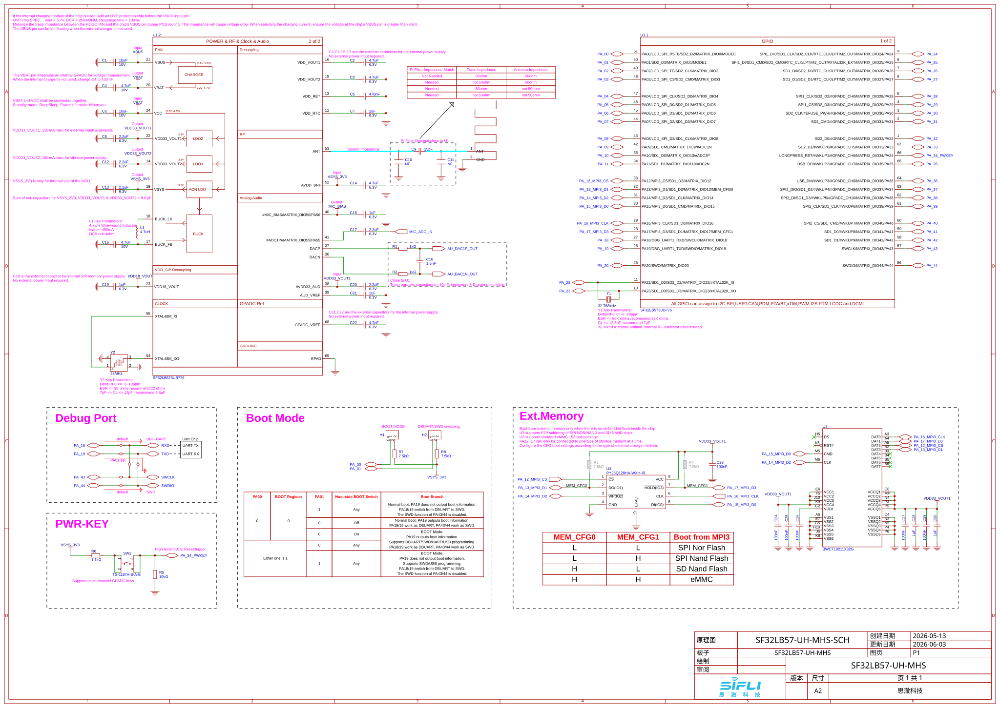{ width="100%" loading="lazy" }

<em>Figure 5.1.2-1: QFN68L Battery-Powered Minimum System</em>

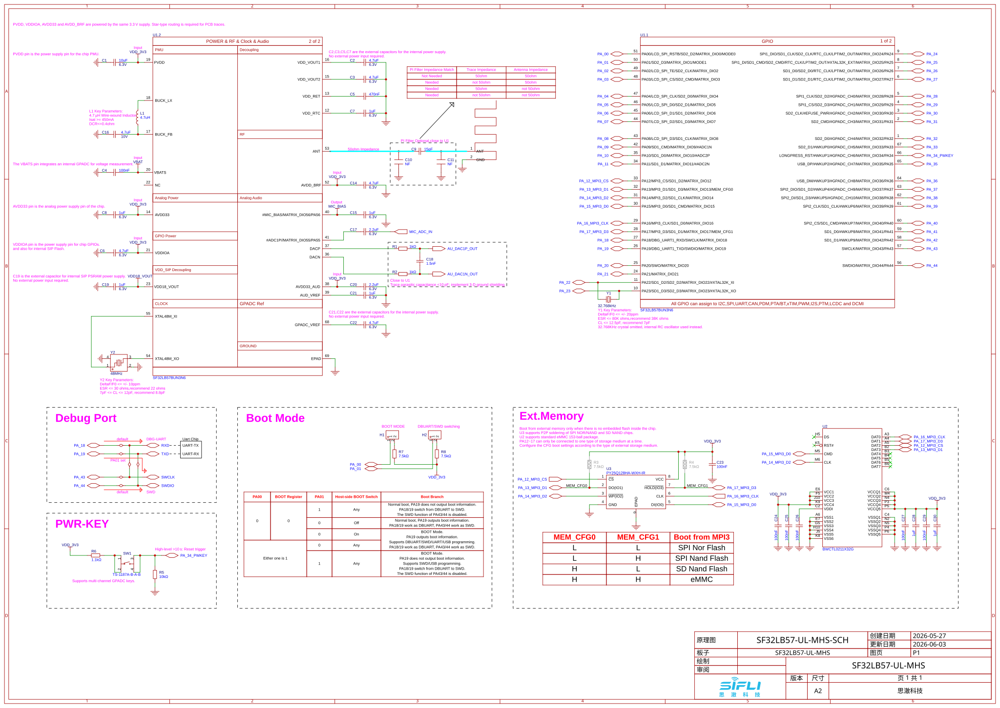{ width="100%" loading="lazy" }

<em>Figure 5.1.2-2: QFN68L 3.3 V Supply Minimum System</em>

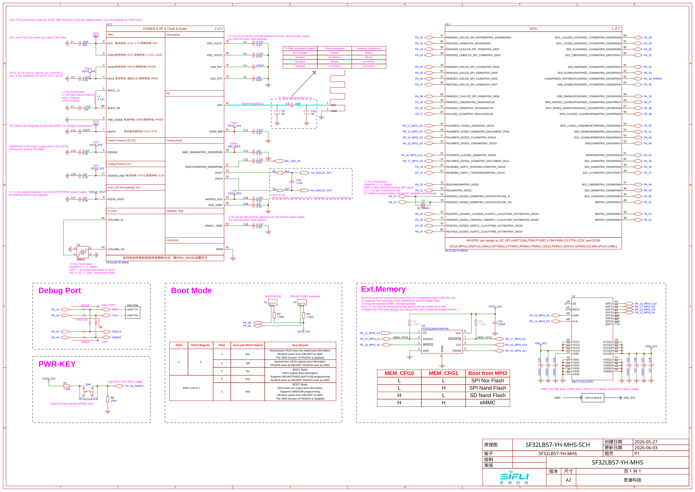{ width="100%" loading="lazy" }

<em>Figure 5.1.2-3: QFN80L Battery-Powered Minimum System</em>

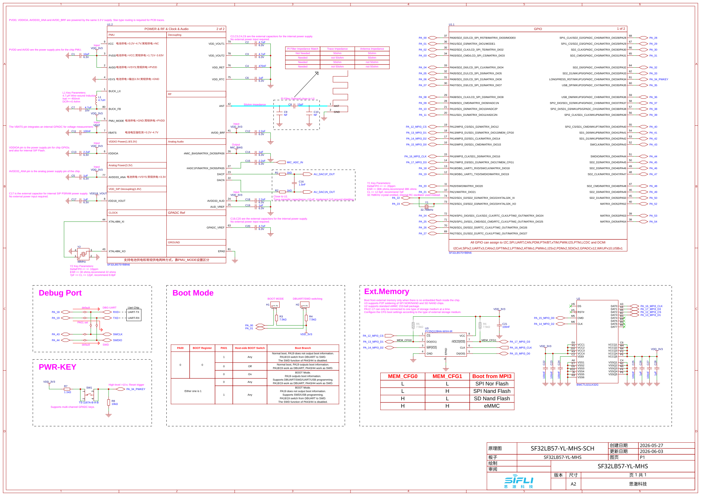{ width="100%" loading="lazy" }

<em>Figure 5.1.2-4: QFN80L 3.3 V Supply Minimum System</em>

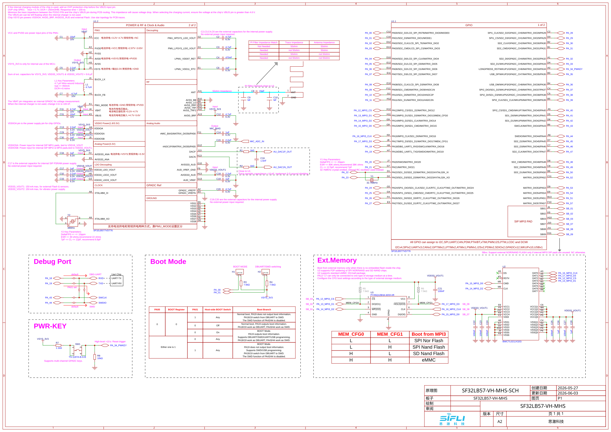{ width="100%" loading="lazy" }

<em>Figure 5.1.2-5: BGA112 Battery-Powered Minimum System</em>

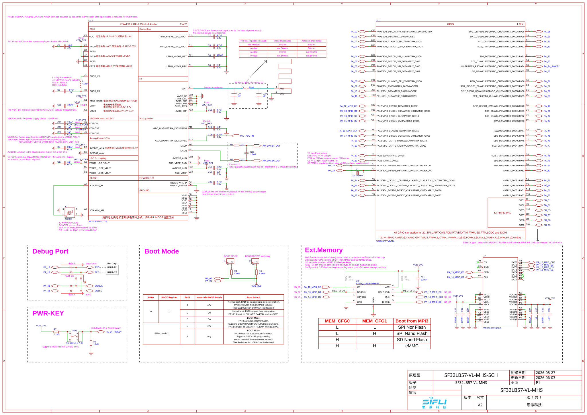{ width="100%" loading="lazy" }

<em>Figure 5.1.2-6: BGA112 3.3 V Supply Minimum System</em>

#### 5.1.3. Boot Storage and Strap Configuration

Select the boot medium before schematic freeze. Package-integrated memory may already consume an MPI channel, and external media have different pull-up and power-control requirements.

<em>Table 5.1.3-1: External Boot Media Selection</em>

| `Bootstrap[1]` (`PA13`) | `Bootstrap[0]` (`PA17`) | External Boot Media |
|:------------------------|:------------------------|:--------------------|
| L | L | SPI NOR Flash |
| L | H | SPI NAND Flash |
| H | L | SD NAND Flash |
| H | H | eMMC |

<em>Table 5.1.3-2: External Boot Media Pull-Up Requirements</em>

| Boot Media | Pull-Up Requirement |
|:-----------|:--------------------|
| SPI NOR Flash | No external pull-up is required on `PA13` / `PA17`. |
| SPI NAND Flash | `PA17` requires a 7.5 kohm pull-up; `PA13` does not require pull-up. |
| SD NAND Flash | `PA13` and `PA15` require 7.5 kohm pull-ups; `PA17` does not require pull-up. |
| eMMC | `PA13`, `PA15`, and `PA17` all require 7.5 kohm pull-ups. |

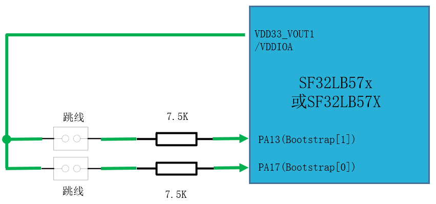{ width="100%" loading="lazy" }

<em>Figure 5.1.3-1: Recommended Bootstrap Pin Circuit</em>

For battery-powered variants, SPI NOR Flash may be powered from `VDD33_VOUT1` without an additional switch. SPI NAND, SD NAND, and eMMC normally require a controlled power switch, and external-media boot designs must ensure that the storage rail is on by default during boot. Use `PA21` as the external boot-media power-switch enable where the selected package exposes it; otherwise choose a pin with a safe default state. If package-integrated storage already occupies MPI3, external MPI3 usage is limited to SD NAND or eMMC; do not attach external SPI NOR/SPI NAND to that channel.

#### 5.1.4. Debug and Download Access

Reserve debug and recovery access before product IO assignment. Many first-board failures become difficult to recover if the default DBG-UART, boot straps, or SWD path are inaccessible.

<em>Table 5.1.4-1: Recommended Debug and Download Test Points</em>

| Test Point | Recommendation | Purpose |
|:-----------|:---------------|:--------|
| Power input | `VBAT` or 3.3 V, plus `VSYS` / `VDD33_VOUT1` when needed | Fixture power, current measurement, low-power validation. |
| GND | Multiple ground test points | Download, debug, calibration, and current-test return path. |
| DBG-UART | `PA18` / `PA19`, corresponding to `DBG_UART_RXD` / `DBG_UART_TXD` | Default download, log, and production programming. |
| SWD | `PA43` / `PA44` or the SWDIO/SWCLK pins defined by the part number | Debug and failure analysis. |
| Boot mode | `PA00` or the boot-mode select pin defined by the part number | Enter download or recovery mode. |
| SWD switch | `PA01` or corresponding configuration pin | Used when SWD pin location must be switched. |
| Power key / wake | `PA34` or corresponding key pin | Fixture power-on, reset, or wake test. |

!!! warning
    Production test points should include both `DBG_UART_RXD` and `DBG_UART_TXD`. Do not accidentally reserve RXD twice.

### 5.2. Power System

#### 5.2.1. Power Tree Planning

Draw the power tree before schematic entry, and label each rail with source, default state, maximum load, sleep state, and controlling GPIO.

<em>Table 5.2-1: Power Rail Planning Quick Reference</em>

| Rail Category | Planning Focus |
|:--------------|:---------------|
| Always-on rails | Keep only RTC, wake, required detection, and Bluetooth retention circuits. Calculate static current item by item. |
| Switchable peripheral rails | Prefer load switches or switchable LDOs for display, backlight, sensors, motor, external storage, and camera. |
| Analog/RF/audio rails | Filter separately, keep loops short, and isolate from high-current and high-speed digital areas. |
| Boot-media rail | The default state must support boot, while the sleep state must prevent back-powering and leakage. |
| Pull-up rails | Design I2C, key, sensor interrupt, and other pull-up rails together with the corresponding peripheral power policy. |

#### 5.2.2. Battery-Powered Variants

Battery-powered variants commonly use `VBUS`, `VBAT`, `VCC`, `VSYS`, `BUCK_LX`, `BUCK_FB`, internal LDO outputs, audio supply pins, and RF supply pins.

Key requirements:

- Keep `VBUS` within the allowed input range and add OVP protection.
- Connect `VBAT` to the battery and use it for battery voltage sensing.
- Treat `VCC` as the main system input. Use sufficient trace width and place decoupling capacitors close to the chip.
- Use `VSYS` only for the purposes allowed by the datasheet, typically internal or specified analog/RF-related supply paths.
- Use `VDD33_VOUT1`, `VDD33_VOUT2`, and other internal regulator outputs only for explicitly permitted loads. Do not use these rails as general-purpose peripheral supplies.
- Connect `AVDD_BRF` and `AVDD33_AUD` from the recommended source rails with local filtering.

#### 5.2.3. 3.3 V Supply Variants

3.3 V variants typically use an external 3.3 V rail for `PVDD`, `AVDD33`, `AVDD_BRF`, `AVDD33_AUD`, `VDDIOA`, and related domains.

Key requirements:

- Use star-style distribution for important 3.3 V domains.
- Filter analog, RF, and audio supplies separately from high-current or high-speed digital paths.
- If `VBATS` is used for battery sensing, verify the input range and filtering.
- Internal references and internal LDO output pins should only be connected to the required external capacitors. Do not drive them from an external voltage source.

#### 5.2.4. Power Capacitor and Usage Quick Reference

Use this table for schematic pre-review. Final values must still be checked against the datasheet and reference design.

<em>Table 5.2-2: Power Capacitor and Usage Quick Reference</em>

| Rail / Pin | Typical External Capacitor | Main Use | Design Notes |
|:-----------|:---------------------------|:---------|:-------------|
| `VBUS` | >= 10 uF | USB / charger input | Battery-powered variants only; add OVP/ESD/EOS protection. |
| `VBAT` | >= 4.7 uF | Battery connection and battery voltage sensing | Keep the battery path short and wide; avoid parallel routing with sensitive traces. |
| `VCC` / `PVDD` | >= 10 uF | Main PMU / system input | Place decoupling close to the chip and size the trace for current. |
| `VSYS` | About 2.2 uF | Internal or specified analog/RF-related supply | Do not use as a general peripheral supply; control total load and capacitance. |
| `VDD33_VOUT1` | 2.2 uF / 6.3 V | Packaged Flash, external NOR/NAND Flash, and `AVDD33_AUD` only | Do not use for heart-rate sensors or other ordinary peripherals; soft-start load current must stay within the source limit. |
| `VDD33_VOUT2` | About 2.2 uF | Display, motor, or specified switchable loads | Default state and inrush current must match firmware configuration. |
| `VDD18_VOUT` | Use the selected minimum-system schematic | Internal / package-integrated PSRAM-related 1.8 V supply | Do not use as an external 1.8 V peripheral supply. |
| `VDD_VOUT1` / `VDD_VOUT2` | 4.7 uF / 6.3 V each | Internal LDO outputs | Internal supplies only; do not power external peripherals. |
| `VDD_RET` / `VDD_RTC` | 0.47 uF / 6.3 V for `VDD_RET`; 1 uF / 6.3 V for `VDD_RTC` | Retention and RTC internal supplies | Place capacitors close to the pins. |
| `AVDD_BRF` | About 4.7 uF | RF analog supply | Place the capacitor close to the chip with short multi-via grounding. |
| `AVDD33_AUD` | About 2.2 uF | Audio analog supply | Keep away from DC/DC, RF, USB, SDIO, and display clocks. |
| `MIC_BIAS` | 1 uF / 6.3 V | Microphone bias | Use only as microphone bias. |
| `AUD_VREF` / `GPADC_VREF` | 1 uF for `AUD_VREF`; 4.7 uF for `GPADC_VREF` | Internal reference | Capacitor only; never drive externally. |

#### 5.2.5. BUCK Inductor and Feedback

Recommended BUCK inductor parameters:

<em>Table 5.2-3: BUCK Inductor Recommended Parameters</em>

| Parameter | Recommended Value |
|:----------|:------------------|
| Inductance | 4.7 uH ±20% |
| DCR | <= 0.4 ohm |
| Saturation current | >= 450 mA |

PCB requirements:

- Place the inductor, output capacitor, and feedback capacitor close to the chip.
- Keep the `BUCK_LX` loop short and wide. Avoid copper pours and sensitive traces in this region.
- Keep the `BUCK_FB` trace reasonably wide; 0.25 mm or wider is recommended.
- Keep a solid reference ground near the inductor area and avoid coupling noise into crystals, RF, audio, and GPADC traces.
- If the product contains sensitive blocks such as GPS, heart-rate sensing, ECG, or analog microphones, reserve optional EMI-tuning footprints near the BUCK_LX area. Final values should be selected during system EMC validation.

#### 5.2.6. Charging and OVP

Battery products can use an external charger or the integrated charging block.

<em>Table 5.2-4: Charging Option Comparison</em>

| Option | Best Use | Notes |
|:-------|:---------|:------|
| External charger without PPM | Cost-focused products powered directly from the battery | Immediate screen-on after charger insertion may not be available. |
| External charger with PPM | Products that need immediate system power or screen-on after charger insertion | Recommended for a better charging user experience. |
| Integrated charger | Lower BOM and simpler design | If the battery is deeply discharged, the system may need to charge above the boot threshold before the UI can start. |

OVP guidance:

- `VBUS` must never exceed the allowed input range.
- For adjustable-OVLO OVP devices, use 1% divider resistors and an OVLO threshold tolerance below 3%.
- For regulated-output OVP devices, keep the output inside the allowed `VBUS` range and verify charge-current capability.
- Route the charger input through TVS/OVP protection before it reaches the chip.

#### 5.2.7. Low-Power Supply Strategy

Low-power behavior must be designed into the schematic.

Recommendations:

- Use load switches or switchable LDOs for display, backlight, sensors, motor, and external storage.
- Set safe default states for load-switch EN pins using 1 Mohm to 5.1 Mohm class pull-up or pull-down resistors.
- Power I2C pull-ups from the same rail as the corresponding peripheral to avoid sleep leakage.
- Choose low-Iq and low-shutdown-current parts for always-on circuits.
- If `VSYS` or an always-on LDO is used as a GPIO pull-up rail, include that leakage in the sleep-current budget.

#### 5.2.8. Power and Charging Reference Figures

The SF32LB57x reference schematics and layout examples cover the power tree, POR timing, charging path, OVP selection, and low-power load-switch strategy. Review battery-powered examples separately from 3.3 V supply examples so the two power families are not mixed.

Battery-powered reference figures:

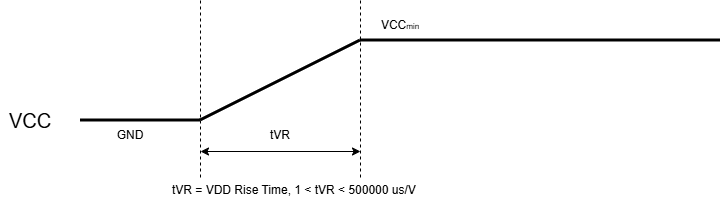{ width="100%" loading="lazy" }

<em>Figure 5.2-1: Battery-Powered Variant Power-Up Timing</em>

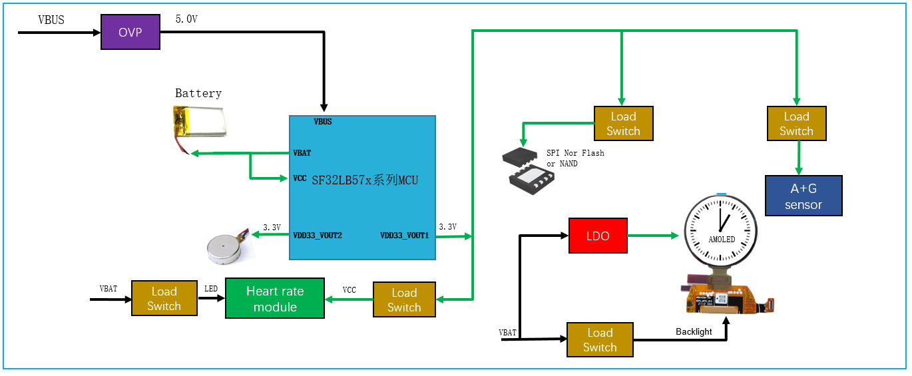{ width="100%" loading="lazy" }

<em>Figure 5.2-2: Battery-Powered System Power Structure</em>

3.3 V supply reference figures:

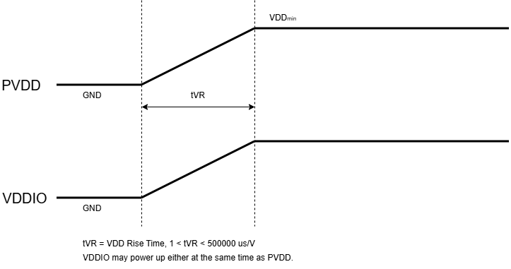{ width="100%" loading="lazy" }

<em>Figure 5.2-3: 3.3 V Supply Variant Power-Up Timing</em>

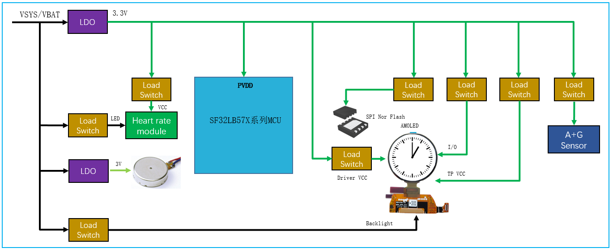{ width="100%" loading="lazy" }

<em>Figure 5.2-4: 3.3 V Supply System Power Structure</em>

Charging and OVP reference figures:

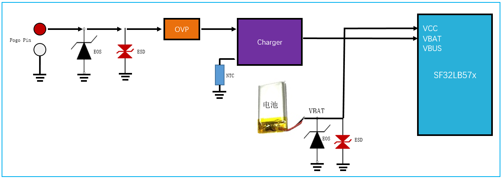{ width="100%" loading="lazy" }

<em>Figure 5.2-5: External Charger Without PPM</em>

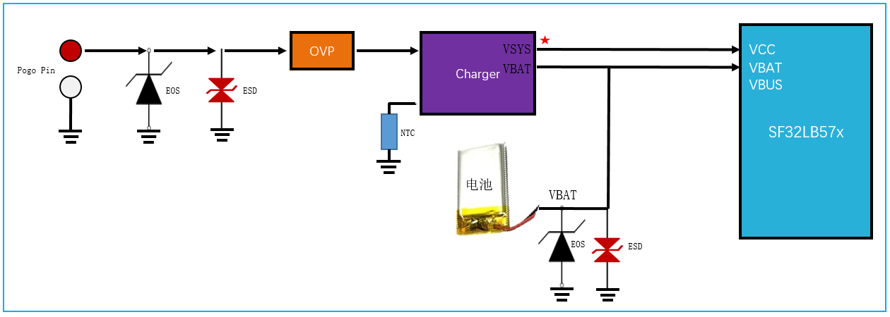{ width="100%" loading="lazy" }

<em>Figure 5.2-6: External Charger With PPM</em>

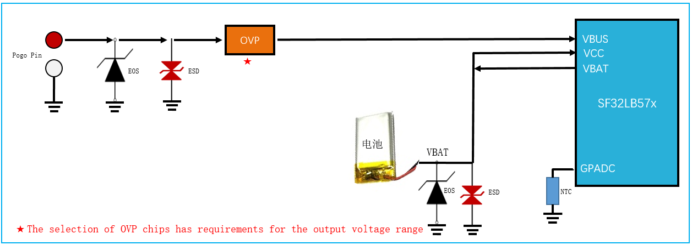{ width="100%" loading="lazy" }

<em>Figure 5.2-7: Integrated Charger Reference Circuit</em>

{ width="100%" loading="lazy" }

<em>Figure 5.2-8: Adjustable OVLO OVP Application</em>

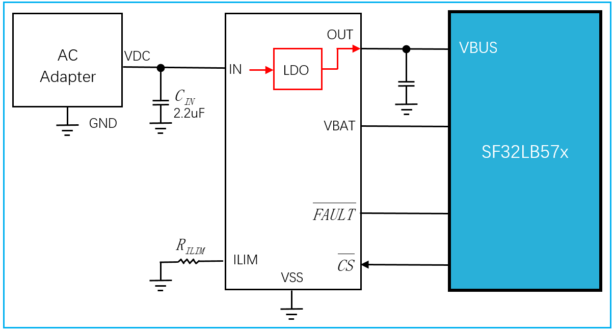{ width="100%" loading="lazy" }

<em>Figure 5.2-9: Regulated-Output OVP Application</em>

#### 5.2.9. Package and Power-Family Electrical Constraints

The SF32LB57x power requirements differ by package and power family. The must-check differences are consolidated below; final schematics should still be reviewed against the minimum-system schematic and datasheet for the selected package.

<em>Table 5.2-5: Key Power-Family Differences</em>

| Design Item | Battery-Powered Variants | 3.3 V Supply Variants |
|:------------|:-------------------------|:----------------------|
| Main power input | `VBUS` 4.6 V to 5.5 V. `VBAT` is the battery connection and charger output/sense node; keep it within the 3.2 V to 4.7 V battery-domain range. `VCC` is the system input. The pin table lists 3.2 V to 4.7 V, while the design self-check uses 3.45 V to 4.7 V because 3.45 V is the hardware boot threshold. The default software low-battery threshold is 3.48 V; for constant bench supply, use 3.6 V to 4.7 V, with 3.8 V recommended. | `PVDD` / `PVDD_PMU` 2.97 V to 3.63 V; `VBATS` is only for battery-voltage sensing. |
| Analog and RF supplies | `AVDD_BRF` is supplied by `VSYS`; `AVDD33_AUD` is supplied by `VDD33_VOUT1`. | `AVDD33` / `AVDD33_ANA`, `AVDD_BRF`, `AVDD33_AUD`, and `VDDIOA` are supplied by external 3.3 V and should use star routing. |
| Internal LDO outputs | `VDD_VOUT1`, `VDD_VOUT2`, `VDD_RET`, `VDD_RTC`, and `VDD18_VOUT` are internal supplies and should not power ordinary external peripherals. | Same; `VDD18_VOUT` is only for internal/package-integrated PSRAM-related supply, not external 1.8 V peripherals. |
| `VDD33_VOUT1` | 3.3 V, 150 mA after startup, enabled by default; soft-start load current must not exceed 15 mA. Use only for packaged Flash, external NOR/NAND Flash, and `AVDD33_AUD`. Do not power heart-rate sensors or other ordinary peripherals from this rail; use an independent controlled supply instead. | Not applicable. |
| `VDD33_VOUT2` | 3.3 V, 150 mA, disabled by default and enabled by software; load current must not exceed 30 mA during soft start. | Not applicable. |
| `VDDIOSB` / `VDDIOSA` | QFN80L and BGA112 designs must follow the package-integrated memory type: PSRAM typically uses 1.8 V, while NOR Flash typically uses 3.3 V. | Same; confirm against the exact orderable part number. |

<em>Table 5.2-6: Key Capacitors and Load Limits</em>

| Rail / Pin | Source Requirement |
|:-----------|:------------------------|
| `VBUS` | Battery-powered variants require at least 10 uF / 10 V when the integrated charger is used. |
| `VBAT` | At least 4.7 uF / 10 V; battery voltage is sensed by an internal GPADC channel. |
| `VCC` / `PVDD` | `VCC` requires at least 10 uF / 10 V; `PVDD` requires at least 10 uF / 6.3 V. |
| `VSYS` | 2.2 uF / 6.3 V; total capacitance on this domain should not exceed 9.6 uF and the rail should only supply specified internal/analog/RF-related loads. |
| `VDD33_VOUT1` / `VDD33_VOUT2` | 2.2 uF / 6.3 V each; total capacitance on each domain should not exceed 9.6 uF. |
| `VDD_VOUT1` / `VDD_VOUT2` | 4.7 uF / 6.3 V each. |
| `VDD_RET` / `VDD_RTC` | `VDD_RET` uses 0.47 uF / 6.3 V; `VDD_RTC` uses 1 uF / 6.3 V. |
| `AVDD_BRF` / `AVDD33_AUD` | `AVDD_BRF` uses 4.7 uF / 6.3 V; `AVDD33_AUD` uses 2.2 uF / 6.3 V. |
| `AUD_VREF` / `GPADC_VREF` | Capacitor only; do not drive externally. Typical values are 1 uF for `AUD_VREF` and 4.7 uF for `GPADC_VREF`. |
| `MIC_BIAS` | 1 uF / 6.3 V, used only as microphone bias. |

<em>Table 5.2-7: Charging and OVP Must-Check Items</em>

| Item | Requirement |
|:-----|:------------|
| Integrated charger use case | Use only when the product can wait until the battery reaches about 3.6 V before firmware powers up the display. |
| Immediate screen-on requirement | If the product must turn on the display immediately after charger insertion, use an external charger with PPM power-path management. |
| Battery specification | `VBAT` charging supports 4.2 V to 4.45 V rated batteries; pre-charge is about 40 mA, and maximum charge current is 1C up to 400 mA. |
| Adjustable OVLO OVP | Use 1% divider resistors; keep OVLO threshold error below 3%; evaluate a target range of 5.15 V to 5.55 V. |
| Regulated-output OVP | LDO-output OVP is recommended; output should be 4.7 V to 5.4 V, load capability at least 0.5 A, and OCP threshold at least 0.7 A. |
| Integrated charger not used | `VBUS` may be left floating and its capacitor may be omitted; in this case `VBAT` does not provide output power. |

#### 5.2.10. Operating Modes and Wake Sources

Operating modes and wake sources belong to the power-system review because they determine which rails, pull-ups, external loads, and wake-capable GPIOs remain active in each low-power state.

#### 5.2.11. Power Modes

<em>Table 5.2-8: Power Mode Comparison</em>

| Mode | CPU | Peripherals | SRAM | IO | Typical Wake Sources | Typical Wake Time |
|:-----|:----|:------------|:-----|:---|:---------------------|:------------------|
| Active | Run | Run | Accessible | Toggles | - | - |
| Sleep | Stop | Run | Accessible | Toggles | Any interrupt | <0.5 us |
| DeepSleep | Stop | Stop | Retained, inaccessible | Level held | RTC, wake IO, GPIO, LPTIM, Bluetooth | ~250 us |
| Standby | Reset | Reset | Retained, inaccessible | Level held | RTC, wake IO, LPTIM, Bluetooth | ~1 ms |
| Hibernate | Reset | Reset | Not retained | High-Z | RTC, wake IO | >2 ms |

#### 5.2.12. Wake Design

- Connect keys, touch interrupts, and sensor interrupts that need wake capability to wake-capable GPIOs.
- Plan external hardware wake signals preferably within the `PA33` to `PA42` range and label the wake function in the schematic.
- Review IO hold, high-Z, pull-up, pull-down, and peripheral supply states in Standby and Hibernate.
- USB attach wake requires a VBUS divider connected to a wake-capable GPIO with the correct IO voltage.
- Bluetooth, RTC, and external wake behavior should be reviewed together with firmware low-power policy.

#### 5.2.13. Low-Power Validation

During EVT, measure at least these states:

<em>Table 5.2-9: Low-Power Validation States and Goals</em>

| State | Measurement Goal |
|:------|:-----------------|
| Shutdown / shipping mode | Confirm long-term battery leakage and peripheral back-powering. |
| Hibernate | Confirm minimum system current when SRAM is not retained. |
| Standby | Confirm IO hold, RTC/wake sources, and Bluetooth wake policy. |
| DeepSleep | Confirm baseline current for common connected-standby scenarios. |
| Screen-on idle | Confirm combined current of display, backlight, touch, sensors, and Bluetooth. |
| Charging | Confirm VBUS, VBAT, thermal behavior, OVP, and system power path. |

<em>Table 5.2-10: Standby/Hibernate External Wake Pins</em>

| Wake Source | Pin |
|:------------|:----|
| `WKUP_PIN0` | `PA33` |
| `WKUP_PIN1` | `PA34` |
| `WKUP_PIN2` | `PA35` |
| `WKUP_PIN3` | `PA36` |
| `WKUP_PIN4` | `PA37` |
| `WKUP_PIN5` | `PA38` |
| `WKUP_PIN6` | `PA39` |
| `WKUP_PIN7` | `PA40` |
| `WKUP_PIN8` | `PA41` |
| `WKUP_PIN9` | `PA42` |

Record firmware version, supply voltage, battery-simulator setting, peripheral connection state, Bluetooth connection state, and ambient temperature for every measurement.

### 5.3. Clock Generation

Clock generation covers the 48 MHz main crystal, the 32.768 kHz RTC crystal, and the calibration assumptions that affect RF, Bluetooth, RTC accuracy, and low-power behavior. Keep crystal selection and layout constraints visible during schematic review and PCB placement.

#### 5.3.1. 48 MHz Main Crystal

Recommended parameters:

<em>Table 5.3-1: 48 MHz Main Crystal Recommended Parameters</em>

| Parameter | Recommendation |
|:----------|:---------------|
| Load capacitance CL | 7 pF to 12 pF, about 8.8 pF recommended |
| Frequency tolerance | <= ±10 ppm |
| ESR | <= 30 ohm, about 22 ohm recommended |

Layout requirements:

- Place the crystal close to the chip pins, preferably inside the shield-can area.
- Keep it away from PA, charger, PMU, DC/DC, battery, and high-speed digital traces.
- Route on the top layer when practical, with a length of about 3 mm to 10 mm.
- Keep the top-layer crystal keep-out consistent with the reference design. Keep the adjacent layer as a continuous ground reference where possible, and do not route signals under the crystal area.
- Use 3D ground shielding, but avoid placing ground too close to the oscillation traces.

The 48 MHz crystal load capacitance and trim setting must be validated on product hardware. If a 7 pF or 12 pF crystal is used instead of the recommended 8.8 pF class, do not assume the default software setting will meet frequency-error requirements; include crystal frequency calibration in the production bring-up flow.

#### 5.3.2. 32.768 kHz RTC Crystal

Recommended parameters:

<em>Table 5.3-2: 32.768 kHz RTC Crystal Recommended Parameters</em>

| Parameter | Recommendation |
|:----------|:---------------|
| Load capacitance CL | <= 12.5 pF, about 7 pF recommended |
| Frequency tolerance | <= ±20 ppm |
| ESR | <= 80 kohm, about 38 kohm recommended |

Layout requirements:

- Place the crystal close to the chip and keep traces short.
- Keep trace length within about 10 mm.
- Keep enough spacing between the two crystal traces and add ground shielding.
- Keep the top-layer crystal keep-out consistent with the reference design. Keep the adjacent layer as a continuous ground reference where possible, and do not route signals under the crystal area.
- Keep the crystal area away from power, RF, USB, SDIO, display clock, and charging noise.

<em>Table 5.3-3: Source Recommended Crystal Parts</em>

| Crystal | Part Number | Vendor | Key Parameters |
|:--------|:------------|:-------|:---------------|
| 48 MHz | E1SB48E001G00E | Hosonic | CL = 8.8 pF, ESR <= 22 ohm, TOPR -30 to 85 °C, 2016 package. |
| 32.768 kHz | ETST00327000LE | Hosonic | CL = 7 pF, ESR <= 70 kohm, TOPR -40 to 85 °C, 3215 package. |
| 48 MHz | SX20Y048000B31T-8.8 | TKD | CL = 8.8 pF, ESR <= 40 ohm, TOPR -20 to 75 °C, 2016 package; higher ESR slightly increases standby current. |
| 32.768 kHz | SF32K32768D71T01 | TKD | CL = 7 pF, ESR <= 70 kohm, TOPR -40 to 85 °C, 3215 package. |
| 32.768 kHz | SF32WK32768D71T005 | TKD | CL = 7 pF, ESR <= 70 kohm, TOPR -40 to 85 °C, 3215 package. |
| 48 MHz | CN4048M000885C822000 | JWT | CL = 8.8 pF, ESR <= 22 ohm, TOPR -30 to 85 °C, 2016 package. |
| 32.768 kHz | DH2032K76807T2719002 | JWT | CL = 7 pF, ESR <= 70 kohm, TOPR -40 to 85 °C, 3215 package. |

The 32.768 kHz crystal `CL` must match register configuration: for 7 pF, set `PMUC->LXT_CR->CAP_SEL = 0`; for 11.5 pF, set `PMUC->LXT_CR->CAP_SEL = 1`. Confirm this setting in firmware before EVT, because the recommended crystal list is mainly 7 pF while some firmware defaults may target a different load-capacitance option.

### 5.4. RF

#### 5.4.1. RF Schematic

Key RF schematic requirements:

- Reserve a π matching network in the antenna path.
- In the RF matching network, reserve NC capacitors in the shunt positions and place a 15 pF capacitor in the series position by default; final values must be tuned on product hardware.
- Place the matching network near the chip RF pin, not near the antenna end.
- Place the `AVDD_BRF` filter capacitor close to the chip and connect its ground directly to the main ground through nearby vias.
- Plan the antenna, matching network, RF ESD, and connector as one signal chain.

#### 5.4.2. RF PCB

PCB requirements:

- Route the RF trace as single-ended 50 ohm.
- Prefer top-layer routing with minimal vias and layer changes.
- Avoid sharp angles and right-angle corners.
- Add ground copper and via fences along both sides.
- Keep a continuous ground reference under the RF trace.
- Keep RF away from DC/DC, crystals, USB, SDIO, display clocks, charger high-current paths, and other noisy regions.

#### 5.4.3. RF Bring-Up and Calibration

Verify RF performance by measurement; correct schematic connectivity is only the starting point.

Recommended RF bring-up items:

- Confirm 48 MHz crystal frequency error and startup stability.
- Use conducted testing to check transmit power, frequency error, receiver sensitivity, and modulation quality.
- Tune the π matching network with the final enclosure, battery, shield can, and antenna placement.
- Verify RF performance while the display is on, charging is active, USB/SDIO/display refresh is running, motor is active, and audio is operating.
- Ensure the production fixture supports crystal calibration, basic RF testing, and firmware download.

!!! note
    Antenna matching should be completed on hardware close to the final product structure. Bare-board matching results usually do not represent final-product RF performance.

### 5.5. User Interfaces

#### 5.5.1. Display, Touch, and Backlight

Review display, touch, and backlight as one interface group because panel timing, power sequencing, FPC routing, touch wake, ESD, and backlight noise often interact during board bring-up.

#### 5.5.2. Display Interface Selection

SF32LB57x LCDC supports multiple display interface types depending on the exact device.

<em>Table 5.5-1: Display Interface Selection Guide</em>

| Interface | Use Case | Hardware Notes |
|:----------|:---------|:---------------|
| SPI / QSPI | Small TFT/AMOLED and wearable displays | Low pin count, limited bandwidth, good for partial refresh. |
| 8080 MCU | Parallel display panels | Higher bandwidth than serial interfaces but uses more pins. |
| RGB / DPI | Medium and high-resolution panels | Continuous pixel stream, strict bandwidth and timing requirements. |
| MIPI DSI | High-density AMOLED | High bandwidth with low pin count, but more complex initialization and signal integrity. |
| EPD | E-paper | Low refresh rate, requires VCOM, PMIC, and waveform planning. |
| JDI | Memory-in-Pixel low-power displays | Good for always-on and sunlight-readable products. |

Common display notes and examples:

- The display controller supports 3-line SPI, 4-line SPI, Dual data SPI, Quad data SPI, 16-bit RGB, 16-bit MCU 8080, 16-bit EPD, and serial/parallel JDI.
- Supported color depths include RGB888, RGB666, RGB565, and RGB111; maximum resolution can reach 1024 x 1024. Confirm the exact modes for the selected device.
- High-resolution projects should review interface bandwidth, display RAM, PSRAM bandwidth, and refresh strategy early.
- If a project does not need a custom pinout, start from an SDK-adapted or reference-design IO group for the selected panel interface. Matrix routing is flexible, but using a software-supported IO group reduces driver and bring-up risk.
- Panel initialization, power sequence, and interface mode must follow the panel vendor datasheet.

<em>Table 5.5-2: Display IO Starting Points</em>

| Display Interface | Recommended Starting Point |
|:------------------|:---------------------------|
| SPI / QSPI | Prefer the dedicated `LCDC1_SPI_*` pins in the pinmux table. If matrix-mapped LCDC SPI signals are used, keep the display clock at or below 50 MHz and verify drive strength. |
| RGB / DPI | For signals above 30 MHz, use `PA22` to `PA50` for matrix-mapped LCDC signals; `PA52` to `PA54` may only be used for `B1` to `B6`. Lower-speed designs may use matrix mapping with timing review. |
| 8080 MCU | Use the same high-speed pin-group rule as RGB/DPI for fast designs; verify bus width, timing, and drive strength against the panel. |
| EPD | Use the same high-speed pin-group rule as RGB/DPI when the EPD bus runs above 30 MHz; also review VCOM and PMIC control pins. |
| JDI | Follow the LCDC JDI signal mapping table and prefer an SDK-adapted panel configuration where available. |
| MIPI DSI | Use the fixed DSI signal assignment from the selected part and reference design; verify lane routing and panel initialization with the software team. |

<em>Table 5.5-3: Source LCD Driver Examples</em>

| Driver | Vendor | Resolution | Type | Typical Interfaces |
|:-------|:-------|:-----------|:-----|:-------------------|
| RM69090 | Raydium | 368 x 448 | AMOLED | SPI, Quad SPI, MIPI-DSI |
| RM69330 | Raydium | 454 x 454 | AMOLED | SPI, Quad SPI, 8080 MCU, MIPI-DSI |
| ILI8688E | ILITEK | 368 x 448 | AMOLED | Quad SPI, MIPI-DSI |
| SH8601A | Shenghe | 454 x 454 | AMOLED | SPI, Quad SPI, 8080 MCU, MIPI-DSI |
| SPD2012 | Solomon | 356 x 400 | TFT | Quad SPI |
| GC9C01 | Galaxycore | 360 x 360 | TFT | Quad SPI |
| GC9B71 | Galaxycore | 320 x 380 | TFT | Quad SPI |
| ST77903 | Sitronix | 400 x 400 | TFT | Quad SPI |
| ICNA3311 | Chipone | 454 x 454 | AMOLED | Quad SPI |
| FT2308 | FocalTech | 410 x 494 | AMOLED | Quad SPI |

#### 5.5.3. Display and Touch Guidelines

- Control display and backlight power independently; default to off at power-up unless the product requires otherwise.
- For high-speed display clocks, reserve a series resistor and optional NC shunt capacitor footprint for EMI tuning.
- Keep FPC, display connector, and touch traces away from the RF antenna area.
- Connect touch INT to a wake-capable GPIO if touch wake is required.
- Match display, touch IC, and MCU IO voltage domains.
- Add ESD protection for display and touch interfaces where exposed to the outside world.
- Prefer dedicated pin groups for SPI/QSPI display signals. For RGB, 8080, EPD, and other high-speed parallel interfaces, choose pin groups suitable for high-speed output and preserve timing consistency in layout.
- When SPI/QSPI uses matrix routing, limit the clock to 50 MHz or below and configure GPIO drive strength as `DS1 = 0, DS0 = 1`.
- For RGB, MCU8080, and EPD signals above 30 MHz, prefer matrix routing on `PA22` to `PA50`; `PA52` to `PA54` may only carry `B1` to `B6`.

#### 5.5.4. Display Bring-Up Sequence

Bring up the display in stages to avoid too many variables at once:

1. Verify display power, reset, backlight/enable, and panel ID readback.
2. Light solid colors at the lowest stable interface speed; confirm RGB order, color depth, and scan direction.
3. Verify partial refresh windows, TE signal, frame synchronization, or command/video mode behavior.
4. Increase interface speed gradually, then add LVGL, ePicasso, DMA, and backlight dimming.
5. Finally validate sleep, wake, screen-off, screen-on, charger insertion/removal, and Bluetooth-connected operation.

For snow, tearing, wrong colors, or intermittent refresh failures, check panel initialization, interface timing, pixel format, refresh window, cache coherency, and FPC signal integrity first.

#### 5.5.5. Audio

Review audio as one noise-sensitive subsystem: microphone bias, audio references, analog inputs, DAC outputs, digital audio clocks, external PA control, and enclosure acoustics should be checked together.

#### 5.5.6. Analog Audio Input

Guidelines:

- Place MIC_BIAS, AUD_VREF, and AVDD33_AUD decoupling capacitors close to the chip.
- Add a DC-blocking capacitor for analog microphone input; 2.2 uF or larger is recommended.
- Place analog input components close to the chip pins.
- Keep ADCP and other analog traces short, shielded, and away from noise sources.
- When a multiplexed GPIO is used as analog input, configure the pin as high impedance as required.

<em>Table 5.5-4: Audio Signal Connections</em>

| Audio Signal | 57x Signal / Pin | Notes |
|:-------------|:-----------------|:------|
| `MIC_BIAS` | `PA56` | Microphone bias supply. |
| `ADC1P` | `PA55` | Single-ended microphone input or differential positive input. |
| `ADC1N` | `PA09` | Differential negative input. |
| `ADC2P` | `PA10` | Single-ended microphone input or differential positive input. |
| `ADC2N` | `PA11` | Differential negative input. |
| `PDM1_CLK` / `PDM1_DATA` | Any GPIO through matrix routing | PDM digital microphone 1. |
| `PDM2_CLK` / `PDM2_DATA` | Any GPIO through matrix routing | PDM digital microphone 2. |
| `DACP` / `DACN` | Chip analog audio output | Differential analog audio output. |

#### 5.5.7. Analog Audio Output

Guidelines:

- Route DACP/DACN as a differential pair.
- Keep the pair short, length matched, and away from RF, DC/DC, USB, SDIO, and display clocks.
- Place output RC matching networks close to the chip.
- Keep parasitic capacitance within the audio requirement.
- Keep audio supply and reference paths clean and short.

#### 5.5.8. Digital Audio

For I2S and PDM:

- Match peripheral IO voltage.
- Check clock trace length, crosstalk, and reference ground continuity.
- Review power sequencing for microphones, codec, PA, and MCU.
- Ensure digital audio peripherals enter a safe state during sleep.

#### 5.5.9. Audio Validation

Audio issues often involve hardware, enclosure, software gain, and power noise at the same time. Validate:

- Idle noise, recording noise, playback noise, and noise during charging.
- Crosstalk while the display refreshes, Bluetooth transmits, motor vibrates, USB is attached, and SDIO is active.
- Microphone bias voltage, DC-blocking capacitor polarity/capacity, and input common-mode range.
- DACP/DACN differential output level, load matching, and external PA input range.
- PDM/I2S clock frequency, channel mapping, and sample-rate configuration.

#### 5.5.10. Camera

Camera designs may use DVP or QSPI camera interfaces.

Guidelines:

- Confirm interface width, clock, sync signals, data lines, and pinmux.
- Make camera power, reset, PWDN, and clock controllable by the MCU.
- Keep camera data and clock traces length grouped and away from RF and analog signals.
- Provide continuous reference ground for high-speed camera routing.
- Add ESD protection for the camera connector or FPC where required.

Recommended camera bring-up sequence:

- Confirm camera power, reset, PWDN, MCLK, and I2C/SPI control path first.
- Read the sensor ID and verify the initialization table and output format.
- Use a low-resolution, low-frame-rate mode to validate PCLK, VSYNC, HSYNC/HREF, and data-line mapping.
- Increase resolution and frame rate only after the basic path is stable, then test together with display refresh, storage writes, and Bluetooth connection.

<em>Table 5.5-5: Common Camera Signal Connections</em>

| Camera Signal | 57x Signal | Notes |
|:--------------|:-----------|:------|
| `SIO-D` / `SBDA` | Any GPIO | I2C data. |
| `SIO-C` / `SBCL` | Any GPIO | I2C clock. |
| `RESET` | Any GPIO | Reset output. |
| `PWDN` | Any GPIO | Active-high power-down control. |
| `MCLK` | Any GPIO / GPTIM | Camera master clock output. |
| `PCLK` / `SCK` | `DCMI_CLK` | Pixel clock input. |
| `VSYNC` | `DCMI_VSYNC` | Vertical sync input. |
| `HSYNC` / `HREF` | `DCMI_HSYNC` | Horizontal sync input. |
| `D0` to `D7` | `DCMI_DI0` to `DCMI_DI7` | 8-bit DVP data. |

For 10-bit DVP cameras, use 8-bit wiring when GPIO resources are tight; connect all data bits only when the design has enough GPIO margin.

#### 5.5.11. Buttons and Motor

- Use the specified pin for the power key and follow the active-level requirement.
- If long-press hardware reset is supported, confirm the board-side pull resistor.
- Power key pull-ups should be supplied from the rail that matches the low-power strategy.
- Add ESD protection for external keys.

Use the SF32LB57x vibration-motor reference circuit when implementing haptic feedback. The motor supply should be switchable in low-power products, and the PWM/control pin should not conflict with boot, display, storage, or debug requirements.

### 5.6. Storage and Connectivity

#### 5.6.1. Storage and Boot

Storage and boot decisions must be reviewed together. The selected boot medium determines strap resistors, default storage power state, bus allocation, and production recovery access.

#### 5.6.2. Storage Interfaces

SF32LB57x can connect to internal/package-integrated and external storage through MPI, SDIO, or related interfaces. Some orderable parts may already consume an interface for package-integrated memory.

Before schematic freeze, confirm:

- Whether package-integrated Flash or PSRAM occupies an MPI channel.
- Whether the external boot medium is SPI NOR, SPI NAND, SD NAND, eMMC, or another device.
- Whether IO voltage matches the storage device.
- Whether pull-ups, chip select, clock, data lines, and power control satisfy boot requirements.
- Whether the external boot medium has the correct default power state.

<em>Table 5.6-1: Recommended MPI3 Storage Connections</em>

| Storage Signal | SPI NOR / SPI NAND | SD NAND / eMMC |
|:---------------|:-------------------|:---------------|
| `CS#` / `SD2_D2` | `PA12` | `PA12` |
| `SO` / `SD2_D3` | `PA13` | `PA13` |
| `WP#` / `SD2_CLK` | `PA14` | `PA14` |
| `SI` / `SD2_CMD` | `PA15` | `PA15` |
| `SCLK` / `SD2_D0` | `PA16` | `PA16` |
| `HOLD#` / `SD2_D1` | `PA17` | `PA17` |

#### 5.6.3. Boot and Power Control

Boot strap settings, boot-media pull-ups, and the bootstrap reference circuit are defined in Section 5.1.3. Use this section only to review storage power and interface allocation after the boot medium has been selected.

Recommendations:

- Control external boot media power with the specified GPIO and ensure a valid default state during boot.
- SPI NAND, SD NAND, and eMMC often need a dedicated power switch to reduce sleep leakage.
- External MPI3 storage pull-ups depend on the selected medium. SPI NOR, SPI NAND, SD NAND, and eMMC have different `D1/D3/CMD` pull-up requirements, so the schematic must be reviewed for the actual boot medium.
- If package-integrated storage already occupies MPI3, external MPI3 usage is limited to SD NAND or eMMC; do not attach external SPI NOR/SPI NAND to that channel.
- Reserve test points for boot configuration, boot-media power control, and download/debug pins.
- Ensure the production fixture can force the required boot and download modes.

#### 5.6.4. GPIO and Pin Multiplexing

GPIO planning should happen before product peripherals are fully assigned, because boot, debug, wake, USB, analog, display, storage, and high-speed signals can constrain otherwise flexible matrix routing.

#### 5.6.5. Pin Planning

SF32LB57x supports flexible pin multiplexing, but the following signals should be fixed early:

- RF, crystals, power, USB, analog audio, GPADC, boot, and debug pins.
- High-speed display, SDIO, storage, and DCMI interfaces that require specific pin groups.
- Wake GPIOs, boot configuration, SWD switching, and production-test pins.

#### 5.6.6. GPIO Guidelines

- Configure unused GPIOs to a defined state.
- Match peripheral IO voltage with the corresponding IO supply domain.
- Include sleep leakage from GPIO pull-ups in the power budget.
- When a pin is reused as analog input, USB, audio, or a special function, configure digital input/output paths according to the user manual.
- Flexible matrix routing does not remove high-speed layout constraints. Respect pin group and PCB requirements.

#### 5.6.7. General Interfaces

Apply the same review pattern to every general-purpose interface: electrical connection, IO voltage, reset/sleep default state, pull-up rail, ESD exposure, and conflicts with boot, debug, wake, or high-speed functions.

#### 5.6.8. Interface Review Principles

Review four items for every peripheral interface:

1. Electrical connectivity, including crossed signals, pull-up/down resistors, ESD, and termination.
2. IO voltage-domain compatibility, including back-power risk when the peripheral is off.
3. Safe reset and sleep default states.
4. Conflicts with boot, download, SWD, USB, wake, or high-speed display multiplexed functions.

#### 5.6.9. UART

- MCU RXD connects to peripheral TXD; MCU TXD connects to peripheral RXD.
- Match peripheral IO voltage with the MCU IO domain.
- Review reset-state behavior for UART pins that are multiplexed with USB, boot, download, or debug functions.

#### 5.6.10. I2C

- SDA and SCL require pull-up resistors.
- For 400 kHz operation, 2.2 kohm is a reasonable starting value; adjust based on bus capacitance.
- I2C pull-up power should turn off with the peripheral supply to avoid sleep leakage.
- Ensure every device on the same bus has a unique address.
- Standard mode at 100 kHz typically uses 4.7 kohm; fast mode at 400 kHz typically uses 2.2 kohm to 3.3 kohm; fast-mode plus at 1 MHz typically uses 1 kohm to 2.2 kohm.

#### 5.6.11. SPI

- MCU SDO connects to peripheral SDI; MCU SDI connects to peripheral SDO.
- Match CLK, CS, mode, phase, polarity, and maximum frequency to the peripheral datasheet.
- Keep high-speed SPI routing short with a continuous reference ground. Add series damping if signal-integrity testing shows it is needed.
- SPI below 30 MHz may use matrix routing to any GPIO; above 30 MHz, prefer dedicated Function 0 to Function 15 pins.
- For high-speed SPI, place a 22 ohm to 27 ohm series resistor near the driver and reserve a shunt capacitor footprint on the clock line for signal-integrity tuning.

#### 5.6.12. SDIO

- Route SDIO signals as a group.
- Keep total length within about 50 mm and group skew within about 6 mm where practical.
- Keep CLK, CMD, and DATA traces over a continuous reference ground.
- Verify pull-ups, power control, and voltage domains for SDIO/eMMC/SD NAND.
- At 24 MHz, the internal GPIO pull-ups may be sufficient for CMD and Data0 to Data3; at 48 MHz and above, add 10 kohm external pull-ups on CMD and Data0 to Data3.
- Add 27 ohm to 33 ohm series resistors on SDIO signals and reserve a shunt capacitor footprint on the clock line.

#### 5.6.13. USB

- Route USB DP/DN as a 90 ohm differential pair.
- USB DP/DM commonly use `PA35` / `PA36` multiplexed functions. When USB is enabled, ensure external circuitry does not force unsafe levels during reset.
- Place ESD close to the connector; route signals through ESD before the chip.
- Avoid stubs and maintain pair matching and reference ground continuity.
- If sleep-mode USB insertion wake is required, add a VBUS divider into a wake-capable GPIO.
- `PA35` is fixed as `USB_DP`, and `PA36` is fixed as `USB_DM`; these functions are not remappable. USB2.0 FS supports up to 12 Mbps.
- Reserve 22 ohm or 33 ohm series resistors near the chip side on DP/DM, plus unpopulated shunt capacitor footprints for signal-integrity tuning.

#### 5.6.14. CAN

- Match CAN transceiver supply and IO voltage to the MCU.
- Add termination, common-mode choke, and ESD according to system requirements.
- For industrial or vehicle environments, review surge, EFT, ESD, and ground-potential differences.

#### 5.6.15. GPADC

- Keep GPADC inputs within the allowed voltage range.
- Use 1% resistors for divider-based measurement.
- Place the filtering capacitor close to the chip.
- Keep GPADC traces away from DC/DC, RF, USB, SDIO, display clocks, and charging loops.

<em>Table 5.6-2: GPADC Pin Assignment</em>

| Pin | GPADC Function |
|:----|:---------------|
| `PA28` to `PA38` | `GPADC_CH0` to `GPADC_CH10` |
| `VBAT` / `VBATS` | `GPADC_CH11`; this belongs to the battery-voltage domain and has a different measurement range than normal GPADC pins. |

### 5.7. Manufacturing

#### 5.7.1. Production Boot and Download Modes

The required debug and recovery test points are defined in Section 5.1.4 and should be reserved before product IO assignment. During production planning, verify that the fixture can force the required boot branch and still access the selected download interface.

<em>Table 5.7-1: Boot Mode and Download Interfaces</em>

| `PA00` / Boot Register | `PA01` | Host Boot Switch | Boot Branch |
|:-----------------------|:-------|:-----------------|:------------|
| L | H | Any | Normal boot; `PA19` does not output boot logs; `PA18` / `PA19` switch to SWD and `PA43` / `PA44` SWD is disabled. |
| L | L | Off | Normal boot; `PA19` outputs boot logs; `PA18` / `PA19` are DBG-UART and `PA43` / `PA44` are SWD. |
| L | L | On | Boot mode; DBG-UART, SWD, UART, and USB programming are supported. |
| H or Boot register = 1 | L | Any | Boot mode; DBG-UART, SWD, UART, and USB programming are supported. |
| H or Boot register = 1 | H | Any | Boot mode; `PA19` does not output boot logs; SWD/USB programming is supported, and `PA18` / `PA19` switch to SWD. |

!!! warning
    Production test points should include both `DBG_UART_RXD` and `DBG_UART_TXD`. Do not accidentally reserve RXD twice.

#### 5.7.2. Production Programming and Calibration

Production usually needs:

- Firmware download.
- Boot-mode control.
- Crystal calibration.
- RF calibration or test.
- Supply-current test.
- Key peripheral functional tests.

Test points must match fixture probe size, spacing, orientation, access, and long-term reliability requirements.

## 6. PCB Layout Guidelines

### 6.1. Stack-Up

QFN designs can typically use a 4-layer PTH PCB. BGA designs generally require at least 4 layers and may need first-order HDI depending on fanout difficulty.

A good stack-up provides:

- Top-layer access for critical components and short routes.
- A solid internal ground plane.
- Low-impedance power distribution.
- Continuous reference ground for high-speed, RF, crystal, audio, and analog traces.

### 6.2. Critical PCB Constraint Quick Reference

<em>Table 6.2-1: Critical PCB Constraint Quick Reference</em>

| Item | Recommended Constraint | Notes |
|:-----|:-----------------------|:------|
| `VBUS` / `VBAT` | Trace width >= 16 mil | Charger and battery paths carry higher current; keep short and wide, away from sensitive traces. |
| `VCC` / `PVDD` | Trace width >= 12 mil | Main supply input; place capacitors close to the chip. |
| `VDD33_VOUT1` / `VDD33_VOUT2` | Trace width >= 10 mil | Check soft-start current limit, inrush current, and allowed load scope. |
| `AVDD_BRF` / `AVDD33_AUD` | Trace width >= 8 mil | Analog/RF/audio supplies should be short, clean, and separately filtered. |
| USB DP/DN | 90 ohm differential | Route through ESD first, avoid stubs, and keep reference ground continuous. |
| RF antenna trace | 50 ohm single-ended | Prefer top layer, minimal vias, continuous reference ground, and ground-via shielding. |
| RF side ground copper | >= 60 mil recommended | Tie to main ground with multiple vias. |
| 48 MHz crystal traces | About 3 mm to 10 mm | Prefer top layer, ground shielding, copper keep-out under the crystal. |
| 32.768 kHz crystal traces | <= 10 mm | Keep spacing between traces, add shielding, and avoid noise sources. |
| SDIO bus | Total length <= 50 mm, group skew <= 6 mm | Route CLK, CMD, and DATA as a group over continuous reference ground. |

### 6.3. Power Layout

- Keep high-current power paths short and wide.
- Place capacitors for VCC, PVDD, VBUS, VBAT, BUCK output, and regulator outputs close to the pins.
- Keep charging paths away from sensitive analog, RF, and crystal traces.
- Connect capacitor grounds to the main ground with nearby vias.
- Use star routing for key analog/RF/IO rails in 3.3 V supply variants.

### 6.4. Crystal Layout

- Place crystals close to the chip and away from heat and noise sources.
- Define keep-out regions for both 48 MHz and 32.768 kHz crystals.
- Keep traces short, symmetric, shielded, and away from split planes.
- Follow the reference design for copper keep-out under and near the crystal.

### 6.5. RF Layout

- Place the matching network near the chip.
- Route RF as a short 50 ohm trace with minimal vias.
- Add continuous ground via fencing.
- Keep the antenna area clear according to antenna vendor and product ID requirements.
- Keep RF away from LCD FPC, USB, SDIO, DC/DC, crystals, and charger paths.

### 6.6. Analog and Audio

- Place analog supply decoupling close to the chip.
- Keep ADCP, DACP/DACN, and GPADC traces short, shielded, and away from noise.
- Match audio differential traces and place RC networks near the chip.
- Avoid routing high-current return paths through the audio area.

### 6.7. High-Speed Interfaces

- Route USB DP/DN as 90 ohm differential and through ESD first.
- Route SDIO as a grouped bus with controlled length and skew.
- Keep RGB/DPI, 8080, EPD, and other parallel display buses over a continuous reference ground.
- Reserve series resistors on high-speed clocks where EMI tuning may be needed.

### 6.8. EMI, ESD, and EOS

- Review ESD protection for every external interface.
- USB, charger, battery connector, keys, touch, display, heart-rate sensor, and antenna are high-priority protection points.
- Place TVS/ESD devices near the connector side; route the signal through protection first.
- Keep protection-device ground short, wide, and connected by multiple vias.
- Charger input protection should consider OVP, EOS, and ESD together.

### 6.9. PCB Reference Figures

The following SF32LB57x package, footprint, stack-up, fanout, routing, and protection figures are the primary PCB visual references for new designs.

{ width="100%" loading="lazy" }

<em>Figure 6.9-1: QFN68L 7 x 7 x 0.9 mm Package Dimensions</em>

{ width="100%" loading="lazy" }

<em>Figure 6.9-2: QFN68L 7 x 7 x 1.1 mm Package Dimensions</em>

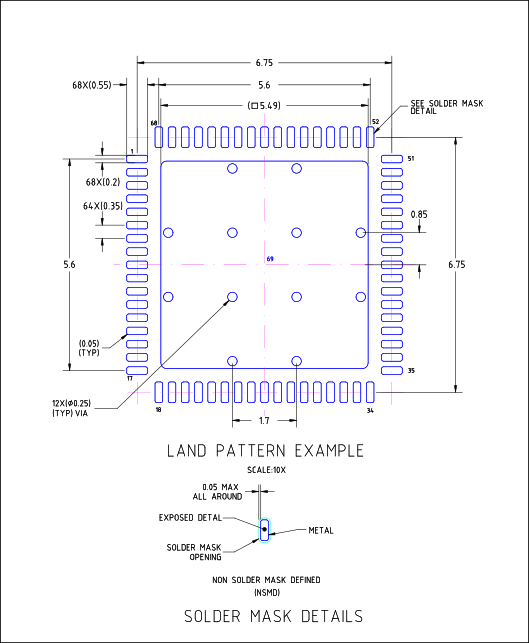{ width="100%" loading="lazy" }

<em>Figure 6.9-3: QFN68L PCB Land Pattern</em>

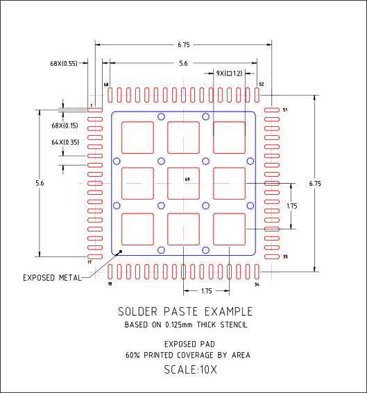{ width="100%" loading="lazy" }

<em>Figure 6.9-4: QFN68L Stencil Opening</em>

{ width="100%" loading="lazy" }

<em>Figure 6.9-5: QFN80L 8 x 8 x 0.9 mm Package Dimensions</em>

{ width="100%" loading="lazy" }

<em>Figure 6.9-6: QFN80L 8 x 8 x 1.1 mm Package Dimensions</em>

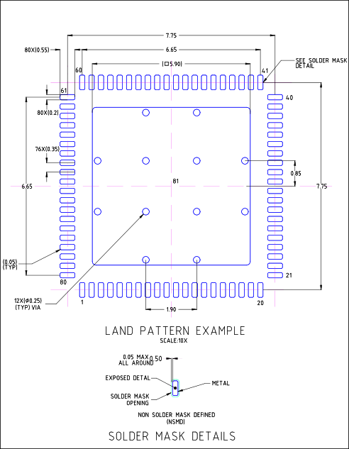{ width="100%" loading="lazy" }

<em>Figure 6.9-7: QFN80L PCB Land Pattern</em>

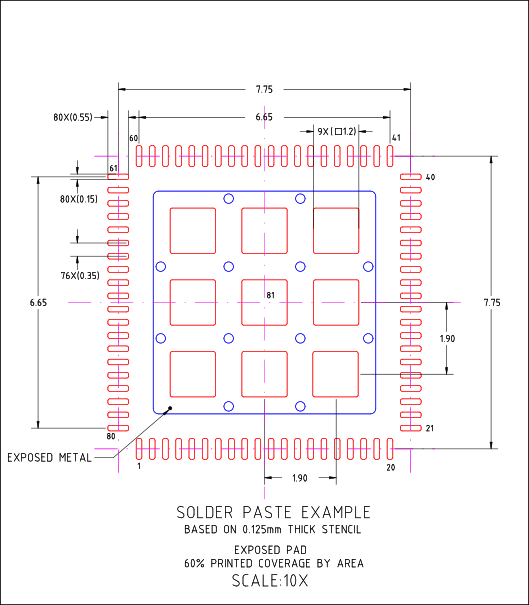{ width="100%" loading="lazy" }

<em>Figure 6.9-8: QFN80L Stencil Opening</em>

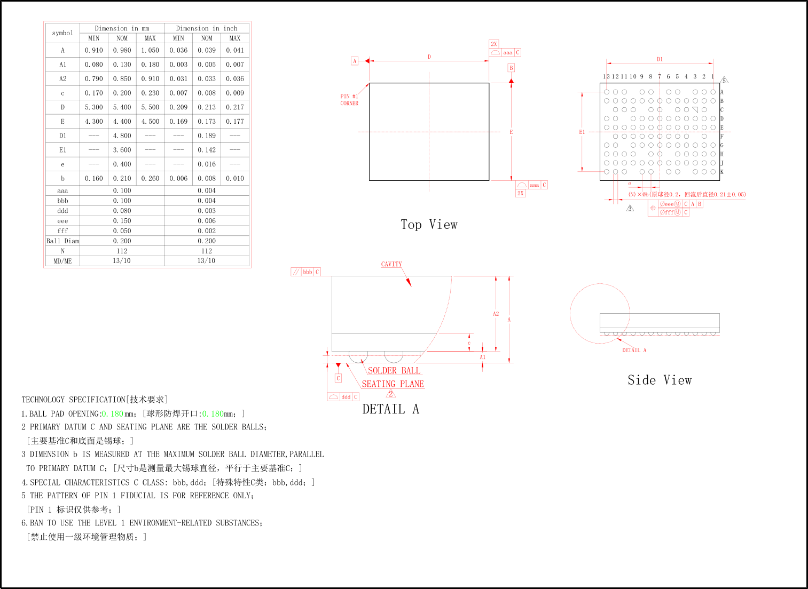{ width="100%" loading="lazy" }

<em>Figure 6.9-9: BGA112 5.4 x 4.4 x 0.98 mm Package Dimensions</em>

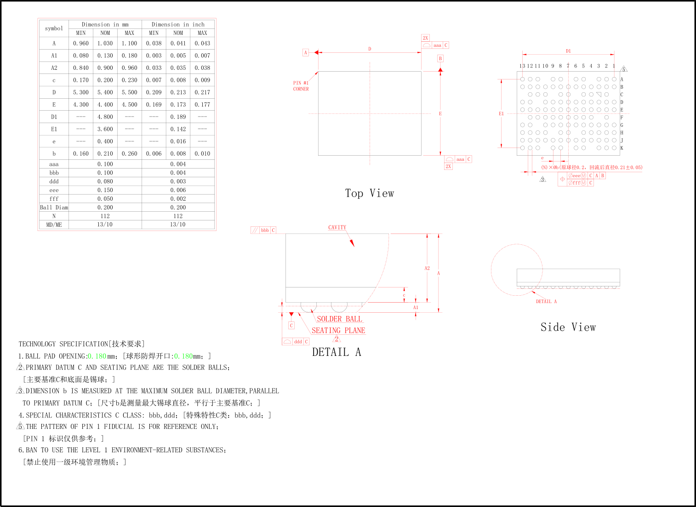{ width="100%" loading="lazy" }

<em>Figure 6.9-10: BGA112 5.4 x 4.4 x 1.03 mm Package Dimensions</em>

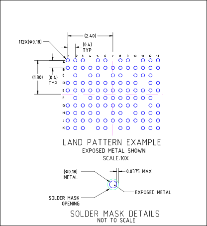{ width="100%" loading="lazy" }

<em>Figure 6.9-11: BGA112 PCB Land Pattern</em>

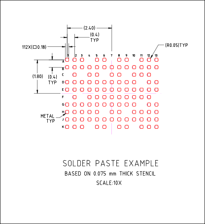{ width="100%" loading="lazy" }

<em>Figure 6.9-12: BGA112 Stencil Opening</em>

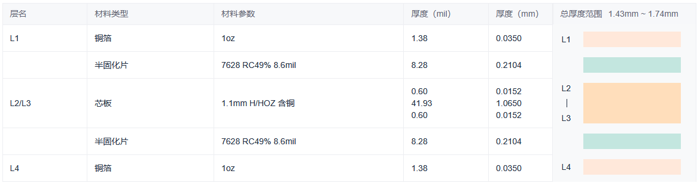{ width="100%" loading="lazy" }

<em>Figure 6.9-13: QFN 1.6 mm PCB Stack-Up Reference</em>

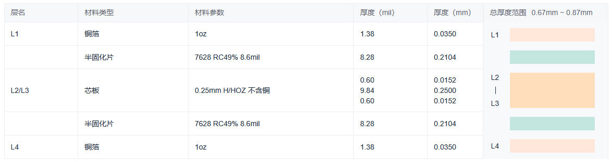{ width="100%" loading="lazy" }

<em>Figure 6.9-14: QFN 0.8 mm PCB Stack-Up Reference</em>

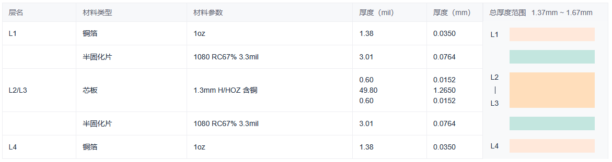{ width="100%" loading="lazy" }

<em>Figure 6.9-15: BGA 1.6 mm PCB Stack-Up Reference</em>

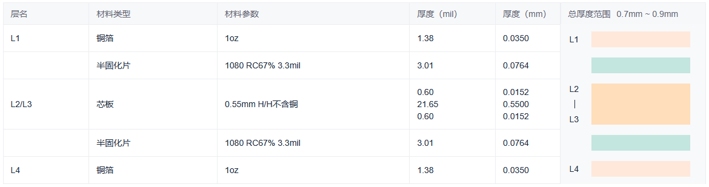{ width="100%" loading="lazy" }

<em>Figure 6.9-16: BGA 0.8 mm PCB Stack-Up Reference</em>

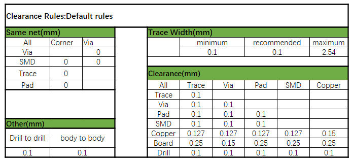{ width="100%" loading="lazy" }

<em>Figure 6.9-17: PTH PCB Design Rules</em>

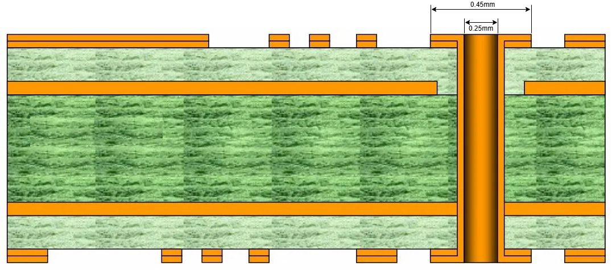{ width="100%" loading="lazy" }

<em>Figure 6.9-18: PTH Via Design Rules</em>

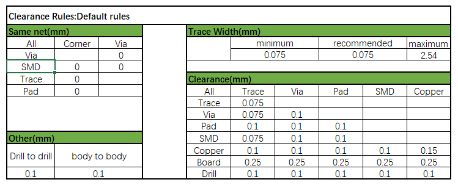{ width="100%" loading="lazy" }

<em>Figure 6.9-19: HDI PCB Design Rules</em>

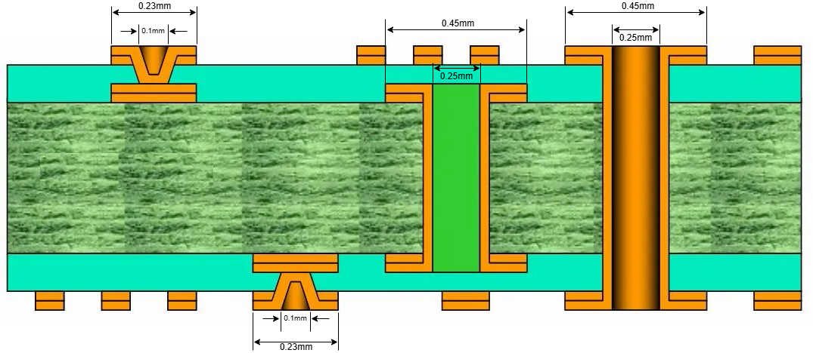{ width="100%" loading="lazy" }

<em>Figure 6.9-20: HDI Via Design Rules</em>

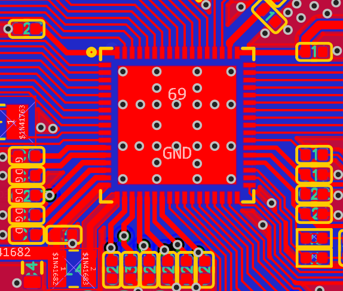{ width="100%" loading="lazy" }

<em>Figure 6.9-21: QFN68 Top-Layer Fanout Reference</em>

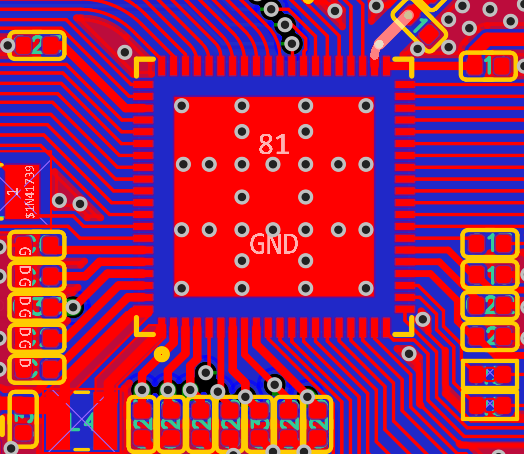{ width="100%" loading="lazy" }

<em>Figure 6.9-22: QFN80 Top-Layer Fanout Reference</em>

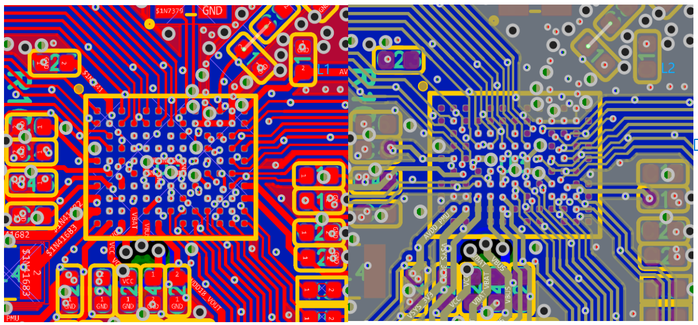{ width="100%" loading="lazy" }

<em>Figure 6.9-23: BGA112 Fanout Reference</em>

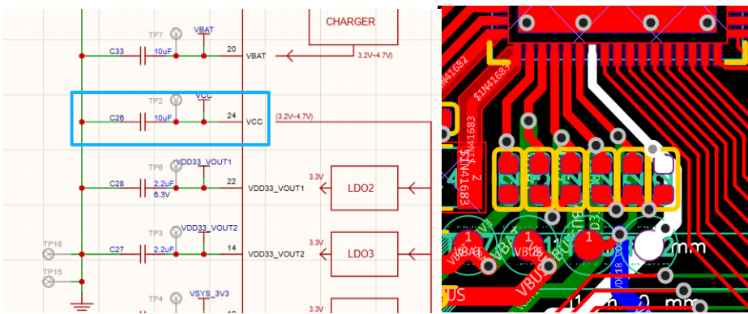{ width="100%" loading="lazy" }

<em>Figure 6.9-24: QFN VCC Power Routing</em>

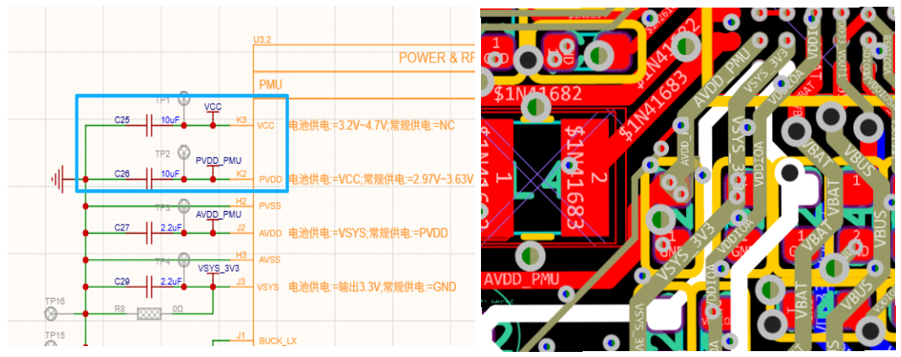{ width="100%" loading="lazy" }

<em>Figure 6.9-25: BGA VCC Power Routing</em>

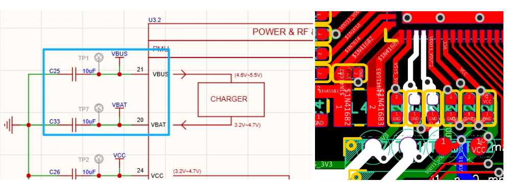{ width="100%" loading="lazy" }

<em>Figure 6.9-26: QFN VBUS and VBAT Routing</em>

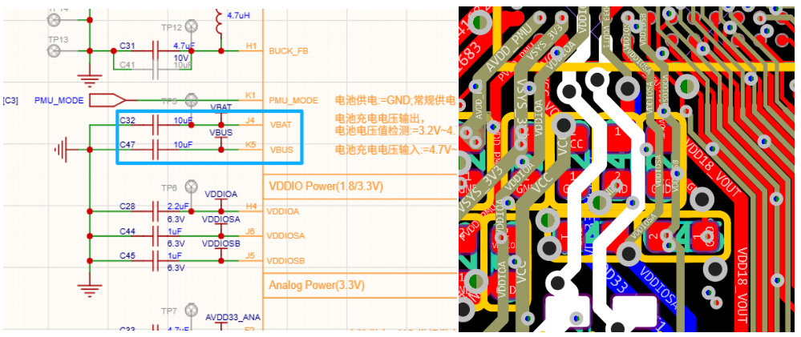{ width="100%" loading="lazy" }

<em>Figure 6.9-27: BGA VBUS and VBAT Routing</em>

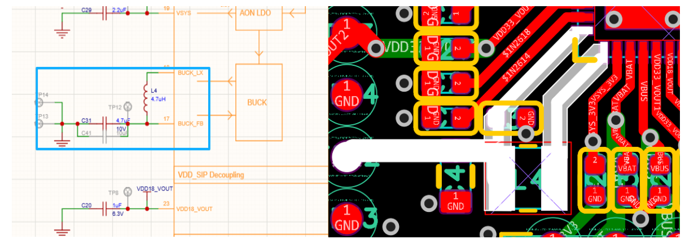{ width="100%" loading="lazy" }

<em>Figure 6.9-28: QFN DCDC Routing</em>

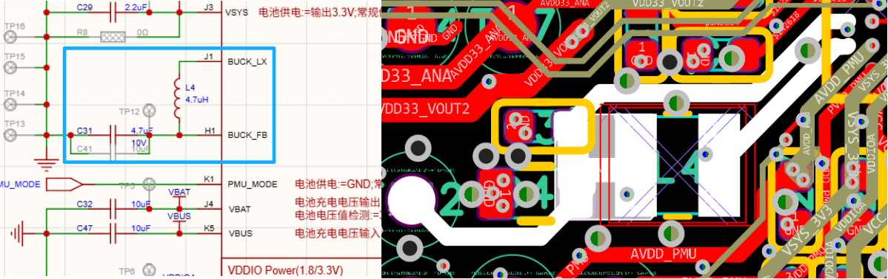{ width="100%" loading="lazy" }

<em>Figure 6.9-29: BGA DCDC Routing</em>

{ width="100%" loading="lazy" }

<em>Figure 6.9-30: Crystal Placement Keep-Out</em>

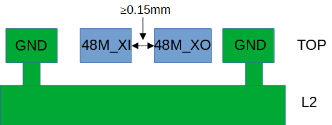{ width="100%" loading="lazy" }

<em>Figure 6.9-31: 48 MHz Crystal Routing Model</em>

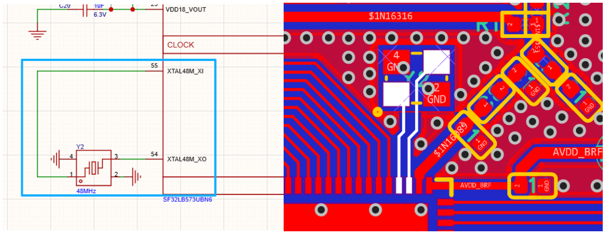{ width="100%" loading="lazy" }

<em>Figure 6.9-32: 48 MHz Crystal Routing Reference</em>

{ width="100%" loading="lazy" }

<em>Figure 6.9-33: 32.768 kHz Crystal Routing Model</em>

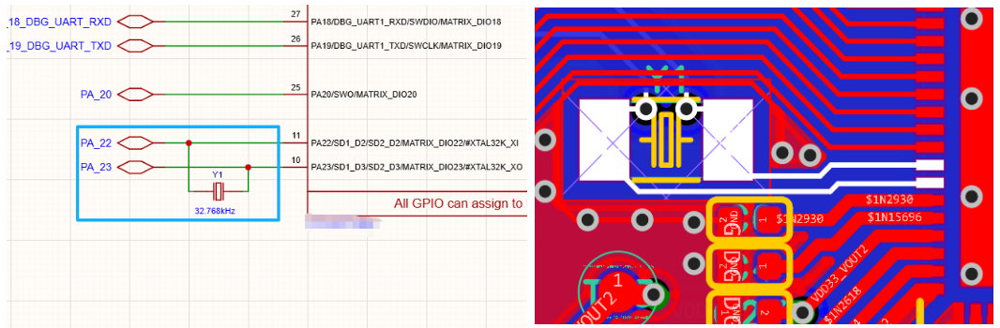{ width="100%" loading="lazy" }

<em>Figure 6.9-34: 32.768 kHz Crystal Routing Reference</em>

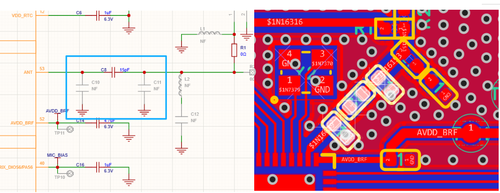{ width="100%" loading="lazy" }

<em>Figure 6.9-35: RF Matching Network Layout</em>

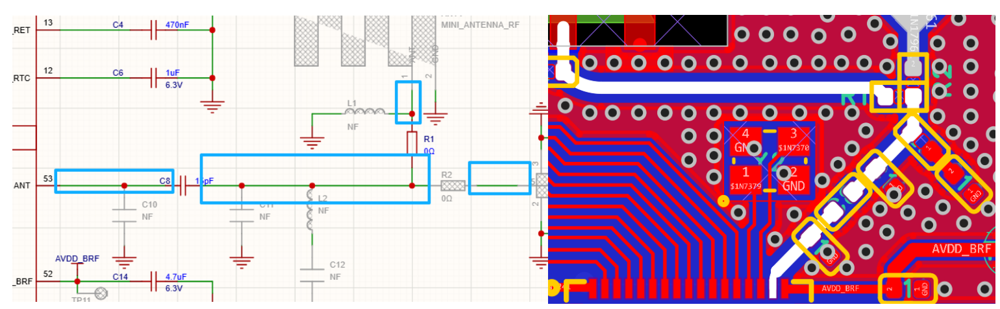{ width="100%" loading="lazy" }

<em>Figure 6.9-36: RF Signal Routing Reference</em>

{ width="100%" loading="lazy" }

<em>Figure 6.9-37: Audio Supply Filtering Layout</em>

{ width="100%" loading="lazy" }

<em>Figure 6.9-38: Analog Audio Input Layout</em>

{ width="100%" loading="lazy" }

<em>Figure 6.9-39: Analog Audio Output Layout</em>

{ width="100%" loading="lazy" }

<em>Figure 6.9-40: SDIO Routing Model</em>

{ width="100%" loading="lazy" }

<em>Figure 6.9-41: SDIO PCB Routing Reference</em>

{ width="100%" loading="lazy" }

<em>Figure 6.9-42: USB Component Placement Reference</em>

{ width="100%" loading="lazy" }

<em>Figure 6.9-43: USB Routing Model</em>

{ width="100%" loading="lazy" }

<em>Figure 6.9-44: USB PCB Routing Reference</em>

{ width="100%" loading="lazy" }

<em>Figure 6.9-45: Power TVS Placement Reference</em>

{ width="100%" loading="lazy" }

<em>Figure 6.9-46: EOS/TVS Grounding Reference</em>

## 7. Customer Design Self-Check

Complete this checklist before requesting schematic review, layout review, or EVT release. The customer design owner should fill in the result and evidence for each item, then attach schematic page references, PCB screenshots, measurements, or review notes where applicable.

### 7.1. Package and Part Number

- [ ] Orderable part number, power family, package, and pinout are confirmed.
- [ ] Schematic symbol and PCB footprint match the datasheet.
- [ ] QFN/BGA pads, stencil, exposed pad, and via design are reviewed.

### 7.2. Power

- [ ] Every power pin voltage, allowed load, and capacitor value follows the datasheet.
- [ ] BUCK inductor, capacitors, and feedback routing meet layout requirements.
- [ ] Internal LDO outputs are not misused as high-current peripheral supplies.
- [ ] Charger, OVP, VBUS, VBAT, VCC/PVDD paths are correct.
- [ ] Peripheral supplies can be switched off and have safe default states.

### 7.3. Clocks

- [ ] 48 MHz and 32.768 kHz crystals meet recommended parameters.
- [ ] Crystals are close to the chip and have keep-out areas.
- [ ] Crystal routing is away from power, RF, USB, SDIO, display, and charging noise.

### 7.4. Storage and Boot

- [ ] Package-integrated memory interface usage is confirmed.
- [ ] External boot media type, pull-ups, power control, and default state are correct.
- [ ] Boot configuration and download/debug test points are reserved.

### 7.5. RF

- [ ] Antenna path is controlled to 50 ohm.
- [ ] π matching network is placed near the chip.
- [ ] RF trace has a continuous reference ground and via shielding.
- [ ] RF is isolated from noise sources and high-speed interfaces.

### 7.6. Display and Touch

- [ ] Display interface, resolution, and pin group meet panel requirements.
- [ ] Display, backlight, and touch supplies are controllable.
- [ ] Touch interrupt uses a wake-capable GPIO if wake is required.
- [ ] FPC and high-speed display traces are kept away from RF.

### 7.7. Audio and Analog

- [ ] MIC_BIAS, AUD_VREF, and AVDD33_AUD decoupling is correct.
- [ ] Analog input DC-blocking and filtering are correct.
- [ ] DACP/DACN differential routing and matching network are correct.
- [ ] GPADC input voltage, divider, filtering, and shielding are correct.

### 7.8. General Interfaces

- [ ] UART, I2C, SPI, SDIO, USB, and CAN wiring and IO levels are correct.
- [ ] I2C pull-up rail turns off with the peripheral supply.
- [ ] USB ESD, 90 ohm differential routing, and VBUS wake detection are implemented as needed.
- [ ] External wake signals use wake-capable pins.

### 7.9. Production and Reliability

- [ ] DBG-UART, SWD, boot-mode, PA00, PA01, PA34, power, and ground test points are reserved.
- [ ] Test points meet fixture probe requirements.
- [ ] ESD, EOS, OVP, reverse-protection, and surge strategy are reviewed.
- [ ] Production firmware download, crystal calibration, and RF test flow are executable.

### 7.10. Review Release Criteria

Before design freeze, use these release criteria:

- [ ] Every mandatory item is closed with schematic page references or PCB screenshots as evidence.
- [ ] Every deviation from the datasheet or reference design has a project-level design reason.
- [ ] RF, crystals, charging, power, USB, display, audio, and production test points have been reviewed by the responsible owners.
- [ ] The low-power current budget includes all peripheral standby currents, pull-up currents, and regulator Iq.
- [ ] EVT bring-up paths for download, logs, current measurement, reset, and boot control are accessible.

## 8. Related Documents and References

Use the latest official documents when checking electrical limits, package data, pin multiplexing, software configuration, component qualification, and manufacturing constraints.

- :fontawesome-solid-file-pdf: __[SF32LB57x Product Brief]__
- :fontawesome-solid-file-pdf: __[SF32LB57x Datasheet]__
- :fontawesome-solid-file-pdf: __[SF32LB57x User Manual]__
- :fontawesome-solid-file-lines: __[SF32LB57x Hardware Application Note]__
- :fontawesome-solid-file-excel: __[SiFli Approved Vendor List (AVL)]__

## 9. Appendices

The appendices collect application and reference-design context. Use them after the main schematic and PCB rules in Sections 5 and 6 have been applied.

<em>Table 9-1: Appendix Index</em>

| Need | Start Here |
|:---|:---|
| Minimum system schematic examples | Section 5.1.2 |
| Package, land-pattern, stencil, stack-up, fanout, power, RF, audio, SDIO, USB, and TVS reference images | Section 6.9 |
| Customer design self-check | Section 7 |

### Appendix A. A Typical SF32LB57x Product

A typical SF32LB57x product includes the MCU, power tree, 48 MHz and 32.768 kHz crystals, RF matching and antenna, display and touch controller, boot storage, audio input/output, sensors, optional camera, USB/SDIO/CAN/UART/I2C/SPI peripherals, debug access, and production test access. Battery-powered designs also require charging, OVP, load-switch, and low-power leakage review.

## 10. Revision History

<em>Table 10-1: Revision History</em>

| Version | Date | Notes |
|:--------|:-----|:------|
| 0.3 | 2026-07 | Restructured schematic guidance so Minimum System Design, Power System, Clock Generation, RF, User Interfaces, Storage and Connectivity, and Manufacturing are separate peer sections. |
| 0.2 | 2026-07 | Added evidence pack, bring-up guidance, low-power validation, RF/display/audio/camera validation, and PCB critical-constraint quick reference. |
| 0.1 | 2026-07 | Initial SF32LB57x hardware design guide release based on the official hardware application note. |

