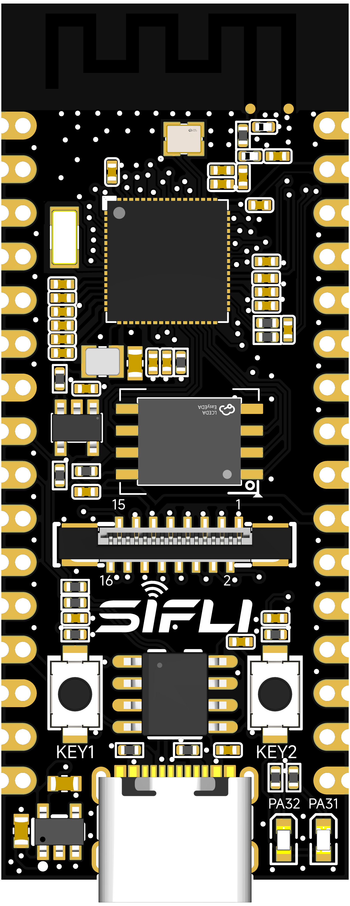
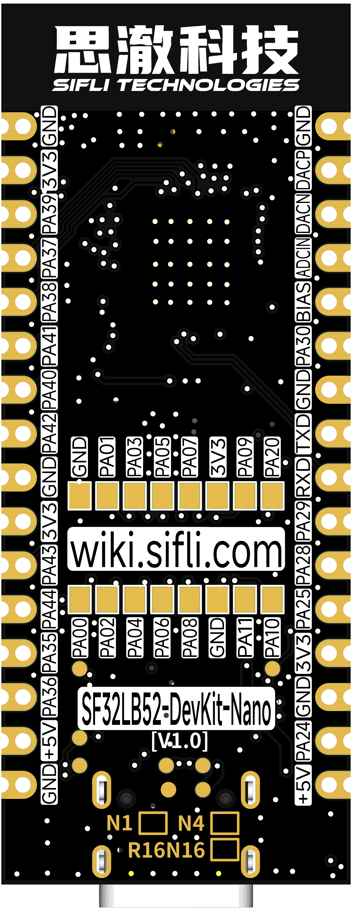
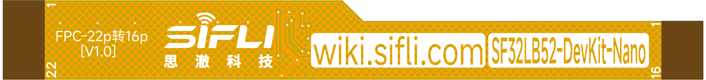

# SF32LB52-DevKit-Nano

## Overview

The SF32LB52-DevKit-Nano is a small SF32LB52x development board for compact prototypes and embedded evaluation. It uses castellated half-holes around the board edge, making it suitable both as a stand-alone development board and as a solder-down module in early product prototypes.

The board measures 21mm x 51mm and exposes the key SF32LB52x resources needed for GPIO, UART, I2C, SPI, LCD, I2S, GPADC, PWM, USB, and analog audio development.

{ loading="lazy" }

<em>SF32LB52-DevKit-Nano — Front View</em>

{ loading="lazy" }

<em>SF32LB52-DevKit-Nano — Back View</em>

## Board Variants

<em>SF32LB52-DevKit-Nano Board Variants</em>

| Variant | MCU | In-Package Memory | On-Board Memory |
| :--- | :--- | :--- | :--- |
| SF32LB52-DevKit-Nano-N4 | SF32LB52BU56 | 4MB SPI NOR Flash | None |
| SF32LB52-DevKit-Nano-R16N16 | SF32LB52JUD6 | 16MB OPI-PSRAM | 16MB SPI NOR Flash |

The N4 variant is suitable for compact control, Bluetooth, and simple UI applications. The R16N16 variant is better for larger display assets, external file systems, and applications that benefit from PSRAM.

The original source identifies both N4 V1.0.0 and R16N16 V1.0.0 as current board options. Confirm the exact assembly before choosing firmware, memory layout, or external Flash assumptions.

## Board Highlights

- 21mm x 51mm compact board
- Castellated half-hole edge layout for solder-down prototypes
- USB Type-C power and USB-to-UART download/debug through CH340N
- GPIO, UART, I2C, SPI, GPADC, PWM, I2S, PDM, and wake-capable pins exposed
- QSPI LCD support through a 16-pin FPC path, typically using a 22-pin-to-16-pin adapter cable
- I2C touch-panel support
- Analog microphone input and differential audio output pins
- USB2.0 FS routed to edge pins
- Two user LEDs
- Power key and function key

## When to Use This Board

Choose SF32LB52-DevKit-Nano when the prototype should stay close to a final product form factor.

- Build compact Bluetooth and display prototypes
- Solder the board onto a carrier PCB
- Test product-like pin assignments before custom board design
- Validate low-cost NOR-only or higher-memory PSRAM variants
- Bring up LCD, audio, sensor, and USB functions in a small footprint

For easier bench wiring and wider signal breakout, use [SF32LB52-DevKit-Core-3p3](SF32LB52-DevKit-Core-3p3.md). For a display-rich board with charger, TF card, microphone, and speaker amplifier, use [SF32LB52-DevKit-LCD](SF32LB52-DevKit-LCD.md).

## Power

The board supports three power approaches:

- USB Type-C power, recommended for development
- 3.3V input through the castellated pins when USB is not connected
- 5V input through the castellated pins when USB is not connected

When USB Type-C is connected, selected 3.3V and 5V pins can be used as outputs. Verify power direction before attaching external circuits.

The board includes a power switch controlled through the CH340N RTS# signal, allowing tool-controlled reset behavior.

## Download and Debug

Use the USB Type-C UART interface for firmware download and serial logs.

- **Download mode**: enable BOOT in the download tool, then power or reset the board.
- **Debug/log mode**: disable BOOT, then power or reset the board.
- **RTS reset behavior**: if opening the serial port unexpectedly resets or powers down the board, disable modem or hardware flow control in the host serial-port settings.

{ loading="lazy" }

<em>Disabling Modem Flow Control in Serial-Port Settings</em>

## User Controls

<em>User Control Signals</em>

| Function | GPIO | Behavior |
| :--- | :--- | :--- |
| LED1 | PA31 | Active low |
| LED2 | PA32 | Active low |
| KEY1 | PA34 | Active high, supports 10s long-press reset |
| KEY2 | PA33 | Active high |

## Castellated Pin Summary

The Nano board exposes two edge pin groups. The first group carries audio, SPI1, debug UART, USB-adjacent power, and GPADC-capable pins. The second group carries SPI2, USB FS, wake-capable GPIOs, and power.

### Front-Side Edge Signals

<em>Front-Side Edge Signal Map</em>

| Pin | Signal | Main Function |
| :--- | :--- | :--- |
| 1 | GND | Ground |
| 2 | DACP | Analog audio output |
| 3 | DACN | Analog audio output |
| 4 | MIC_ADC | Analog microphone input |
| 5 | MIC_BIAS | Microphone bias |
| 6 | PA30 | I2S1_LRCK / GPADC2 / UART / I2C |
| 8 | PA19 | UART0_TXD / SWCLK / debug |
| 9 | PA18 | UART0_RXD / SWDIO / debug |
| 10 | PA29 | SPI1_CS / I2S1_BCK / GPADC1 |
| 11 | PA28 | SPI1_CLK / I2S1_SDI / GPADC0 |
| 12 | PA25 | SPI1_DI / I2S1_SDO / WKUP1 |
| 13 | 3.3V | 3.3V input/output |
| 15 | PA24 | SPI1_DIO / I2S1_MCLK / WKUP0 |
| 16 | 5V | 5V input/output |

### Back-Side Edge Signals

<em>Back-Side Edge Signal Map</em>

| Pin | Signal | Main Function |
| :--- | :--- | :--- |
| 2 | 3.3V | 3.3V input/output |
| 3 | PA39 | SPI2_CLK / WKUP15 |
| 4 | PA37 | SPI2_DIO / WKUP13 |
| 5 | PA38 | SPI2_DI / WKUP14 |
| 6 | PA41 | UART / I2C / GPTIM / WKUP17 |
| 7 | PA40 | SPI2_CS / WKUP16 |
| 8 | PA42 | UART / I2C / GPTIM / WKUP18 |
| 10 | 3.3V | 3.3V input/output |
| 11 | PA43 | UART / I2C / GPTIM / WKUP19 |
| 12 | PA44 | UART / I2C / GPTIM / WKUP20 |
| 13 | PA35 | USB_DP / WKUP11 |
| 14 | PA36 | USB_DM / WKUP12 |
| 15 | 5V | 5V input/output |
| 16 | GND | Ground |

## LCD Interface

The board supports QSPI LCD panels through a 16-pin FPC signal set. The original board note describes connection to the Huangshan Pi 1.85-inch AMOLED screen through a 22-pin-to-16-pin FPC cable.

{ loading="lazy" }

<em>22-Pin to 16-Pin FPC Adapter Cable</em>

<em>16-Pin LCD FPC Signal Map</em>

| Pin | Signal | Function |
| :--- | :--- | :--- |
| 1 | GND | Ground |
| 2 | PA00 | LCD reset |
| 3 | PA01 | Backlight PWM |
| 4 | PA02 | LCD TE / I2S1_MCLK |
| 5 | PA03 | LCD CS / I2S1_SDO |
| 6 | PA04 | LCD CLK / I2S1_SDI |
| 7 | PA05 | LCD D0 / I2S1_BCK |
| 8 | PA06 | LCD D1 / I2S1_LRCK |
| 9 | PA07 | LCD D2 / PDM1_CLK |
| 10 | PA08 | LCD D3 / PDM1_DAT |
| 11 | 3.3V | Display power output |
| 12 | GND | Ground |
| 13 | PA09 | Touch interrupt |
| 14 | PA11 | Touch I2C SDA |
| 15 | PA20 | Touch I2C SCL |
| 16 | PA10 | Touch reset |

## External Flash and SDIO Pins

The R16N16 variant includes external 16MB SPI NOR Flash. The storage pin group is:

<em>External Flash and SDIO Pin Group</em>

| Pin | Signal | Function |
| :--- | :--- | :--- |
| 1 | PA12 | MPI2_CS / SD1_D2 |
| 2 | PA13 | MPI2_D1 / SD1_D3 |
| 3 | PA14 | MPI2_D2 / SD1_CLK |
| 4 | PA15 | MPI2_D0 / SD1_CMD |
| 5 | PA16 | MPI2_CLK / SD1_D0 |
| 6 | PA17 | MPI2_D3 / SD1_D1 |

These pins may be occupied by the mounted Flash depending on the variant. Check the exact board assembly before using them as expansion pins.

## Audio Expansion

The Nano board exposes analog microphone input, microphone bias, and differential analog audio output. Add an external microphone circuit and audio power amplifier as required by the target product.

## Related Documents

[SF32LB52x Chip Introduction]: ../chips/SF32LB52x.md
[SF32LB52x Hardware Design Guide]: ../chips/SF32LB52x_hardware_design_guide.md
[Original SiFli Wiki Article]: https://github.com/OpenSiFli/SiFli-Wiki/blob/main/source/en/board/sf32lb52x/SF32LB52-DevKit-Nano.md
[Design Package]: https://downloads.sifli.com/hardware/files/documentation/SF32LB52-DevKit-Nano_V1.0.0.zip?
[Buy Samples]: https://sifli.taobao.com/

- :fontawesome-solid-microchip: __[SF32LB52x Chip Introduction]__
- :fontawesome-solid-file-lines: __[SF32LB52x Hardware Design Guide]__
- :fontawesome-brands-github: __[Original SiFli Wiki Article]__
- :fontawesome-solid-download: __[Design Package]__
- :fontawesome-solid-cart-shopping: __[Buy Samples]__

