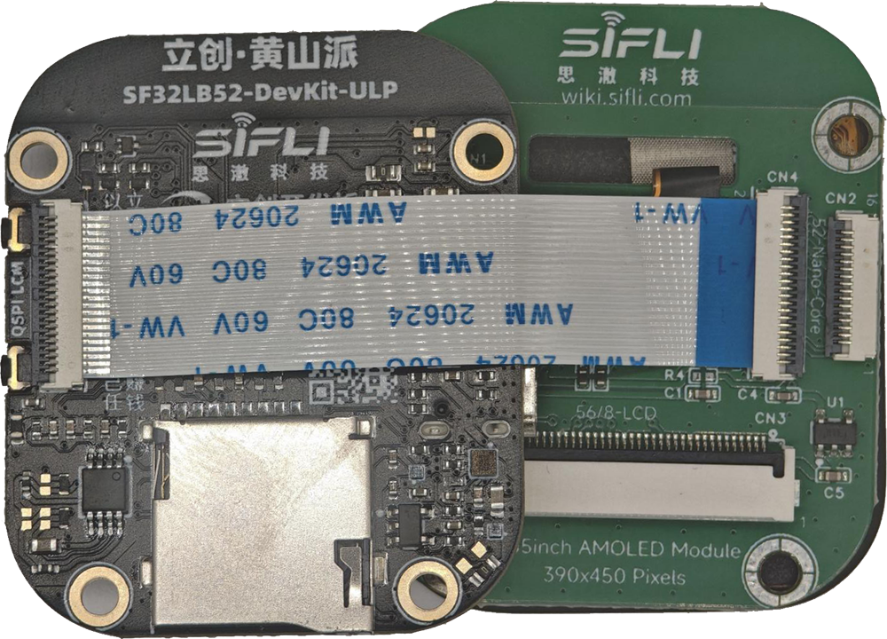
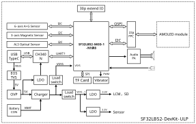

# SF32LB52-DevKit-ULP

## Overview

The SF32LB52-DevKit-ULP is also known as **立创黄山派**, **LCKFB-HSPI-SF32LB52-ULP**, and **SF32LB52-ULP**. It is a compact ultra-low-power wearable development board built around the SF32LB52x family, positioned as a smartwatch and fitness-band prototype platform rather than a simple MCU breakout board.

Compared with the LCD, Nano, and Core-3p3 boards, this board is more product-like: it combines an SF32LB52 module, AMOLED display, touch, microphone, speaker amplifier, RGB LED, vibration motor drive, motion sensor, magnetic sensor, ambient-light sensor, battery charging, and power-measurement jumpers. That makes it especially useful when the product question is not just "does the MCU run?" but "how does the whole wearable system behave on battery?"

Most board-level details in this page are based on the [LCKFB hardware wiki], with the original [SiFli ULP source article][Original SiFli Wiki Article] used as the SiFli/OpenSiFli board-family reference.

{ loading="lazy" }

<em>SF32LB52-ULP — Wearable Board Assembly Reference</em>

{ loading="lazy" }

<em>Huangshan Pi SF32LB52 — Block Diagram</em>

## Naming

<em>Board Naming Aliases</em>

| Name | Where It Is Used |
| :--- | :--- |
| SF32LB52-DevKit-ULP | SiFli/OpenSiFli board-family naming |
| SF32LB52-ULP | Short hardware/product name |
| LCKFB-HSPI-SF32LB52-ULP | LCKFB project/order naming |
| 立创黄山派 / 立创・黄山派 SF32LB52 | Chinese product and documentation name |

Use these names as aliases for the same board family when searching for hardware documents, examples, purchase pages, or community material. For schematic, pinout, or BOM work, always confirm the exact board revision and vendor document set.

## Board Highlights

- SF32LB52x-MOD-1-N16R8 module based on SF32LB52x
- SF32LB525UC6 standard module configuration
- 8MB OPI-PSRAM, 144MHz interface
- 128Mb QSPI-NOR Flash, 72MHz STR mode
- 48MHz main crystal and 32.768kHz RTC crystal
- On-board PCBA antenna
- 1.85-inch AMOLED display, 390 x 450 resolution
- Quad-SPI display interface with touch support
- On-board MEMS microphone
- Analog audio output with Class-D speaker amplifier
- External speaker connector for 3W/4ohm or 2W/8ohm speakers
- USB Type-C UART interface through CH340N for download, debug, and power
- USB2.0 FS signals exposed through the 30-pin expansion connector
- MicroSD card slot using SPI
- One function key and one power/reset key
- WS2812B-2020 RGB LED
- Vibration motor driver circuit with external motor solder pads
- LSM6DS3TR-C 6-axis IMU
- MMC5603NJ 3-axis magnetic sensor
- LTR-303ALS-01 ambient-light sensor
- Battery charger and power-management devices for wearable power testing
- 2x15-pin, 1.27mm-pitch expansion header with GPIO and current-measurement support

## When to Use This Board

Choose SF32LB52-DevKit-ULP / 立创黄山派 when the goal is wearable system validation.

- Build watch, band, and sensor-rich wearable prototypes
- Evaluate AMOLED UI behavior on the SF32LB52x platform
- Test touch, motion sensing, magnetic sensing, ambient-light sensing, audio, vibration, and RGB LED behavior together
- Measure battery, system, and 3.3V current paths during sleep and active use
- Validate wake-up flows driven by buttons, sensors, touch, or firmware timers
- Compare real product-like power behavior against early estimates from simpler DevKit boards

For a display-focused general evaluation board, use [SF32LB52-DevKit-LCD](SF32LB52-DevKit-LCD.md). For compact solder-down module prototyping, use [SF32LB52-DevKit-Nano](SF32LB52-DevKit-Nano.md). For maximum direct pin access during early bench bring-up, use [SF32LB52-DevKit-Core-3p3](SF32LB52-DevKit-Core-3p3.md).

## Hardware Configuration

<em>Hardware Configuration Summary</em>

| Area | Configuration |
| :--- | :--- |
| Core module | SF32LB52x-MOD-1-N16R8 |
| MCU | SF32LB525UC6 |
| PSRAM | 8MB OPI-PSRAM, 144MHz interface |
| Flash | 128Mb QSPI-NOR Flash, 72MHz STR mode |
| Display | 1.85-inch AMOLED, 390 x 450, Quad-SPI |
| Display driver | CO5300AF-01 |
| Display power IC | BV6802W |
| Touch controller | FT6146-M00 |
| Microphone | On-board MEMS microphone |
| Speaker output | Class-D amplifier, external GH-1.25mm speaker connector |
| Storage | MicroSD card over SPI |
| Motion sensor | LSM6DS3TR-C 6-axis IMU |
| Magnetic sensor | MMC5603NJ 3-axis magnetometer |
| Ambient-light sensor | LTR-303ALS-01 |
| USB-UART | CH340N over USB Type-C |
| Battery | External Li-ion battery through GH1.25mm connector |
| Charger | AW32001ECSR, default 450mA constant-current setting |
| Protection/power devices | LP5305AQVF OVP, LP5240HVF load switch, ETA5055V330DS2F LDO |

## Package Contents

The Huangshan Pi board set is documented as including:

- Core board
- Screen board
- Battery
- Speaker

Verify the purchased kit contents before planning a lab setup, because accessory bundles may differ by seller or production batch.

## Power and Battery

The board supports two primary power modes:

- USB Type-C power
- Standalone battery power

The battery input is intended for a single-cell Li-ion battery using a GH1.25mm connector with forward pin order. The documented charging configuration supports a maximum charge current of 500mA, with a default constant-current setting of 450mA.

When using the board without a battery and supplying VBAT from a bench supply, the documented VBAT input range is 3.7V to 4.7V, with 3.8V recommended for normal-voltage supply testing. The SF32LB52-MOD-1-N16R8 power thresholds are documented as 3.58V for power-on and 3.48V for power-off.

## Power Measurement Jumpers

The board exposes current-measurement jumpers for the major power paths.

<em>Power Measurement Jumper Assignments</em>

| Pins | Path | Purpose |
| :--- | :--- | :--- |
| 5-6 | VBAT path | Insert a current meter between battery/charger and downstream system |
| 7-8 | VSYS path | Insert a current meter in the VSYS path |
| 11-12 | VCC_3V3 path | Insert a current meter in the 3.3V main rail |

For normal operation, pins 5-6, 7-8, and 11-12 must be shorted with jumpers. Remove the appropriate jumper only when inserting a current meter or power analyzer.

## Download and Debug

Use the USB Type-C UART interface for firmware download, serial logs, and board power during normal development.

Required hardware for first bring-up:

- SF32LB52-DevKit-ULP / 立创黄山派 board
- USB 2.0 data cable
- Host computer running Windows, Linux, or macOS

Optional hardware:

- External speaker
- TF card
- Li-ion battery, 450mAh or larger
- Second USB cable when UART debug and native USB testing are needed at the same time

Use a real data-capable USB cable. Charge-only cables can power the board but will not expose the serial data interface.

## Key Signal Assignments

<em>Key Signal Assignments</em>

| Signal | Function |
| :--- | :--- |
| PA44 | VBUS_DET, charger insertion detect |
| PA43 | KEY2 |
| PA42 | Audio_PA_EN |
| PA41 | Touch interrupt |
| PA40 / PA39 | Sensor I2C1 SCL / SDA |
| PA38 | VSYS to VSYS_1 switch control |
| PA37 / PA33 | Touch I2C SCL / SDA |
| PA36 / PA35 | USB DM / DP |
| PA34 | HOME key and 10s long-press reset |
| PA32 | RGB LED data |
| PA31 | Sensor interrupt 1 |
| PA30 | VSYS_1 to HR3V3 switch control |
| PA27 | SD-card detect |
| PA24, PA25, PA28, PA29 | SPI1 MicroSD interface |
| PA20 | Vibration motor PWM |
| PA19 / PA18 | Debug UART TXD / RXD |
| PA11 / PA10 | Charger I2C0 SDA / SCL |
| MIC_BIAS / MIC_ADC_IN | Microphone bias and input |
| AU_DAC1P_OUT / AU_DAC1N_OUT | Analog audio output |
| PA08..PA03, PA02, PA01, PA00 | QSPI display, TE, backlight PWM, and reset |
| PA15..PA12, PA16, PA17 | MPI2 / SD1 signals, internally used by module Flash on the N16R8 module |

## 30-Pin Expansion Header

The 30-pin header exposes power, USB, sensor, display-adjacent, storage, vibration, debug, key, and charger-control signals.

<em>30-Pin Expansion Header Signal Map</em>

| Pin Group | Signals | Notes |
| :--- | :--- | :--- |
| 1-2 | USB_VBUS_5V | 5V from USB when connected; can be 5V input when USB is not connected |
| 5-6 | VBAT_S / VBAT | Short for normal operation; open for VBAT current measurement |
| 7-8 | VSYS_S / VSYS | Short for normal operation; open for VSYS current measurement |
| 11-12 | VCC_3V3_S / VCC_3V3 | Short for normal operation; open for 3.3V current measurement |
| 13 / 15 | PA36 / PA35 | USB DM / DP |
| 14 / 16 | PA39 / PA40 | Sensor I2C1 SDA / SCL |
| 17 | PA32 | RGB LED data, also usable as GPIO |
| 18 | PA30 | Sensor power control; GPIO use may affect PA39/PA40 behavior |
| 19-23 | PA29, PA24, PA28, PA25, PA27 | SPI1/SD-card related pins; expansion use conflicts with the on-board TF card |
| 24 | PA20 | Vibration PWM; expansion use conflicts with motor drive |
| 25 / 27 | PA19 / PA18 | Debug UART TXD / RXD |
| 26 / 28 | PA34 / PA43 | Power/reset key and function key |
| 29 / 30 | PA11 / PA10 | Charger I2C0 SDA / SCL |

## Display and Touch Interface

The board uses an AMOLED display path and exposes a 22-pin QSPI FPC signal set. The table below lists the active signals used by the documented board; omitted pins in the 22-pin sequence are not used for the main QSPI display path in this summary.

<em>22-Pin QSPI Display and Touch FPC Signal Map</em>

| Pin | Signal | Function |
| :--- | :--- | :--- |
| 1 | VBAT | Display-side VBAT output |
| 2 | PA01 | Backlight PWM for TFT-style use |
| 3 | PA07 | QSPI D2 |
| 4 | PA08 | QSPI D3 |
| 11 | PA02 | QSPI TE |
| 12 | PA00 | LCD reset |
| 13 | PA04 | QSPI/SPI clock |
| 14 | PA05 | QSPI D0 / SPI SDI |
| 15 | PA03 | QSPI/SPI chip select |
| 16 | PA06 | QSPI D1 / SPI DC |
| 17 | VDD_3V3 | 3.3V output |
| 18 | PA41 | Touch interrupt |
| 19 | PA33 | Touch I2C SDA |
| 20 | PA37 | Touch I2C SCL |
| 21 | PA09 | Touch reset |
| 22 | GND | Ground |

## Power Measurement Guidance

For useful ultra-low-power measurements:

- Measure VBAT, VSYS, and VCC_3V3 separately when possible.
- Keep the correct jumper shorted for any rail that is not under measurement.
- Disable avoidable loads such as RGB LED effects, debug logging, display refresh, and sensor polling before measuring sleep current.
- Record board revision, firmware commit, battery or supply voltage, jumper configuration, and sensor state with every measurement.
- Measure both steady sleep current and event current for touch, sensor interrupts, Bluetooth activity, display wake, and vibration events.

## Related Documents

[SF32LB52x Chip Introduction]: ../chips/SF32LB52x.md
[SF32LB52x Hardware Design Guide]: ../chips/SF32LB52x_hardware_design_guide.md
[Original SiFli Wiki Article]: https://github.com/OpenSiFli/SiFli-Wiki/blob/main/source/en/board/sf32lb52x/SF32LB52-DevKit-ULP.md
[LCKFB Project Page]: https://lckfb.com/project/detail/lckfb-hspi-sf32lb52-ulp?param=baseInfo
[LCKFB Hardware Wiki]: https://wiki.lckfb.com/zh-hans/hspi-sf32lb52/hardware/board.html
[Buy Samples]: https://sifli.taobao.com/

- :fontawesome-solid-microchip: __[SF32LB52x Chip Introduction]__
- :fontawesome-solid-file-lines: __[SF32LB52x Hardware Design Guide]__
- :fontawesome-brands-github: __[Original SiFli Wiki Article]__
- :fontawesome-solid-up-right-from-square: __[LCKFB Project Page]__
- :fontawesome-solid-book: __[LCKFB Hardware Wiki]__
- :fontawesome-solid-cart-shopping: __[Buy Samples]__

