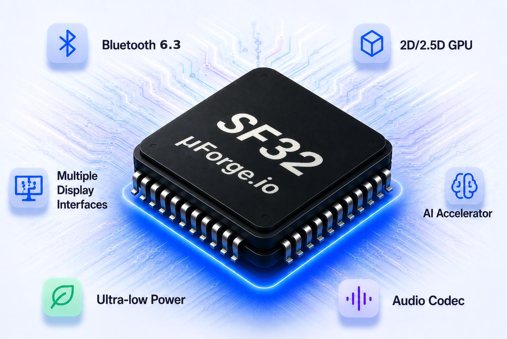

OPEN. POWERFUL. FOR DEVELOPERS.

# Build the Next Generation  of Embedded Devices

<!-- 
***μForge.io*** is an open-source development platform for innovative semiconductor platforms, starting with the SF32 family of ultra-low-power microcontrollers from SiFli. High performance, rich peripherals, and modern development tools—everything you need to build smarter products-faster.
--->

***μForge.io*** is an open-source development platform for innovative semiconductor solutions, beginning with the SF32 family of ultra-low-power microcontrollers from SiFli. From silicon and development boards to SDKs, documentation, and production-ready reference designs, μForge brings together everything developers need to design, build, and ship connected, intelligent, and energy-efficient embedded products, faster.

[Get Started :material-arrow-right:](getting-started/overview.md){ .md-button .md-button--primary }
[Explore SF32 :material-file-document-outline:](hardware/chips/SF32_family.md){ .md-button }
[GitHub :fontawesome-brands-github:](https://github.com/uforge-io){ .md-button }

:fontawesome-solid-circle-half-stroke: Open Source
&nbsp;&nbsp;&nbsp;
:fontawesome-solid-users: Active Community
&nbsp;&nbsp;&nbsp;
:fontawesome-solid-shield-halved: Production Ready
&nbsp;&nbsp;&nbsp;
:fontawesome-solid-rotate: Regular Updates

{ .uf-chip-scene title="SF32 MCU platform visual" style="position: relative; top: -6px; width: 136%; max-width: none; margin-left: -36%; height: auto; border-radius: 16px;" }

- :fontawesome-solid-microchip:{ .uf-ql-icon .uf-purple } **Hardware**

    Microcontrollers, modules, development boards, and production-ready reference designs.

    [See Hardware :material-arrow-right:](hardware/chips/SF32_family.md){ .uf-link-purple }

- :fontawesome-solid-code:{ .uf-ql-icon .uf-green } **SDK & Tools**

    SDKs, toolchains, middleware, drivers, and developer tools.

    [View Develop :material-arrow-right:](develop/overview.md){ .uf-link-green }

- :fontawesome-solid-book:{ .uf-ql-icon .uf-blue } **Learn**

    Architecture and subsystem guidance for graphics, Bluetooth, AI, audio, and low power.

    [Explore Learn :material-arrow-right:](learn/overview.md){ .uf-link-blue }

- :fontawesome-solid-rocket:{ .uf-ql-icon .uf-pink } **Examples**

    Production-quality example applications for common embedded use cases.

    [Browse Examples :material-arrow-right:](develop/examples/index.md){ .uf-link-pink }

---

## Why Choose ***SF32***? { .uf-center-heading }

- :fontawesome-solid-microchip:{ .uf-icon-blue } **High Performance**

    Single-core, dual-core or triple-core Cortex-M33 / STAR-MC1, featuring integrated instruction (I\$) and data (D\$) caches, FPU and MPU, and up to 64 MB of in-package PSRAM for graphics-intensive and compute-intensive applications.

- :fontawesome-brands-bluetooth:{ .uf-icon-blue } **Bluetooth 6.3**

    Dual-mode Bluetooth with Bluetooth Classic and LE, LE Audio, and long-range PHY support. A dedicated Bluetooth subsystem with its own processor, memory, and firmware enables advanced customization and protocol development.

- :fontawesome-solid-cube:{ .uf-icon-purple } **Graphics Acceleration**

    2D / 2.5D GPU, LCD controller, and LVGL graphics framework for rich and smooth graphical user interfaces with resolutions up to 1280 × 720. Supported interfaces include MIPI, RGB, QSPI, 8080, JDI, and EPD.

- :fontawesome-solid-volume-high:{ .uf-icon-pink } **Audio Subsystem**

    Integrated audio subsystem with analog audio, I²S, PDM, and hardware-assisted digital audio processing.

- :fontawesome-solid-brain:{ .uf-icon-amber } **AI Acceleration**

    Integrated NPU for TinyML, voice recognition, and intelligent edge AI applications.

- :fontawesome-solid-leaf:{ .uf-icon-green } **Ultra-Low Power**

    Advanced power management architecture optimized for battery-powered and always-on devices.

---

## Supported SF32 MCUs [^1] { .uf-center-heading }

- SF32LB52

    **SF32LB52x**{ .uf-mcu-title } Essential Wearable MCU

    ---

    - :fontawesome-solid-circle:{ .uf-dot-blue } Cortex-M33 STAR-MC1
    - :fontawesome-solid-circle:{ .uf-dot-blue } Dual-Mode Bluetooth 6.3
    - :fontawesome-solid-circle:{ .uf-dot-blue } 2D / 2.5D GPU, ePicasso 2.0
    - :fontawesome-solid-circle:{ .uf-dot-blue } eZip 2.0 Hardware Decompression
    - :fontawesome-solid-circle:{ .uf-dot-blue } Audio Codec, 1 x AMIC, 2 x DMIC
    - :fontawesome-solid-circle:{ .uf-dot-blue } 576 KB SRAM, up to 16 MB PSRAM
    - :fontawesome-solid-circle:{ .uf-dot-blue } QFN68 package, with up to 45 GPIOs and optional integrated linear charger

    [View Series :material-arrow-right:](hardware/chips/SF32LB52x.md){ .uf-link-blue }

- SF32LB56

    **SF32LB56x**{ .uf-mcu-title } Graphics-Optimized MCU

    ---

    - :fontawesome-solid-circle:{ .uf-dot-blue } Cortex-M33 STAR-MC1
    - :fontawesome-solid-circle:{ .uf-dot-blue } RGB Display up to 1024 x 600
    - :fontawesome-solid-circle:{ .uf-dot-blue } 2D / 2.5D GPU, ePicasso 2.0
    - :fontawesome-solid-circle:{ .uf-dot-blue } eZip 2.0 Hardware Decompression
    - :fontawesome-solid-circle:{ .uf-dot-blue } Audio Codec, 1 x AMIC, 4 x DMIC
    - :fontawesome-solid-circle:{ .uf-dot-blue } 960 KB SRAM, up to 16 MB PSRAM
    - :fontawesome-solid-circle:{ .uf-dot-blue } Available in QFN68 and BGA175 packages, with up to 44 / 120 GPIOs

    [View Series :material-arrow-right:](hardware/chips/SF32LB56x.md){ .uf-link-blue }

- SF32LB57

    **SF32LB57x**{ .uf-mcu-title } Multimedia AIoT MCU

    ---

    - :fontawesome-solid-circle:{ .uf-dot-blue } Dual-Core Cortex-M33 STAR-MC1
    - :fontawesome-solid-circle:{ .uf-dot-blue } Dual-Mode Bluetooth 6.3
    - :fontawesome-solid-circle:{ .uf-dot-blue } 2D / 2.5D GPU, ePicasso 3.0
    - :fontawesome-solid-circle:{ .uf-dot-blue } eZip 3.0 Hardware Decompression, DCMI Camera Input
    - :fontawesome-solid-circle:{ .uf-dot-blue } Audio Codec, 2 x AMIC, 2 x DMIC
    - :fontawesome-solid-circle:{ .uf-dot-blue } 592 KB SRAM, up to 32 MB PSRAM
    - :fontawesome-solid-circle:{ .uf-dot-blue } Available in QFN68, QFN80, and BGA112 packages, with up to 46 / 47 / 58 / 64 GPIOs

    [View Series :material-arrow-right:](hardware/chips/SF32LB57x.md){ .uf-link-blue }

- SF32LB58

    **SF32LB58x**{ .uf-mcu-title } Flagship AIoT Platform MCU

    ---

    - :fontawesome-solid-circle:{ .uf-dot-blue } Dual-core Cortex-M33 STAR-MC1
    - :fontawesome-solid-circle:{ .uf-dot-blue } MIPI Display up to 1280 x 720
    - :fontawesome-solid-circle:{ .uf-dot-blue } 2D / 2.5D GPU + Vector Graphics, ePicasso 2.0
    - :fontawesome-solid-circle:{ .uf-dot-blue } eZip 2.0 and JPEG/MJPEG Dec
    - :fontawesome-solid-circle:{ .uf-dot-blue } Audio Codec, 2 x AMIC, 4 x DMIC
    - :fontawesome-solid-circle:{ .uf-dot-blue } 3.7 MB SRAM, up to 64 MB PSRAM
    - :fontawesome-solid-circle:{ .uf-dot-blue } Available in BGA256 package, up to 154 GPIOs

    [View Series :material-arrow-right:](hardware/chips/SF32LB58x.md){ .uf-link-blue }

[^1]: See the [SF32 Family Overview](hardware/chips/SF32_family.md) for a detailed comparison of all devices.

<!--
---

## Get Started in 5 Steps { .uf-center-heading }

- 1

    :fontawesome-solid-download:{ .uf-step-icon .uf-icon-blue }

    **Install**

    Install the uSDK and development tools.

- 2

    :fontawesome-solid-code:{ .uf-step-icon .uf-icon-purple }

    **Build**

    Build examples or create your own application.

- 3

    :fontawesome-solid-bolt:{ .uf-step-icon .uf-icon-pink }

    **Flash**

    Flash the firmware to your board or device.

- 4

    :fontawesome-solid-bug:{ .uf-step-icon .uf-icon-amber }

    **Debug**

    Debug with powerful tools and logging.

- 5

    :fontawesome-solid-rocket:{ .uf-step-icon .uf-icon-green }

    **Run & Ship**

    Run, optimize, and deploy your product.

---

## Featured Projects

- ⌚ **Smart Watch Demo** — Complete smartwatch demo with UI
- 🎵 **Bluetooth Audio** — LE Audio broadcast and playback
- 🤖 **AI Gesture Recognition** — TinyML example with on-device AI
- 💡 **Matter Light** — Matter over Thread lighting example

[View All Examples :material-arrow-right:](develop/examples/index.md){ .uf-link-blue }

## Latest News

[**uSDK v2.1.0 Released**](blog/usdk-v210.md) May 12, 2025
:   New graphics, AI SDK and performance improvements.

[**SF32LB58 Development Board Available**](blog/sf32lb58-devboard.md) Apr 28, 2025
:   High-performance board for advanced applications.

[**GUIX on SF32 – Getting Started Guide**](blog/guix-getting-started.md) Apr 15, 2025
:   Build beautiful UI with the GUIX graphics library.

[**Bluetooth LE Audio Examples Added**](blog/le-audio-examples.md) Apr 02, 2025
:   New LE Audio broadcast and unicast examples.

[View All News :material-arrow-right:](blog/index.md){ .uf-link-blue }

## Join the Community

Connect with developers, ask questions, and share your projects.

- :fontawesome-brands-github:{ .uf-comm-icon-gray } **GitHub Discussions** — Ask questions, share ideas
- :fontawesome-brands-discord:{ .uf-comm-icon-purple } **Discord Server** — Real-time chat with the community
- :fontawesome-solid-comments:{ .uf-comm-icon-blue } **Developer Forum** — In-depth technical discussions
- :fontawesome-brands-weixin:{ .uf-comm-icon-green } **WeChat Group** — Join the μForge developer community

[Community Overview :material-arrow-right:](community/index.md){ .uf-link-blue }

--->
