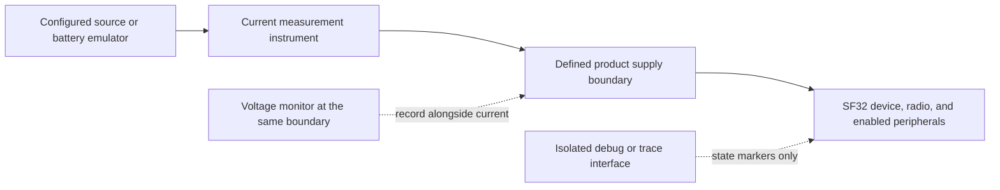

# Bluetooth Low-Power Profiling { #bluetooth-low-power-profiling }

This article explains how to determine the **actual Bluetooth LE power consumption of a device**. The goal is a repeatable product measurement: current and voltage at a defined electrical boundary, under a defined Bluetooth scenario, with enough firmware evidence to explain every important part of the trace.

Nordic's [Online Power Profiler for Bluetooth LE](https://devzone.nordicsemi.com/power/w/opp/2/online-power-profiler-for-bluetooth-le) is a useful conceptual reference. Nordic describes it as a model derived from measurements that produces expected values, not a measurement of a specific device. Its published accuracy experience applies to Nordic reference parts only and must not be applied to SF32. Use a model to decide what to test; use a current measurement on the target device to establish the product result.

## Define What You Are Measuring

"Bluetooth power" can mean very different things. A radio-only measurement can help optimize a connection parameter, but it does not reveal the power a shipping device draws when the controller, application CPU, sensors, display, memory, and power supply are all involved.

<div align="center"><em>Table: Bluetooth Power Measurement Boundaries</em></div>

<div align="center" markdown>

| Boundary | What it includes | When to use it | Limitation |
|:---------|:-----------------|:---------------|:-----------|
| Bluetooth subsystem or selected rail | Radio/controller and the selected supply path | Isolating a radio or controller regression | Does not equal whole-device battery consumption |
| MCU input rail | MCU, controller, and on-chip peripherals supplied by that rail | Comparing firmware states on a controlled board | Excludes external components on other rails and regulator loss |
| Battery or main product input | Regulators, MCU, external memory, sensors, display, and other powered loads | Battery-life modeling and product acceptance | Requires careful control of all attached hardware and supplies |

</div>

For a product battery-life claim, measure at the battery or main product-input boundary whenever practical. Record the voltage with current, so the result can be expressed as power and energy rather than a current number detached from its supply condition.

## Set Up a Repeatable Test

The instrument and the device must share a clearly documented test boundary. Nordic's Power Profiler Kit II (PPK II) is a useful reference-class source measure tool when its voltage and current ranges suit the setup. An equivalent source measure unit or current analyzer is also valid. The discipline matters more than the brand of instrument.

<div align="center"><em>Figure: Device-Level Bluetooth Power Measurement Setup</em></div>



Before each run:

1. Disconnect USB power, a debugger, or other supplies that can bypass the instrument or add load. Keep only the interfaces required by the scenario.
2. Apply the documented supply voltage at the selected boundary. Record every powered rail, jumper, module, and external device.
3. Use the product firmware build and its intended PM configuration. Disable high-volume diagnostic logging for final numbers unless it is part of the shipping configuration.
4. Prepare the same phone, accessory, test application, distance, antenna orientation, and RF environment for each comparison.
5. Capture a sufficiently long window to include many repeated Bluetooth events, not only one convenient pulse.

## Measure Named Bluetooth Scenarios

Do not begin with an undefined "Bluetooth on" state. Profile scenarios that reflect how the device is actually used.

<div align="center"><em>Table: Minimum Bluetooth LE Scenario Set</em></div>

<div align="center" markdown>

| Scenario | Setup | What to calculate | Typical cause of a misleading result |
|:---------|:------|:------------------|:-------------------------------------|
| Advertising | Device is discoverable but not connected | Average current and energy per advertising interval | Phone scanning behavior, debug traffic, or advertising that never backs off |
| Connected idle | Bonded device is connected with no application transfer | Average current over many connection intervals | Application CPU wakes on every connection event; timers or notifications remain active |
| User interaction | One representative GATT command, sensor upload, or UI-triggered action | Energy per completed action and added energy over idle | Only measuring the radio while ignoring host, display, or sensor work |
| Burst transfer or OTA | A defined payload with a defined completion condition | Energy per byte or per completed transfer, plus total duration | Using a peak rate as though it represented the whole transfer |
| Disconnect and reconnect | Peer leaves range, returns, and reconnects | Energy and time to recover | Unbounded retries or an aggressive advertising policy continuing indefinitely |

</div>

For each scenario, write down the Bluetooth role, peer, connection or advertising parameters, TX power, payload, start trigger, end condition, and how often the event occurs in real use. A trace without these facts cannot be compared with another firmware revision.

## Correlate the Trace with Firmware Behavior

The key to finding actual device consumption is attribution. Mark or log the start and end of product work so the trace answers why current changed:

- Before and after an application-initiated transfer or notification burst.
- When the display, sensor, Flash, audio path, or other external component is enabled or disabled.
- When firmware requests a PM state and when the device actually enters it.
- When a reconnect, retry, or error-recovery path starts.

Use a GPIO trace point, low-overhead event marker, or a reproducible test script. A serial log can assist bring-up, but it can also change current consumption. Treat final measurement logging as a controlled test variable, not a free observation channel.

<div align="center"><em>Table: Reading a Bluetooth Power Trace</em></div>

<div align="center" markdown>

| Trace observation | Likely meaning | Verify in firmware or hardware |
|:------------------|:---------------|:-------------------------------|
| Short, regularly spaced pulses above a low baseline | Scheduled advertising or connection events | Interval, radio role, and actual low-power state between events |
| A larger burst immediately after each radio event | Host callback, protocol processing, or application work | Which callback runs, whether data is useful, and whether work can be batched |
| High current persists after the expected event | A PM constraint, peripheral, or external interface remains active | PM votes, timers, clocks, pin states, display/sensor power, and error paths |
| Sporadic long bursts | Retries, scanning, reconnects, peer traffic, or user activity | RF conditions, peer behavior, backoff/retry policy, and test script |
| Baseline changes after connecting a module or cable | The electrical boundary changed | Back-power paths, UART adapters, external pulls, module rails, and supply routing |

</div>

## Calculate Actual Energy and Daily Consumption

For a variable trace, calculate energy from current and voltage over time:

```text
E_scenario = integral(V(t) x I(t) dt)
P_average = E_scenario / T_scenario
```

If voltage is held constant at the measurement boundary, average current can also be used for comparisons. Keep the voltage record anyway, especially when moving between a regulated rail and the battery input.

For a repeated product scenario:

```text
E_day = sum(E_scenario x events_per_day) + E_connected_idle + E_other_states
```

The scenario energy must include the full device work needed to complete it. For example, a phone notification may include a connection event, host processing, a sensor or Flash access, a display update, and a return to sleep. Measuring only the RF pulse understates the device energy; measuring the entire product without trace markers makes the cause impossible to improve.

## Reconcile the Model with the Device

Use the first model to rank likely contributors, then update it from real measurements. A difference between estimate and trace is valuable: it points to a missing event, a wrong duration, an unexpected wakeup, or an external load that was not included.

<div align="center"><em>Figure: Actual Bluetooth Power-Verification Loop</em></div>


<div align="center"><em>Table: Reconciliation Questions</em></div>

<div align="center" markdown>

| Model vs. measurement mismatch | Questions to answer |
|:--------------------------------|:-------------------|
| Average current is higher than expected | Is the device entering the requested PM state? Are timers, logging, or peripheral clocks keeping it awake? |
| Event energy is higher than expected | Did the host, display, sensor, memory, or retry path do extra work? Is RF quality forcing retries or higher TX power? |
| Connected idle dominates battery life | Are connection interval, peripheral latency, notification cadence, and application wakeups appropriate for an idle product? |
| Reconnect energy dominates | Does the product use bounded retry/backoff behavior and a realistic discovery policy? |
| Board and final product disagree | Which external rails, regulator losses, modules, antenna/enclosure effects, and interface pulls differ? |

</div>

## Start from a Repeatable SiFli Baseline

Use SiFli-SDK examples to make a Bluetooth state repeatable before measuring the product firmware. The example's supported board, supply path, jumper configuration, SDK settings, and test procedure are baseline evidence; they are not product specifications.

<div align="center"><em>Table: SiFli-SDK Bluetooth Profiling Starting Points</em></div>

<div align="center" markdown>

| Measurement target | Official starting point | Then measure on the product |
|:-------------------|:------------------------|:----------------------------|
| BLE advertising and connection power | [BLE Broadcast and Connection Power Consumption Test](https://docs.sifli.com/projects/sdk/latest/en/sf32lb52x/example/pm/ble/README.html) | Product advertising policy, connection parameters, callbacks, peer behavior, and antenna |
| BLE and Classic Bluetooth power | [BLE/BT Power Consumption Test](https://docs.sifli.com/projects/sdk/latest/en/sf32lb52x/example/pm/bt/README.html) | Actual role, mode, audio/data traffic, and power policy |
| Connected GATT service | [BLE Peripheral](https://docs.sifli.com/projects/sdk/latest/sf32lb58x/example/ble/peripheral/README.html) | Real characteristics, notification cadence, security, and phone interaction |
| BLE data transfer | [BLE Throughput](https://docs.sifli.com/projects/sdk/latest/sf32lb58x/example/ble/throughput/README.html) | Energy per completed payload and end-to-end completion time |
| Other Bluetooth workflows | [Bluetooth SDK Examples](bluetooth-sdk-examples.md) | The closest Classic Bluetooth, BLE, or LE Audio role/profile before product integration |

</div>

## Release Review Checklist

- [ ] The measurement boundary and supply voltage are documented.
- [ ] Current and voltage were recorded for every release-relevant scenario.
- [ ] USB, debugger, UART adapters, and external module supplies were controlled or explicitly included.
- [ ] Traces are correlated to firmware events, PM state requests, and actual entered states.
- [ ] Advertising, connected idle, representative transfer, and reconnect behavior have all been measured where applicable.
- [ ] Scenario energy has been scaled with realistic daily frequency and reconciled with the battery budget.
- [ ] The largest energy contributor has an owner and an optimization or acceptance decision.

## Related Resources

- [Bluetooth Overview](overview.md) for connection parameters, profiles, security, and system coexistence.
- [Bluetooth SDK Examples](bluetooth-sdk-examples.md) for Classic Bluetooth, BLE, and LE Audio project selection.
- [Low-Power Overview](../low-power/overview.md) for PM design and the full product power budget.
- [Power Measurement and Validation](../low-power/measurement-and-validation.md) for the component-to-product validation workflow.
- [Smartwatch Power Profiling](../low-power/smartwatch-power-profiling.md) for a worked daily-use energy model.

!!! note "Auto-generated content"
    This page was compiled/drafted without an existing source document. Verify technical claims against SiFli's official documentation before relying on them.
