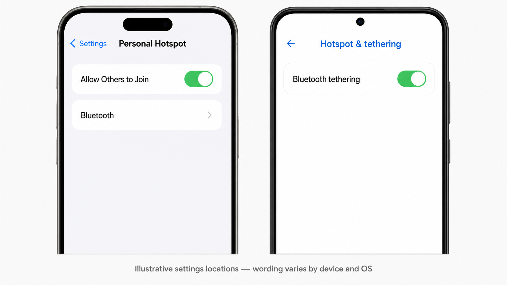

# Bluetooth PAN

## Overview

**Bluetooth PAN** (Personal Area Networking) lets an SF32 device reach an IP network — typically the internet, by way of a phone's tethering connection — over a Classic Bluetooth link instead of a dedicated Wi-Fi radio. It is one of the Classic Bluetooth profiles listed in [Bluetooth Overview](overview.md#classic-bluetooth-profiles) and one of the OTA transport options covered in [OTA and DFU](../../develop/firmware-topics/ota-dfu.md).

Use this page when a product needs occasional or moderate-throughput IP connectivity — weather, time sync, cloud API calls, voice-assistant traffic, firmware downloads — and adding a full Wi-Fi radio, antenna, and RF certification path is not worth the cost, board area, or power budget for that use case.

## How Bluetooth PAN Works

PAN is defined by the Bluetooth SIG as a Classic Bluetooth (BR/EDR) profile. It carries Ethernet-style packets over a Bluetooth ACL link using **BNEP** (Bluetooth Network Encapsulation Protocol), which runs over L2CAP rather than RFCOMM. Because it depends on Classic Bluetooth's ACL connection, PAN is only available on dual-mode Bluetooth devices — it has no BLE equivalent.

The profile defines three roles:

<em>Table: Bluetooth PAN Roles</em>

| Role | Function |
|:-----|:---------|
| **NAP** (Network Access Point) | Bridges connected Bluetooth devices to an external network, forwarding packets between the Bluetooth piconet and that network. Typically the phone, when using its tethering/Personal Hotspot feature. |
| **PANU** (PAN User) | The client role. Connects to a NAP (or GN) device and uses its network access. This is the role SF32 devices use. |
| **GN** (Group Ad-hoc Network) | Forwards packets between connected PANU devices without providing outside network access — used for ad-hoc device-to-device networking rather than internet access. |

A PANU discovers nearby NAP devices via inquiry and SDP (checking for the Networking bit in the discovered device's class-of-device field), connects over ACL, then brings up a BNEP connection over L2CAP. From that point, the NAP forwards network packets to and from the PANU much like an Ethernet bridge. Either side can terminate the connection at any time, and typical phone-side behavior means the link needs to be re-established after the phone's tethering state changes.

## Why Use PAN Instead of Wi-Fi

<em>Table: PAN vs. Wi-Fi vs. BLE for Network Access</em>

| Approach | Good Fit When | Tradeoff |
|:---------|:---------------|:---------|
| Bluetooth PAN | Product already uses dual-mode Bluetooth, needs occasional/moderate IP traffic, and a companion phone is normally nearby. | Throughput and range are bounded by the phone's tethering link and Bluetooth Classic; no direct internet access without a paired phone. |
| Dedicated Wi-Fi radio | Product needs sustained high-throughput or phone-independent connectivity. | Extra radio, antenna, RF certification, and power budget on top of Bluetooth. |
| BLE only (no PAN) | Product only needs short data exchanges with a companion app, not general IP networking. | No general network/internet access — BLE has no PAN equivalent. |

For products already committed to dual-mode Bluetooth for audio, GATT services, or Classic profiles, PAN is frequently the lowest-incremental-cost way to add internet access without a second radio subsystem — provided the product's use case tolerates being dependent on a nearby, tethering-enabled phone.

## iOS Data Transport: BLE Relay, Classic Bluetooth, and PAN

It is important to separate three different iPhone connectivity designs. Saying “Classic Bluetooth requires MFi” without qualification is too broad: iOS supports standard Bluetooth profiles, and Personal Hotspot itself can use Bluetooth. The restriction applies when an iOS app needs a **custom data channel** to a Bluetooth Classic accessory through Apple’s External Accessory/iAP path. Apple documents that External Accessory communicates with MFi accessories over Bluetooth, while its [technical Q&A](https://developer.apple.com/library/archive/qa/qa1657/_index.html) states that BLE accessories use Core Bluetooth instead and are not required to be MFi compliant.

<em>Table: iOS Accessory-to-Internet Design Choices</em>

| Design | Device-to-phone path | iOS product implication | Internet throughput and engineering tradeoff |
|:-------|:---------------------|:------------------------|:--------------------------------------------|
| BLE → app → Internet | Custom GATT protocol; the iOS app receives device data and forwards it to the cloud. | BLE can use Core Bluetooth without the External Accessory MFi path. The app must own pairing, framing, retry, background behavior, and the cloud relay. | BLE payload capacity and scheduling are limited by connection parameters and iOS/app behavior. This route is often appropriate for small, intermittent data, but it is not a general IP link and can become the practical bottleneck for continuous or data-heavy traffic. |
| Custom Classic Bluetooth → app | A custom Bluetooth Classic accessory data channel to an iOS app. | The [External Accessory framework](https://developer.apple.com/documentation/externalaccessory) is for MFi accessories; Apple states that this framework is limited to MFi hardware. Standard supported profiles are a separate case. | May suit a product that needs a licensed Classic Bluetooth accessory protocol, but it adds MFi program, protocol, app, and certification considerations; it does not by itself create direct device IP networking. |
| Bluetooth PAN → phone hotspot → Internet | Standard PANU-to-NAP networking; SF32 uses the phone's Bluetooth Personal Hotspot/tethering service. | The device uses the phone's tethering service rather than a custom app-to-accessory transport. The product still must qualify the phone, carrier, and tethering behavior. | The SF32 device obtains an IP path and can run its own network client. This can provide materially higher practical Internet throughput than a conventional BLE → app → Internet relay, while removing the app from the data path. It is not a throughput guarantee: the result remains bounded by Bluetooth PAN, phone policy, cellular service, and the cloud endpoint. |

For a voice assistant, OTA client, or other product that needs sustained streaming or direct HTTP/WebSocket traffic, PAN is therefore an effective iOS-compatible alternative to putting a BLE relay app in the middle. It does **not** replace an app where the product needs configuration UI, user authentication, notifications, or local control; it simply keeps the application data plane from being constrained by that app relay. The [SF32 Xiaozhi Voice Assistant](../../projects/sf32-xiaozhi.md) is a working example of this architecture.

## Device Support on SF32

PAN requires dual-mode Bluetooth, so it follows the same device split as other Classic Bluetooth profiles:

<em>Table: SF32 Family PAN Support</em>

| Family | Bluetooth Capability | PAN Support |
|:-------|:----------------------|:-------------|
| SF32LB52x | Dual-mode Bluetooth | Yes |
| SF32LB55x | BLE only | No — PAN requires Classic Bluetooth |
| SF32LB56x | Dual-mode Bluetooth | Yes |
| SF32LB58x | Dual-mode Bluetooth | Yes |

See [Bluetooth Overview](overview.md#choose-ble-classic-or-dual-mode) for the broader BLE-vs-dual-mode device selection guidance.

## SiFli-SDK's PAN Example

SiFli-SDK ships a working PANU implementation at `example/bt/pan`, supported on the `eh-lb52x`, `eh-lb56x`, `eh-lb58x`, and the `sf32lb52/56/58-lcd` board series. The example connects to a phone's PAN (NAP) service and then uses Finsh shell commands to demonstrate real network use — including a `weather` command that fetches current conditions over the established PAN link.

At startup, the example enables Bluetooth inquiry and page scan so a phone can discover and pair with the device under its default Bluetooth name, `sifli_pan`.

<em>Table: PAN Example Finsh Commands</em>

| Command | Effect |
|:--------|:-------|
| `pan_cmd conn_pan` | Connect to PAN after the phone's network sharing is enabled. |
| `pan_cmd ota_pan` | Download and install the firmware image specified in `main.c` over the PAN link. |
| `pan_cmd set_retry_flag 1` / `0` | Enable or disable automatic PAN reconnection. |
| `pan_cmd set_retry_time N` | Set the maximum number of autoconnect retry attempts. |
| `pan_cmd autoconnect` | Manually trigger a reconnect attempt after the phone drops and re-enables sharing. |

## Mobile Phone OS Support and Qualification

The phone is the PAN **NAP** and part of the product's network path, not merely a provisioning tool. Treat its operating system, handset model, carrier plan, and tethering policy as supported-product configuration. A Bluetooth pairing that succeeds is not sufficient: the phone must expose a Bluetooth tethering/PAN service and route traffic after the PANU connects.

<em>Table: Mobile Phone OS Support for Bluetooth PAN</em>

| Mobile OS | What the platform documents | SF32 bring-up guidance | Product qualification boundary |
|:----------|:----------------------------|:-----------------------|:-------------------------------|
| **iOS / iPadOS with cellular service** | [Apple Personal Hotspot documentation](https://support.apple.com/guide/iphone/share-your-internet-connection-iph45447ca6/26/ios/26) documents Bluetooth as a connection method and states that Personal Hotspot shares the phone's cellular Internet connection. | Follow the [SiFli Xiaozhi iOS path](https://docs.sifli.com/projects/xiaozhi/get-started/): use a phone with an installed SIM, enable Personal Hotspot before pairing, keep Bluetooth enabled, and pair/connect to the SF32 device. If `sifli-pan` is not visible, the SiFli guide notes that restarting the phone can help. | Personal Hotspot availability, data limits, and the number of connected devices depend on the carrier and iPhone model. Test every supported iOS/iPadOS release, handset class, and carrier plan; do not infer support from Wi-Fi hotspot operation alone. |
| **Android** | [Android Help](https://support.google.com/android/answer/9059108) states that most Android phones can share mobile data by Bluetooth: pair first, configure the other device's Bluetooth network connection, then enable **Bluetooth tethering**. | Enable Bluetooth tethering before `pan_cmd conn_pan`. Setting names and menu locations vary by vendor, Android release, and enterprise policy; record the exact path used for each qualified phone. | Google describes this as available on *most*, not all, Android phones. Carriers can limit or charge for tethering, and vendors can hide or alter the control. Test the shipping handset/OS/carrier combinations rather than relying on an Android version alone. |
| **HarmonyOS and other Android-derived mobile systems** | This guide has no platform-wide PAN-support assertion for these systems. Their Bluetooth and tethering implementations may be derived from Android but can differ by model, market, release, carrier configuration, or device-management policy. | Look for a Bluetooth-tethering control, pair the phone and SF32 device, then prove actual IP traffic with the PAN example. | Treat each exact handset, OS build, region, and carrier as **qualification required** until it passes the same validation record used for Android. Do not advertise support based only on brand or Bluetooth pairing. |

### Phone-Side Setup

<em>Figure: Illustrative locations of the iOS Personal Hotspot and Android Bluetooth-tethering switches</em>

This is an illustrative settings reference, not a literal operating-system screenshot. The wording and menu location vary by iOS/iPadOS version, Android vendor, and phone-management policy; look for **Allow Others to Join** on iOS/iPadOS or **Bluetooth tethering** on Android.

Use this sequence for each phone under test:

1. Confirm that cellular data works on the phone and that the carrier plan permits tethering.
2. Enable the phone's Bluetooth tethering or Personal Hotspot function **before** requesting PAN from the SF32 device.
3. Pair the phone and device, keeping the phone discoverable when the OS requires it.
4. Run `pan_cmd conn_pan`, then prove an IP transaction such as the example's `weather` command—not just a successful Bluetooth connection.
5. Disable sharing, sleep/wake the phone, and move the phone out of range; confirm that the product's intended reconnect behavior works.

If sharing is enabled only after the Bluetooth connection is already established, reconnect PAN explicitly with `pan_cmd conn_pan`.

### Define a Shipping Phone Support Matrix

For a consumer product, publish supported **phone model + OS version + carrier/region** combinations, not simply “iOS” or “Android.” Record at least the following for each candidate: phone model, OS build, carrier and SIM state, tethering setting name, initial connection time, reconnect behavior after screen lock and radio loss, sustained traffic result, and any user action needed to restore service. Re-run this matrix whenever the app, PAN firmware, phone OS, or carrier profile changes.

## PAN-Based OTA Delivery

The PAN example ships with OTA enabled by default: `pan_cmd ota_pan` downloads and installs a firmware image over the same Bluetooth PAN link already used for network traffic, using the DFU_PAN OTA path documented alongside SiFli-SDK's firmware upgrade service. This is a good fit for products that already rely on PAN for data and don't want a second OTA transport — see [OTA and DFU](../../develop/firmware-topics/ota-dfu.md) for how PAN compares to BLE and other update transports, and plan rollback/recovery behavior the same way regardless of transport.

## A Real SF32 Product Using PAN

The [SF32 Xiaozhi Voice Assistant](../../projects/sf32-xiaozhi.md) project is a concrete, working example of PAN on SF32: it uses Bluetooth PAN to obtain internet access through a paired phone, then streams voice interaction to a cloud service over that connection. It's a useful reference for how a full product wires PAN networking, WebSocket/HTTP application traffic, and the phone-tethering dependency together end to end.

## Troubleshooting

<em>Table: Troubleshooting Bluetooth PAN</em>

| Symptom | Likely Cause |
|:--------|:--------------|
| PAN connects but network commands (e.g. `weather`) fail | Device's Bluetooth MAC address OUI (first three bytes) is not a valid IEEE-assigned value. Check with `nvds get_mac` and set a valid one with `nvds update addr 6 ...` if needed. |
| Phone doesn't see the device, or won't connect | Confirm the phone's tethering/network-sharing is enabled *before* connecting, and that the device is discoverable (inquiry/page scan active). |
| Phone pairs but `weather` or another IP operation fails | Pairing does not prove a PAN NAP service. Confirm Bluetooth tethering/Personal Hotspot is enabled, cellular data works, the carrier permits tethering, and the tested handset/OS combination is in the support matrix. |
| PAN drops after phone-side network state changes | Expected — reconnect with `pan_cmd conn_pan` or enable `pan_cmd set_retry_flag 1` for automatic reconnection. |
| OTA over PAN fails partway through | Treat it like any other OTA transport: verify the image URL, partition layout, and rollback behavior per [OTA and DFU](../../develop/firmware-topics/ota-dfu.md) rather than assuming PAN itself is at fault. |

## Bring-Up Checklist

- [ ] Confirm the target SF32 family supports dual-mode Bluetooth (SF32LB52x/56x/58x, not SF32LB55x).
- [ ] Decide whether PAN's phone-tethering dependency fits the product's connectivity model, or whether a dedicated Wi-Fi radio is actually needed.
- [ ] Bring up `example/bt/pan` on the target board and confirm phone-side tethering setup (iOS/iPadOS Personal Hotspot or Android Bluetooth tethering).
- [ ] Validate a real PAN connection and at least one network operation (e.g. the example's `weather` command) end to end.
- [ ] Qualify every intended phone model, OS build, region/carrier plan, and tethering setting path; do not ship with a generic “iOS/Android supported” claim.
- [ ] Verify the device's Bluetooth MAC OUI is valid before relying on network functionality.
- [ ] If using PAN for OTA, test the full `pan_cmd ota_pan` path, including rollback behavior, before shipping.
- [ ] Design the reconnect/autoconnect behavior (`set_retry_flag`, `set_retry_time`) around how often the product expects the phone to be in range.

## Key Takeaways

- Bluetooth PAN carries IP/Ethernet-style traffic over Classic Bluetooth using BNEP over L2CAP — it requires dual-mode Bluetooth and has no BLE equivalent.
- SF32 devices use the client **PANU** role, typically connecting to a phone acting as **NAP** through its tethering/Personal Hotspot feature.
- On iOS, BLE accessories can use Core Bluetooth without MFi, but a custom app-to-accessory Bluetooth Classic data channel through External Accessory/iAP is an MFi path. PAN instead uses the phone's tethering service, letting the SF32 device use its own IP client rather than a BLE-app relay.
- PAN is supported on SF32LB52x, SF32LB56x, and SF32LB58x; SF32LB55x is BLE-only and does not support it.
- SiFli-SDK's `example/bt/pan` is a working reference implementation, including Finsh commands for connect, reconnect, and PAN-based OTA delivery.
- PAN is a good fit when a phone is normally nearby and the product's IP traffic is occasional or moderate — sustained high-throughput or phone-independent connectivity still calls for a dedicated Wi-Fi radio.

!!! note "Auto-generated content"
    This page was compiled/drafted without an existing source document. Verify technical claims against SiFli's official documentation before relying on them.
