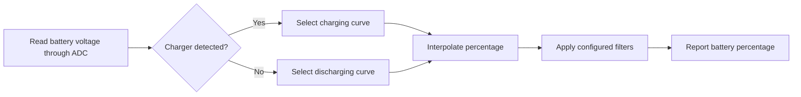

# Battery Capacity Calculation

The SiFli-SDK battery calculator estimates a battery's state of charge as a percentage from its measured voltage. It is a voltage-to-percentage estimator, not a coulomb counter: the result is only as accurate as the battery curve and charger-state information supplied to it.

The middleware uses separate charge and discharge curves, detects the current charging state, interpolates between curve points, and filters the result so ordinary voltage movement does not make the battery indicator jump.

## What the Calculator Does

<div align="center"><em>Table: Battery-calculator behavior</em></div>
<div align="center" markdown>

| Function | Behavior |
| --- | --- |
| Charge and discharge curves | Selects the appropriate voltage-to-percentage curve for the current charging state. |
| Linear interpolation | Calculates a percentage between the points in the selected curve. |
| Primary filter | Rejects voltage changes that do not persist beyond the configured threshold and count. |
| Secondary filter | Optionally smooths the result with a weighted previous/current voltage average. |
| Charge-state detection | Uses `CHARGE_DETECT_PIN` to switch between the charge and discharge curves. |

</div>

<div align="center"><em>Diagram: Battery-percentage estimation path</em></div>



## Configure the Board First

Before using the middleware, configure the board in menuconfig:

1. Enable ADC support for battery-voltage measurement.
2. Enable the battery-calculator feature.
3. Enable charging support.
4. Select the charger IC used by the board. Use the simple charger option only when no listed charger IC applies.
5. Configure the board's charger-insertion detection pin.
6. Select the detection-pin polarity to match the hardware.

`BSP_CHARGER_INT_PIN_ACTIVE_HIGH` defines the charger-detect polarity. When it is defined, a high level means the charger is inserted; when it is not defined, a low level means inserted. A wrong polarity selects the wrong battery curve and can make the displayed percentage appear stuck or behave in the wrong direction.

## Use Battery Curves from the Actual Cell

The board directory's default `battery_table.c` is a reference example, not a universal battery model. Obtain voltage-versus-percentage curves for the actual cell from its manufacturer, then configure matching lookup tables for the product.

<div align="center"><em>Table: Battery-curve requirements</em></div>
<div align="center" markdown>

| Table | Required definition |
| --- | --- |
| `charging_curve_table` | `const battery_lookup_point_t[]` table for charging. Voltage entries must be ordered from high to low. |
| `discharge_curve_table` | `const battery_lookup_point_t[]` table for discharging. Voltage entries must be ordered from high to low. |
| Table contents | Percentages correspond from 100 down to 0 and must reflect the actual battery's behavior. |
| Table location | Board-specific `battery_table.c`. |

</div>

Use separate curves because a cell's voltage at the same state of charge differs between charging and discharging. Do not substitute an arbitrary 4.2 V lithium-cell curve for the actual cell simply because the nominal chemistry matches.

## Configure the Calculator

`battery_calculator_config_t` supplies the two curve tables and filtering settings.

<div align="center"><em>Table: Battery-calculator configuration</em></div>
<div align="center" markdown>

| Field | Purpose | SDK reference value |
| --- | --- | --- |
| `charging_table`, `charging_table_size` | Charging curve and number of points | Board-specific |
| `discharging_table`, `discharging_table_size` | Discharge curve and number of points | Board-specific |
| `charge_filter_threshold` | Charging voltage-jump threshold | `50` mV |
| `discharge_filter_threshold` | Discharging voltage-jump threshold | `30` mV |
| `filter_count` | Consecutive readings that must exceed the threshold before updating | `3` |
| `secondary_filter_enabled` | Enables the weighted secondary filter | `true` |
| `secondary_filter_weight_pre` | Previous-voltage weight | `90` |
| `secondary_filter_weight_cur` | Current-voltage weight | `10` |

</div>

When the secondary filter is enabled, `secondary_filter_weight_pre + secondary_filter_weight_cur` must equal `100`. Tune thresholds, counts, and weights against the actual battery, load transients, and product experience rather than treating the SDK reference values as a calibration result.

## Initialize and Calculate

Initialize the calculator before requesting a percentage:

```c
void battery_calculator_init(battery_calculator_t *calc,
                             const battery_calculator_config_t *config);
```

Provide the measured battery voltage in mV to calculate the percentage:

```c
uint8_t battery_calculator_get_percent(battery_calculator_t *calc,
                                       uint32_t voltage_mv);
```

<div align="center"><em>Table: Recommended integration sequence</em></div>
<div align="center" markdown>

| Step | Action |
| --- | --- |
| 1 | Configure the board's ADC, charger type, charger-detect pin, and polarity. |
| 2 | Define validated charging and discharging curves in `battery_table.c`. |
| 3 | Initialize `battery_calculator_t` with `battery_calculator_config_t`. |
| 4 | Read the battery voltage through the configured ADC path. |
| 5 | Pass the voltage in mV to `battery_calculator_get_percent()`. |
| 6 | Use the filtered result for UI, low-battery policy, and product telemetry. |

</div>

## Verify Behavior on Product Hardware

The displayed percentage should follow the product's physical state, not merely return plausible-looking values in a lab. Verify the charger-detect state, voltage reading, selected curve, and displayed percentage together during charging, discharging, cable insertion, and cable removal.

<div align="center"><em>Table: Battery-percentage troubleshooting</em></div>
<div align="center" markdown>

| Symptom | Check first |
| --- | --- |
| Percentage changes too abruptly | Increase the relevant filter threshold or `filter_count`; enable or strengthen the secondary filter. |
| Percentage is inaccurate | Obtain a curve that matches the actual battery and recalibrate the lookup points. |
| Percentage stays fixed | Verify the reported charger state and the `BSP_CHARGER_INT_PIN_ACTIVE_HIGH` polarity. While charging, the algorithm does not allow the percentage to decrease; while discharging, it does not allow it to increase. |
| Percentage has the wrong trend | Verify the charger-detect pin, its electrical polarity, and the selected charging/discharging curve. |

</div>

For the official middleware reference and current configuration screenshots, see [Battery Capacity Calculation in SiFli-SDK](https://docs.sifli.com/projects/sdk/latest/sf32lb58x/middleware/battery_calculator.html). For system-level battery-life estimates, continue with [Smartwatch Power Profiling](smartwatch-power-profiling.md); for measured verification, see [Power Measurement and Validation](measurement-and-validation.md).
