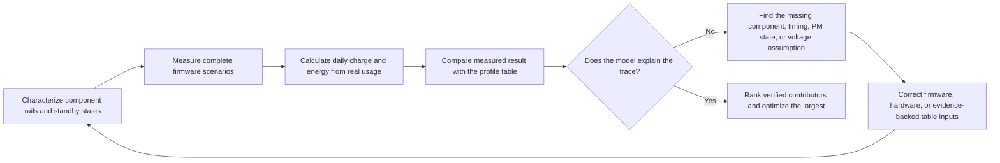

# Power Measurement and Validation

A battery-life estimate becomes credible only when its assumptions converge with hardware measurements. Use this page with the [Low-Power Overview](overview.md) and the [Smartwatch Power Profiling](smartwatch-power-profiling.md) example. The workflow starts with individual components, validates complete firmware scenarios, reconciles the daily-use model, and then directs the next optimization effort to the largest verified energy cost.

## Measure Energy, Not Current Alone

Current is only one part of the result. Record the device-under-test voltage (`V_DUT`) with the current trace so that the capture represents instantaneous power and energy as well as charge:

```text
power_W(t) = voltage_V(t) x current_A(t)
energy_Wh = integral(power_W(t) dt) / 3600
charge_mAh = integral(current_mA(t) dt) / 3600
```

If the supply is stable, record the measured `V_DUT` for the capture and use it with the current trace. If the voltage changes during the test, sample it on the same timebase as current, or record enough synchronized voltage points to calculate a defensible average power. Comparing only mAh can hide a real change in energy when the supply voltage, regulator operating point, or battery state differs between captures.

## Set Up the Measurement Baseline

Use the Nordic [Power Profiler Kit II (PPK2)](https://docs.nordicsemi.com/r/bundle/ug_ppk2/page/ug/ppk/ppk_user_guide_intro.html) as the reference current-measurement tool. It can supply a DUT in Source Meter mode or measure current in series with an external supply in Ampere Meter mode. In Source Meter mode, use the configured output voltage as a controlled test condition; in Ampere Meter mode, measure and log the external supply voltage at the DUT. In either case, record the voltage actually presented to the DUT, not just the nominal battery or bench-supply setting.

PPK2 provides the current waveform, accumulated charge, and exportable capture data. Where the DUT voltage is compatible, its digital inputs can also mark firmware phases in the trace. Use a GPIO marker around important paths such as wake, display update, radio transfer, sensor sampling, and return to sleep. The official [PPK2 user guide](https://docs.nordicsemi.com/r/bundle/ug_ppk2/) documents the supported operating modes and connection requirements.

<div align="center"><em>Table: Required Capture Record</em></div>

<div align="center" markdown>

| Record | Why It Is Needed |
|:-------|:-----------------|
| Test ID, board revision, populated components, and firmware revision | Makes results repeatable and comparable. |
| `V_DUT`: target, measured start/end, and variation during the capture | Enables a valid power and energy calculation. |
| Current trace, average current, peak current, charge, and capture duration | Separates brief peaks from sustained energy cost. |
| Temperature, battery state or bench-supply setting, and radio environment | Prevents environmental changes from being misread as firmware improvements. |
| Enabled peripherals, clock policy, PM state, and wake sources | Explains why the device did or did not enter the intended low-power state. |
| Firmware markers and trigger conditions | Attributes energy to a specific path instead of a vague waveform region. |

</div>

## Characterize Each Component Before Full-System Tests

Measure each component at an isolatable rail or fixture before relying on a whole-board trace. The goal is not to create a catalogue number; it is to determine which operating modes, loads, and firmware settings dominate the component's energy in the actual product.

<div align="center"><em>Table: Component-Level Characterization Plan</em></div>

<div align="center" markdown>

| Component | Measure at Minimum | Record in the Model |
|:----------|:-------------------|:--------------------|
| MCU | Active work, Idle, each intended sleep mode, wake and clock-transition intervals | Current and duration for each firmware state; unexpected wakeups and PM blockers. |
| External PSRAM | Standby or retention, reads, writes, burst traffic, and refresh behavior where applicable | Rail current by access pattern and the time spent in each pattern. |
| External Flash | Deep-power-down or standby, reads, writes, erase operations, and wake latency | Energy per access or operation plus idle-state current. |
| Each external sensor | Every enabled mode, output data rate, FIFO or interrupt policy, and duty cycle | Energy per sample or interval, including the MCU service cost when measured as a scenario. |
| Haptic motor and driver | Startup, amplitude, pattern, duration, and braking or coast behavior | Energy per haptic pattern, not just motor peak current. |
| Audio codec and power amplifier | Powered off, standby, playback or capture, output level, and real speaker or load impedance | Energy per audio session and the off-state leakage of the complete audio path. |
| Display, touch, radio, PMIC, and other loads | Their relevant active, idle, and retention states | Separate current assumptions or explicit `Other` entries with a stated boundary. |

</div>

Measure at the battery input whenever the question is whole-product energy. Rail-level measurements are still essential for isolation, but convert them back to the battery side with measured regulator efficiency and quiescent current before adding them to a battery-life model. Do not treat the sum of rail currents as a battery-input result.

## Verify Driver-Controlled Power States

A component reaches its specified low-power state only when its driver applies the documented settings and sequence. A driver that is functionally correct can still waste power if it leaves an enable signal asserted, uses the wrong standby command, keeps a clock or bus active, or changes power, reset, and interface signals in the wrong order. For every intended state, reproduce the datasheet conditions in firmware and confirm that measured current, voltage, charge, and energy match the applicable specification or the product's validated operating point.

<div align="center"><em>Table: Driver-Controlled Power-State Review</em></div>

<div align="center" markdown>

| Control Area | Driver Requirement | Measurement Evidence |
|:-------------|:-------------------|:---------------------|
| Mode registers and low-power commands | Apply the documented standby, shutdown, retention, data-rate, and interrupt settings; verify status where the component supports it. | Current and energy match the selected mode, with the intended configuration captured in the test record. |
| Power, enable, reset, and clock sequence | Meet the component's required ordering and timing during power-up, use, and power-down. | GPIO markers and the power trace show that no unintended active interval or current spike remains. |
| SPI, I2C, UART, and other control buses | Stop unnecessary traffic; put chip select, clock, data, and interrupt lines in their specified inactive state. | The component stays in its intended low-power state between transactions. |
| GPIO pulls and high impedance | Configure every control pin deliberately as output high, output low, input with the correct pull-up or pull-down, or high impedance only where the external circuit defines the level. | Current is checked with the peer powered and unpowered, and with reset/default states included. |
| Power-domain crossings | Never drive an unpowered component through a control or data pin unless the hardware explicitly supports that path. | No back-powering or leakage appears when either side of the interface is off. |
| Error and resume paths | Restore the correct state after timeouts, failed transfers, wakeups, and firmware resets. | Long-duration captures show no accumulating current caused by a failed cleanup path. |

</div>

Valid logic levels do not guarantee low leakage. Internal pulls, conflicting pull definitions, reset defaults, ESD paths, and bus pull-ups can create a leakage or back-power path even when both devices appear to be in a sensible logic state. Measure interface-related current with both sides of the interface powered, with one side unpowered, and across the transition between those conditions. If an observed state does not meet expectation, first distinguish a driver configuration or sequence error from a board-level leakage path before changing the power-profile table.

## Validate Firmware Scenarios

Once component behavior is understood, measure the complete firmware scenes that a user experiences. A scenario includes the components, PM states, wakeups, and timing that happen together. For a smartwatch, start with the same scenes used in the [Smartwatch Power Profiling](smartwatch-power-profiling.md) model: display-off standby, notifications, incoming-call alerts, raise-to-wake, automatic heart-rate checks, manual SpO2 checks, exercise recording, alarms, sleep monitoring, and app synchronization. Add NFC, Bluetooth calling, and AOD as separate scenes when those features are enabled.

<div align="center"><em>Table: Scenario Validation Record</em></div>

<div align="center" markdown>

| For Each Scenario | Verify | Feed Back Into the Profile |
|:------------------|:-------|:---------------------------|
| Start and end marker | The trace includes the entire wake-to-sleep path. | Scenario boundary and duration. |
| Component and rail activity | Only expected components are active. | Correct component assumptions and `Other` allocation. |
| PM state after work completes | The system reaches the intended sleep state. | Idle or standby current and remaining-time assumption. |
| Current, `V_DUT`, charge, and energy per occurrence | The capture represents battery-side cost. | Energy per event and charge per event. |
| Product behavior | The measurement preserves required latency, RF reliability, audio quality, and user experience. | A valid operating point, rather than an unusable low-power setting. |

</div>

Use firmware GPIO markers to divide one waveform into phases. For example, a raise-to-wake trace can expose gesture recognition, MCU wake, display enable, rendering, display-on dwell, dim or off, and return to sleep. This turns one average-current number into actions that firmware and hardware teams can own.

## Reconcile the Daily-Use Profile

The final check is not a collection of isolated best-case captures. Run or reconstruct a representative day from the measured scenario energy and its real frequency. Compare the measured result with the profile table in both charge and energy:

```text
daily_charge_mAh = sum(occurrences_per_day x charge_per_occurrence_mAh)
daily_energy_mWh = sum(occurrences_per_day x energy_per_occurrence_mWh)
```

<div align="center"><em>Diagram: Power-Profile Convergence Loop</em></div>



When measurement and model disagree, do not edit a table merely to force agreement. Trace the discrepancy to a testable cause: a missing load, an incorrect duty cycle, a regulator-loss assumption, an unintended wakeup, a component left enabled, or a measurement boundary that does not match the model. Update the table only with evidence from the corrected hardware or firmware measurement. Set an explicit, product-specific agreement criterion before release; the acceptable error depends on the battery claim, operating range, and remaining uncertainty.

<div align="center"><em>Table: How to Interpret a Profile Mismatch</em></div>

<div align="center" markdown>

| Mismatch | Likely Cause | Next Check |
|:---------|:-------------|:-----------|
| Component measurement is higher than expected | Incorrect component mode, rail leakage, regulator loss, or test fixture loading | Isolate the rail; verify mode pins, voltage, and board population. |
| Scenario energy is higher than the component sum | Extra wakeups, display or radio dwell, service code, or overlapping loads | Add firmware markers and compare component states across the full scenario. |
| Daily profile is higher than the scenario sum | Usage frequency, connected-idle time, disabled feature, or background task is wrong | Audit event counts, timers, radio schedule, and the definition of remaining standby time. |
| Model and measurement agree only in one setup | Voltage, temperature, RF environment, battery state, or firmware build differs | Repeat the same scenes across the intended operating range. |

</div>

## Optimize the Largest Verified Contributors

Use the reconciled profile to decide where effort has the highest return. Separate two questions: which component consumes the most energy, and which product scenario consumes the most energy. The answer can be different. A display may be the largest component, while raise-to-wake frequency is the scenario that makes it dominant.

1. **Improve firmware first where behavior is the driver.** Remove unintended wakeups, reduce polling, batch work, shorten display-on time, avoid unnecessary redraws, release PM constraints promptly, and lower sensor or radio duty cycles without breaking the product requirement.
2. **Improve hardware where the component limit is real.** Select lower-power sensors, memory, regulators, codecs, amplifiers, displays, or haptic solutions only after comparing the measured energy in the intended operating mode, not a headline datasheet current in an unrelated state.
3. **Re-measure the changed component and scenario.** A replacement can move the bottleneck, change wake timing, or require a different regulator operating point.
4. **Update the profile and repeat the full-day comparison.** A change is complete only when both the scenario trace and the product-level budget improve.

## Release Evidence

Before making a battery-life claim, retain the component captures, scenario captures, daily-use profile, voltage records, firmware markers, and the versioned assumptions that connect them. Re-run the affected portion of this workflow whenever firmware scheduling, display policy, radio parameters, sensor cadence, power-tree components, or product usage assumptions change.
