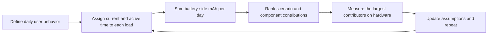
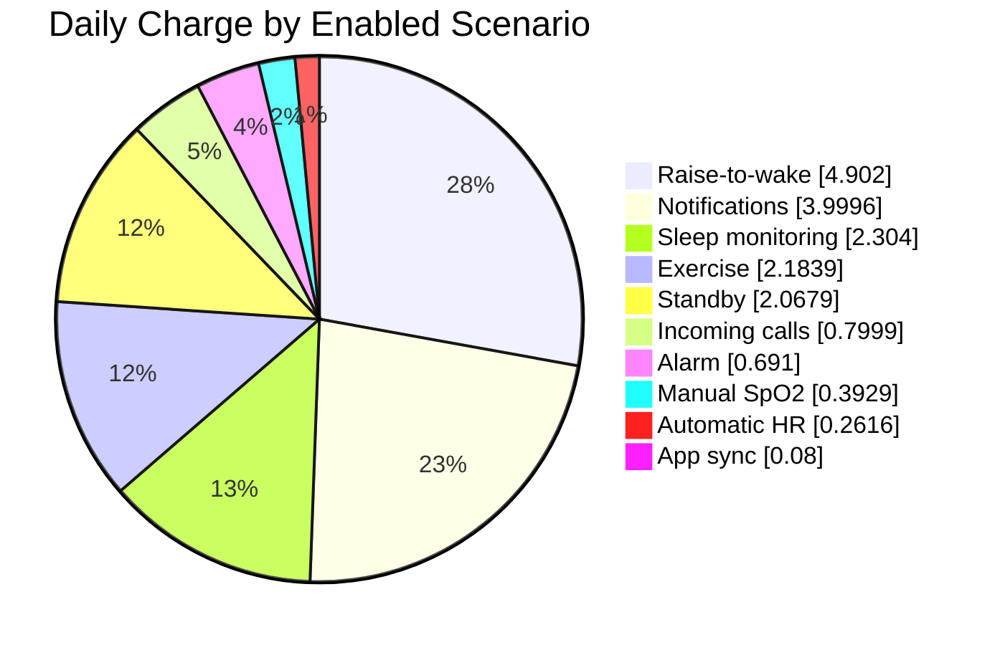
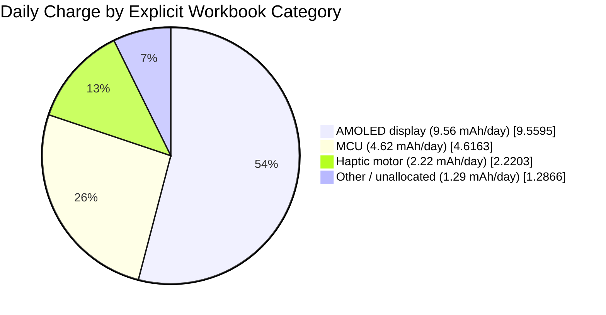
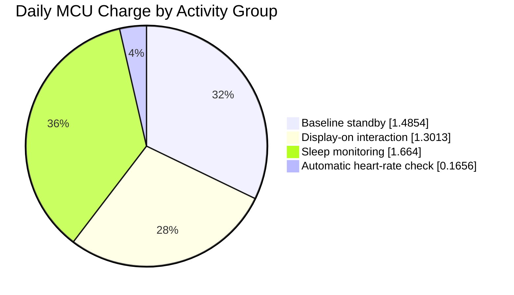

# Power Profiling a Smartwatch

Power profiling turns expected daily use into a battery-life estimate and, more importantly, a ranked list of the loads worth optimizing. This article uses the supplied [English Smartwatch Power Profile Data workbook](assets/smartwatch-power-profile-data.xlsx) as a worked example. It shows how to convert user behavior into mAh per day, identify the loads that dominate the budget, and turn a spreadsheet model into a measurement plan.

!!! warning "Model, not a device specification"
    The currents and usage assumptions in this example belong to the supplied model. They are not characterization data for a specific SF32 device, display, battery, or watch design. Replace them with measurements from your hardware before using the result in a product battery-life claim.

Use this page with the [Low-Power Overview](overview.md) for architecture and firmware guidance, and [Power Measurement and Validation](measurement-and-validation.md) for the measurement workflow that validates the model.

## Smartwatch System Overview

Start by defining the model boundary. This workbook represents a battery-powered smartwatch with an MCU, AMOLED display, haptic motor, and an unallocated `Other` load bucket. It does not identify the panel size, resolution, brightness setting, radio architecture, or individual sensors. Treat the display-current entries below as measured or assumed AMOLED operating points, not as a specification for a particular panel. Treat `Other` as a modelling boundary, not as one physical component.

<div align="center"><em>Table: Smartwatch System and Model Inputs</em></div>

<div align="center" markdown>

| Item | Value in the Workbook | Why It Matters |
|:-----|----------------------:|:---------------|
| Normal AMOLED display current | 15 mA | Used for notifications, incoming-call alerts, and raise-to-wake events. |
| AMOLED AOD current | 2 mA | Defined in the model, but its AOD scenario is disabled in this baseline. |
| Rated battery capacity | 250 mAh | The starting capacity before the model's allowance. |
| Battery degradation allowance | 7% | Reduces the available capacity to 232.5 mAh. |
| Nominal battery voltage | 3.87 V | Used by the workbook's voltage-normalization helper. |

</div>

## Power Consumption by Scenario

A scenario is a complete user or system event, rather than one isolated part. A message notification can wake the MCU, light the AMOLED display, drive the haptic motor, and keep background loads active. In the source matrix, every `Display` row refers to the AMOLED display. The matrix keeps each scenario's component rows together and retains calculated daily values for traceability. The daily frequency and duration assumptions that drive those values appear in the next section.

<div align="center"><em>Table: Complete Component-Level Power Model</em></div>

<div align="center" markdown>

| Scenario | Component | Voltage | Current | Voltage Factor* | Daily Charge | Share of Daily Charge |
|:---------|:----------|--------:|--------:|----------------:|-------------:|----------------------:|
| Baseline standby | MCU | 3.3 V | 0.102 mA | 85.27% | 1.4854 mAh | 8.40% |
| Baseline standby | Display | 3.3 V | 0 mA | 85.27% | 0 mAh | 0.00% |
| Baseline standby | Haptic motor | 3.3 V | 0 mA | 85.27% | 0 mAh | 0.00% |
| Baseline standby | Other | 3.87 V | 0.04 mA | 100.00% | 0.5825 mAh | 3.29% |
| Message notification | MCU | 3.3 V | 2.507 mA | 85.27% | 0.3482 mAh | 1.97% |
| Message notification | Display | 3.3 V | 15 mA | 85.27% | 2.0833 mAh | 11.78% |
| Message notification | Haptic motor | 3.3 V | 11.25 mA | 85.27% | 1.5625 mAh | 8.84% |
| Message notification | Other | 3.87 V | 0.04 mA | 100.00% | 0.0056 mAh | 0.03% |
| Incoming-call alert | MCU | 3.3 V | 2.507 mA | 85.27% | 0.0696 mAh | 0.39% |
| Incoming-call alert | Display | 3.3 V | 15 mA | 85.27% | 0.4167 mAh | 2.36% |
| Incoming-call alert | Haptic motor | 3.3 V | 11.25 mA | 85.27% | 0.3125 mAh | 1.77% |
| Incoming-call alert | Other | 3.87 V | 0.04 mA | 100.00% | 0.0011 mAh | 0.01% |
| Raise-to-wake | MCU | 3.3 V | 2.607 mA | 85.27% | 0.7242 mAh | 4.10% |
| Raise-to-wake | Display | 3.3 V | 15 mA | 85.27% | 4.1667 mAh | 23.56% |
| Raise-to-wake | Haptic motor | 3.3 V | 0 mA | 85.27% | 0 mAh | 0.00% |
| Raise-to-wake | Other | 3.87 V | 0.04 mA | 100.00% | 0.0111 mAh | 0.06% |
| Automatic heart-rate check | MCU | 3.3 V | 0.207 mA | 85.27% | 0.1656 mAh | 0.94% |
| Automatic heart-rate check | Display | 3.3 V | 0 mA | 85.27% | 0 mAh | 0.00% |
| Automatic heart-rate check | Haptic motor | 3.3 V | 0.08 mA | 85.27% | 0.0640 mAh | 0.36% |
| Automatic heart-rate check | Other | 3.87 V | 0.04 mA | 100.00% | 0.0320 mAh | 0.18% |
| Manual SpO2 check | MCU | 3.3 V | 2.6 mA | 85.27% | 0.0578 mAh | 0.33% |
| Manual SpO2 check | Display | 3.3 V | 15 mA | 85.27% | 0.3333 mAh | 1.89% |
| Manual SpO2 check | Haptic motor | 3.3 V | 0 mA | 85.27% | 0 mAh | 0.00% |
| Manual SpO2 check | Other | 3.87 V | 0.08 mA | 100.00% | 0.0018 mAh | 0.01% |
| Exercise recording | MCU | 3.3 V | 0.207 mA | 85.27% | 0.0296 mAh | 0.17% |
| Exercise recording | Display | 3.3 V | 15 mA | 85.27% | 2.1429 mAh | 12.12% |
| Exercise recording | Haptic motor | 3.3 V | 0 mA | 85.27% | 0 mAh | 0.00% |
| Exercise recording | Other | 3.87 V | 0.08 mA | 100.00% | 0.0114 mAh | 0.06% |
| Alarm vibration | MCU | 3.3 V | 2.6 mA | 85.27% | 0.0650 mAh | 0.37% |
| Alarm vibration | Display | 3.3 V | 15 mA | 85.27% | 0.3750 mAh | 2.12% |
| Alarm vibration | Haptic motor | 3.3 V | 10 mA | 85.27% | 0.2500 mAh | 1.41% |
| Alarm vibration | Other | 3.87 V | 0.04 mA | 100.00% | 0.0010 mAh | 0.01% |
| Sleep monitoring | MCU | 3.3 V | 0.208 mA | 85.27% | 1.6640 mAh | 9.41% |
| Sleep monitoring | Display | 3.3 V | 0 mA | 85.27% | 0 mAh | 0.00% |
| Sleep monitoring | Haptic motor | 3.3 V | 0 mA | 85.27% | 0 mAh | 0.00% |
| Sleep monitoring | Other | 3.87 V | 0.08 mA | 100.00% | 0.6400 mAh | 3.62% |
| App data synchronization | MCU | 3.3 V | 2.5 mA | 85.27% | 0.0069 mAh | 0.04% |
| App data synchronization | Display | 3.3 V | 15 mA | 85.27% | 0.0417 mAh | 0.24% |
| App data synchronization | Haptic motor | 3.3 V | 11.25 mA | 85.27% | 0.0313 mAh | 0.18% |
| App data synchronization | Other | 3.87 V | 0.04 mA | 100.00% | 0.0001 mAh | 0.0006% |
| NFC card transaction | MCU | 3.3 V | 2.5 mA | 85.27% | 0 mAh | 0.00% |
| NFC card transaction | Display | 3.3 V | 15 mA | 85.27% | 0 mAh | 0.00% |
| NFC card transaction | Haptic motor | 3.3 V | 11.25 mA | 85.27% | 0 mAh | 0.00% |
| NFC card transaction | Other | 3.87 V | 0.04 mA | 100.00% | 0 mAh | 0.00% |
| Bluetooth call | MCU | 3.3 V | 10 mA | 85.27% | 0 mAh | 0.00% |
| Bluetooth call | Display | 3.3 V | 15 mA | 85.27% | 0 mAh | 0.00% |
| Bluetooth call | Haptic motor | 3.3 V | 11.25 mA | 85.27% | 0 mAh | 0.00% |
| Bluetooth call | Other | 3.87 V | 0.04 mA | 100.00% | 0 mAh | 0.00% |
| AOD, MCU update once per minute | MCU | 3.3 V | 2.5 mA | 85.27% | 0 mAh | 0.00% |
| AOD, MCU update once per minute | Display | 3.3 V | 0 mA | 85.27% | 0 mAh | 0.00% |
| AOD, MCU update once per minute | Haptic motor | 3.3 V | 0 mA | 85.27% | 0 mAh | 0.00% |
| AOD, MCU update once per minute | Other | 3.87 V | 0.08 mA | 100.00% | 0 mAh | 0.00% |
| AOD, display on | MCU | 3.3 V | 0 mA | 85.27% | 0 mAh | 0.00% |
| AOD, display on | Display | 3.3 V | 2 mA | 85.27% | 0 mAh | 0.00% |
| AOD, display on | Haptic motor | 3.3 V | 0 mA | 85.27% | 0 mAh | 0.00% |
| AOD, display on | Other | 3.87 V | 0.08 mA | 100.00% | 0 mAh | 0.00% |

</div>

\*The workbook labels this factor as power efficiency, but it is a voltage-ratio helper rather than a measured regulator efficiency. [Check the Workbook's Conversion Assumption](#check-the-workbooks-conversion-assumption) explains the consequence for battery-life estimates. Daily-charge and percentage values in this table are rounded from the workbook; use the downloadable file for the exact formulas and values. Use the ranked tables below to set priorities, then return to this matrix when you need to inspect the current or voltage assumption behind a contribution.

<div align="center"><em>Diagram: Smartwatch Power-Profiling Loop</em></div>



### Convert a Scenario Into Daily Charge

For a load whose current is already expressed at the battery, its daily charge is straightforward:

```text
daily_charge_mAh = current_mA x active_time_seconds_per_day / 3600
```

For a load supplied through a regulator, calculate battery-side current before applying the time term:

```text
battery_current_mA = (load_voltage_V x load_current_mA) /
                     (battery_voltage_V x regulator_efficiency)
```

Use measured regulator efficiency at the intended load current. A regulator's peak-efficiency headline is rarely useful for a watch that spends much of its day at light load.

### Check the Workbook's Conversion Assumption

The workbook labels one helper column as supply efficiency, but calculates it as `load voltage / battery voltage`. Its subsequent energy formula divides by that helper and then divides by battery voltage again, which cancels the voltage terms. In effect, the baseline calculation assumes ideal power conversion.

The ranking remains useful as a first-pass view of the declared current and time assumptions, but it is not a final battery budget: real regulator losses can change close comparisons and make the absolute battery-life estimate optimistic. For a production budget, replace that helper with the measured regulator efficiency for each rail and load range, include quiescent current, and account for battery-protection and charger-path losses in the finished product.

## Calculate Daily Consumption from Product Usage

The same scenario can be negligible or dominant depending on how the product is used. The workbook enables a representative day: baseline standby, notifications, incoming-call alerts, raise-to-wake, heart-rate and SpO2 checks, exercise recording, alarms, sleep monitoring, and app synchronization. It sets NFC, Bluetooth calling, and both AOD scenarios to zero, so those features are not included in the 13.15-day result.

<div align="center"><em>Table: Product Daily-Use Profile and Contributions</em></div>

<div align="center" markdown>

| Scenario | Occurrences per Day | Duration per Occurrence | Total Duration per Day | Share of Daily Charge | Modelling Status |
|:---------|--------------------:|------------------------:|-----------------------:|----------------------:|:----------------|
| Baseline standby | 1 | Remaining seconds of the day (`=G7`) | 52,425.7 s | 11.69% | Enabled |
| Message notification | 100 | 5 s | 500 s | 22.62% | Enabled |
| Incoming-call alert | 10 | 10 s | 100 s | 4.52% | Enabled |
| Raise-to-wake | 200 | 5 s | 1,000 s | 27.72% | Enabled |
| Automatic heart-rate check | 48 | 60 s | 2,880 s | 1.48% | Enabled |
| Manual SpO2 check | 2 | 40 s | 80 s | 2.22% | Enabled |
| Exercise recording | 1 | `3,600 / 7` s | 514.3 s | 12.35% | Enabled; one hour per week, averaged per day |
| Alarm vibration | 3 | 30 s | 90 s | 3.91% | Enabled |
| Sleep monitoring | 1 | `8 x 3,600` s | 28,800 s | 13.03% | Enabled |
| App data synchronization | 20 | 0.5 s | 10 s | 0.45% | Enabled |
| NFC card transaction | 0 | 5 s | 0 s | 0.00% | Disabled |
| Bluetooth call | 0 | `2 x 60` s | 0 s | 0.00% | Disabled |
| AOD, MCU update once per minute | 0 | 0.05 s | 0 s | 0.00% | Disabled |
| AOD, display on | 0 | `(24 - 8) x 3,600` s | 0 s | 0.00% | Disabled |

</div>

The blank scenario cells in the source matrix are intentional: each named scenario is followed by its display, haptic-motor, and `Other` component-load rows. Those rows inherit the daily occurrence and duration from the scenario row above, so the source names each scenario only once.

<div align="center"><em>Table: Calculated Daily-Use Result</em></div>

<div align="center" markdown>

| Result | Calculation | Value |
|:-------|:------------|------:|
| Usable battery capacity | `250 mAh x (1 - 7%)` | 232.5 mAh |
| Modelled daily consumption | Sum of all enabled scenario loads | 17.68 mAh/day |
| Average battery current | `17.68 mAh/day / 24 h` | 0.74 mA |
| Estimated battery life | `232.5 mAh / 17.68 mAh/day` | 13.15 days |

</div>

The model's scenario ranking is more actionable than its final battery-life number. The largest contributors are the first places to test an optimization hypothesis.

<div align="center"><em>Table: Enabled Scenario Contributions in the Smartwatch Model</em></div>

<div align="center" markdown>

| Scenario | Daily Charge | Share of Daily Charge | Assumed Daily Behavior |
|:---------|------------:|----------------------:|:-----------------------|
| Raise-to-wake | 4.90 mAh | 27.72% | 200 events, 5 s each. |
| Message notification | 4.00 mAh | 22.62% | 100 notifications, 5 s each. |
| Sleep monitoring | 2.30 mAh | 13.03% | 8 h. |
| Exercise recording | 2.18 mAh | 12.35% | 1 h per week, averaged per day. |
| Baseline standby | 2.07 mAh | 11.69% | Remaining time after the enabled activities. |
| Incoming-call alert | 0.80 mAh | 4.52% | 10 alerts, 10 s each. |
| Alarm vibration | 0.69 mAh | 3.91% | 3 alarms, 30 s each. |
| Manual SpO2 check | 0.39 mAh | 2.22% | 2 checks, 40 s each. |
| Automatic heart-rate check | 0.26 mAh | 1.48% | 48 checks, 60 s each. |
| App data synchronization | 0.08 mAh | 0.45% | 20 transfers, 0.5 s each. |

</div>

<div align="center"><em>Chart: Enabled Scenario Contributions in the Smartwatch Model</em></div>



The first two screen-on interactions account for about half of the modelled daily charge. That is a testable result, not simply a generic claim that displays use power. Before spending effort on smaller loads, confirm the true raise-to-wake count, display-on duration, brightness, refresh behavior, and notification policy.

<div align="center"><em>Table: Daily Charge by Component Category</em></div>

<div align="center" markdown>

| Component Category | Daily Charge | Share of Daily Charge | Profiling Question |
|:-------------------|------------:|----------------------:|:-------------------|
| AMOLED display | 9.56 mAh | 54.06% | Are brightness, on-time, and refreshes aligned with real user behavior? |
| MCU | 4.62 mAh | 26.11% | Does firmware return to its intended sleep state between work bursts? |
| Haptic motor | 2.22 mAh | 12.56% | Are vibration strength, pattern, and duration necessary for each event? |
| Other / unallocated | 1.29 mAh | 7.28% | Are sensor, PMIC, radio, and leakage assumptions measured individually? |

</div>

<div align="center"><em>Chart: Known Daily Charge Split in the Smartwatch Model</em></div>



The chart deliberately leaves the final slice as `Other / unallocated`. The workbook does not provide independent battery-side values for Bluetooth, the accelerometer, or the gyroscope. Its disabled Bluetooth-calling scenario does not prove that Bluetooth costs zero: the app-synchronization scene may also use a radio path, but the workbook does not split that energy out. Likewise, the sensor contribution may be included in `Other`, but it cannot be separated into accelerometer and gyroscope values from the supplied data.

To turn this into a five-way MCU/display/haptic/Bluetooth/accelerometer-and-gyroscope chart, add separate rows for Bluetooth idle and transfer states, accelerometer modes and duty cycles, and gyroscope modes and duty cycles. Measure each row at the battery input, or apply the measured regulator efficiency before adding it to the battery-side mAh total. Then replace the `Other / unallocated` slice rather than adding a second, overlapping sensor or Bluetooth slice.

### Separate Standby MCU, Active MCU, and Sensors

The workbook provides an explicit `MCU` bucket, but it does not isolate graphics rendering as its own code path. The most defensible split is therefore between its baseline-standby MCU entry, MCU work in display-on interaction scenarios, and other scheduled MCU work.

<div align="center"><em>Table: Breakdown of the Workbook's MCU Bucket</em></div>

<div align="center" markdown>

| MCU Activity Group | Daily Charge | Share of Total Daily Charge | Share of MCU Charge | Interpretation |
|:-------------------|------------:|----------------------------:|--------------------:|:---------------|
| Baseline standby | 1.49 mAh | 8.40% | 32.18% | 0.102 mA for the model's remaining 14.56 h. This is a system-level MCU-bucket assumption, not verified bare-die leakage. |
| Display-on interaction | 1.30 mAh | 7.36% | 28.19% | Message, incoming-call, raise-to-wake, SpO2, exercise, alarm, and app-sync scenarios. It includes event handling as well as any graphics work. |
| Sleep monitoring | 1.66 mAh | 9.41% | 36.04% | 0.208 mA over 8 h; the largest individual MCU entry in the model. |
| Automatic heart-rate check | 0.17 mAh | 0.94% | 3.59% | Scheduled sensing and its associated MCU work. |
| **Total MCU** | **4.62 mAh** | **26.11%** | **100%** | All explicit MCU entries in the workbook. |

</div>

<div align="center"><em>Chart: Daily Charge Breakdown of the Workbook's MCU Bucket</em></div>



Two comparisons prevent a misleading conclusion:

- **Standby MCU versus display-on MCU:** baseline standby contributes 1.49 mAh/day, slightly more than the 1.30 mAh/day MCU contribution from all display-on interaction scenarios combined. In this baseline, reducing standby current is at least as important as making individual graphics bursts shorter.
- **Standby MCU versus all active MCU work:** all non-standby MCU entries total 3.13 mAh/day, or 2.11 times the baseline-standby MCU entry. The largest opportunity is not graphics alone: the 8-hour sleep-monitoring scene dominates the active MCU portion.

The workbook provides no dedicated sensor category. Its `Other` bucket is the only place that could include sensor consumption, but it may also include PMIC, radio, leakage, or other background loads. It totals 1.29 mAh/day (7.28%). Therefore, even under the conservative assumption that all `Other` consumption belongs to sensors, the explicit MCU bucket is more dominant: 4.62 mAh/day versus 1.29 mAh/day, or 3.59 times higher. The true sensor-only share can only be determined after the model separates sensor rails from the generic `Other` entry.

<div align="center"><em>Table: What to Measure Next to Separate the Remaining Loads</em></div>

<div align="center" markdown>

| Question | Current Workbook Boundary | Measurement Needed |
|:---------|:--------------------------|:-------------------|
| What is MCU leakage? | Baseline `MCU` current includes more than bare-die leakage. | Measure the MCU supply in the intended sleep state, then separately measure board-level leakage. |
| How much energy is graphics rendering? | Display-on MCU time also includes wake, event handling, and display-driver work. | Mark the render interval in firmware and integrate current over that interval. |
| How much belongs to sensors? | Sensors are not a separate category; they may be inside `Other`. | Measure each sensor rail or add one workbook row per sensor mode and duty cycle. |
| What remains in `Other`? | PMIC, radio, leakage, and sensors are mixed. | Disable or isolate one rail or subsystem at a time, then reconcile the battery-side total. |

</div>

## Turn the Ranking Into Design Work

Work from the largest modelled contributor downward, then validate the order with measurements. In this model, a sensible sequence is:

1. **Display policy:** Measure the full raise-to-wake trace. Reduce false gesture triggers, screen-on duration, brightness, full-screen redraws, and unnecessary animation before chasing MCU microamps.
2. **Notification policy:** Coalesce non-urgent notifications where the product experience permits. Review whether every event needs both display and haptic feedback.
3. **Connected standby:** Confirm that the MCU reaches the intended sleep mode after each event. Audit periodic timers, polling loops, Bluetooth callbacks, and power-management votes.
4. **Haptic patterns:** Tune amplitude and duration using perceptual tests. A shorter or softer pattern can reduce energy without making alerts less usable.
5. **Long-running sensing:** Profile sleep monitoring and exercise recording as complete scenes, including sensor duty cycle, processing, memory traffic, and radio behavior.

Do not optimize an isolated spreadsheet number. An apparently efficient change can increase wake frequency, reduce user satisfaction, or extend active time enough to erase the expected energy saving.

## Validate the Model on Hardware

The model becomes useful when it is continuously calibrated against measurements. For every top contributor, record the battery or supply voltage, temperature, board revision, firmware revision, enabled radios, display mode, and measurement range.

<div align="center"><em>Table: Minimum Validation Plan for This Smartwatch Profile</em></div>

<div align="center" markdown>

| Profiled Scene | What to Measure | What to Feed Back Into the Model |
|:---------------|:----------------|:---------------------------------|
| Display-off standby | Average current and unexpected wakeups over a long capture | Baseline MCU, sensor, PMIC, and other background current. |
| Raise-to-wake | Gesture detection, wake latency, display current, and screen-on time | Actual event count, display duration, and UI cost. |
| Notification | MCU, display, haptic, and Bluetooth activity during one alert | Energy per notification and the correct daily count. |
| Sleep monitoring | A full overnight trace or representative repeatable window | Sensor duty cycle and periodic processing cost. |
| Exercise recording | Sensor, display, storage, and radio activity over the intended session | Energy per session and realistic weekly frequency. |
| AOD, NFC, and Bluetooth calling | Separate measurements before enabling them in the forecast | Their own scenarios, not a small adjustment to standby. |

</div>

## Keep the Profile Honest

- Treat disabled scenarios as unbudgeted, not free. The workbook currently assigns zero charge to NFC, Bluetooth calling, and AOD scenarios.
- Keep separate scenarios for user-visible features and background work. This makes product trade-offs visible during reviews.
- Measure at the battery input when possible. Rail-level measurements are still valuable, but they need regulator losses and quiescent current added before they become battery-life numbers.
- Change one assumption at a time, then compare mAh per day rather than only instantaneous current.
- Re-run the profile whenever a display policy, Bluetooth setting, sensor cadence, PM policy, or major firmware feature changes.

## Key Takeaways

- Battery life is the effective battery capacity divided by daily charge consumption; this model projects 13.15 days from 232.5 mAh of usable capacity and 17.68 mAh/day of enabled load.
- In the supplied baseline, display behavior dominates the budget. Raise-to-wake and message notifications alone account for about half of daily charge.
- Scenario ranking tells you where to measure and optimize first; it is more useful than a single average-current number.
- Use actual converter efficiency and quiescent current before treating a workbook forecast as a production battery-life claim.
- Repeat the loop: model realistic behavior, measure the dominant scenes, update the assumptions, and then optimize.
