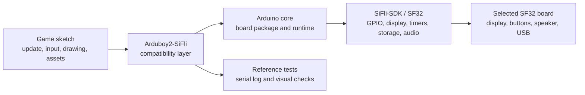

# Arduboy2 on SiFli

## What Is Arduboy2-SiFli?

[OpenSiFli/Arduboy2-SiFli](https://github.com/OpenSiFli/Arduboy2-SiFli) is an OpenSiFli port of the [Arduboy2 library](https://github.com/MLXXXp/Arduboy2) for the SiFli development environment. Arduboy2 provides an application-facing model for a small game device: a frame loop, a display buffer, buttons, sprites, text, and optional sound control. The SiFli port is therefore useful as a compatibility experiment: it tests how much of an Arduboy-style game can be retained while the underlying board, display, input, audio, and build path move to SF32.

The repository is a software reference, not a finished game console or a production hardware design. Treat its README, source tree, examples, issue history, and license files as the authority for the exact board target, supported API surface, build instructions, and redistribution conditions. This page organizes the engineering decisions around that reference; it does not replace the repository's executable instructions.

## Why the SiFli Implementation?

An Arduboy-style application is a compact way to exercise several embedded-product decisions at once: a predictable render loop, small monochrome or low-resolution assets, button input, audio timing, and a tightly bounded memory budget. Porting that model to SF32 can provide a useful early reference for handheld games, UI demonstrators, educational devices, and other products whose interaction is local and deterministic.

The value is not that every Arduboy sketch will run unchanged. The value is the boundary the port exposes:

- The game can keep its high-level update, input, drawing, and asset logic when it stays within the supported Arduboy2 API.
- The port must translate the display, button, audio, timing, and storage assumptions that were implicit in the original hardware.
- Any sketch that directly controls AVR registers, Arduboy-specific pins, display transactions, timers, or EEPROM layout needs deliberate adaptation and separate regression evidence.

These are engineering expectations, not measured compatibility claims. Confirm them against the current OpenSiFli repository and record the exact result for the selected board and commit.

## Outcome, Scope, and Entry Criteria

This page defines a staged route from the OpenSiFli reference to one reproducible SF32 game or interactive demo. It does **not** claim that the port supports every Arduboy2 feature, every Arduboy game, every SF32 board, or production-quality display and audio timing. It also does not establish licensing rights for games, fonts, graphics, or other assets copied from third-party repositories.

**Outcome:** a source-controlled Arduboy2-SiFli build that runs one repository example or a small test sketch, demonstrates the selected display/input/audio path, and records the evidence needed to decide whether a larger game or product adaptation is justified.

**Intended reader:** firmware, hardware, and product engineers who can use Arduino tooling, inspect C/C++ code, flash an SF32 board, read serial output, and make basic display, input, and power measurements.

Before starting, have the following available:

- A development board and display/input hardware explicitly named by the repository or by the current SiFli Arduino path.
- A known-good Arduino installation and the OpenSiFli board package. The current μForge Arduino guide documents the **SF32LB52 DevKit LCD** as its baseline; verify that Arduboy2-SiFli targets the same board before treating it as a supported combination.
- The exact Arduboy2-SiFli commit, Arduino core/package version, host OS, and upload tool.
- A USB data connection and a way to capture the serial log and observe the display, buttons, and audio output.
- Permission to use and redistribute every game, image, font, and sound asset included in a downstream adaptation.

<em>Table: Project Contract</em>

| Area | Project baseline | Evidence before adaptation |
|:-----|:-----------------|:---------------------------|
| Source | A recorded OpenSiFli/Arduboy2-SiFli commit and its dependency revisions. | Clean checkout and a reproducible build record. |
| Board | The exact SF32 board and display/input/audio configuration named by the repository. | Board identity, wiring, power source, and successful upload are recorded. |
| Toolchain | Arduino IDE or CLI, OpenSiFli board package, and the documented upload path. | Package versions, board selection, compiler output, upload log, and serial log. |
| Reference behavior | One upstream example or minimal sketch that exercises the port. | Display refresh, input response, and any supported audio behavior are observed and repeatable. |
| Product change | One bounded game or UI adaptation. | The reference test still passes after the change, with asset and license records retained. |

## Choose a Supported Baseline

Start with the board and software combination named in the OpenSiFli repository rather than selecting a board from the product catalogue by similarity. The board package, display wiring, input mapping, upload method, and library assumptions are part of the baseline.

<em>Table: Baseline Selection</em>

| Baseline element | Select it from | Do not assume |
|:-----------------|:---------------|:--------------|
| Target board | Arduboy2-SiFli README, examples, and board configuration. | A sketch tested on one SF32 board is portable to another board with the same chip. |
| Arduino core | The OpenSiFli package and revision documented for the target. | The latest package is interchangeable with the revision used by the repository. |
| Display and input | The repository's pin/configuration definitions and the physical board schematic. | Arduboy's original display geometry, button polarity, or pin names match the SF32 board. |
| Audio | The repository's supported output path and any board-specific configuration. | A tone API proves that speaker timing, volume, and power behavior are product-ready. |
| Upload and recovery | The documented Arduino or `sftool` flow for the selected board. | A successful upload on one host proves a recoverable field-update path. |

If the repository does not identify a complete board configuration, stop at the baseline-discovery stage and record the missing information. Do not fill the gap with pin mappings or addresses copied from another SF32 project.

## Delivery Map

Use the stages as decision gates rather than as a feature checklist.

<em>Table: Delivery Map</em>

| Stage | Decision it supports | Required output |
|:------|:---------------------|:----------------|
| 1. Untouched reference | Does the documented port build, upload, and run on the selected baseline? | A known-good sketch, commit/package record, upload log, and observed behavior. |
| 2. Peripheral validation | Do display, input, audio, reset, and timing behave predictably on the real board? | A peripheral test record with failures and recovery behavior. |
| 3. Reproducible source baseline | Can another engineer rebuild the same image from a clean checkout? | A clean-build artifact, environment record, and repeat result. |
| 4. Controlled game adaptation | Can one bounded game or UI change be introduced without breaking the port? | A reviewed change, asset/license record, and regression result. |
| 5. Product-readiness review | Is the reference strong enough to justify custom hardware or a larger software investment? | A risk register with owners, evidence, mitigation, and a proceed/defer/stop decision. |

## System Architecture and Dependencies

<em>Figure: Arduboy2-SiFli Application Path</em>

This is a decision model, not a claim that the repository uses exactly these internal module names. Confirm the actual source boundaries before modifying the port. The important product paths are:

- **Frame and timing:** the game loop must update and render at a repeatable cadence, and any timing-sensitive audio or input behavior must be measured on the target board.
- **Display:** the compatibility layer must map the game’s buffer and geometry to the selected display controller, pixel format, orientation, and refresh path.
- **Input:** button names, polarity, debounce, simultaneous presses, and wake/reset behavior must be checked against the board wiring.
- **Audio:** tone generation, timer ownership, speaker connection, volume, and mute behavior must be treated as board-specific until verified.
- **Assets and storage:** fonts, sprites, sound data, flash layout, and RAM use must be measured after the selected game is linked.
- **Recovery:** preserve a known upload and recovery route before experimenting with timing, memory, or low-power changes.

The principal failure domains are application/API compatibility, display configuration, input wiring, audio/timer behavior, memory and asset placement, and upload/recovery. A failure in one domain should not be reported simply as “the port does not work.”

## Stage 1 — Establish the Untouched Reference

**Goal:** prove that the repository's documented baseline is real before changing the library or a game.

1. Read the repository instructions, record the default branch or release, and inspect its examples, board configuration, dependencies, and license files.
2. Install the exact Arduino core/package and tools required by the repository. Record the host OS and tool versions.
3. Build and upload the smallest documented example or test sketch.
4. Capture the serial output and record what appears on the display, which buttons respond, and whether the example uses audio.

**Evidence to retain:** repository commit, dependency/package versions, board revision, wiring or schematic reference, build output, upload log, serial log, and a short functional record.

**Gate 1 exit criterion:** the untouched reference builds and uploads on the selected board, and its documented behavior is repeatable after a reset or power cycle.

## Stage 2 — Validate Peripheral and Timing Boundaries

**Goal:** separate a successful compile from a usable game-device baseline.

1. Exercise the display clear, full-frame update, sprite or bitmap rendering, text path, and any geometry/orientation assumptions used by the example.
2. Exercise every input used by the project, including release, simultaneous presses, rapid presses, and reset or wake behavior where applicable.
3. If audio is included, verify tone start/stop, timer interaction, mute behavior, and the effect of display and input activity on the sound path.
4. Interrupt the normal flow with reset, unplug/replug, and an invalid or incomplete input sequence. Record whether the board returns to a usable upload and run state.

**Evidence to retain:** visual or captured display results, input matrix, timing observations, audio observations, reset/recovery log, and any measured current or latency that affects the product decision.

**Gate 2 exit criterion:** the selected peripheral path is understood well enough to distinguish application bugs from board configuration, timing, or power problems.

## Stage 3 — Build a Reproducible Source Baseline

**Goal:** make the port reproducible instead of depending on one development machine or a supplied binary.

1. Start from a clean checkout and initialize every dependency required by the repository.
2. Record the board package, Arduino IDE/CLI version, compiler/tool versions, configuration files, and any generated assets.
3. Build from a clean directory, save the resulting image and map/size information where available, and record the upload command or tool output.
4. Repeat on a second machine or after removing the build directory.

**Evidence to retain:** source revision, dependency revisions, host/tool manifest, build log, binary or other artifact, size report, upload log, and serial log.

**Gate 3 exit criterion:** a clean checkout reproduces an image that passes the Stage 2 peripheral checks without undocumented local files or manual edits.

## Stage 4 — Adapt One Game Deliberately

**Goal:** prove the compatibility boundary with one controlled product change.

Start with a small sketch or game whose display, input, audio, and asset requirements are visible. Keep the untouched reference image available and change one class of behavior at a time:

<em>Table: Controlled Adaptation Order</em>

| Change class | Start with | Required regression |
|:-------------|:-----------|:--------------------|
| Identity and UI | Title screen, font, sprite, palette, or screen layout. | Build, upload, frame update, input, and asset-integrity checks. |
| Game logic | One bounded rule, level, or state transition. | Repeatable input sequence, reset, score/state persistence if used, and frame timing. |
| Audio | One tone or short effect using the supported path. | Start/stop, mute, timer interaction, and behavior under display/input load. |
| Storage | A small save or asset-loading change. | Size report, power-loss behavior, corruption handling, and clean recovery. |
| Board adaptation | A deliberate display, button, or speaker mapping change. | Schematic/pin evidence, full peripheral regression, and rollback to the reference image. |

Do not copy AVR register access, original Arduboy pin assumptions, or storage addresses into the SF32 project without a source-backed design decision. Keep third-party game and asset licenses beside the adapted source, and remove anything whose redistribution terms are not clear.

**Evidence to retain:** reviewed diff, asset provenance, before/after image, build and upload logs, regression results, and a rollback image.

**Gate 4 exit criterion:** the adapted game passes the reference peripheral checks, and its memory, timing, recovery, and licensing boundaries are recorded.

## Stage 5 — Product-Readiness Review

Do not move from a porting demonstration to custom hardware or a field trial until the team can answer:

- Which exact SF32 board, display, buttons, speaker, and power source are supported, and which are still assumptions?
- What frame rate, input latency, audio behavior, startup time, and current profile were measured on the intended product baseline?
- How much flash and RAM do the game, assets, fonts, and runtime consume, including worst-case content?
- What happens after reset, brownout, power loss during save, corrupted assets, failed upload, or an incomplete update?
- Which parts of the port are maintained by the product team, OpenSiFli, SiFli, or the original Arduboy2 community?
- Are every game, font, image, sound, and library license compatible with the intended distribution model?

**Gate 5 exit criterion:** remaining risks have named owners and evidence; each item has a mitigation, an explicit deferral, or a stop decision.

## Handoff to Product Design

Carry the selected SF32 device, display and input architecture, audio/timer plan, flash and asset layout, power measurements, recovery method, and production-test assumptions into the [Hardware](../hardware/index.md) section. Use the [SF32 Product Selector](../sf32-products/product-selector.md) when the game’s display, memory, package, power, or connectivity requirements change the device shortlist. For the software baseline, start with [Getting Started with Arduino](../getting-started/arduino/getting-started-arduino.md) and continue with the [Arduino platform overview](../develop/platforms/arduino/overview.md).

The reference has served its product-development purpose when another engineer can rebuild the port, reproduce the peripheral results, explain every board-specific adaptation, and review the evidence before a custom board or expanded game library is approved.

## Authoritative Sources

- [OpenSiFli/Arduboy2-SiFli](https://github.com/OpenSiFli/Arduboy2-SiFli)
- [MLXXXp/Arduboy2](https://github.com/MLXXXp/Arduboy2)
- [OpenSiFli/ArduinoCore-zephyr](https://github.com/OpenSiFli/ArduinoCore-zephyr)
- [Getting Started with Arduino on SF32](../getting-started/arduino/getting-started-arduino.md)
- [Arduino platform overview](../develop/platforms/arduino/overview.md)
- [SF32 Product Selector](../sf32-products/product-selector.md)
