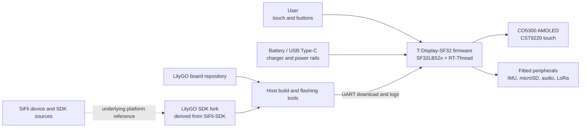

# LilyGO T-Display-SF32

!!! warning "Third-party project — not a SiFli project"
    T-Display-SF32 is published and maintained by Xinyuan-LilyGO/LilyGO, not by SiFli or OpenSiFli. Use LilyGO's repositories for board-specific hardware, firmware, and support decisions. SiFli's sources remain authoritative for the underlying SF32 device and SiFli-SDK, but they do not imply that SiFli has validated or supports this LilyGO board.

## What Is T-Display-SF32?

[Xinyuan-LilyGO/T-Display-SF32](https://github.com/Xinyuan-LilyGO/T-Display-SF32) is a development platform built around an SF32LB52x MCU and a 2.16-inch CO5300 AMOLED with CST9220 touch. The repository documents 16 MB flash, 8 MB PSRAM, a BHI260AP IMU, SX1262 LoRa, a microSD interface, audio, USB Type-C, charging support, board pin assignments, example applications, hardware files, a factory-firmware directory, and a board-specific power-consumption report.

This combination makes the board useful for evaluating a display-led wearable, handheld controller, portable sensor terminal, or connected HMI. It is a platform reference rather than a finished product: the repository exposes many hardware paths, but a product team must still choose which paths matter, reproduce a known baseline, measure them on its exact board revision, and qualify power, RF, safety, software maintenance, and recovery.

## Why the SF32 Implementation?

T-Display-SF32 combines SF32LB52x graphics, Bluetooth, audio, and low-power capabilities with external display, touch, motion, storage, and LoRa devices on one board. LilyGO also provides board configuration, dedicated device drivers, examples, and a separate [LilyGO SDK fork](https://github.com/Xinyuan-LilyGO/SlFli-SDK-Lilygo) described as being based on SiFli-SDK 2.4.0. That can shorten initial board bring-up compared with starting from an unmodified generic SDK target.

The tradeoff is ownership. Board support, driver changes, hardware revisions, bundled firmware, and the relationship between LilyGO's SDK fork and upstream SiFli-SDK are controlled outside SiFli. A reproducible project therefore needs to lock both repositories by commit, retain a working factory/recovery image, and test any migration to a newer upstream SDK as an explicit engineering change.

## Outcome, Scope, and Entry Criteria

**Outcome:** establish a version-locked T-Display-SF32 baseline; validate the display/touch, selected peripherals, power behavior, and recovery route; reproduce a source build; then make one bounded application change with regression evidence suitable for a product review.

This page does not prove that every peripheral is fitted on every board variant, that the vendor firmware is production-ready, that the power report applies to another revision or workload, or that LoRa operation is legal in every region. It also does not transfer SiFli support to LilyGO-specific hardware or drivers.

Before starting, have:

- the exact T-Display-SF32 board and hardware revision, with its schematic or pin map;
- a current-limited bench supply or a protected battery whose voltage and condition can be monitored;
- a known-good USB data cable, the documented Type-C flashing connection, and a retained recovery image;
- fixed commits of both the T-Display-SF32 repository and LilyGO's SDK fork;
- the Windows/PowerShell environment documented by the LilyGO SDK fork for the initial reproducible build; treat other host paths as separately qualified;
- test accessories only for the interfaces in scope, such as a microSD card, headphones or audio load, and a legal-band LoRa peer;
- a record for firmware versions, build logs, serial output, photographs, current measurements, and fault/recovery results.

<div align="center"><em>Table: T-Display-SF32 Project Contract</em></div>

<div align="center" markdown>

| Area | Starting baseline | Evidence required before adaptation |
|:-----|:------------------|:------------------------------------|
| Ownership | LilyGO board, repository, and SDK fork | Repository owners, commits, board revision, and support boundary |
| Hardware | SF32LB52x, 2.16-inch AMOLED/touch, external memory, and fitted peripheral set | Schematic/pin-map review, assembly record, and fitted-device inventory |
| Firmware | Bundled factory image or an untouched repository example | Image identity, flash log, boot log, and functional record |
| Power | USB/charger/battery path documented by LilyGO | Supply limits, startup result, shutdown behavior, and measured current for the chosen workload |
| Adaptation | One example, UI, sensor, storage, audio, or radio change at a time | Reviewed change, rollback image, and complete regression result |

</div>

## Choose a Supported Baseline

The upstream repository currently uses the `master` branch and does not present a tagged release as the universal software baseline. Record the exact commit instead of writing “latest.” The repository contains a `firmware/T-SF32-Factory-V1.2` directory, but that directory name is not a substitute for recording the matching board revision, repository commit, and flash procedure.

<div align="center"><em>Table: T-Display-SF32 Baseline Selection</em></div>

<div align="center" markdown>

| Baseline element | Recommended start | Critical limitation |
|:-----------------|:------------------|:--------------------|
| Board | One photographed and revision-identified T-Display-SF32 unit | Do not assume a pin map or fitted peripheral matches another revision or keyboard-related variant |
| Factory behavior | Bundled factory V1.2 directory or an untouched `menu_app` build, as applicable to the unit | Verify provenance and compatibility before flashing; retain the original image |
| Source | Fixed T-Display-SF32 commit | The repository evolves independently of SiFli-SDK |
| SDK | Fixed LilyGO SDK-fork commit, documented as derived from SiFli-SDK 2.4.0 | Do not silently replace it with another SDK revision; board drivers and configuration may differ |
| Build target | `t-display-sf32_hcpu` | This is a LilyGO board target, not a generic SF32LB52x target |
| Power entry | Follow LilyGO's stated greater-than-3.5 V startup condition and implement voltage detection/low-battery shutdown in custom firmware | Treat this as a vendor board requirement to verify, not as a substitute for the chip datasheet, battery limits, or measured brownout behavior |

</div>

The T-Display-SF32 README documents this Windows build and download route after the required environment has been configured:

```powershell
cd T-Display-SF32\examples\rt_os\rt_driver\project
scons --board=t-display-sf32_hcpu -j8
build_t-display-sf32_hcpu\uart_download.bat
```

Save the actual repository and SDK commits, environment-export result, full build log, generated images, download log, and boot log. The parallel-job count may change; the target and source revisions may not.

## Delivery Map

<div align="center"><em>Table: T-Display-SF32 Delivery Map</em></div>

<div align="center" markdown>

| Stage | Decision it supports | Required output |
|:------|:---------------------|:----------------|
| 1. Vendor baseline | Does the untouched board/firmware combination work as identified? | Version-locked, photographed known-good session |
| 2. Peripheral and recovery validation | Are the selected interfaces, power states, and failures observable and recoverable? | Fault-injection, measurement, and recovery record |
| 3. Source reproduction | Can the team rebuild and flash the same behavior from clean sources? | Environment, image, flash log, and repeat result |
| 4. Controlled adaptation | Can one product behavior change without breaking the baseline? | Bounded change, rollback path, and regression evidence |
| 5. Product review | Is the third-party platform suitable for continued prototype or custom-hardware work? | Owned risks and a proceed/defer/stop decision |

</div>

## System Architecture and Dependencies

<div align="center"><em>Figure: T-Display-SF32 Product and Development Boundaries</em></div>



Treat failures as separate domains: board power/charging, boot and download, display/touch, each selected peripheral, LilyGO board support, and the underlying SDK. For example, a failed display example can arise from power, board revision, panel/touch configuration, the application, or an SDK/driver mismatch; “the SDK failed” is not a sufficient diagnosis.

## Stage 1 — Establish the Untouched Vendor Baseline

**Goal:** prove what the received board and vendor baseline actually do before changing source.

1. Photograph both sides of the board and record markings, fitted peripherals, display/touch parts, memory, switches, connectors, and repository commit.
2. Verify the power source and polarity. LilyGO warns that startup requires more than 3.5 V; use a monitored source and do not use a deeply discharged cell as a test method.
3. Flash only a baseline known to match the board, or first run the existing firmware if its provenance is known. Preserve the original image where the tooling permits.
4. Exercise the local menu or untouched examples for display/touch and each peripheral selected for the product. Record unavailable or unfitted functions instead of treating them as failures.
5. Cold-start twice and retain boot logs, UI photographs, touch/input results, and a current trace for one clearly defined idle/active workload.

**Evidence to retain:** board revision and photos, repository/image identity, supply and battery details, flash and boot logs, fitted-device inventory, functional results, and current-test conditions.

**Gate 1 exit criterion:** two cold starts reproduce the identified display/touch baseline, every in-scope fitted peripheral has a recorded result, and the original or known-good image can be restored.

## Stage 2 — Validate Peripheral, Power, and Recovery Boundaries

**Goal:** determine whether failures can be detected and recovered without unsafe battery use or undocumented reflashing.

<div align="center"><em>Table: T-Display-SF32 Fault and Recovery Tests</em></div>

<div align="center" markdown>

| Test | Method | Pass evidence |
|:-----|:-------|:--------------|
| Startup margin | Sweep a current-limited bench supply around the intended operating range without exceeding documented limits | Startup/shutdown thresholds and behavior are measured; repeated resets or undefined states are not hidden |
| Low-battery policy | Use a controlled supply to exercise warning and shutdown thresholds | Custom firmware warns and shuts down before the selected battery's safe discharge limit |
| Powered-off charging | After factory-firmware shutdown, connect USB power and use the documented button wake path | Charging state and button-only wake behavior match the vendor note; USB insertion alone is not incorrectly treated as a boot path |
| Display/touch interruption | Reset or power-cycle during UI activity and repeat edge/corner touch tests | Display and touch return to a known state without persistent corruption or false input |
| Removable storage | Remove, corrupt, or replace the test card only at controlled points | Missing/error states are diagnosable; the application does not corrupt unrelated state or hang |
| LoRa path | Use a legal-band peer and controlled RF setup | Frequency/configuration are recorded; timeout and reconnect behavior are visible; no range claim is made without measurement |
| Flash recovery | Interrupt a test download only on a recoverable unit, then use the documented Type-C/UART route | The retained known-good image is restored with recorded tools and steps |

</div>

**Gate 2 exit criterion:** each applicable test has a repeatable result and recovery route, low-battery protection is implemented for any custom firmware, and no unresolved fault can damage the battery or strand the board without a documented recovery path.

## Stage 3 — Build a Reproducible Source Baseline

**Goal:** let a second engineer create and flash the same baseline from clean, version-locked sources.

1. Check out fixed commits of the board repository and LilyGO SDK fork; record the fork's stated upstream SDK basis.
2. Configure the documented PowerShell environment and build `t-display-sf32_hcpu` from a clean directory.
3. Save environment, dependency, configuration, memory/partition, image, download, and serial-log evidence.
4. Repeat on another machine or after deleting all build output, then run the complete Stage 2 regression.

**Gate 3 exit criterion:** no stale image, untracked board file, or undocumented SDK substitution is needed to produce firmware that passes Stage 2.

## Stage 4 — Adapt One Product Path at a Time

**Goal:** make one useful change while preserving the working vendor and recovery baselines.

<div align="center"><em>Table: Controlled T-Display-SF32 Adaptation Order</em></div>

<div align="center" markdown>

| Change class | Good first change | Required regression |
|:-------------|:------------------|:--------------------|
| UI | One page, icon, font, or touch action | Cold start, full-screen refresh, touch bounds, memory use, and recovery |
| Sensor | One IMU value or event | Device identity, range, sample rate, error handling, idle current, and wake behavior |
| Storage/audio | One file operation or playback path | Missing media, malformed data, volume/output limits, power interruption, and filesystem recovery |
| LoRa | One bounded packet exchange in an allowed band | Configuration record, timeout, retry, current, coexistence, and regulatory review |
| Power | One sleep/wake or rail-control change | All wake sources, display/peripheral state, low-battery shutdown, charging, and repeated cycles |
| SDK migration | One candidate LilyGO-fork or upstream-SDK update | Board configuration diff, clean build, every peripheral regression, current measurements, and rollback |

</div>

**Gate 4 exit criterion:** the change is reviewed, the original image remains restorable, and all applicable display, touch, peripheral, power, flash, and recovery tests pass.

## Stage 5 — Product-Readiness Review

Before committing to a field trial or custom PCB, answer:

- Who owns the board files, LilyGO SDK fork, driver fixes, security updates, and migration to later SiFli-SDK versions?
- Which board revisions and fitted peripherals are in the product baseline, and how will incoming units be identified and tested?
- What are the measured active, idle, sleep, startup, and shutdown currents for the intended display brightness, radio duty cycle, storage, and sensor configuration?
- How are battery protection, charging, thermal behavior, enclosure, connector access, and powered-off recovery verified?
- Which LoRa region, antenna, frequency plan, transmit parameters, and regulatory obligations apply?
- Do the hardware files, firmware, SDK fork, examples, assets, and third-party components carry licenses compatible with the intended distribution?
- Is the team accepting a third-party prototype dependency, or has it qualified a controlled fork and support plan?

**Gate 5 exit criterion:** every residual risk has an owner, evidence, and disposition, and the team has explicitly decided to proceed, defer, or stop.

## Handoff to Product Design

Carry forward the exact SF32 part and memory devices, display/touch timing, fitted peripherals and buses, power tree, charger and battery policy, antenna/RF strategy, boot/download connection, partition plan, production-test access, software-fork ownership, and proven recovery route. Continue with the [SF32LB52x integration path](../sf32-products/chips/SF32LB52x.md#integration-path), [SF32LB52x Hardware Design Guide](../hardware/chip-guides/SF32LB52x_hardware_design_guide.md), [SiFli-SDK Build, Flash, and Monitor](../develop/platforms/sifli-sdk/build-flash-monitor.md), and [Design for Production](../hardware/design-for-production.md).

## Authoritative Sources

- [Xinyuan-LilyGO/T-Display-SF32 repository](https://github.com/Xinyuan-LilyGO/T-Display-SF32)
- [T-Display-SF32 Chinese README](https://github.com/Xinyuan-LilyGO/T-Display-SF32/blob/master/readme_cn.md)
- [T-Display-SF32 examples](https://github.com/Xinyuan-LilyGO/T-Display-SF32/tree/master/examples)
- [T-Display-SF32 hardware files](https://github.com/Xinyuan-LilyGO/T-Display-SF32/tree/master/hardware)
- [T-Display-SF32 power-test material](https://github.com/Xinyuan-LilyGO/T-Display-SF32/tree/master/lowpowertest)
- [Xinyuan-LilyGO/SlFli-SDK-Lilygo repository](https://github.com/Xinyuan-LilyGO/SlFli-SDK-Lilygo)
- [OpenSiFli/SiFli-SDK](https://github.com/OpenSiFli/SiFli-SDK)
