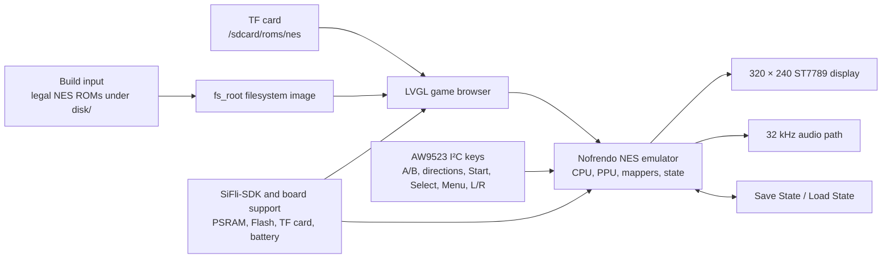

# Pocket Pi SF32 Handheld Game Console

## What Is Pocket Pi?

[SiFliSparks/PocketPi](https://github.com/SiFliSparks/PocketPi) is a handheld game-console and emulator reference for SF32LB52. The current source integrates the Nofrendo NES emulator, an LVGL game browser, a 320 × 240 ST7789 8080 display path, audio, save/load state, an embedded filesystem, and a TF-card ROM directory. Its public build baseline uses the Huangshan Pi / `sf32lb52-lchspi-ulp` target.

It is useful for testing how local graphics, input, audio, external storage, PSRAM allocation, and emulator load coexist on an SF32LB52 system. The repository does not include commercial game ROMs; users must supply `.nes`/`.NES` files they are entitled to use. The public source is also not a complete production-handheld design and does not replace battery-safety, audio, EMC, thermal, licensing, or content-distribution review.


<div align="center"><em>Pocket Pi Running an NES Game on SF32LB52</em></div>

## Why the SF32 Implementation?

NES emulation compresses several embedded boundaries into one intuitive workload: CPU emulation, PPU graphics, audio sampling, low-latency keys, file reads, frame buffering, and save states must continue to work together. SF32LB52 display, audio, external-storage, PSRAM, and battery-platform capabilities make it a practical starting point for a low-cost local-interaction product.

The value is not a claim that every NES title is fully compatible. ROM mapper support, frame rate, audio, save behavior, peak memory, and input latency can differ by game. Each added ROM or mapper needs its own compatibility and copyright decision.

## Outcome, Scope, and Entry Criteria

**Outcome:** build a repeatable image from current PocketPi source, boot at least one legally usable test ROM, validate display, input, audio, pause, save, load, exit, and recovery, then complete one bounded adaptation.

This page does not guarantee every NES mapper, PAL/NTSC timing, game-audio path, save format, or third-party ROM. It grants no right to copy or distribute game content. The repository currently has no top-level license file; before copying code into a product or distributing binaries, an owner must establish the license for PocketPi, Nofrendo, and every incorporated third-party component.

Before starting, have:

- [SF32LB52-DevKit-ULP / Huangshan Pi](../sf32-products/devkits/SF32LB52-DevKit-ULP.md), or hardware that matches the repository’s `sf32lb52-lchspi-ulp` board definition;
- the 320 × 240 display, AW9523 I²C input expander, keys, audio, and optional TF-card path expected by the current source; the board name alone does not prove that all peripherals are assembled;
- SiFli-SDK, SCons, UART download, and logging tools;
- a self-authored, public-domain, or properly licensed `.nes` test ROM;
- the ROM under repository `disk/` for the built-in filesystem, or under `/roms/nes` on a TF card;
- a way to observe frame behavior, audio, input, memory, and current.

<div align="center"><em>Table: Pocket Pi Project Contract</em></div>

<div align="center" markdown>

| Area | Current source baseline | Evidence required before adaptation |
|:-----|:------------------------|:------------------------------------|
| Board | `sf32lb52-lchspi-ulp` | Board, expander, display, audio, storage, and power revisions |
| Content | Scans only `.nes` and `.NES`; an identically named `.jpg` can supply cover art | ROM provenance/license, file hash, mapper, and artwork provenance |
| Storage | Builds `disk/` into `fs_root`; also scans `/sdcard/roms/nes` at runtime | Filesystem image, TF-card format, directory, and error-recovery record |
| Input | Current source reads A/B, directions, Start, Select, Menu, L/R, and related keys through an AW9523 I²C expander | Schematic/pin definition, full key matrix, and simultaneous-key results |
| Emulator | Nofrendo NES core, display, 32 kHz audio path, and state save/load | Game compatibility, frame/audio, state, memory, and reset evidence |

</div>

## Choose a Supported Baseline

Use the upstream `main` branch locked to commit [`7d9fac2`](https://github.com/SiFliSparks/PocketPi/commit/7d9fac2cb577d6c9b66a99521aebf3c9de0ae163). The README provides this build route:

```bash
git clone https://github.com/SiFliSparks/PocketPi.git
cd PocketPi/project
scons --board=sf32lb52-lchspi-ulp -j8
```

The build script turns `../disk` into a filesystem image and adds it to the firmware as `fs_root`. On Windows, the generated `build_sf32lb52-lchspi-ulp_hcpu\uart_download.bat` supplies the download path. Other hosts should use the corresponding SiFli-SDK download tool and record equivalent parameters.

<div align="center"><em>Table: Pocket Pi Baseline Selection</em></div>

<div align="center" markdown>

| Element | Baseline choice | Critical limitation |
|:--------|:----------------|:--------------------|
| ROM | Begin with one small, legal ROM with a known mapper | The scanner accepts no other extension; appearing in the list does not prove emulator compatibility |
| Artwork | Optional same-directory, same-basename `.jpg` | Decode failure should fall back to the default image rather than block the game list |
| Display | Current UI is 320 × 240 and source selects 270° rotation | Another LCD or orientation requires complete display/input regression |
| Input | Follow the current AW9523 mapping in `input.c` and `input.h` | The README section describing direct GPIO, nine keys, and Select chords is stale |
| Save state | Use the pause-menu Save State / Load State actions | Power-loss integrity, slot format, and cross-version compatibility still need proof |

</div>

!!! warning "The README input description has diverged from current source"
    The README still describes `key_pin_def[]`, 200 Hz GPIO scanning, and Select-key chords. Current `main` reads keys through an AW9523 I²C expander at address `0x5B`; Menu opens a pause screen with Save State, Load State, and Exit Game, while L/R adjust audio shifting. Reproduction and hardware design must follow the locked source and schematic, not the old GPIO table.

## Delivery Map

<div align="center"><em>Table: Pocket Pi Delivery Map</em></div>

<div align="center" markdown>

| Stage | Decision it supports | Required output |
|:------|:---------------------|:----------------|
| 1. Untouched baseline | Can the target hardware list and run one legal ROM? | Version, build, ROM, boot, display, and audio record |
| 2. Interaction and recovery | Are input, pause, save, load, exit, and reset reliable? | Game-level functional and fault-recovery record |
| 3. Source reproduction | Can a second engineer rebuild the same filesystem and image? | Version-locked build, artifact hashes, and repeat result |
| 4. Controlled adaptation | Can one ROM, UI, or hardware change be made without breaking the baseline? | Change, content license, performance, and regression evidence |
| 5. Product review | Is the reference strong enough for custom handheld hardware and a content strategy? | Compatibility, licensing, power, and risk decision |

</div>

## System Architecture and Dependencies

<div align="center"><em>Figure: Pocket Pi Runtime Path</em></div>



The principal failure domains are filesystem/ROM, mapper/emulator, PSRAM/memory, display/frame timing, AW9523 input, audio, save state, and power/reset. A black screen should first be separated into “ROM not discovered,” “artwork decode failed,” “mapper unsupported,” “framebuffer allocation failed,” or “LCD path failed,” rather than being reported generically as an emulator failure.

## Stage 1 — Establish the Untouched Game Baseline

**Goal:** use one legal test ROM to prove the complete path from build input to running game.

1. Lock the PocketPi and SiFli-SDK commits plus the board and peripheral revisions.
2. Put a legal `.nes` ROM under `disk/`; if supplying artwork, use a same-basename `.jpg`. Save the ROM hash, provenance, and mapper.
3. Build cleanly and confirm that `fs_root` is generated and included in the download artifacts.
4. Download and cold-start. Confirm the game appears in the list, cover art or the default image is visible, and the game launches.
5. Record startup time, stable video, key response, audio, and serial logs, then reset and repeat.

**Evidence to retain:** repository/SDK commits, board and peripherals, ROM hash/license, build log, filesystem image, download log, serial log, and game-list/runtime photos.

**Gate 1 exit criterion:** two cold starts list and run the same ROM, with repeatable display, basic directions/A/B/Start/Select, and audio behavior.

## Stage 2 — Validate Input, State, and Fault Recovery

**Goal:** turn “the game starts” into a reviewable handheld baseline.

<div align="center"><em>Table: Pocket Pi Core Validation</em></div>

<div align="center" markdown>

| Test | Method | Pass evidence |
|:-----|:-------|:--------------|
| Full key set | Exercise A, B, directions, Start, Select, Menu, L, and R individually plus required combinations | No stuck, swapped, or unexplained repeated keys; mapping matches current source |
| Pause screen | Press Menu in-game; exercise return, Save State, Load State, and Exit Game | Focus, pause/resume, and exit are repeatable |
| Save/load | Save in a recognizable scene, change state, then load | Expected state returns; save file and slot are traceable |
| Filesystems | Test empty `disk/`, invalid extension, damaged ROM, missing/damaged JPG, and unavailable TF card | UI does not crash; serial output is diagnosable; default art and root filesystem remain usable |
| Reset and power | Reset or remove power from game, pause, before/after save, and list states | Filesystem remains intact; device returns to a recoverable list or explicit fault state |
| Endurance | Run one representative game for an extended interval | No continuing memory growth, audio/video collapse, input loss, or abnormal temperature rise |

</div>

**Gate 2 exit criterion:** input, display, audio, pause, save, load, exit, and reset are recorded for the selected ROM, and each failure maps to a defined domain.

## Stage 3 — Build a Reproducible Source and Content Baseline

**Goal:** allow another engineer to rebuild the same firmware and content image.

1. Record PocketPi, SiFli-SDK, and any third-party core revisions.
2. Create a `disk/` manifest containing filenames, hashes, provenance, and licenses for each ROM and cover. Do not commit ROMs you cannot redistribute.
3. Build from an empty output directory and save `fs_root`, firmware, memory/partition output, download script, and hashes.
4. Rebuild on a second computer or in a clean directory and repeat the core Stage 2 tests.

**Gate 3 exit criterion:** source and content manifests reproduce an image with matching hashes or explained differences, without undocumented local files.

## Stage 4 — Adapt One Variable at a Time

**Goal:** measure the emulator, content, and hardware boundary.

<div align="center"><em>Table: Controlled Pocket Pi Adaptation Order</em></div>

<div align="center" markdown>

| Change class | Good first change | Required regression |
|:-------------|:------------------|:--------------------|
| Content | Add one legal ROM and optional cover | Discovery, mapper, boot, frame/audio, input, save, and licensing |
| Game-list UI | Font, cover, sorting, or empty-list prompt | Memory, scrolling, default art, long filenames, and damaged JPG |
| Input | Change one AW9523 mapping or physical layout | All keys, simultaneous input, menu, I²C fault, and boot |
| Display | Orientation, LCD, or framebuffer strategy | 320 × 240 geometry, frame timing, tearing, memory, and exit recovery |
| Audio | Volume, shift, or output hardware | 32 kHz path, distortion, underrun, display/storage concurrency, and mute |
| Storage | TF-card directory or state-file policy | Hot-plug boundary, corruption, power loss, full media, and fallback path |

</div>

**Gate 4 exit criterion:** the change and content rights are reviewed, the original image is recoverable, and all selected-ROM Stage 2 tests pass.

## Stage 5 — Product-Readiness Review

Before custom handheld hardware or content distribution, answer:

- Which mappers does the intended game set require, and has each ROM’s frame rate, audio, memory, and save behavior been qualified?
- Are the licenses and distribution rights for PocketPi, Nofrendo, SiFli-SDK, fonts, covers, sounds, and ROMs clear?
- Do the AW9523, LCD, audio, TF card, battery, and charging hardware have complete schematics, BOMs, and production tests?
- What are game, list, pause, sleep, and off-state current, battery life, temperature, and low-battery behavior?
- How are save states protected and migrated after power loss, version updates, full media, or corruption?
- How does the device recover from a damaged filesystem, failed update, black screen, or unbootable ROM?

**Gate 5 exit criterion:** compatibility matrix, content/software licensing, hardware ownership, power, and recovery risks have named owners and a proceed/defer/stop decision.

## Handoff to Product Design

Carry forward the SF32/module selection, PSRAM and Flash peaks, display/framebuffer path, AW9523 input matrix, audio amplifier and speaker, TF card and built-in filesystem, save-state format, battery/charging, recovery download port, ROM/mapper compatibility matrix, and complete license manifest. Continue with [SF32LB52x](../sf32-products/chips/SF32LB52x.md), [SF32LB52-DevKit-ULP](../sf32-products/devkits/SF32LB52-DevKit-ULP.md), [SiFli-SDK Build, Flash, and Monitor](../develop/platforms/sifli-sdk/build-flash-monitor.md), and [Design for Production](../hardware/design-for-production.md).

## Authoritative Sources

- [SiFliSparks/PocketPi](https://github.com/SiFliSparks/PocketPi)
- [Locked reference commit `7d9fac2`](https://github.com/SiFliSparks/PocketPi/commit/7d9fac2cb577d6c9b66a99521aebf3c9de0ae163)
- [LCKFB Huangshan Pi SF32LB52-ULP board](https://lckfb.com/project/detail/lckfb-hspi-sf32lb52-ulp?param=baseInfo)
- [OpenSiFli/SiFli-SDK](https://github.com/OpenSiFli/SiFli-SDK)
- [pebri86/esplay-retro-emulation](https://github.com/pebri86/esplay-retro-emulation)
- [LVGL documentation](https://docs.lvgl.io/latest/en/html/index.html)
