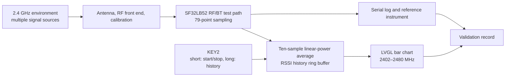

# Radiation Monitor Portable Signal-Strength Detector

## What Is Radiation Monitor?

[SiFliSparks/RadiationMonitor](https://github.com/SiFliSparks/RadiationMonitor) is a portable 2.4 GHz signal-strength viewing project built on SF32LB52 and SiFli-SDK. Its firmware steps through 79 frequency points from 2402 to 2480 MHz and renders the received-strength values as an LVGL bar chart. KEY2 starts or stops scanning and browses stored history.

The project is useful for learning the SF32 RF test path, real-time data processing, frequency visualization, and one-button interaction. It is not a calibrated spectrum analyzer, and it does not decode or identify the source of observed energy. Wi-Fi, Bluetooth Classic, BLE, other 2.4 GHz devices, and the measurement environment can all affect the chart. Without calibration and a controlled comparison, its values are not suitable for regulatory, certification, or precision RF measurements.

<em>Radiation Monitor 79-Point Bar-Chart Interface</em>

## Why the SF32 Implementation?

SF32LB52 combines a 2.4 GHz radio subsystem, real-time MCU, display interface, and LVGL software path. Frequency sampling, smoothing, history buffering, and screen updates can therefore remain local to the device. That makes this reference a useful early experiment for an RF visualization panel, field interference indicator, or production diagnostic UI.

The main limitation follows from the same integrated radio path. The firmware uses low-level RF/BT test drivers and registers, so results depend on silicon revision, RF calibration, antenna, enclosure, board noise, and firmware timing. Moving the method to a different SF32LB52 board, SDK revision, or product PCB requires renewed validation; a successful compile does not establish measurement equivalence.

## Outcome, Scope, and Entry Criteria

**Outcome:** reproduce the 79-point chart on version-locked SF32LB52 hardware, prove that start/stop, 10-sample smoothing, 10-record history playback, and recovery are repeatable, then collect enough evidence to decide whether calibration or custom hardware deserves investment.

This page does not interpret RSSI bar height as duty cycle, throughput, transmitter power, protocol identity, or regulatory spectrum power. It also does not claim that the repository provides a complete production design, calibration method, or explicit software license.

Before starting, have:

- an SF32LB52 display board matching the current project target; the repository’s build-directory evidence points to `sf32lb52-lchspi-ulp_hcpu`, while its README says only SF32LB52x, so record the actual board and configuration;
- SiFli-SDK, SCons, a download path, and serial-log capture;
- a controllable 2.4 GHz source or at least two repeatable scenes, such as a selected BLE advertiser turned off and on;
- a calibrated spectrum analyzer or power instrument plus fixed antenna/distance/shielding conditions if numerical accuracy is in scope;
- a test record for screen state, serial output, board orientation, distance, power, and environment.

<em>Table: Radiation Monitor Project Contract</em>

| Area | Current source baseline | Evidence required before adaptation |
|:-----|:------------------------|:------------------------------------|
| Frequency scan | 79 points from 2402 to 2480 MHz | Firmware commit, SDK/board revision, and complete scan log |
| Processing | Ten linear-power-ratio samples per point, averaged and converted back to dB | Source revision, raw/smoothed results, and stable-source comparison |
| History | Ten-record circular history | Stop, page, wrap, and restart record |
| UI | LVGL bar chart with a nominal -110 to -20 dBm Y-axis | Screen capture and label-to-array mapping check |
| Measurement boundary | No traceable calibration or uncertainty is supplied | Reference-instrument, fixture, and error record, or an explicit relative-trend-only label |

## Choose a Supported Baseline

Lock the upstream `main` branch to commit [`670cf20`](https://github.com/SiFliSparks/RadiationMonitor/commit/670cf20b931e82b7ff1cd14fa6727e460c4f677a). The README names `build_sf32lb52-lchspi-ulp_hcpu` as its build-output directory, which aligns with the Huangshan Pi / SF32LB52-DevKit-ULP target naming, but it does not freeze a board revision or publish a complete SCons command as the formal baseline. Treat that as an item to confirm during first reproduction, not as proof that every SF32LB52x board is supported.

<em>Table: Radiation Monitor Baseline Selection</em>

| Element | Baseline choice | Do not assume |
|:--------|:----------------|:--------------|
| Board | Reproduce the existing `sf32lb52-lchspi-ulp_hcpu` target first and record the actual PCB | Every SF32LB52x antenna and display path is equivalent |
| SDK | Record the SiFli-SDK commit that builds successfully | The newest SDK preserves the original RF-test register behavior |
| Smoothing | Follow the current source: ten-sample linear-power averaging | The README overview’s “30 samples” describes the current implementation |
| Timing | The source thread delays 30 ms after each scan-and-process iteration | 30 ms is a guaranteed full 79-point update period |
| Licensing | Confirm the repository and incorporated-code licenses before reuse or distribution | Publicly visible source automatically grants product distribution rights |

!!! warning "The upstream documentation disagrees on smoothing depth"
    The README feature overview says a 30-scan average, while its module description says ten. Current `src/BT/bt_repeat.c` maintains a `[79][10]` buffer and averages ten linear power ratios. This article therefore records ten samples. Recheck the documentation, array depth, and tests if the upstream implementation changes.

## Delivery Map

<em>Table: Radiation Monitor Delivery Map</em>

| Stage | Decision it supports | Required output |
|:------|:---------------------|:----------------|
| 1. Untouched baseline | Can the target board scan and display all 79 points reliably? | Version, board, log, screen, and controlled-source record |
| 2. Data and recovery | Are smoothing, stop, history, and reset behavior trustworthy? | Deterministic functional and recovery tests |
| 3. Source reproduction | Can a second engineer rebuild the same image? | Clean build, image, download, and repeat result |
| 4. Measurement adaptation | Can one display or calibration change be added without hiding reference behavior? | Change, comparison data, error, and regression record |
| 5. Product review | Should it remain a trend indicator or become an instrument-development program? | Accuracy target, licensing, hardware, and risk decision |

## System Architecture and Dependencies

<em>Figure: Radiation Monitor Data Path</em>

The principal failure domains are RF input/antenna, low-level scanning and calibration, data processing, history buffer, button state machine, LVGL mapping, and power. One tall bar means only that the current implementation observed a relatively strong receive value; it does not identify a transmitter, modulation, or compliance state without a controlled comparison.

## Stage 1 — Establish the Untouched Scan Baseline

**Goal:** prove that the selected hardware and source produce a repeatable 79-point display.

1. Lock the repository and SiFli-SDK commits, board revision, antenna, and display connection; build and download cleanly.
2. With a stable RF scene, start the device and record its initial chart, serial output, and KEY2 state.
3. Short-press KEY2 to start scanning. Confirm coverage and the X-axis references at 2402, 2441, and 2480 MHz.
4. Use a controlled BLE advertiser or another repeatable source and record source-off, source-on, distance, and board-orientation changes.
5. Reset and repeat, checking that the 79-point array and chart are not shifted or retaining stale data.

**Evidence to retain:** source/SDK/board revisions, build/download logs, environment description, source settings, distance/orientation, serial log, screen captures, and reset result.

**Gate 1 exit criterion:** two independent boots scan and display 79 points; controlled-scene changes are directionally repeatable; display indices and frequency labels have been checked.

## Stage 2 — Validate Processing, History, and Recovery

**Goal:** prove that the UI represents an explainable data path rather than an accidental animation.

<em>Table: Radiation Monitor Functional Validation</em>

| Test | Method | Pass evidence |
|:-----|:-------|:--------------|
| Ten-sample smoothing | Record raw values and `rssi_res` for one frequency | Output matches ten-sample linear-power averaging, not an arithmetic dBm average |
| Start/stop | Short-press KEY2 during scanning, then resume | Stop retains history; resume continues without a hang |
| History | While stopped, long-press KEY2 more than once | Up to ten records browse backward and wrap correctly |
| Empty history | Stop or long-press before valid history accumulates | No out-of-bounds access or crash; UI remains in a recognizable no-data state |
| Reset | Reset while scanning, stopped, and browsing history | Device returns to a known initial state without unexplained stale values |
| Interference change | Change source, distance, or shielding | Response is repeatable, with latency and peak-hold behavior recorded |

**Gate 2 exit criterion:** smoothing, history depth, button state, and reset behavior match the source; abnormal states are observable rather than silent.

## Stage 3 — Build a Reproducible Source Baseline

**Goal:** reproduce the Stage 2 image from a clean environment.

1. Record the project commit, SDK commit, host OS, SCons/compiler versions, and actual board argument.
2. Remove build output, reconfigure, and rebuild; save images, memory/partition output, and complete logs.
3. Flash with the generated download script and record the port, baud rate, and result.
4. Repeat on a second computer or clean directory and rerun the core Stage 2 checks.

**Gate 3 exit criterion:** the project produces a behaviorally equivalent image without untracked board files, generated files, or stale products.

## Stage 4 — Make One Controlled Measurement or UI Adaptation

**Goal:** test one product direction without losing the original baseline.

Candidate changes include raw-value logging, explicit 1 MHz labels, peak hold, a different history selector, a calibration offset, or host export of relative trends. Change only one class at a time and retain the original image.

If adding calibration, define the reference source, frequency, input level, antenna/cable, distance, orientation, temperature, and uncertainty. One global offset is rarely enough to compensate frequency response, board variation, and enclosure effects.

**Gate 4 exit criterion:** the change passes the original 79-point, start/stop, history, reset, and controlled-source regressions; every accuracy statement names its reference instrument and conditions.

## Stage 5 — Product-Readiness Review

The team must answer:

- Does the product need only relative interference trends, or traceable absolute power and uncertainty?
- Is the low-level RF test path supported on the target silicon, SDK, and product radio-concurrency model?
- How much do antenna, enclosure, display noise, DC/DC operation, battery level, and temperature move the result?
- Can the product maintain required Bluetooth communication while scanning, or must the functions be mutually exclusive?
- Does the true latency of a 79-point scan plus ten-sample smoothing meet the UI requirement?
- How will distribution and commercial rights be resolved when RadiationMonitor and incorporated code have no explicit top-level license?

**Gate 5 exit criterion:** the measurement goal, calibration plan, radio-concurrency strategy, licensing, hardware, and software ownership have named owners and a proceed/defer/stop decision.

## Handoff to Product Design

Carry forward the target SF32 device, board/antenna, RF test mode, frequency/data definition, raw and smoothed records, UI refresh budget, calibration fixture, power-noise tests, recovery path, and production-test boundary. Continue with [SF32LB52x](../sf32-products/chips/SF32LB52x.md), [SF32LB52-DevKit-ULP](../sf32-products/devkits/SF32LB52-DevKit-ULP.md), the [SF32LB52x Hardware Design Guide](../hardware/chip-guides/SF32LB52x_hardware_design_guide.md), and [SiFli-SDK RF Performance Tests](../develop/platforms/sifli-sdk/application-notes/rf-performance-tests.md).

## Authoritative Sources

- [SiFliSparks/RadiationMonitor](https://github.com/SiFliSparks/RadiationMonitor)
- [Locked reference commit `670cf20`](https://github.com/SiFliSparks/RadiationMonitor/commit/670cf20b931e82b7ff1cd14fa6727e460c4f677a)
- [SiFli Sparks project catalogue](https://sparks.sifli.com/#projects)
- [OpenSiFli/SiFli-SDK](https://github.com/OpenSiFli/SiFli-SDK)
- [SF32LB52x SiFli-SDK quick start](https://docs.sifli.com/projects/sdk/latest/sf32lb52x/quickstart/index.html)
