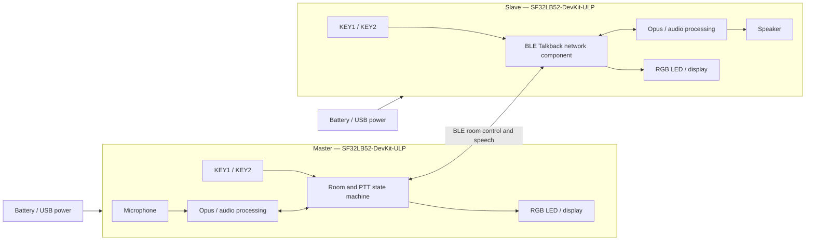

# SF32 BLE Talkback Intercom

## What Is Talkback?

[OpenSiFli Talkback](https://github.com/OpenSiFli/sifli-sdk-demo/tree/main/talkback) is a multi-device BLE push-to-talk (PTT) example for the `SF32LB52-DevKit-ULP`, also known as Huangshan Pi. A device can act as the Master that creates a room or as a Slave that scans for and joins one. After joining, the user holds the talk key to transmit and releases it to stop. The official baseline accommodates up to eight devices and allows up to three devices to speak concurrently.

The project uses Opus for speech coding and combines the RGB LED, keys, and display into a minimal local interface. It also implements one-key Slave reconnection, battery-voltage/level reporting, sleep after 60 seconds without input, and long-press power-off and power-on behavior. That makes it a more useful portable-intercom reference than an isolated point-to-point audio example.

## Why the SF32 Implementation?

This path combines SF32LB52 BLE, audio, display, keys, battery monitoring, and low-power behavior in one working baseline. A team can qualify networking and acoustics on supported development hardware before investing in custom RF, audio, and power design.

“Up to eight devices and three concurrent talkers” is an upstream implementation boundary, not a product claim already qualified across distance, interference, packet loss, and every concurrency pattern. Upstream material also does not specify room authentication, link-encryption policy, a voice-privacy guarantee, radio-regulatory status, or the complete licensing boundary of the binary `talk_back` component. Each requires separate product review.

## Outcome, Scope, and Entry Criteria

**Outcome:** use at least two revision-controlled boards to reproduce room creation, joining, PTT speech, leave/reconnect, sleep/wake, and battery-state behavior, then retain enough evidence to decide whether custom hardware is justified.

**Out of scope:** this page does not prove long-range coverage, degraded-link voice quality, end-to-end encryption, certification, production power, antenna consistency, regulatory compliance, or compatibility with arbitrary BLE devices.

**Entry criteria:** the team can install a SiFli-SDK build environment, download firmware over UART, inspect logs, and connect a speaker and battery safely. A complete speech baseline requires at least two boards of the same revision.

<div align="center"><em>Table: Project Contract</em></div>

<div align="center" markdown>

| Area | Baseline requirement | Evidence retained before proceeding |
|:-----|:---------------------|:------------------------------------|
| Reproduction boundary | Keep the upstream target, dependencies, and default interaction unchanged first | Board revision, application commit, SDK revision, dependency-resolution record, and firmware hash |
| Functional boundary | Prove create/join, PTT, leave, Slave reconnect, sleep/wake, and battery reporting | Operation record, UART logs, LED states, and fault-recovery results |
| Product boundary | Acoustics, RF, security, privacy, licensing, power, and regulation remain separate qualification work | Risk, owner, disposition plan, and proceed/stop decision |

</div>

## Hardware and Software Specifications

### Hardware Specification

<div align="center"><em>Table: Hardware Specification</em></div>

<div align="center" markdown>

| Component | Required specification | Role | Status | Where to get it | Compatibility and substitution notes |
|:----------|:-----------------------|:-----|:-------|:----------------|:-------------------------------------|
| SF32LB52-DevKit-ULP / LCKFB-HSPI-SF32LB52-ULP | `sf32lb52-lchspi-ulp` target; at least 2 boards and no more than 8 | Runs Talkback and provides BLE, microphone, display, keys, RGB LED, power, and audio paths | Required | [μForge board reference](../sf32-products/devkits/SF32LB52-DevKit-ULP.md); [LCKFB board page](https://lckfb.com/project/detail/lckfb-hspi-sf32lb52-ulp?param=baseInfo); [SiFli sample/kit store](https://sifli.taobao.com/) | Record every hardware revision; an unvalidated SF32LB52 board is not an equivalent substitute |
| Speaker | One 3 W/4 Ω or 2 W/8 Ω external speaker per board through the GH-1.25 mm connector | Plays received speech | Required | Commonly included with the board kit; verify the bundle against the [board reference](../sf32-products/devkits/SF32LB52-DevKit-ULP.md) before purchase | Do not attach a load outside the on-board Class-D amplifier and connector limits |
| USB data cables and host | One data-capable USB-C cable per board; host able to run SiFli-SDK tools | Power, UART download, and logging | Required | Standard USB-C data cable; tools start at [SiFli-SDK](https://github.com/OpenSiFli/SiFli-SDK) | Charge-only cables cannot download firmware; record port assignments and host environment |
| Single-cell lithium battery | Must match the board connector, polarity, and charge path | Mobile use, sleep/wake, and battery-level qualification | Required for product qualification; optional for bench function | No separate channel is published by the Talkback repository; confirm the interface in the [board reference](../sf32-products/devkits/SF32LB52-DevKit-ULP.md) before sourcing | Verify polarity, voltage range, capacity, and protection before connection; connector appearance does not establish compatibility |
| Integrated microphone, keys, RGB LED, and display | Original components on the development board | Captures speech and shows role, pairing, talking, receiving, and sleep state | Integrated | Included with the board; not sourced separately | Replacing audio or HMI hardware is an adaptation that requires gain, timing, key-code, and state-map regression |

</div>

### Software Specification

<div align="center"><em>Table: Software Specification</em></div>

<div align="center" markdown>

| Package or service | Required version or revision | Role | Status | Where to get it | Compatibility and update notes |
|:-------------------|:-----------------------------|:-----|:-------|:----------------|:-------------------------------|
| OpenSiFli `sifli-sdk-demo/talkback` | Article review commit [`6fa55ac`](https://github.com/OpenSiFli/sifli-sdk-demo/commit/6fa55ac65b51fca5eac6660a7e481a30e07388ee) | Application, board configuration, and build entry | Required | [Talkback source directory](https://github.com/OpenSiFli/sifli-sdk-demo/tree/main/talkback) | Upstream `main` moves; pin a commit before evidence. The current path is `talkback/project`; the README's `example/ble/talkback/project` path is stale |
| SiFli-SDK | `conanfile.py` declares compatibility with `^2.4`; no exact SDK commit is pinned upstream | RT-Thread, BLE, audio, power, build, and download foundation | Required | [OpenSiFli/SiFli-SDK](https://github.com/OpenSiFli/SiFli-SDK) | Select and record one concrete commit satisfying `^2.4`; a moving `main` is not a baseline revision |
| `talk_back/1.2@sifli` | `1.2` | BLE Talkback networking/audio component | Required | Resolved by the project's [Conan manifest](https://github.com/OpenSiFli/sifli-sdk-demo/blob/6fa55ac65b51fca5eac6660a7e481a30e07388ee/talkback/project/conanfile.py) | Upstream does not publish standalone source, package hash, package server, or complete licensing on that page; archive the package and resolution record and close this risk before product use |
| Opus and WebRTC AECM/AGC configuration | Determined jointly by the pinned application, SDK, and Conan dependency | Speech coding, echo handling, and gain control | Required | [Project configuration](https://github.com/OpenSiFli/sifli-sdk-demo/blob/6fa55ac65b51fca5eac6660a7e481a30e07388ee/talkback/project/proj.conf) and pinned SDK dependencies | Do not record only feature macros; retain resolved library versions and license material |
| SCons, compiler, and UART download tools | Versions matching the selected SiFli-SDK | Configures, builds, and downloads images | Required | Supplied by the [selected SiFli-SDK](https://github.com/OpenSiFli/SiFli-SDK) environment | Record host OS, toolchain version, build command, and generated-script hash |

</div>

## Choose a Supported Baseline

Start with two `SF32LB52-DevKit-ULP` boards of the same revision. Pin the demo repository at `6fa55ac`, select and record a concrete SiFli-SDK commit satisfying `^2.4`, and retain the Conan resolution for `talk_back/1.2@sifli`. Do not change audio parameters, role logic, or low-power timing during the first reproduction.

From the repository root, enter the path that actually exists:

```bash
cd talkback/project
scons --board=sf32lb52-lchspi-ulp -j8
```

On Windows, the generated download script is `build_sf32lb52-lchspi-ulp_hcpu\uart_download.bat`. Run it and enter the appropriate COM port when prompted. Use the same baseline image on every device and record each board identity and image hash.

### Default Controls and State Indication

<div align="center"><em>Table: Default Key and LED Behavior</em></div>

<div align="center" markdown>

| State | KEY1 | KEY2 | LED |
|:------|:-----|:-----|:----|
| Standby | A Slave with a previous successful join short-presses to reconnect; otherwise a short press resets the sleep timer | Short press switches Master/Slave; long press starts pairing | Master solid blue; Slave solid red |
| Pairing | — | Master creates a room; Slave scans | Master blinking blue; Slave blinking red |
| Waiting to start | — | Master long-presses to confirm start | Master blinking blue; Slave blinking red |
| In room | Short press after releasing KEY2 to leave | Hold to speak; release to stop | Solid green while speaking; solid orange while receiving |
| Sleep | Any key wakes | Any key wakes | Off |

</div>

## Delivery Map

<div align="center"><em>Table: Delivery Stages and Decisions</em></div>

<div align="center" markdown>

| Stage | Decision supported | Minimum evidence |
|:------|:-------------------|:-----------------|
| Establish the untouched baseline | Does the pinned set build, download, and start reliably? | Version manifest, clean-build log, image hash, and startup record |
| Validate two-device speech | Do default room creation, joining, and PTT work? | Roles, LEDs, key actions, and bidirectional speech record for two devices |
| Validate networking and recovery | Are leave, timeout, reconnect, and concurrency boundaries acceptable? | Fault-injection matrix, recovery time, logs, and failed states |
| Qualify audio and power | Do acoustics and battery behavior fit the intended form factor? | Audio quality, latency, range, current, sleep, and wake measurements |
| Review product readiness | Is there enough evidence to fund custom hardware? | Risk register, owners, and proceed/defer/stop decision |

</div>

## System Architecture and Dependencies

<div align="center"><em>Figure: Talkback Device Roles, Audio, and Control Paths</em></div>



The principal failure domains are BLE scanning/room creation, room-state synchronization, concurrent-speaker scheduling, the Opus/acoustic path, key events, low battery and sleep, power-key recovery, and unpublished component/licensing details. Diagnose role and state first, then distinguish radio, audio, and local-power failures.

## Stage 1 — Establish the Untouched Source Baseline

**Goal:** prove that pinned source, SDK, and resolved dependencies produce a repeatable image.

1. Pin the application and a concrete SDK commit; retain dependency-resolution output.
2. Build `sf32lb52-lchspi-ulp` in a clean directory and download it to two boards.
3. Confirm that each device starts as a Slave with a solid red LED, then check the keys, display, battery, and speaker paths.

**Evidence to retain:** full version manifest, build/download logs, firmware hashes, both board revisions, and startup records.

**Gate 1 exit criterion:** the same inputs reproducibly generate and download the same baseline image to both devices, and startup state matches upstream behavior.

## Stage 2 — Validate Room Setup and Bidirectional PTT

**Goal:** prove that a user can create and use the minimum room without debugger intervention.

1. In standby, short-press KEY2 to make one device the Master with a solid blue LED; leave the other as the red Slave.
2. Long-press KEY2 on both devices: the Master creates a room and the Slave scans. Pairing times out after 30 seconds.
3. In the waiting state, long-press KEY2 on the Master to start. In the talk state, hold KEY2 to speak and release it to stop.
4. Confirm solid green while transmitting, solid orange while receiving, and intelligible speech in both directions.

**Evidence to retain:** roles, operation timeline, LED state, UART logs, bidirectional audio samples, and retry results.

**Gate 2 exit criterion:** at least two devices complete repeated bidirectional PTT sessions, indicators match the actual audio direction, and the 30-second timeout returns to an explainable state.

## Stage 3 — Validate Leave, Reconnect, and Capacity Boundaries

**Goal:** confirm that upstream recovery paths and capacity limits do not strand the user.

1. Release KEY2 before short-pressing KEY1 to leave in the talk state; a device cannot leave while it is transmitting.
2. For a Slave that joined successfully before, short-press KEY1 in standby to reconnect. The Master has no equivalent reconnect path.
3. Inject out-of-range operation, pairing timeout, Master loss, and a power restart.
4. If multi-party operation matters, scale to the intended participant count and cover the stated limits of eight devices and three concurrent speakers.

**Evidence to retain:** initial state, trigger, recovery action, recovery time, logs, and final room membership for every fault.

**Gate 3 exit criterion:** every target fault has an explicit, repeatable, user-comprehensible recovery path, and required capacity/concurrency has been measured in the target RF environment rather than copied from the limit statement.

## Stage 4 — Qualify Acoustics, RF, and Low Power

**Goal:** decide whether development-board behavior can support the intended enclosure, range, and operating time.

1. Record intelligibility, clipping, echo, and PTT start/end clipping in quiet conditions, near-end double talk, background noise, and multiple speaker-volume settings.
2. Record connection, dropouts, and recovery at target distance, through obstructions, and under 2.4 GHz interference.
3. Verify sleep after 60 seconds without input, role reset to Slave, wake on any key, long-press power-off/power-on, and the LED indication below 20% battery.
4. Measure standby, transmit, receive, sleep, and wake current; do not equate development-board measurements with final-product battery life.

**Evidence to retain:** environment, board/antenna orientation, audio files, distance and interference, current traces, battery conditions, and recovery results.

**Gate 4 exit criterion:** the product team has defined and met acoustic, RF, power, and wake thresholds for its target environment, with owners and dispositions for every miss.

## Stage 5 — Product-Readiness Review

Before custom hardware, answer at least these questions:

- How does a room identify trusted devices, and what authentication, encryption, and replay protection cover speech and control data?
- Who owns licensing, source delivery, and vulnerability response for `talk_back/1.2@sifli`, Opus, WebRTC components, and repository source files?
- What coverage, latency, packet loss, and recovery have been measured with the target antenna, enclosure, body obstruction, and concurrency?
- How will microphone, amplifier, speaker cavity, and volume limits meet acoustic and safety requirements?
- How does the device recover from low battery, abnormal power loss, corrupted firmware, or failed field update?
- Which Bluetooth, EMC, radio, and battery-compliance activities apply?

**Gate 5 exit criterion:** the risk register contains evidence, owners, mitigations, and an explicit proceed, defer, or stop decision. Security, licensing, and regulatory issues cannot remain ownerless “later” work.

## Handoff to Product Design

The handoff package should include pinned source/SDK/dependencies, roles and state machine, capacity and recovery matrix, audio/RF/power measurements, antenna and acoustic assumptions, battery/charging boundaries, security/privacy model, licensing material, production-test needs, and recovery plan. Use the [SF32LB52x integration path](../sf32-products/chips/SF32LB52x.md#integration-path) to select the chip, module, board, hardware design guide, and checklist. Map qualified behavior into the custom schematic and layout instead of carrying development-board conclusions forward unchanged.

## Authoritative Sources

- [OpenSiFli Talkback directory](https://github.com/OpenSiFli/sifli-sdk-demo/tree/main/talkback)
- [Application review commit `6fa55ac`](https://github.com/OpenSiFli/sifli-sdk-demo/commit/6fa55ac65b51fca5eac6660a7e481a30e07388ee)
- [Official Talkback README](https://github.com/OpenSiFli/sifli-sdk-demo/blob/6fa55ac65b51fca5eac6660a7e481a30e07388ee/talkback/README.md)
- [Talkback Conan manifest](https://github.com/OpenSiFli/sifli-sdk-demo/blob/6fa55ac65b51fca5eac6660a7e481a30e07388ee/talkback/project/conanfile.py)
- [Talkback project configuration](https://github.com/OpenSiFli/sifli-sdk-demo/blob/6fa55ac65b51fca5eac6660a7e481a30e07388ee/talkback/project/proj.conf)
- [OpenSiFli/SiFli-SDK](https://github.com/OpenSiFli/SiFli-SDK)
- [Official SF32LB52-DevKit-ULP Wiki source](https://github.com/OpenSiFli/SiFli-Wiki/blob/main/source/en/board/sf32lb52x/SF32LB52-DevKit-ULP.md)
