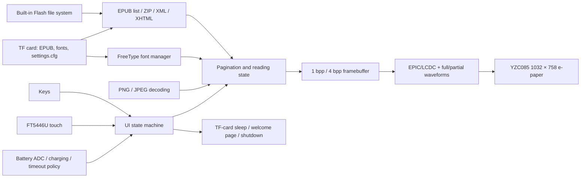

# SF32 E-Paper EPUB Reader

## What Is EPD Reader?

[OpenSiFli EPD Reader](https://github.com/OpenSiFli/EPD_Reader) adapts [atomic14/diy-esp32-epub-reader](https://github.com/atomic14/diy-esp32-epub-reader) to SiFli `SF32-OED-EPD` hardware. It uses SF32LB52X as the processing core, reads EPUB files from the built-in file system or a TF card, lays out content through ZIP/XML/XHTML parsing, FreeType fonts, and image decoders, then drives an e-paper panel with full- and partial-refresh waveforms.

The current application provides library, table-of-contents, reading, reading-settings, function-settings, welcome/screen-off, low-battery, charging, and shutdown pages. It supports keys and touch, Chinese and English text, dynamic TTF/OTF fonts, font size/weight, line spacing, margins, and persistence of reading settings to the TF card. To conserve resources, the bundled Chinese font does not enable separate bold/italic faces by default; validate the actual result of weight options with the target font. It is a complete reference for a low-refresh reading terminal, not proof of general EPUB conformance or a production e-reader.

## Why the SF32 Implementation?

This path combines SF32LB52 external storage, EPIC/LCDC display acceleration, touch, keys, Bluetooth PAN configuration, battery monitoring, and low-power management in one application. For a product team, its value is not merely showing one page: it enables joint evaluation of layout memory, full/partial refresh ghosting, waveform adaptation, TF-card power management, font access, interaction flow, and sleep behavior on supported hardware.

Upstream publishes no authoritative purchase link for the `SF32-OED-EPD` boards or panels, and it specifies no EPUB coverage rate, panel operating-temperature range, production lifetime, or current figures for each mode. This page therefore treats hardware revision, panel/touch combination, and software commit as a mandatory engineering baseline. Other e-paper modules are not drop-in substitutes.

## Outcome, Scope, and Entry Criteria

**Outcome:** on a pinned `SF32-OED-EPD_V1.1` board and 6.0-inch YZC085 V1.05 panel, reproduce build/download, library/contents/reading, key/touch input, settings persistence, full/partial refresh, low-battery, sleep, and shutdown behavior, then retain the evidence required for a product decision.

**Out of scope:** this page does not prove complete EPUB/CSS/font compatibility, DRM support, arbitrary-panel waveform compatibility, commercial reading quality, wireless content distribution, certification, or production reliability. Current source enables Bluetooth/PAN configuration and status UI, but the official README does not define network download as part of the local EPUB reading baseline.

**Entry criteria:** the team can build and download SiFli-SDK applications and can identify the board revision, panel model, flex orientation, battery polarity, and TF-card file system. If the board/panel source and hardware documentation are unclear, stop purchase commitment until SiFli or the hardware provider confirms them.

<div align="center"><em>Table: Project Contract</em></div>

<div align="center" markdown>

| Area | Baseline requirement | Evidence retained before proceeding |
|:-----|:---------------------|:------------------------------------|
| Version boundary | Pin board, panel, touch controller, application commit, and SDK submodule commit | Photos, markings, configuration, commits, image hashes, and cable orientation |
| Reading boundary | Test built-in samples, TF-card books, contents, images, Chinese/English, and settings separately | Content manifest, page results, logs, and failure classification |
| Display boundary | Waveform, VCOM, resolution, bus, and temperature must match the panel | Full/partial refresh, ghosting, refresh time, temperature, and current records |
| Product boundary | Licensing, content rights, power, reliability, radio, and regulation require separate review | Risk register, owners, and proceed/stop decision |

</div>

## Hardware and Software Specifications

### Hardware Specification

<div align="center"><em>Table: Hardware Specification</em></div>

<div align="center" markdown>

| Component | Required specification | Role | Status | Where to get it | Compatibility and substitution notes |
|:----------|:-----------------------|:-----|:-------|:----------------|:-------------------------------------|
| SF32-OED-EPD V1.1 board | SF32LB52X; `sf32-oed-epd_v11` software target; project map provides a 16 MiB QSPI NOR region and 8 MiB PSRAM region | Processing, storage, display, input, battery, and power management | Required | No purchase channel is published; identify it from the [pinned V1.1 board configuration](https://github.com/OpenSiFli/EPD_Reader/tree/7d72223c513d0a77eb251a3acb0f18cadb8d4d89/epdiy-epub/sf32-oed-epd_v11) and obtain it through SiFli/the hardware provider | V1.2 and V1.2-SPI have separate targets and are not substitutes based only on connector appearance |
| YZC085 V1.05 e-paper module | 6.0-inch, 1032 × 758, 300 dpi, 8-bit EPD/DBI path; V1.1 default | Displays EPUB pages and UI | Required | Acquisition channel not published; match the [pinned Kconfig option](https://github.com/OpenSiFli/EPD_Reader/blob/7d72223c513d0a77eb251a3acb0f18cadb8d4d89/epdiy-epub/project/Kconfig.proj) to the physical model | R7D005 (1448 × 1072) and OPM037A3 (240 × 416, SPI) are separate configurations, not unconfigured replacements; validate waveform, VCOM, timing, and resolution per panel |
| FT5446U touch path | V1.1 default `TSC_USING_FT5446U_V01` | Touch selection, page turns, and swipe-up overlay | Required when touch is used | Obtain with the matching V1.1 board/panel assembly; no independent channel is published | V1.2 defaults to GT967 and the 3.7-inch SPI configuration selects FT6336U; drivers are not interchangeable |
| TF card | Recognized by the board SPI storage driver and FAT file system | Bulk EPUB storage, external fonts, and `/settings.cfg` persistence | Required for the complete feature baseline; optional for built-in samples only | Standard TF card; upstream specifies no brand or capacity | Firmware prefers the TF card; record capacity, format, and file set and test removal/corruption recovery |
| USB data cable and build host | Data-capable cable; host able to run SiFli-SDK tools | Power, UART download, and logging | Required | Standard data cable; tools from the [pinned SDK commit](https://github.com/OpenSiFli/SiFli-SDK/commit/8a1eb8a34be02c1df8529c9e8f0e69172bf9ef36) | Record host OS, port, and toolchain; a charge-only cable is unusable |
| Battery/power assembly | Must match the exact SF32-OED-EPD board input, connector, polarity, and charger | Low-battery, charging, sleep, and portable-use qualification | Required for product qualification; USB is sufficient for bench reading | Upstream publishes no battery part number or purchase channel; obtain specifications from the board provider | Do not infer compatibility from the connector without a schematic/specification; record cell, protection, capacity, and charging limits |

</div>

### Software Specification

<div align="center"><em>Table: Software Specification</em></div>

<div align="center" markdown>

| Package or service | Required version or revision | Role | Status | Where to get it | Compatibility and update notes |
|:-------------------|:-----------------------------|:-----|:-------|:----------------|:-------------------------------|
| OpenSiFli EPD Reader | Article review commit [`7d72223`](https://github.com/OpenSiFli/EPD_Reader/commit/7d72223c513d0a77eb251a3acb0f18cadb8d4d89); submodules must be obtained recursively | Top-level project, application, board definitions, waveforms, and SDK pin | Required | [OpenSiFli/EPD_Reader](https://github.com/OpenSiFli/EPD_Reader) | Use `git clone --recursive` or initialize submodules; moving `main` is discovery-only |
| `epdiy-epub` application | Pinned by `7d72223` | EPUB discovery/parsing, page state machine, fonts, rendering, input, and power policy | Required | [Pinned application directory](https://github.com/OpenSiFli/EPD_Reader/tree/7d72223c513d0a77eb251a3acb0f18cadb8d4d89/epdiy-epub) | Adapted from the atomic14 project; main application is MIT-licensed, while third-party libraries retain their own licenses |
| SiFli-SDK submodule | [`8a1eb8a`](https://github.com/OpenSiFli/SiFli-SDK/commit/8a1eb8a34be02c1df8529c9e8f0e69172bf9ef36) | RT-Thread, BSP, file systems, Bluetooth, networking, PM, build, and download | Required | [Repository submodule](https://github.com/OpenSiFli/EPD_Reader/tree/7d72223c513d0a77eb251a3acb0f18cadb8d4d89/SiFli-SDK) | This is the upstream reproducible SDK pin; any update requires display, storage, input, and power regression |
| EPUB/rendering dependencies | Pinned by the application: EPDIY, tinyxml2, miniz 2.2.0, PNGdec, TJpgDec, FreeType, and bundled font | Archive, XML/XHTML, PNG/JPEG, font, and EPD rendering | Required | Pinned [`lib/` directory](https://github.com/OpenSiFli/EPD_Reader/tree/7d72223c513d0a77eb251a3acb0f18cadb8d4d89/epdiy-epub/lib) and [`font/` directory](https://github.com/OpenSiFli/EPD_Reader/tree/7d72223c513d0a77eb251a3acb0f18cadb8d4d89/epdiy-epub/font) | Review each license and font NOTICE; the main-project MIT license does not automatically cover all third-party code and fonts |
| SCons, compiler, and UART download tools | Environment matching the pinned SDK commit | menuconfig, build, file-system/waveform images, and download | Required | Supplied by the [pinned SiFli-SDK](https://github.com/OpenSiFli/SiFli-SDK/commit/8a1eb8a34be02c1df8529c9e8f0e69172bf9ef36) | Retain environment, commands, generated images, and download logs |
| EPUB and font assets | Team-approved non-DRM EPUB; optional `.ttf`/`.otf`, up to 64 external fonts | Reading content and font selection | EPUB required; external fonts optional | Owned/licensed content; repository [`disk/`](https://github.com/OpenSiFli/EPD_Reader/tree/7d72223c513d0a77eb251a3acb0f18cadb8d4d89/epdiy-epub/disk) contains test samples | The team owns content/font rights; test the EPUB structures, languages, and images used by the product |

</div>

## Choose a Supported Baseline

Use `SF32-OED-EPD V1.1 + YZC085 V1.05 + FT5446U` for the first reproduction. Upstream documents an explicit `sf32-oed-epd_v11` build/download path, and Kconfig makes this the V1.1 default combination. Pin top-level commit `7d72223` and SDK submodule `8a1eb8a`; do not change board, panel, touch controller, and waveform together in the first pass.

```bash
git clone --recursive https://github.com/OpenSiFli/EPD_Reader.git
cd EPD_Reader/epdiy-epub/project
scons --board=sf32-oed-epd_v11 --board_search_path=.. -j8
```

The Windows download script is `build_sf32-oed-epd_v11_hcpu\uart_download.bat`. Run it and enter the COM port when prompted. Inspect options with:

```bash
scons --board=sf32-oed-epd_v11 --board_search_path=.. --menuconfig
```

## Delivery Map

<div align="center"><em>Table: Delivery Stages and Decisions</em></div>

<div align="center" markdown>

| Stage | Decision supported | Minimum evidence |
|:------|:-------------------|:-----------------|
| Pin hardware and source | Does the physical assembly match the upstream V1.1 baseline? | Marking/panel photos, connection orientation, commits, submodules, and configuration |
| Establish the reading baseline | Can the pinned image complete the local EPUB flow? | Build/download logs, sample manifest, pages, and input record |
| Qualify content and recovery | Are real books, fonts, TF card, and settings repeatable? | Compatibility matrix, missing/corrupt storage and font recovery, and persistence results |
| Qualify display and power | Can waveform, ghosting, refresh, and battery behavior support the product direction? | Temperature, full/partial refresh, VCOM, refresh time, and current measurements |
| Adapt and review | Can one bounded change be made safely, and should product work proceed? | Change, regression, risk register, and proceed/stop decision |

</div>

## System Architecture and Dependencies

<div align="center"><em>Figure: EPUB Content, Rendering, Input, and E-Paper Paths</em></div>



The main failure domains are content archive/XHTML parsing, font files and memory, TF-card detection/power, touch/key mapping, panel model/waveform/VCOM, full/partial ghosting, battery ADC/charge state, and shutdown/wake. Bluetooth PAN exists in current configuration but should not obscure local-file, display, and power baseline failures.

## Stage 1 — Pin the Physical and Source Baseline

**Goal:** prove that board, panel, touch controller, and source describe one supported combination.

1. Record V1.1 board markings, the SF32 device, panel model, touch controller, flex orientation, and power source.
2. Pin the top-level commit and SDK submodule and retain complete submodule status.
3. Build and download from a clean environment; hash every generated image and download script.

**Evidence to retain:** physical photos, component identifiers, Git state, configuration, build/download logs, image hashes, and startup log.

**Gate 1 exit criterion:** the assembly matches the `sf32-oed-epd_v11` default combination, and pinned inputs reproducibly generate and start the same image.

## Stage 2 — Validate the Untouched Reading Flow

**Goal:** prove the core user journey before modification.

1. Discover EPUB files from built-in storage and TF card separately; firmware gives the TF card priority.
2. Complete Home → Library → Contents → Reading, verifying four library items per page, six contents items per page, and key/touch “select, then confirm” behavior.
3. Validate left/right page turns, the swipe-up overlay, `-5/-1/+1/+5` jumps, contents/library return, and reading-settings entry.
4. Check Chinese, English, PNG/JPEG, and chapter navigation, recording unsupported or malformed content structures.

**Evidence to retain:** source/hash of test EPUBs, page photos, interaction timeline, logs, memory headroom, and classified failures.

**Gate 2 exit criterion:** the main flow repeats across the target sample set and every failure is classified as content, font, storage, memory, input, or display—not “intermittent.”

## Stage 3 — Qualify Settings, Storage, and Recovery

**Goal:** ensure that real content and settings cannot leave the user in an unrecoverable state after storage events.

1. Place `.ttf`/`.otf` files in TF `/fonts`; validate discovery of up to 64 external fonts, selection, and fallback when a font disappears.
2. Test font sizes 24–48 px, font weight, 1.0×–2.0× line spacing, 5–20 px margins, and reboot persistence through `/settings.cfg`.
3. At safe non-write points, test no card, removal, reinsertion, corrupt settings, and unavailable fonts; do not hot-remove in a way that intentionally corrupts the file system.
4. Verify the current boundary: Continue Reading retains the most recently opened book index and chapter during the current run; do not describe it as complete reading-progress synchronization across reboots.

**Evidence to retain:** card specification/format, asset manifest, settings file, reboot results, error logs, and recovery actions.

**Gate 3 exit criterion:** target content and settings load repeatedly; missing card, invalid configuration, and missing font have comprehensible fallbacks that do not prevent return to Home.

## Stage 4 — Qualify E-Paper Quality and Power

**Goal:** decide whether the panel driver and low-power policy fit the intended reading experience.

1. Validate full-refresh periods 5, 10, 20, and every time (`0`), recording ghosting, flashing, refresh time, and page consistency.
2. Validate the target panel's waveform, VCOM, and timing over the expected temperature range; do not copy values from another panel configuration.
3. Validate user timeout choices of 5/10/30 minutes, 1 hour, and never, plus the independent default policy that enters the shutdown page after five hours without interaction in the main loop.
4. Validate the status-bar battery percentage and charging-bolt icon, including removal of the charge icon at 98%; measure current for pagination, partial refresh, full refresh, idle, TF-card wake/sleep, low battery, charging, and shutdown paths.

**Evidence to retain:** panel/waveform version, temperature, page images, refresh statistics, current traces, battery conditions, and wake/shutdown results.

**Gate 4 exit criterion:** display quality, refresh latency, temperature, power, and recovery thresholds are defined and met, with an explicit disposition for every miss.

## Stage 5 — Make a Controlled Adaptation and Review Readiness

**Goal:** prove that the team can adapt one boundary without breaking the baseline.

Suitable changes include adding one licensed font, adjusting one page, implementing one bounded EPUB-compatibility fix, or adding a separate driver for one new panel. New-panel work must cover Kconfig, resolution/DPI, touch, bus, waveform, temperature bands, LUT, timing, and VCOM while preserving the original board target for regression.

The product review must answer at least:

- What compatibility rate and memory ceiling apply to the target EPUB/XHTML/CSS/image/language corpus?
- Who controls and specifies panel supply, waveform, VCOM, temperature range, and lifetime?
- How do licenses for content, fonts, the main application, and every third-party library permit distribution?
- How does the device recover from TF-card corruption, settings corruption, low battery, abnormal shutdown, corrupted firmware, and interrupted update?
- If Bluetooth/PAN enters scope, how are its purpose, pairing, security, privacy, and radio compliance defined?
- How will production test cover display defects/ghosting, touch, keys, storage, battery ADC, charging, and sleep current?

**Evidence to retain:** change review, diff, regression matrix, risk register, owners, and product decision.

**Gate 5 exit criterion:** the controlled change passes every applicable regression, and remaining content, display, power, security, licensing, supply, and regulatory risks have owners, mitigations, and a proceed, defer, or stop decision.

## Handoff to Product Design

The handoff package should include board/panel/touch revisions, pinned code and SDK, memory/partitions, file systems, font/content assets, waveform/VCOM/timing, full/partial-refresh policy, input map, battery curve, power measurements, fault recovery, license manifest, and production-test plan. Use the [SF32LB52x integration path](../sf32-products/chips/SF32LB52x.md#integration-path) to select the chip, module, board, hardware design guide, and checklist, then redesign custom hardware from the qualified functional boundary.

## Authoritative Sources

- [OpenSiFli/EPD_Reader](https://github.com/OpenSiFli/EPD_Reader)
- [Project review commit `7d72223`](https://github.com/OpenSiFli/EPD_Reader/commit/7d72223c513d0a77eb251a3acb0f18cadb8d4d89)
- [Official Chinese EPD Reader README](https://github.com/OpenSiFli/EPD_Reader/blob/7d72223c513d0a77eb251a3acb0f18cadb8d4d89/epdiy-epub/README.md)
- [Pinned SiFli-SDK submodule commit `8a1eb8a`](https://github.com/OpenSiFli/SiFli-SDK/commit/8a1eb8a34be02c1df8529c9e8f0e69172bf9ef36)
- [EPD Reader board/panel Kconfig](https://github.com/OpenSiFli/EPD_Reader/blob/7d72223c513d0a77eb251a3acb0f18cadb8d4d89/epdiy-epub/project/Kconfig.proj)
- [EPD Reader V1.1 board configuration](https://github.com/OpenSiFli/EPD_Reader/tree/7d72223c513d0a77eb251a3acb0f18cadb8d4d89/epdiy-epub/sf32-oed-epd_v11)
- [EPD Reader main-application MIT license](https://github.com/OpenSiFli/EPD_Reader/blob/7d72223c513d0a77eb251a3acb0f18cadb8d4d89/epdiy-epub/LICENSE)
- [atomic14/diy-esp32-epub-reader](https://github.com/atomic14/diy-esp32-epub-reader)
- [SiFli SF32LB52x build and download guide](https://docs.sifli.com/projects/sdk/latest/sf32lb52x/quickstart/build.html)
