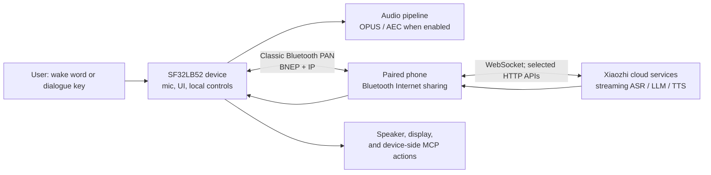

# SF32 Xiaozhi Voice Assistant

## What Is Xiaozhi?

[Xiaozhi](https://github.com/78/xiaozhi-esp32) is an open-source, MCP-based voice chatbot that became widely known through its ESP32 implementation in 2025. It combines a voice-interaction device with cloud large-model services and device-side or cloud-side MCP extensions, making it a practical starting point for conversational AI hardware rather than just a text-chat application.

## Why the SF32 Implementation?

[78/xiaozhi-sf32](https://github.com/78/xiaozhi-sf32) is the SF32 implementation, but it deliberately uses a different connectivity scheme. Whereas the original ESP32 project supports Wi-Fi and other direct networking options, the SF32 version uses Classic [Bluetooth PAN](../learn/bluetooth/pan.md) to obtain Internet access from a paired phone. This shifts the wide-area connection burden from the device to the phone and can reduce device-side networking power substantially in a phone-tethered design; the actual saving depends on the phone, radio conditions, dialogue duty cycle, and power policy. That makes the SF32 approach especially well suited to battery-powered, personal portable products such as pendants, badges, compact assistants, and small wearables.

It is an unusually useful product reference because it joins the work that is often treated separately: display and audio hardware, phone-provided networking, a cloud voice service, a user-facing activation flow, device controls, and field-update capability.

## Outcome, Scope, and Entry Criteria

This page is a complete engineering path for adapting that reference into a product direction. It does **not** claim that Xiaozhi is an offline on-device LLM, that every upstream feature is production-qualified, or that a supported development board is equivalent to a certified finished product. The device uses Bluetooth PAN to obtain Internet access from a paired phone and relies on Xiaozhi cloud services for the conversational flow. Confirm service terms, account ownership, privacy, security, cost, availability, and regional suitability before product commitment.

**Outcome:** a repeatable voice-and-display assistant that can provision through a phone, complete a cloud-backed dialogue, control one safe device function, recover from a lost PAN connection, and produce the evidence needed to decide whether to make custom hardware.

**Intended reader:** firmware, hardware, and product engineers who can already build and flash an SF32 baseline and are prepared to work with C/C++, board schematics, Bluetooth configuration, and cloud-service integration.

<div align="center"><em>Table: Project Contract</em></div>

<div align="center" markdown>

| Area | Project baseline | Evidence before the next stage |
|:-----|:-----------------|:-------------------------------|
| Hardware | One documented SF32LB52 Xiaozhi target, its audio/display path, USB download path, and power source. | Cold boot, keys, display, microphone, speaker, charging/battery indication where applicable. |
| Connectivity | A phone that can pair as `sifli-pan` and provide Bluetooth PAN Internet sharing. | Board UI confirms PAN; loss and reconnection behavior are repeatable. |
| Service | A Xiaozhi account, device activation, and a configured agent through the Xiaozhi console. | A dialogue request reaches the service and a response returns to the board. |
| Firmware | A recorded upstream commit, SDK submodule revision, board target, and build/download method. | Reproducible clean build, flash, serial log, and firmware artifact. |
| Product adaptation | One intentionally limited change, such as UI branding, device name, battery curve, or a safe MCP-controlled output. | The original voice loop still passes after the change. |

</div>

## Choose a Supported Baseline

The SiFli Xiaozhi quick-start documentation lists four prebuilt-firmware targets: SF32LB52-DevKit-ULP (Huangshan), SF32LB52-DevKit-LCD, SF32LB52-DevKit-Nano, and the Xiaotangyuan plug-in board. Its source-build documentation currently lists DevKit-ULP, DevKit-LCD, and DevKit-Nano. Choose a board that is in the source-build list if source customization is a project requirement; do not assume a prebuilt image implies a documented source-build target.

<div align="center"><em>Table: Board Selection</em></div>

<div align="center" markdown>

| Board | Use it when | Product-grade caution |
|:------|:------------|:----------------------|
| [SF32LB52-DevKit-ULP](https://docs.sifli.com/projects/xiaozhi/get-started/SF32LB52-DevKit-ULP/) | You want the documented ULP source-build example and a battery-oriented evaluation route. | Recalibrate the battery curve for any battery other than the documented baseline. |
| [SF32LB52-DevKit-LCD](https://docs.sifli.com/projects/xiaozhi/get-started/SF32LB52-DevKit-LCD/) | You want an explicit display-and-speaker integration reference. | Its 390 × 450 AMOLED, FPC orientation, `SPK` connection, `KEY1`, and `KEY2` instructions are board-specific. |
| [SF32LB52-DevKit-Nano](https://docs.sifli.com/projects/xiaozhi/get-started/SF32LB52-DevKit-Nano/) | You want a smaller documented SF32LB52 baseline. | Confirm the exact display, audio, power, and user-input configuration before reusing any other board's wiring. |
| Xiaotangyuan plug-in board | You are following the relevant prebuilt quick-start route. | Confirm the current source-build and customization status before using it as the product baseline. |

</div>

## Delivery Map

Use the stages as decision points, not as a feature checklist. Each one leaves behind an artifact that makes the next decision reviewable and repeatable.

<div align="center"><em>Table: Delivery Map</em></div>

<div align="center" markdown>

| Stage | Decision it supports | Required output |
|:------|:---------------------|:----------------|
| 1. Reference baseline | Does the documented board, phone, account, and service work together untouched? | A recorded, known-good dialogue session. |
| 2. Recovery validation | Is that baseline dependable across the failures a user will see? | A passing fault-and-recovery test record. |
| 3. Source baseline | Can the team reproduce the firmware rather than depend on a supplied image? | A version-locked build artifact and logs. |
| 4. Controlled adaptation | Can one product change be made without losing the reference behavior? | A reviewed change and its regression evidence. |
| 5. Product decision | Are the hardware, service, security, and recovery risks understood well enough to invest further? | A signed-off product-readiness record and hardware handoff. |

</div>

## System Architecture and Dependencies

<div align="center"><em>Figure: Xiaozhi SF32 Product Flow</em></div>



The official architecture guide describes Bluetooth PAN over Classic Bluetooth as the network path, with lightweight IP networking on the device. It identifies WebSocket as the primary real-time application channel and HTTP for selected API interactions. The upstream project adds the voice pipeline, display UI, battery/power behavior, keyword wake, AEC, device-side MCP controls, cloud-side MCP extension, and PAN OTA capabilities.

This flow creates four failure domains that must be diagnosed independently: local hardware/audio, Bluetooth pairing and PAN, Internet/cloud-service reachability, and application/service configuration. A successful BLE pairing alone does not prove that the board has Internet access or that the voice service is activated.

## Stage 1 — Establish the Untouched Reference Baseline

1. Complete the official board-specific hardware setup. For DevKit-LCD, this includes the specified AMOLED/FPC arrangement, a speaker on `SPK`, `KEY1` for wake/dialogue, and `KEY2` for long-press power-off.
2. Flash the supported prebuilt firmware using the official Xiaozhi procedure. The quick-start guide recommends the UI flashing tool; it notes that terminal flashing is not supported for firmware version 1.4.0 and later at the time of that guide.
3. On the phone, enable **Bluetooth Internet sharing before pairing**. Pair with the `sifli-pan` device, then use the board UI and the phone's sharing status to confirm that PAN—not merely Bluetooth pairing—is active. For iOS, the official guide notes that a phone restart may be needed if `sifli-pan` is not visible.
4. Follow the official activation flow in the Xiaozhi console at [xiaozhi.me](https://xiaozhi.me): create/configure an agent and add the device code presented by the board.
5. Perform one dialogue using the board's dialogue key or configured wake path. Record the firmware version, board, phone model/OS, and service account/agent identifier in the project record.

**Gate 1 exit criterion:** after a cold boot, the device establishes PAN, identifies itself as activated, accepts a dialogue request, plays a response, and presents the expected UI state.

## Stage 2 — Prove Recovery and Product-Critical Behavior

Run these tests before any source change. They turn the demonstration into a dependable baseline:

<div align="center"><em>Table: Baseline Validation Evidence</em></div>

<div align="center" markdown>

| Test | Method | Pass evidence |
|:-----|:-------|:--------------|
| PAN absent | Pair without enabling Bluetooth Internet sharing. | The failure UI/log clearly indicates missing PAN; enabling sharing and reconnecting restores service. |
| PAN loss | Disable sharing, disconnect Bluetooth, or move out of range during idle and during a dialogue. | The device detects the fault, returns to a recoverable state, and reconnects via the documented wake/reconnect path. |
| Sleep and wake | Leave the device idle until it sleeps, then use the designated wake control. | Wake, reconnection, and next dialogue are repeatable without reflashing. |
| Audio and UI | Run repeated dialogues at realistic volume. | Capture is intelligible, playback is clean, UI remains responsive, and no reset occurs. |
| Battery reporting | Charge and discharge through representative levels. | Reported state is plausible; a non-baseline battery is flagged for curve calibration. |
| Service boundary | Test an account/agent intentionally lacking expected configuration. | The failure is distinguishable from PAN and hardware faults. |

</div>

The official guide warns that the default per-board `battery_table.c` curve can be inaccurate for a different battery. For a product battery, obtain supplier charge/discharge data or measure it, update `charging_curve_table` and `discharge_curve_table`, rebuild, and repeat the battery tests.

**Gate 2 exit criterion:** every test has a recorded result, failures are distinguishable by failure domain, and each documented recovery route works without reflashing or manual state repair.

## Stage 3 — Build a Reproducible Source Baseline

The repository brings SiFli-SDK in as a submodule. Clone it recursively and record both the Xiaozhi commit and the SDK submodule commit:

```bash
git clone --recursive https://github.com/78/xiaozhi-sf32.git
cd xiaozhi-sf32/sdk
# Windows: .\install.ps1, then .\export.ps1
# macOS/Linux: ./install.sh, then . ./export.sh
```

For the official DevKit-ULP script-build example, build from `app/project` with the documented external-board path:

```bash
scons --board=sf32lb52-lchspi-ulp --board_search_path="../boards" -j8
```

Use the board-specific official build page for the exact target and download script; do not copy the ULP board name or generated artifact path to another board. A reproducible build record must include host OS, tool-install result, exported environment, board argument, upstream/SDK revision, build log, downloaded image, and serial log.

**Gate 3 exit criterion:** a clean checkout on a second machine—or after deleting the build directory—produces an image that passes every Stage 2 check.

## Stage 4 — Adapt Deliberately

Make one change at a time and preserve the passing baseline image. The official customization material covers Bluetooth naming, static and animated graphics, fonts, PAN DFU, and MCP.

<div align="center"><em>Table: Safe Adaptation Order</em></div>

<div align="center" markdown>

| Change class | Start with | Required regression |
|:-------------|:-----------|:--------------------|
| Product identity | Bluetooth name, static image, font, or animation. | Flash, activation, PAN, UI, and a dialogue. |
| Battery/product hardware | Battery curve, display parameters, audio path, key behavior. | Power, wake, audio/UI, and repeated dialogue tests. |
| Local device control | A narrowly scoped MCP tool with bounded parameters and a safe callback. | Command authorization, invalid input, disconnect during action, physical fail-safe, and an auditable log. |
| Cloud extension | An external MCP service. | Endpoint authentication, secret storage, availability/restart behavior, least privilege, and user-visible consent. |
| Field update | DFU_PAN and an OTA server. | Version detection, CRC/partition correctness, interrupted update, rollback/recovery, and image provenance. |

</div>

For device-side MCP, the official guide uses `McpServer::AddCommonTools()` in `app/src/mcp/mcp_server.cc`. Treat an LLM-requested action as an untrusted request: validate range and state in the callback, default outputs to safe states, and never expose irreversible, hazardous, or security-sensitive controls without product-specific authorization.

For PAN OTA, the official documentation describes three separately deployable image classes—code, image assets, and font assets—and directs engineers to use the partition table for image address and size. Production OTA needs a version policy, server access control, integrity validation, an interruption test, and a wired or local recovery route before it is enabled for users.

**Gate 4 exit criterion:** the selected change, its rollback or recovery route, and every applicable regression result are recorded; the original dialogue loop and the safety boundary of any device action still pass.

## Stage 5 — Product-Readiness Review

Do not move to custom hardware until the team can answer all of these:

- Which phone/OS versions support the exact PAN onboarding flow, and what is the fallback when they do not?
- Which cloud endpoint, account, agent, MCP endpoint, and credentials are used—and who owns and rotates them?
- What audio, device, and user data leaves the device; how is consent obtained; and what are the retention and regional requirements?
- What are measured active-dialogue, connected-idle, sleep, charge, and wake currents on the intended battery and enclosure?
- How does the device recover from a failed update, lost phone, cloud outage, corrupted asset, or incorrect configuration?
- Which parts of the upstream code, service, model behavior, and OTA infrastructure are controlled by your product team versus external providers?

**Gate 5 exit criterion:** the answers, named owners, and residual risks are recorded and accepted by the product team; each unresolved item has a mitigation, an explicit deferral, or a stop decision.

## Handoff to Product Design

Carry the chosen SF32 part, power architecture, display/audio design, RF strategy, storage/partition plan, production test, and recovery assumptions into [Design for Production](../hardware/design-for-production.md). Use the [SF32LB52 integration path](../explore-sf32/chips/SF32LB52x.md#integration-path) to choose the relevant chip, module, board, guide, and checklist.

**Project completion definition:** this reference has served its purpose when a new team member can reproduce the selected baseline, trace each observed failure to its owner or recovery path, rebuild the customized image, and review the evidence required for the custom-hardware decision. It is then a product-development reference—not an unexamined demo to carry into production.

## Authoritative Sources

- [78/xiaozhi-esp32 repository](https://github.com/78/xiaozhi-esp32)
- [78/xiaozhi-sf32 repository](https://github.com/78/xiaozhi-sf32)
- [SiFli Xiaozhi quick start](https://docs.sifli.com/projects/xiaozhi/get-started/)
- [SiFli Xiaozhi source build](https://docs.sifli.com/projects/xiaozhi/source-build/)
- [SiFli Xiaozhi architecture](https://docs.sifli.com/projects/xiaozhi/architecture/)
- [SiFli Xiaozhi customization](https://docs.sifli.com/projects/xiaozhi/custom/)
- [SiFli Xiaozhi DFU_PAN guide](https://docs.sifli.com/projects/xiaozhi/custom/dfu_pan.html)
- [SiFli Xiaozhi MCP guide](https://docs.sifli.com/projects/xiaozhi/custom/mcp.html)
