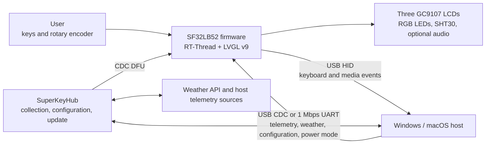

# SuperKey Multifunction Macro Keyboard

## What Is SuperKey?

[SiFliSparks/SuperKey](https://github.com/SiFliSparks/SuperKey) is an SF32LB52-based reference for a multifunction macro keyboard with displays. Its open-source firmware runs on RT-Thread and LVGL v9, drives three 128 × 128 GC9107 LCDs, three RGB LEDs, four physical keys, a rotary encoder, and an SHT30 temperature/humidity sensor, and connects to a computer as a composite USB HID/CDC device.

SuperKey is more than a shortcut keypad. It combines these product paths in one working reference:

- USB HID keyboard and media-control output;
- computer performance, weather, configuration, and power-state data over USB CDC or a 1 Mbps UART;
- three-display pages for performance monitoring, weather, clock, utilities, music, and custom key mappings;
- a companion [SuperKeyHub](https://github.com/SiFliSparks/SuperKeyHub) application that gathers host data, configures functions, and triggers firmware updates;
- reproducible hardware through the open [sf32-keyboard design](https://oshwhub.com/sifli/sf32-keyboard).


<div align="center"><em>SuperKey Three-Display User Interface</em></div>

## Why the SF32 Implementation?

SuperKey needs graphics, multiple displays, a composite USB device, keys and an encoder, sensors, RGB effects, a filesystem, and optional audio. SF32LB52 keeps those real-time tasks on the MCU, so the device can boot its UI and provide basic HID behavior even when the companion application is not running. The host application handles computer telemetry and Internet data that are better owned by a desktop operating system.

That split suits desktop controllers, workflow keyboards, status panels, and compact HMIs, but it creates explicit dependencies. Advanced data displays require the companion application, drivers, and external APIs; firmware and host versions must remain compatible; and USB loss, host sleep, and damaged configuration need independent recovery tests.

## Outcome, Scope, and Entry Criteria

**Outcome:** reproduce a version-locked SuperKey, validate HID, CDC, three-display UI, input, sensing, and sleep recovery, then change only one class of behavior while retaining build, communication, and regression evidence suitable for product review.

This page does not establish that the open PCB is production-ready or that every PC telemetry source, weather service, serial bridge, USB host, or operating-system version is compatible. Stock, weather, and performance data can depend on the SuperKeyHub version, third-party APIs, system permissions, and host hardware.

Before starting, have:

- SuperKey hardware assembled from the open design, including three GC9107 LCDs, keys, an encoder, and a USB data connection;
- a Windows 10/11 computer; upstream notes also mention a Mac experience, but treat it as an unqualified path;
- a SuperKeyHub version matched to the firmware;
- a SiFli-SDK environment, the recursively checked-out SDK submodule, and a working download/recovery connection;
- a valid QWeather API Key, API Host, and city configuration if weather is in scope;
- a test record for USB enumeration, serial logs, key behavior, display state, and sleep recovery.

<div align="center"><em>Table: SuperKey Project Contract</em></div>

<div align="center" markdown>

| Area | Known baseline | Evidence required before adaptation |
|:-----|:---------------|:------------------------------------|
| Hardware | Open `sf32-keyboard` hardware and the `sf32lb52-superkey` board target | PCB/assembly revision, LCD and input devices, power, and USB connection record |
| Firmware | SuperKey repository, SiFli-SDK submodule, RT-Thread, LVGL v9, and CherryUSB | Firmware commit, SDK commit, build log, image, and download log |
| Companion | SuperKeyHub with a compatible firmware protocol | Application version, OS, port, API configuration, and connection log |
| Core behavior | HID, CDC, three displays, encoder, keys, sensor, and power modes | Cold-start, data refresh, input, disconnect, and sleep-recovery record |
| Adaptation | One UI, key, LED, or data-field change at a time | Reviewed change, rollback image, and complete regression result |

</div>

## Choose a Supported Baseline

The current release from the upstream `main` line is firmware [v1.4.2](https://github.com/SiFliSparks/SuperKey/releases/tag/v1.4.2). Its release notes require SuperKeyHub v1.8.x. Record the exact firmware tag, repository commit, and host version used for the baseline rather than writing only “latest.”

<div align="center"><em>Table: SuperKey Baseline Selection</em></div>

<div align="center" markdown>

| Baseline element | Recommended start | Critical limitation |
|:-----------------|:------------------|:--------------------|
| Firmware | SuperKey v1.4.2 or a team-qualified commit | Firmware and host protocol versions must match |
| Companion | SuperKeyHub v1.8.x | Windows is the primary documented route; privileges, performance counters, and third-party APIs can affect results |
| Build target | `sf32lb52-superkey`, with board files under `app/boards` | This is not a generic SF32LB52 development-board target |
| Communication | Validate composite USB HID + CDC first; validate 1 Mbps UART separately if used | “USB enumerated” does not prove both HID and CDC interfaces work |
| Update | Companion-triggered CDC DFU plus a retained wired download/recovery path | It is not a field-update solution until interruption, mismatch, and recovery are proven |

</div>

The upstream CI uses the following target. Install and export the SiFli-SDK environment before running it locally:

```bash
git clone --recursive https://github.com/SiFliSparks/SuperKey.git
cd SuperKey/SiFli-SDK
./install.sh
. ./export.sh
cd ../app/project
scons --board=sf32lb52-superkey --board_search_path="../boards" -j8
```

On Windows, use the corresponding SiFli-SDK PowerShell install and environment scripts. Parallelism may change, but the board name, board search path, and submodule revisions belong in the build record.

## Delivery Map

<div align="center"><em>Table: SuperKey Delivery Map</em></div>

<div align="center" markdown>

| Stage | Decision it supports | Required output |
|:------|:---------------------|:----------------|
| 1. Untouched baseline | Do the open hardware, firmware, and companion work together as recorded? | A version-locked known-good session |
| 2. Communication and recovery | Are USB, serial, sleep, disconnect, and configuration faults diagnosable and recoverable? | Fault-injection and recovery record |
| 3. Source reproduction | Can the team rebuild the same image from a clean checkout? | Environment, image, download, and repeat result |
| 4. Controlled adaptation | Can one product behavior change without breaking the baseline? | Bounded change, rollback path, and regression evidence |
| 5. Product review | Is the reference strong enough for a custom PCB, enclosure, or pilot build? | Owned risks and a proceed/defer/stop decision |

</div>

## System Architecture and Dependencies

<div align="center"><em>Figure: SuperKey Product Data and Control Paths</em></div>



Treat failures as five domains: device hardware/display, HID input, CDC/UART data channel, companion/system permissions, and external data services. A blank weather panel is not automatically a firmware fault; the API key, API Host, city configuration, or data push may be responsible.

## Stage 1 — Establish the Untouched Reference Baseline

**Goal:** prove the complete reference path before changing code.

1. Follow the upstream assembly material to verify LCD-cable orientation, switches, encoder, enclosure, and USB connector; record the PCB and firmware revisions.
2. Install the matched SuperKeyHub. Verify device enumeration, then test HID and CDC independently.
3. Configure weather credentials, the port, and 1 Mbps serial operation. Record behavior without the companion, then connect it and enable data delivery.
4. Verify three-display navigation, key mapping, media control, encoder, SHT30 data, LED effects, and one complete telemetry refresh cycle.
5. Cold-start and repeat. Save UI photos, companion logs, device logs, and the version-query result.

**Evidence to retain:** hardware revision, firmware tag/commit, SDK commit, companion version, OS, port and API configuration, USB enumeration, logs, displays, and input record.

**Gate 1 exit criterion:** two cold starts complete HID input, CDC data refresh, and three-display interaction; each failure domain can be distinguished through logs or observable state.

## Stage 2 — Validate Fault and Recovery Boundaries

**Goal:** prove that common desktop interruptions do not turn the device into a demo that requires reflashing.

<div align="center"><em>Table: SuperKey Fault and Recovery Tests</em></div>

<div align="center" markdown>

| Test | Method | Pass evidence |
|:-----|:-------|:--------------|
| Companion absent | Close SuperKeyHub and restart the device | Local UI and HID still work; companion-dependent values remain recognizably stale or unavailable |
| CDC loss | Unplug/replug USB or change ports during data delivery | Device does not hang; version query and data delivery recover after reconnection |
| Host sleep | Enable `power_mode sleep/normal`, then run one host sleep/wake cycle | LCD, LEDs, backlight, and sensors stop/resume as intended, and later data still refreshes |
| Version mismatch | In a controlled setup, test an incompatible companion/firmware pair | The pair rejects operation or presents a diagnosable error instead of applying an incompatible update |
| API failure | Use invalid weather configuration or disconnect the network | Weather failure does not break HID, CDC, local UI, or recovery |
| Interrupted DFU | Interrupt an update on a recoverable test unit | The retained wired download path restores the known image |

</div>

**Gate 2 exit criterion:** every applicable fault has a repeatable detection and recovery result, without undocumented manual state repair.

## Stage 3 — Build a Reproducible Source Baseline

**Goal:** allow a second engineer to build, download, and repeat Stage 2 from a clean checkout.

1. Clone recursively and record both the SuperKey and SiFli-SDK commits.
2. Build cleanly with `sf32lb52-superkey` and the `../boards` search path.
3. Save the build log, memory/partition output, download script, generated images, and serial log.
4. Rebuild on a second computer or after deleting the build directory, download to the same hardware, and repeat the core regressions.

**Gate 3 exit criterion:** no untracked files, stale products, or manual binary substitutions are required to generate an image that passes Stage 2.

## Stage 4 — Adapt One Product Variable at a Time

**Goal:** validate the change boundary while protecting the passing reference.

<div align="center"><em>Table: Controlled SuperKey Adaptation Order</em></div>

<div align="center" markdown>

| Change class | Good first change | Required regression |
|:-------------|:------------------|:--------------------|
| Identity and UI | Icon, font, page layout, or one rotation setting | Three-display refresh, rotation, fonts, cold start, and memory use |
| Key workflow | One HID mapping or chord | Press/release, multiple keys, unexpected disconnect, and persisted configuration |
| Data field | One telemetry or sensor value | Protocol compatibility, range checks, refresh timeout, and older companion behavior |
| LED effect | One color or animation | Brightness boundaries, sleep, key feedback, and long-duration operation |
| Update | Version policy or update UI | Image provenance, version validation, interruption, rollback, and wired recovery |

</div>

**Gate 4 exit criterion:** the change is reviewed, the original image is recoverable, and HID, CDC, display, input, sleep, and recovery tests pass.

## Stage 5 — Product-Readiness Review

Before custom hardware or a pilot build, the team must answer:

- Will the product continue to depend on SuperKeyHub, administrator privileges, and a third-party weather service, and who owns those dependencies?
- How are firmware, companion, and protocol versions managed, and how are invalid combinations blocked?
- Which target PCs, USB hubs, cables, sleep policies, and security-software combinations have been tested?
- What are memory use, temperature, and current when three displays, USB data, LEDs, sensing, and optional audio run together?
- How do configuration, key mappings, and update state recover from power loss or damaged storage?
- Are the open PCB, enclosure, fonts, icons, music, and third-party APIs licensed for the intended distribution?

**Gate 5 exit criterion:** every residual risk has an owner, evidence, and disposition; the team has made a proceed, defer, or stop decision.

## Handoff to Product Design

Carry forward the SF32 and memory selection, USB HID/CDC descriptors, three-display and backlight connections, input/sensor interfaces, power and sleep policy, filesystem and update partitions, companion protocol, production test points, and validated recovery route. Continue with [SF32LB52x](../sf32-products/chips/SF32LB52x.md), the [SF32LB52x Hardware Design Guide](../hardware/chip-guides/SF32LB52x_hardware_design_guide.md), [SiFli-SDK Build, Flash, and Monitor](../develop/platforms/sifli-sdk/build-flash-monitor.md), and [Design for Production](../hardware/design-for-production.md).

## Authoritative Sources

- [SiFliSparks/SuperKey firmware repository](https://github.com/SiFliSparks/SuperKey)
- [SuperKey v1.4.2 release](https://github.com/SiFliSparks/SuperKey/releases/tag/v1.4.2)
- [SiFliSparks/SuperKeyHub companion repository](https://github.com/SiFliSparks/SuperKeyHub)
- [SuperKey project documentation](https://sparks.sifli.com/projects/superkey/)
- [Open sf32-keyboard hardware](https://oshwhub.com/sifli/sf32-keyboard)
- [OpenSiFli/SiFli-SDK](https://github.com/OpenSiFli/SiFli-SDK)
