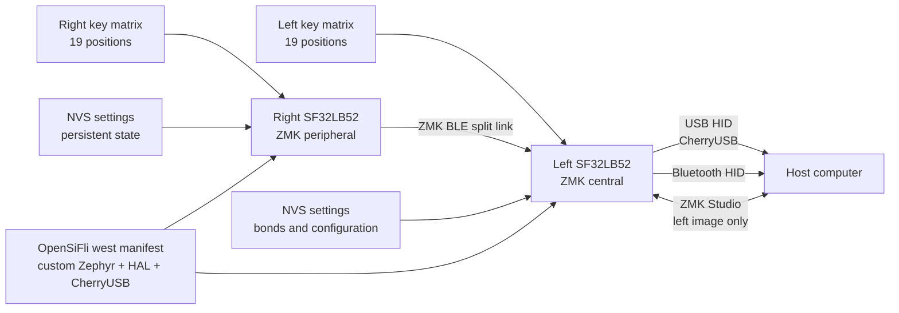

# ZMK Keyboard Firmware on SF32

## What Is ZMK on SF32?

[ZMK Firmware](https://zmk.dev/) is an MIT-licensed keyboard firmware built on Zephyr. Upstream ZMK provides the application model used by many wired, wireless, and split keyboards: matrix scanning, keymaps and layers, key behaviors, USB and Bluetooth HID, persistent settings, and extensible board/shield definitions.

[OpenSiFli/zmk](https://github.com/OpenSiFli/zmk) is OpenSiFli's downstream fork of that project. The reviewed fork adds:

- an `sf32lb52_devkit_lcd/sf32lb525uc6/zmk` board variant;
- SF32LB52 SoC integration inside the ZMK application tree;
- single-board, split, ZMK Studio, and `urchin_sf32lb52` shield configurations;
- an SF32-oriented CherryUSB backend;
- a 256 KB NVS settings partition and Bluetooth settings support;
- an Urchin split-keyboard keymap with three layers, Bluetooth profile controls, and ZMK Studio unlock bindings.

This is a development port, not a tagged SF32 ZMK product release. The fork's top-level README remains the generic upstream ZMK README and does not provide an SF32-specific quick start. Treat the board, shield, manifest, source, and commit as the executable reference, and require your own clean-build, download, functional, and recovery evidence before adapting it.

## Why the SF32 Implementation?

The SF32 port demonstrates how ZMK's keyboard model can run on SF32LB52 while retaining Zephyr's devicetree, Kconfig, `west`, keymap, shield, and split-keyboard conventions. The `urchin_sf32lb52` reference divides a 38-key layout across two halves. Its left configuration is the ZMK split central, enables CherryUSB and ZMK Studio, and can present USB HID to a host; the right configuration is the split peripheral. Both halves enable ZMK BLE.

That makes the fork useful for evaluating a wireless split keyboard, USB/Bluetooth desktop input device, programmable macro pad, or custom human-interface product on SF32. The tradeoff is dependency maturity: the fork's `west` manifest pins a custom Zephyr branch (`v4.3+sf32-zmk_fixes`), a fixed SiFli HAL revision, and a custom CherryUSB `zephyr-adapt` branch. These are part of the port's compatibility boundary and cannot be replaced with upstream “latest” revisions without a full migration and regression pass.

## Outcome, Scope, and Entry Criteria

**Outcome:** build and download version-locked left and right Urchin images, validate the complete key matrix, layers, USB HID, BLE split and host paths, settings persistence, ZMK Studio boundary, and recovery; then make one controlled keymap or hardware change with repeatable evidence.

This page does not claim full upstream-ZMK feature parity, compatibility with arbitrary ZMK shields, production-ready battery life, validated radio performance, or a supported migration to another Zephyr/ZMK revision. It also does not define a production keyboard PCB: the repository's Urchin configuration maps a reference key matrix to SF32LB52-DevKit-LCD pins and must be translated deliberately into any custom hardware.

Before starting, have:

- two SF32LB52-DevKit-LCD boards that match the fork's `sf32lb525uc6/zmk` variant;
- a 38-key split test fixture wired exactly to the `urchin_sf32lb52_left` and `urchin_sf32lb52_right` overlays, or a smaller documented test shield for initial port checks;
- a host with a working Zephyr/ZMK `west` environment and enough storage for the fork's pinned modules;
- known download, serial-console, and recovery connections for each half before testing split behavior;
- a USB data cable for the left/central half and an independent way to power and recover the right/peripheral half;
- a Bluetooth host, a ZMK Studio-capable host if Studio is in scope, and a way to measure current for each half;
- a record for fork commit, manifest revisions, board/shield identifiers, build and download logs, key test results, bonds, settings state, and current measurements.

<div align="center"><em>Table: ZMK on SF32 Project Contract</em></div>

<div align="center" markdown>

| Area | Reviewed baseline | Evidence required before adaptation |
|:-----|:------------------|:------------------------------------|
| Fork | OpenSiFli/zmk at fixed commit | Fork commit, upstream relationship, manifest revisions, and local-diff record |
| Board | `sf32lb52_devkit_lcd/sf32lb525uc6/zmk` | Exact board revision, download/recovery path, and console log |
| Split reference | `urchin_sf32lb52_left` central plus `urchin_sf32lb52_right` peripheral | Wiring, image-to-half mapping, complete matrix test, and split-link result |
| Host paths | USB/CherryUSB and BLE HID from the central half | Enumeration, pairing/bond, reconnect, profile, and fault-recovery evidence |
| Configuration | Three-layer keymap, NVS settings, and left-side ZMK Studio | Key-by-key result, persistence test, Studio authorization, and rollback record |
| Adaptation | One keymap, matrix, transport, power, or dependency change at a time | Reviewed change, original images, and full regression result |

</div>

## Choose a Supported Baseline

The reviewed OpenSiFli baseline is commit `fd4d5843065f` from 2026-05-27. It includes the Urchin shield and board-configuration update available at that commit but is not a tagged SF32 ZMK release. Pin this commit for initial reproduction, or record and review a newer commit explicitly.

<div align="center"><em>Table: ZMK on SF32 Baseline Selection</em></div>

<div align="center" markdown>

| Baseline element | Recommended start | Critical limitation |
|:-----------------|:------------------|:--------------------|
| ZMK fork | OpenSiFli/zmk `fd4d5843065f` | Do not substitute upstream zmkfirmware/zmk; it does not contain this SF32 port |
| Board target | `sf32lb52_devkit_lcd/sf32lb525uc6/zmk` | This is a ZMK-specific variant of SF32LB52-DevKit-LCD |
| Product-like shield | `urchin_sf32lb52_left` and `urchin_sf32lb52_right` | The overlays define different GPIO maps and roles; images are not interchangeable |
| Diagnostic shields | `sf32lb52_test`, `sf32lb52_split_test_left/right`, and `sf32lb52_zmkstudio_test` | These are port-development references, not product compatibility promises |
| Split role | Left = central; right = peripheral | USB and ZMK Studio are enabled on the left configuration; do not assume symmetry |
| Dependency manifest | Custom Zephyr `v4.3+sf32-zmk_fixes`, pinned `hal_sifli`, and custom CherryUSB `zephyr-adapt` | Updating any one dependency changes the compatibility boundary |
| License | ZMK fork and identified SF32 additions use MIT headers/license | Review all modules, hardware, keymap assets, and product content separately |

</div>

The following commands combine the fork's own `west` workflow shape with its exact SF32 board and Urchin shield identifiers. Preserve the two build directories so the images cannot be confused:

```bash
git clone https://github.com/OpenSiFli/zmk.git
cd zmk
git checkout fd4d5843065f

west init -l app
west update --fetch-opt=--filter=tree:0
west zephyr-export

west build -s app -p always -d build-left \
  -b sf32lb52_devkit_lcd/sf32lb525uc6/zmk -- \
  -DSHIELD=urchin_sf32lb52_left

west build -s app -p always -d build-right \
  -b sf32lb52_devkit_lcd/sf32lb525uc6/zmk -- \
  -DSHIELD=urchin_sf32lb52_right
```

Record the final `west list`, generated Kconfig and devicetree, artifact hashes, image-to-half labels, and actual download procedure. Do not begin split testing until each board can be recovered independently.

## Delivery Map

<div align="center"><em>Table: ZMK on SF32 Delivery Map</em></div>

<div align="center" markdown>

| Stage | Decision it supports | Required output |
|:------|:---------------------|:----------------|
| 1. Untouched port baseline | Do the pinned fork, board target, shields, wiring, and host work together? | Version-locked left/right images and a known-good typing session |
| 2. Input, transport, and recovery | Are matrix, USB, BLE, split, settings, and Studio faults diagnosable and recoverable? | Key coverage plus fault-injection and recovery record |
| 3. Source reproduction | Can a second environment regenerate both images without hidden state? | Manifest, clean builds, artifact hashes, downloads, and repeat result |
| 4. Controlled adaptation | Can one keyboard behavior or hardware mapping change without breaking the baseline? | Bounded change, rollback path, and regression evidence |
| 5. Product review | Is the port mature enough for a custom PCB or battery prototype? | Owned risks and a proceed/defer/stop decision |

</div>

## System Architecture and Dependencies

<div align="center"><em>Figure: ZMK Split-Keyboard Paths on SF32LB52</em></div>



Treat failures as distinct domains: physical matrix/wiring, the right-to-left split link, left-side USB, host Bluetooth, stored bonds/settings, ZMK Studio, board download/recovery, and the pinned dependency stack. A key that does not reach the host can fail before scanning, during split transport, in the central keymap, or at the selected HID endpoint; diagnose the path in that order.

## Stage 1 — Establish the Untouched Port Baseline

**Goal:** prove the exact OpenSiFli reference before changing a keymap, overlay, or dependency.

1. Record both board revisions and wire the two fixtures exactly to the left and right Urchin overlays. Label the boards and USB/download cables by role.
2. Build both images at the pinned commit, save `west list`, and inspect the generated configuration to confirm the expected board, shield, split role, BLE, CherryUSB, ZMK Studio, and NVS settings.
3. Download each image through its independently verified recovery path. Capture cold-boot and console behavior before pairing the halves or host.
4. Establish the BLE split connection, then verify all 38 positions against the default, lower, and raise layers. Check Bluetooth profile selection/clear and Studio-unlock bindings deliberately so they are not triggered accidentally during typing tests.
5. Validate USB HID and ZMK Studio on the left half, then validate Bluetooth HID to the selected host. Repeat after a cold start.

**Evidence to retain:** board and wiring records, fork and manifest revisions, generated configurations, image hashes, download and boot logs, complete key-position matrix, layer results, endpoint selection, and host/Studio versions.

**Gate 1 exit criterion:** two cold starts reproduce the full 38-position keymap, all three layers, the right-to-left split link, and at least one selected host endpoint; both halves remain independently recoverable.

## Stage 2 — Validate Input, Transport, Settings, and Recovery

**Goal:** prove that realistic keyboard faults are visible and recoverable without rebuilding from an unknown state.

<div align="center"><em>Table: ZMK on SF32 Fault and Recovery Tests</em></div>

<div align="center" markdown>

| Test | Method | Pass evidence |
|:-----|:-------|:--------------|
| Matrix coverage | Exercise every position, rollover combinations, each layer, and both direct inputs | No missing, duplicated, stuck, or role-swapped keys; press/release ordering is recorded |
| Split loss | Power off or move the right half out of range during idle and typing | Left-side keys and host link remain defined; the right half reconnects without reflashing or stale keys |
| USB interruption | Disconnect/reconnect the left USB data path during input and Studio use | HID and Studio recover independently; no stuck modifier or corrupted settings remain |
| Host BLE loss | Disable host Bluetooth, switch profile, and reconnect | Endpoint/profile state is visible; reconnection and deliberate bond clearing follow a recorded path |
| Settings persistence | Change a reversible setting, power-cycle both halves, then restore the baseline | Expected NVS state persists; a documented reset/recovery path removes damaged or unwanted state |
| ZMK Studio boundary | Attempt an authorized change, disconnect mid-session on a recoverable setup, and restore | Only the central image exposes Studio; invalid/incomplete changes do not strand the keyboard |
| Power cycle | Repeat independent and simultaneous half power cycles while logging current and wake | Roles, split, endpoint, and key release state recover predictably |

</div>

**Gate 2 exit criterion:** every applicable failure has a repeatable detection and recovery result, no test leaves a stuck HID state, and settings or bonds can be returned to the recorded baseline without replacing untracked files.

## Stage 3 — Build a Reproducible Source Baseline

**Goal:** allow a second engineer to regenerate both images and repeat Stage 2 from clean sources.

1. Start from a clean fork checkout at the recorded commit and run `west init`, `west update`, and `west zephyr-export` without local module substitution.
2. Save `west list`, compiler/tool versions, generated `.config`, generated devicetree, memory output, build logs, and both artifacts with hashes.
3. Download the labeled left and right images to the correct halves and repeat the complete Stage 2 test set.
4. Compare artifacts and configuration with the original record; explain any non-reproducible difference before proceeding.

**Gate 3 exit criterion:** a second environment produces correctly labeled images that pass Stage 2 without untracked overlays, stale build output, or floating dependency revisions.

## Stage 4 — Adapt One Keyboard Boundary at a Time

**Goal:** make one product change while preserving the known-good port and independent recovery paths.

<div align="center"><em>Table: Controlled ZMK on SF32 Adaptation Order</em></div>

<div align="center" markdown>

| Change class | Good first change | Required regression |
|:-------------|:------------------|:--------------------|
| Keymap | One binding, layer, hold-tap, or combo | All positions/layers, press-release order, rollover, split loss, and both host endpoints |
| Matrix/PCB | One row, column, direct input, or diode-direction change | Electrical review, generated devicetree, complete matrix, shorts/ghosting, wake, and recovery |
| Studio | One editable parameter or layout exposure | Authorization, valid/invalid changes, persistence, disconnect, restore, and version compatibility |
| Transport | One USB/BLE endpoint or split-policy change | Enumeration, pairing, bonds, profile switching, split reconnect, stuck-key prevention, and current |
| Power | One sleep, wake, scan, or radio setting | Per-half active/idle/sleep current, latency, every wake source, split reconnection, and settings retention |
| Dependency migration | One ZMK, Zephyr, HAL, or CherryUSB update | Manifest diff, clean builds, generated-config diff, all Stage 2 tests, current, and rollback |

</div>

**Gate 4 exit criterion:** the change is reviewed, original images and settings can be restored, and all applicable matrix, layer, split, USB, BLE, Studio, power, and recovery tests pass.

## Stage 5 — Product-Readiness Review

Before designing a custom keyboard PCB or battery prototype, answer:

- Who owns the OpenSiFli ZMK fork, custom Zephyr branch, SiFli HAL revision, CherryUSB adaptation, and future security or compatibility updates?
- Which upstream ZMK features are actually exercised on SF32, and which are only present in the inherited tree?
- How will left/right image identity, board revision, keymap, configuration, bonds, and factory-reset state be controlled in manufacturing and service?
- What are the measured active, connected-idle, disconnected, and sleep currents of each half, including scan rate, reconnect behavior, and battery protection?
- Which hosts, operating systems, USB controllers, Bluetooth stacks, wake paths, rollover cases, and interference conditions have been tested?
- Can a failed dependency update, Studio change, settings write, or field update be recovered without opening or scrapping the product?
- Are the ZMK/Zephyr licenses, PCB and enclosure files, keymap content, logos, fonts, and any bundled configuration suitable for distribution?

**Gate 5 exit criterion:** every residual risk has an owner, evidence, and disposition, and the team has explicitly decided to proceed, defer, or stop.

## Handoff to Product Design

Carry forward the exact SF32 part and memory, split roles and transport, row/column/direct-input map, diode direction, USB connection, antenna and enclosure assumptions, NVS/settings policy, download and recovery interfaces, per-half power budget, test fixtures, image identification, and pinned manifest. Continue with [SF32LB52-DevKit-LCD](../sf32-products/devkits/SF32LB52-DevKit-LCD.md), the [Zephyr platform boundary](../develop/platforms/zephyr/overview.md), [Bluetooth Architecture](../learn/bluetooth/overview.md), the [SF32LB52x Hardware Design Guide](../hardware/chip-guides/SF32LB52x_hardware_design_guide.md), and [Design for Production](../hardware/design-for-production.md).

## Authoritative Sources

- [OpenSiFli/zmk SF32 fork](https://github.com/OpenSiFli/zmk)
- [Reviewed OpenSiFli/zmk commit](https://github.com/OpenSiFli/zmk/tree/fd4d5843065f65ed5ed6198dc2e5d0520330bf8e)
- [SF32LB52 ZMK board variant](https://github.com/OpenSiFli/zmk/tree/main/app/boards/sifli/sf32lb52_devkit_lcd)
- [Urchin SF32LB52 split shield](https://github.com/OpenSiFli/zmk/tree/main/app/boards/shields/urchin_sf32lb52)
- [OpenSiFli ZMK west manifest](https://github.com/OpenSiFli/zmk/blob/main/app/west.yml)
- [Upstream zmkfirmware/zmk](https://github.com/zmkfirmware/zmk)
- [ZMK documentation](https://zmk.dev/docs/)
- [Zephyr project documentation](https://docs.zephyrproject.org/)
