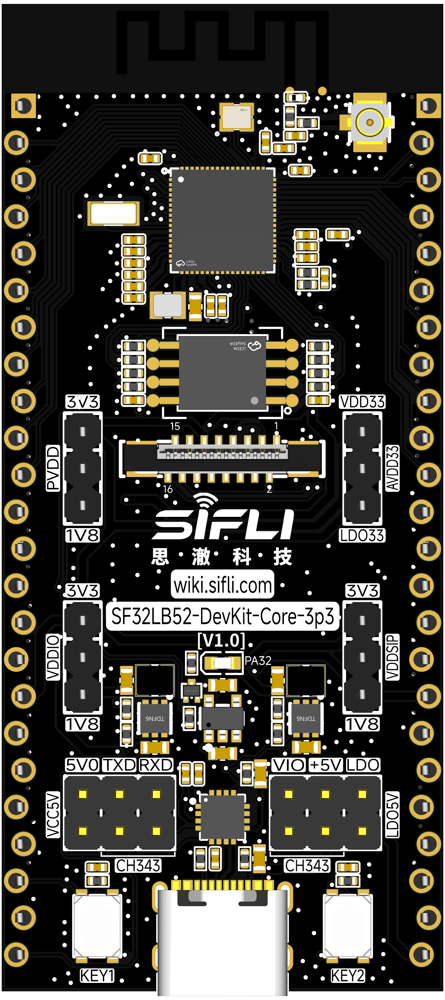
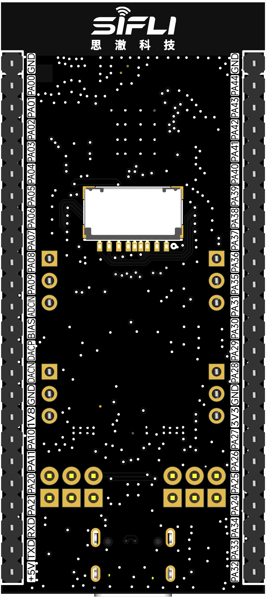
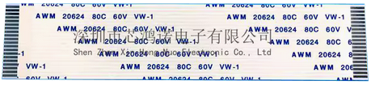

# SF32LB52-DevKit-Core-3p3

## Overview

The SF32LB52-DevKit-Core-3p3 is a compact 3.3V development board for direct evaluation of SF32LB52x chips. It exposes the main MCU signals through edge headers, supports solderless use through castellated-style header holes, and is aimed at engineers who want broad access to GPIO, serial buses, display signals, audio, ADC, PWM, and power rails.

The board is only 30.88mm x 68mm, making it small enough for breadboard-style prototypes while still providing a practical set of interfaces for SF32LB52x firmware and hardware bring-up.

{ width="50%" loading="lazy" }

<em>SF32LB52-DevKit-Core-3p3 — Front View</em>

{ width="50%" loading="lazy" }

<em>SF32LB52-DevKit-Core-3p3 — Back View</em>

## Board Variants

<em>SF32LB52-DevKit-Core-3p3 Board Variants</em>

| Variant | MCU | In-Package Memory | On-Board Memory |
| :--- | :--- | :--- | :--- |
| SF32LB52-DevKit-Core-3p3-N1 | SF32LB52BU36 | 1MB SPI NOR Flash | None |
| SF32LB52-DevKit-Core-3p3-N4 | SF32LB52BU56 | 4MB SPI NOR Flash | None |
| SF32LB52-DevKit-Core-3p3-R4N16 | SF32LB52EUB6 | 4MB OPI-PSRAM | 16MB SPI NOR Flash |
| SF32LB52-DevKit-Core-3p3-R8N16 | SF32LB52GUC6 | 8MB OPI-PSRAM | 16MB SPI NOR Flash |
| SF32LB52-DevKit-Core-3p3-R16N16 | SF32LB52JUD6 | 16MB OPI-PSRAM | 16MB SPI NOR Flash |

Use the NOR-only variants for compact Bluetooth, control, and simple HMI work. Use the PSRAM + external NOR variants when the application needs larger graphics assets, frame buffers, file systems, or application storage.

The original source identifies the R16N16 V1.0.0 configuration as the current version. Confirm the actual marking on the board before selecting a matching firmware target.

## Board Highlights

- SF32LB52x MCU variants with NOR-only or PSRAM + NOR configurations
- 48MHz main crystal and 32.768kHz RTC crystal
- USB Type-C power and USB-to-UART download/debug through CH340N
- USB2.0 FS signals routed to the edge header
- GPIO, UART, I2C, SPI, GPADC, PWM, I2S, PDM, and wake-capable pins exposed
- QSPI LCD connector through a 16-pin, 0.5mm-pitch FPC
- I2C touch-panel signals
- Analog microphone and differential audio output pins
- One user LED
- Power key and function key
- Test points for measuring individual rail current

## When to Use This Board

Choose SF32LB52-DevKit-Core-3p3 when you need the most direct access to SF32LB52x signals.

- Bring up custom daughterboards or sensor boards
- Evaluate SF32LB52x memory variants
- Prototype LCD, audio, USB, and GPIO functions
- Measure current on individual power rails
- Validate firmware before designing a compact product PCB

For a smaller castellated module-style board, use [SF32LB52-DevKit-Nano](SF32LB52-DevKit-Nano.md). For a ready display board with audio amplifier, TF-card slot, and battery charger, use [SF32LB52-DevKit-LCD](SF32LB52-DevKit-LCD.md).

## Power

The board supports three power approaches:

- USB Type-C power, recommended for normal development and debugging
- 3.3V input through the edge header when USB is not connected
- External lab supply or current meter inserted into the relevant power path for current measurement

When USB Type-C is connected, the board can also provide 3.3V, 1.8V, and 5V outputs through selected header pins. Confirm the required direction before connecting external circuits.

The board includes a power switch. The CH340N RTS# signal can control board enable, allowing the host tool to reset the MCU during download or debug workflows.

## Download and Debug

Use the USB Type-C UART port for firmware download and software debug.

- **Download mode**: enable BOOT in the download tool, then power or reset the board.
- **Debug/log mode**: disable BOOT, then power or reset the board.
- **Reset**: use the on-board reset/power-key function or the tool-controlled RTS reset path.

## User Controls

<em>User Control Signals</em>

| Function | GPIO | Behavior |
| :--- | :--- | :--- |
| LED | PA32 | Active high |
| KEY1 | PA34 | Active high, supports 10s long-press reset |
| KEY2 | PA33 | Active high |

## Display Interface

The board supports QSPI LCD panels through a 16-pin, 0.5mm-pitch FPC connector. The connector supports LCD reset, backlight PWM, TE, chip select, clock, four data lines, and I2C touch signals.

{ loading="lazy" }

<em>FPC Connection Reference</em>

### 16-Pin LCD FPC Signal Map

<em>16-Pin LCD FPC Signal Map</em>

| Pin | Signal | Function |
| :--- | :--- | :--- |
| 1 | GND | Ground |
| 2 | PA00 | LCD reset |
| 3 | PA01 | Backlight PWM |
| 4 | PA02 | LCD TE / I2S1_MCLK |
| 5 | PA03 | LCD CS / I2S1_SDO |
| 6 | PA04 | LCD CLK / I2S1_SDI |
| 7 | PA05 | LCD D0 / I2S1_BCK |
| 8 | PA06 | LCD D1 / I2S1_LRCK |
| 9 | PA07 | LCD D2 / PDM1_CLK |
| 10 | PA08 | LCD D3 / PDM1_DAT |
| 11 | 3.3V | Display power output |
| 12 | GND | Ground |
| 13 | PA09 | Touch interrupt |
| 14 | PA11 | Touch I2C SDA |
| 15 | PA20 | Touch I2C SCL |
| 16 | PA10 | Touch reset |

The original board note identifies the 1.85-inch AMOLED module as a directly supported display through the 16-pin FPC cable.

## Header Signal Summary

The board exposes two 24-pin edge headers. The first side focuses on general GPIO, SPI2, USB, GPADC, and power. The second side focuses on LCD, touch, debug UART, audio, and power.

{ loading="lazy" }

<em>SF32LB52-DevKit-Core-3p3 Pinout</em>

### General I/O Header

<em>General I/O Header Pin Assignments</em>

| Pin Range | Signals | Main Functions |
| :--- | :--- | :--- |
| 2-9 | PA44..PA37 | UART, I2C, GPTIM, SPI2, wake inputs |
| 10-11 | PA36 / PA35 | USB DM / USB DP, UART, I2C, GPTIM |
| 12-15 | PA31..PA28 | GPADC3..0, SPI1, I2S1, UART, I2C |
| 17 | 3.3V | 3.3V input or output depending on USB power |
| 18-21 | PA27..PA24 | Wake inputs, SPI1, I2S1 |
| 22-24 | PA34..PA32 | GPADC6..4, wake inputs, GPIO |

### LCD, Audio, and Debug Header

<em>LCD, Audio, and Debug Header Pin Assignments</em>

| Pin Range | Signals | Main Functions |
| :--- | :--- | :--- |
| 2-11 | PA00..PA09 | LCD, touch, PDM, I2S, UART, I2C |
| 12-15 | MIC_ADC, MIC_BIAS, DACP, DACN | Analog microphone and audio output |
| 17 | 1.8V | 1.8V input or output depending on USB power |
| 18-21 | PA10, PA11, PA20, PA21 | Touch, UART, I2C, GPTIM |
| 22-23 | PA18 / PA19 | UART0 RX/TX, SWDIO/SWCLK, download/debug |
| 24 | 5V | 5V input or output depending on USB power |

## External Flash and SDIO Pins

Some variants include an external 16MB QSPI-NOR Flash. The shared storage/SDIO pin group is:

<em>External Flash and SDIO Pin Group</em>

| Pin | Signal | Function |
| :--- | :--- | :--- |
| 1 | PA12 | MPI2_CS / SD1_D2 |
| 2 | PA13 | MPI2_D1 / SD1_D3 |
| 3 | PA14 | MPI2_D2 / SD1_CLK |
| 4 | PA15 | MPI2_D0 / SD1_CMD |
| 5 | PA16 | MPI2_CLK / SD1_D0 |
| 6 | PA17 | MPI2_D3 / SD1_D1 |

Check whether these pins are already occupied by the mounted Flash before using them for SDIO or other expansion functions.

## Audio Expansion

The board routes analog microphone bias/input and differential DAC output, but the microphone and differential audio power amplifier are external. This makes the board flexible for testing different microphone, headphone, and speaker-amplifier circuits.

## Related Documents

[SF32LB52x Chip Introduction]: ../chips/SF32LB52x.md
[SF32LB52x Hardware Design Guide]: ../../hardware/chip-guides/SF32LB52x_hardware_design_guide.md
[Original SiFli Wiki Article]: https://github.com/OpenSiFli/SiFli-Wiki/blob/main/source/en/board/sf32lb52x/SF32LB52-DevKit-Core-3p3.md
[Design Package]: https://downloads.sifli.com/hardware/files/documentation/ProPrj_SF32LB52-DevKit-Core-3p3-V100_2025-06-10.epro?
[Buy Samples]: https://sifli.taobao.com/

- :fontawesome-solid-microchip: __[SF32LB52x Chip Introduction]__
- :fontawesome-solid-file-lines: __[SF32LB52x Hardware Design Guide]__
- :fontawesome-brands-github: __[Original SiFli Wiki Article]__
- :fontawesome-solid-download: __[Design Package]__
- :fontawesome-solid-cart-shopping: __[Buy Samples]__

